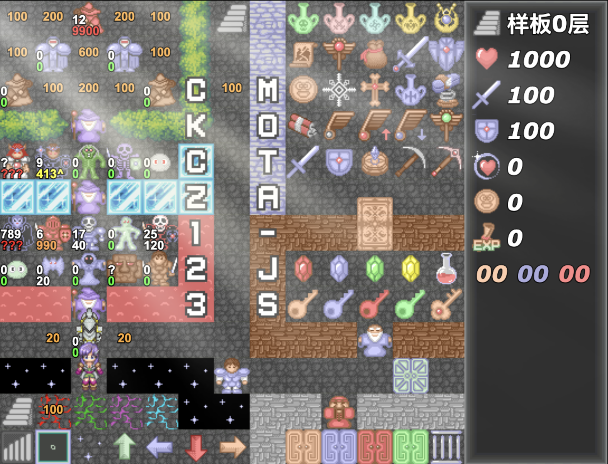

# HTML5 魔塔样板

## 简介

HTML5 canvas制作的魔塔样板，支持全平台游戏！
**即使完全不会编程的用户，按照模板和说明文档也能很快做出一个魔塔游戏！**

* [List / HTML5魔塔游戏列表](https://h5mota.com/)
* [Demo / 样板效果](https://ckcz123.com/games/template/)
* [Docs / 使用文档说明](https://ckcz123.github.io/mota-js/)
* [Video / 视频教程](https://www.bilibili.com/video/av32781473/)



## 目录结构

``` bash
├── /_server/        # 为可视化地图编辑器提供一些支持的目录
├── /docs/           # 文档目录
├── /extensions/     # 拓展工具目录，发布到网站后不会加载
├── /libs/           # 系统库目录
│ ├─ /thirdparty/    # 游戏所用到的第三方库文件
│ ├─ actions.js      # 处理用户交互的文件
│ ├─ core.js         # 系统核心文件（游戏入口，接口&转发）
│ ├─ control.js      # 游戏逻辑控制
│ ├─ data.js         # 记录了一些初始化信息
│ ├─ enemys.js       # 记录了怪物的信息，包括特殊属性、伤害计算公式、临界值计算等。
│ ├─ events.js       # 处理事件的文件，所有自定义事件都会在此文件中进行处理
│ ├─ extensions.js   # 加载拓展工具的文件
│ ├─ icons.js        # 图标信息，会被转发到project下
│ ├─ items.js        # 道具信息，会被转发到project下
│ ├─ loader.js       # 动态加载JS代码、图片、音效等
│ ├─ maps.js         # 记录了地图信息，和地图绘制等操作
│ ├─ ui.js           # UI绘制信息，主要负责绘制各个UI窗口。
│ └─ utils.js        # 工具类
├── /project/        # 项目目录，用户需要在这里做自己的塔
│ ├─ /animates/      # 动画目录
│ ├─ /autotiles/     # 使用到的自动元件
│ ├─ /bgms/          # 使用到的背景音乐
│ ├─ /floors/        # 剧本文件，记录了每个地图的数据和事件
│ ├─ /fonts/         # 字体目录
│ ├─ /images/        # 游戏中使用到的图片目录
│ ├─ /materials/     # 系统素材目录
│ ├─ /sounds/        # 音效目录
│ ├─ /tilesets/      # 额外素材目录
│ ├─ data.js         # 全局变量信息
│ ├─ enemys.js       # 怪物属性数据
│ ├─ events.js       # 公共事件
│ ├─ functions.js    # 可能会被修改的脚本代码
│ ├─ icons.js        # 素材和ID的对应关系定义
│ ├─ items.js        # 道具的定义，获得道具的效果
│ ├─ maps.js         # 地图和数字的对应关系
│ └─ plugins.js      # 自定义插件
├── /常用工具/        # 一些常用工具，可以辅助造塔；具体可参见下面的【相关工具】
├── editor.html      # 可视化地图编辑工具
├── editor-mobile.html      # 可视化地图编辑工具（手机版）
├── index.html       # 主程序，游戏的入口
├── logo.png         # 启动游戏时显示的logo图标
├── main.js          # JS程序的入口，将动态对所需JS进行加载
├── runtime.d.js     # 样板运行时的类型标注
├── server.py        # 使用python编写的启动服务
├── style.css        # 游戏所需要用到的样式表
└── 启动服务.exe      # 一个本地的HTTP服务器，也能支撑前端的一些POST请求从而能拓展JS的IO功能。
```

## 更新说明

### 2021.9.1 HTML5魔塔样板V2.8.2

* [x] 在游戏中，可以在大地图长按后拖动预览。（超大地图福音！）
* [x] 编辑器支持快速选层操作，还可以搜索楼层。
* [x] 离线游戏存档本地化，将直接存入本地的_saves目录。
* [x] 支持播放存档剩余录像（接续播放录像的简化版本）。
* [x] 编辑器中自绘状态栏支持直接预览。
* [x] 可以以当前素材为模板追加新素材并修改色调。
* [x] 对话框支持不等待用户操作，从而可做多对话框。
* [x] 事件：设置勇士不透明度；同时移除显示和隐藏勇士事件。
* [x] 在sample2层新增了大怪物使用样例。
* [x] 大幅提升了高层塔加载的加载速度。
* [x] 增加了高清显伤。
* [x] 修复素材区折叠对齐的问题。
* [x] 修复所有已知问题，大量细节优化。

### 2021.8.14 HTML5魔塔样板V2.8.1

* [x] 支持任意尺寸和任意朝向的怪物和NPC素材。
* [x] 编辑器中支持对话框预览。
* [x] 支持多个对话框同时显示。
* [x] 支持对话框任意定位位置和大小。
* [x] 事件：锁定视角；移动对话框；图片放缩。
* [x] 新增横屏时工具栏移动到画布底部的选项，解放状态栏。
* [x] 未破防的怪物也可以正确显示临界了。
* [x] 点击状态栏的楼梯图标也可以浏览地图了。
* [x] 瞬间移动不再聚集跟随者。
* [x] 新增registerWeather函数可注册一个天气。
* [x] 编辑器新增可通行度显示。
* [x] 更新便捷PS工具，支持高度16像素，及更多快捷键。
* [x] 更新大量默认素材和系统音效。
* [x] 大量细节优化，修复了所有已知bug。

### 2021.7.31 HTML5魔塔样板V2.8

* [x] 现在可以在编辑器中删除不需要的素材了。
* [x] 可以设置每个点的不透明度和绘制特效，并通过事件调节。
* [x] 新增事件：修改装备属性，旋转图片。
* [x] 新增事件：设置某个点的怪物信息。
* [x] 新增事件：修改背景音乐的播放速度和音调。
* [x] 新增装备穿上事件、装备脱下事件、战前事件、图块碰触事件。
* [x] 等待用户操作可以只检测子块，都不满足将不跳出等待。
* [x] 对话框支持淡入淡出效果。
* [x] 新增天气：晴。
* [x] 勇士和图块支持斜向移动，支持变速移动。
* [x] 增添更多系统音效，并可以使用文件别名进行配置。
* [x] 增加录像容错脚本，可以部分处理连载塔录像出错问题。
* [x] 手机端支持快捷换装；快捷换装计入录像。
* [x] 全局商店支持长按空格或屏幕连续购买。
* [x] 怪物手册将单独列出单个属性不同怪物的信息。
* [x] 支持快速追加并注册3*4的va素材。
* [x] 怪物也可以绑定行走图朝向。
* [x] 事件和脚本编辑器支持记录上次关闭时的位置。
* [x] 事件编辑器在禁用后重新打开将维持禁用状态。
* [x] 插件：自绘标题界面居中。
* [x] 新增register系列函数的详细文档教程。
* [x] 更新和修复了常用工具。
* [x] 大量细节优化，修复了所有已知bug。

### 2021.1.29 HTML5魔塔样板V2.7.3.1

* [x] 怪物可以增加怪物描述到详情页
* [x] 修复V2.7.3的所有已知bug

### 2020.11.8 HTML5魔塔样板V2.7.3

* [x] 内置高清UI，界面更清晰！
* [x] 完整的emoji支持！现在可以对话中直接使用emiji了。
* [x] 动画添加多音效支持！可在注册时绑定。
* [x] 事件编辑器的自动补全增加图块图标。
* [x] terrains追加薄墙图块，支持单方向通行。
* [x] 录像播放增加百分比进度显示。
* [x] 怪物增加批量战后事件。
* [x] 设置视角支持增量并可以指定动画时间。
* [x] 新增禁用存档事件。
* [x] 新增左手模式，此模式下WASD为移动，IJKL为存读档。
* [x] core.fillText支持\r变色。
* [x] QTE功能会将超时剩余时间写入flag中。
* [x] 修复npc48追加的朝向绑定问题。
* [x] 大量细节优化，修复了所有已知bug。

### 2020.7.15 HTML5魔塔样板V2.7.2

* [x] 超大地图支持，现在最大能支持128x128的地图了。
* [x] 从底层重写地图绘制相关逻辑，超大地图在手机端也不会卡顿！
* [x] 现在编辑器的大地图模式下也可以进行绘图。
* [x] 事件编辑器的折叠状态会被保留，方便超长事件页的编写不卡顿。
* [x] 可以给显示选择项事件的每个选项设置启用条件。
* [x] 新增剧情文本\g改变绘制字体。
* [x] 增加图块数字的新值块；增加一元操作值块
* [x] 优化部分API调用，修复已知bug

### 2020.6.20 HTML5魔塔样板V2.7.1

* [x] 编辑器中支持直接对大地图进行编辑
* [x] 编辑器支持深色模式
* [x] blockly的多行文本显示
* [x] 高层塔分区指定
* [x] 将素材文件拖到素材区直接自动追加并注册。
* [x] 地图多选点（绑定机关门的实现）
* [x] 录像折叠
* [x] 跳跃事件支持dx和dy
* [x] 道具商店支持经验
* [x] 瞬移可穿透楼梯；短距离瞬移录像
* [x] 编辑器可以回到上个楼层
* [x] 跟着存档走的存档笔记
* [x] 内置了包含怪物境界、多角色等在内的更多插件
* [x] 数据统计指定楼层范围
* [x] 重写云雾效果
* [x] 毒衰咒不再走公共事件；中毒状态自动寻路毒网
* [x] 修复blockly事件块复制粘贴位置的问题

### 2020.6.7 HTML5魔塔样板V2.7

* [x] 大幅增强脚本编辑的自动补全和代码提示等功能
* [x] 地图可以右键拉框批量复制剪切删除，额外素材可以拉框绘制区域
* [x] 图片、音乐音效、动画的半自动注册，可以预览或试听
* [x] 表格注释大幅精简，怪物特殊属性、图块出入方向、状态栏显示项等改为多选框
* [x] 重构全局商店，支持任何事件类型
* [x] 门信息、装备属性、难度分歧、楼层贴图、css等事件化
* [x] 增加五图层插件，支持背景2层和前景2层
* [x] 大量图片和几何图形事件支持翻转、旋转和预览
* [x] 新增大量事件：勇士前进或撞击、事件转向、循环遍历，UI绘制等
* [x] 选择项、确认框、等待用户操作等支持超时时间，可以制作QTE效果
* [x] 事件编辑器支持更为强大的自动补全功能
* [x] 初始化和读档对超高层的优化，现在能更好的支持超高层塔了
* [x] 包括状态栏图标在内的大量素材进行更新
* [x] 支持大地图浏览和选点
* [x] 油漆桶和动态更改地图大小
* [x] 重构了几乎全部的文档，对初学者更为友好
* [x] 大量细节优化，解决了许多历史遗留问题

### 2019.12.31 HTML5魔塔样板V2.6.6

* [x] 编辑器增加【最近使用的图块】的区域
* [x] 编辑器拉伸到铺满全屏幕，还可以Ctrl+滚轮放缩
* [x] 编辑器支持连续Ctrl+Z的撤销，Ctrl+Y的重做
* [x] 新增tileset右键绑定宽高，以替代贴图模式
* [x] 多重自动存档，可以连续A键读档
* [x] 高层塔分区域支持
* [x] 自绘状态栏点击事件
* [x] 绘制的锁定模式
* [x] 等待用户操作增设分歧选项
* [x] 增设压缩模式，会对图片等进行zip压缩
* [x] 追加素材现在可以同时进行自动注册
* [x] 可以复制和粘贴怪物或道具的属性
* [x] 折叠素材时设置每一列个数
* [x] 标题界面和显示选择项时光标跟随鼠标
* [x] 修复所有已知的bug，大量细节优化

### 2019.12.1 HTML5魔塔样板V2.6.5

* [x] 事件：设置怪物属性；穿脱装备
* [x] 新值块：enemy:xxx:atk可获得怪物数据
* [x] 新值块：blockId:x,y获得某点图块ID
* [x] 部分事件预编译，加快执行速度
* [x] 在系统设置中可以设置bgm的播放音量
* [x] 通关事件可以不退出游戏
* [x] 失败时允许直接读取自动存档
* [x] NPC48自动注册可以自动绑定faceIds
* [x] 编辑器Alt+1-9存图块，1-9读取图块
* [x] 编辑器现在可以跨楼层复制粘贴图块了
* [x] 可以对flags.进行自动补全
* [x] 部分Bug修复，大量细节优化

### 2019.10.29 HTML5魔塔样板V2.6.4

* [x] 自动事件，多事件页
* [x] 增加开场logo动画
* [x] 拓展：游戏时动态修改地图和怪物数据
* [x] 插件：道具商店，支持买入和卖出道具
* [x] 编辑器可以搜索变量出现位置
* [x] 变量的中文替换
* [x] 可以给图块绑定自定义脚本，碰触时触发
* [x] 编辑器右键可以绑定机关门和出生点
* [x] 支持多个drawTip同时出现
* [x] 闪烁光标同时支持多个同时存在
* [x] 插件：镜头平滑移动，默认禁用
* [x] 素材的快速追加
* [x] 批量导出动画
* [x] 部分Bug修复，大量细节优化

### 2019.7.24 V2.6.3

* [x] 标题界面大幅美化，增加闪烁光标，支持键盘开始游戏
* [x] 事件编辑器支持自动补全，能对flag和API列表等进行补全
* [x] 剧情文本中\\c修改字体大小，\\d和\\e切换粗体和斜体
* [x] 事件：设置视角&移动视角
* [x] 可以指定显示选择项的出现条件并动态生成
* [x] 楼层传送器的平面传送模式（哪里离开飞回到哪里）
* [x] UI绘制事件增添绘制圆和绘制圆边框
* [x] 所有的UI绘制事件均可以双击预览
* [x] 播放BGM事件可以一直持续播放直到下次调用
* [x] \f立绘支持alpha值
* [x] 支持在脚本编辑中直接flags.xxx调用自定义变量
* [x] 首次获得道具将给予提示
* [x] 等待用户操作支持滚轮，视为PgUp和PgDn
* [x] 脚本编辑器语法错误将禁止保存
* [x] 录像播放时B键查看数据统计
* [x] 所有已知bug的修复，大量细节优化

### 2019.6.7 V2.6.2

* [x] 可以拖动地图上的图块和事件，复制剪切和跨楼层粘贴
* [x] 新增事件的地图选点功能，可以在地图上选择落点
* [x] 现在素材区可以进行折叠与自动换列了
* [x] 新增UI绘制系列事件，并且可以进行预览
* [x] 显示文本事件的标题解析
* [x] 新增常用工具：额外素材合并工具
* [x] 进一步提升24倍速的播放速度
* [x] 楼层转换增加对称点
* [x] 增加编辑器快捷键说明，H键查看
* [x] 文档-事件增加事件编辑器截图
* [x] 大量细节优化，所有已知的Bug修复

### 2019.5.2 V2.6.1

* [x] 区域优化的录像播放功能，R键使用
* [x] 强制战斗可以指定怪物坐标，将自动隐藏并执行该点战后事件
* [x] flag:xxx也支持中文，例如 flag:2楼机关门
* [x] 增加文件名映射，可以用中文映射到某个图片或bgm文件并使用
* [x] 勇士宽度可以超过32（例如48x48的勇士行走图）
* [x] 现在允许修改floorId和图块ID了（在表格下方）
* [x] 增加事件：自动存档，返回标题界面；部分事件优化
* [x] 商店长按空格可以连续加点
* [x] 增设global:xxx使用全局存储，可被录像支持
* [x] 支持\b[hero]和\b[null,x,y]来自动调整上下方向
* [x] 支持\t[yellowKey]等只显示图标而没有标题
* [x] 编辑器中前景层对于有事件的点半透明显示
* [x] 存档改成1000页，长按上下页可快速翻页
* [x] 录像播放初始默认暂停，N键可以单步执行
* [x] 增设本地API文档，部分API和事件的优化
* [x] 所有已知的bug修复，大量细节优化

### 2019.4.13 V2.6

* [x] 拆分整个项目，大幅重构代码，新增大量API
* [x] 重写文档，尤其是脚本和API列表
* [x] 现在可以对编辑器的表格的结构进行配置
* [x] 可以收藏和高亮存档
* [x] 独立出来的插件编写
* [x] 新增事件：关门、显示确认框、后置循环处理
* [x] 剧情文本的绘制可以设置居中选项
* [x] 选项框的绘制可以增加图标
* [x] 增加公共事件版的全局商店
* [x] 公共事件现在可以传入参数
* [x] 重写滑冰事件，现在滑冰在背景层了
* [x] 将输入框改成自定义实现，避免部分设备不支持
* [x] 状态栏文字可以自动放缩
* [x] 显示图片和对话框立绘可以裁剪图片
* [x] 修复所有已知bug，大量细节优化

### 2019.2.19 V2.5.5

* [x] 现在编辑器修改地图后可以直接读档生效，无需再重置地图或回放录像
* [x] 存档方式优化，大幅降低单个存档的占用空间
* [x] 脚本编辑器增加代码格式化的选项
* [x] 事件和脚本编辑器中Ctrl+S可以进行保存
* [x] 显示选择项提供颜色控制
* [x] 事件的移动勇士增加前进和后退两个操作
* [x] 事件编辑器的下拉框增加滚动条
* [x] 通关后将询问是否进行评分
* [x] 录像播放失败后可以回退到上个节点
* [x] 修复已知的所有Bug，大量细节优化

### 2019.2.4 V2.5.4

* [x] 发布15x15的版本
* [x] 独立出来的公共事件
* [x] 支持多重装备（一个装备可以装到多个孔上）
* [x] 工具栏按钮增添至8个，快捷商店和虚拟键盘同时显示
* [x] 点击状态栏的金币图标也可以打开快捷商店
* [x] 等待事件提供flag:px和flag:py在0~415之间
* [x] 事件：呼出存读档界面；呼出怪物手册
* [x] 事件：使用道具，暂停背景音乐，暂停所有音效
* [x] type:trigger可以触发系统事件
* [x] 独立开关
* [x] 贴图也可以支持帧动画了
* [x] 图块内置颜色选择器
* [x] 标题界面增加音乐按钮
* [x] 等待事件可被Ctrl（长按）跳过
* [x] 部分Bug修复，大量细节优化，性能进一步得到提升

### 2018.12.22 V2.5.3

* [x] 标题界面事件化；现在可以用事件流来处理标题界面了
* [x] 动态canvas管理；无限图层，可以任意创建图层并使用
* [x] 状态栏canvas化，可以自行对状态栏进行绘制
* [x] 手机端新增1-7按钮，可点工具栏进行切换
* [x] 事件编辑器可以查看最近使用图块和搜索图块
* [x] 事件编辑器中增加增加颜色选择器
* [x] 对话框里`\f`可以自带立绘效果
* [x] 图片相关事件全部修改为动态canvas实现
* [x] 新增事件：滚动字幕
* [x] 新增事件：等待所有异步事件执行完毕
* [x] 新增事件：画面闪烁
* [x] BGM缓存管理；新增事件：预加载BGM
* [x] 新增天气：雾
* [x] 每次到达楼层执行的事件`eachArrive`
* [x] 可以控制某些图块无全局动画效果
* [x] 背景/前景层的素材可以全局动画/动态Autotile效果
* [x] 可以为每个装备单独设置是否按比例增加
* [x] 地图编辑器中选中点高亮；双击选中素材；WASD平移大地图
* [x] 修复所有Bug，部分代码重构，大量细节优化

### 2018.11.30 V2.5.2

* [x] 怪物和NPC的行走图和朝向问题
* [x] 可以引入WindowSkin作为对话框的背景素材
* [x] 允许使用\t[标题,1.png]来绘制大头像图
* [x] 对话框的宽度可以根据文本长度自动调整
* [x] \r[red]可以动态调整剧情文本的颜色
* [x] 升级事件改用事件编辑器完成
* [x] 每层楼都增添该层的并行事件处理
* [x] 新增快捷键：N返回标题；P游戏主页；O打开工程
* [x] 新增事件：设置全局属性或全局数值
* [x] 新增事件：隐藏/显示状态栏
* [x] 道具可以设置是否在回放时绘制道具栏或直接使用
* [x] 可以同时异步移动/跳跃勇士和多个NPC
* [x] 可以同时异步移动两张或以上的图片了
* [x] 追加素材一次可以追加多个
* [x] 菜单栏中新增虚拟键盘的弹出
* [x] 修复所有已知Bug；部分细节优化

### 2018.11.21 V2.5.1

* [x] 新增事件type:insert，可以插入另一个地点的事件执行（公共事件）
* [x] 可以使用\r来控制剧情文本部分文字的颜色
* [x] 新增事件type:switch，多重分歧
* [x] 绘制前景/背景层时淡化其他图层
* [x] 追加素材的自动调整（如白底、不规范的素材）
* [x] 浏览地图时：左上角/V开启显伤；右上角/Z查看当前层大地图
* [x] 允许在受到领域夹击等伤害后禁用快捷商店
* [x] 升级的扣除模式，即不显示经验值，只显示升级的所需剩余值
* [x] 装备增加可装备条件判定
* [x] 选项界面可以使用1-9快速选择
* [x] 未开启状态的快捷商店用灰色显示
* [x] 修复不能在背景/前景层绘图的Bug
* [x] 手机端的地图编辑器也能有报错信息了
* [x] 部分其他细节优化

### 2018.10.31 V2.5

* [x] 添加绘图模式支持；可以用户手动绘图和保存
* [x] 内置主动技能：二倍斩的支持，可以仿照制作其他主动技能
* [x] 将按键处理移动到脚本编辑中
* [x] Alt+0\~9保存和读取当前套装
* [x] 图块属性的cannotOut和cannotIn控制可通行方向（来造成悬崖效果）
* [x] 支持动态Autotile自动元件（仅在事件层有效）
* [x] 允许快捷商店使用共用的times
* [x] 未启用的快捷商店可以隐藏或预览
* [x] 开始剧情startText可以执行任意事件
* [x] 对话窗口可以任意调节位置（上中下、距离顶部/底部的像素值）
* [x] 楼层转换界面可以设置背景图片文字颜色等
* [x] 数据统计进行分段描写，剑盾显示数值
* [x] 现在可以在事件编辑器中注释内容了
* [x] 存读档界面显示该存档的属性
* [x] F7键可以开启debug模式
* [x] R键可以从本地选取录像文件从头播放
* [x] 吸血属性的显伤增加^；仇恨怪显示仇恨伤害
* [x] 4键默认使用破冰稿或冰冻徽章或地震卷轴或上下楼器（依次判断是否存在）
* [x] 血瓶的道具化选项；黄宝石增加加点选项
* [x] 破炸飞增加默认音效
* [x] 修复单击瞬移的拖动打怪问题
* [x] 其他细节优化

### 2018.10.27 V2.4.4

* [x] tilesets可以设置图块属性（如可通行状态）
* [x] 追加素材时可以更改图片色调
* [x] 防作弊手段的进一步加强：打开控制台则禁止上传成绩
* [x] 图块属性增加“是否可被破震”的选项
* [x] 模仿怪物内置模仿临界计算器
* [x] 部分其他细节优化

### 2018.10.14 V2.4.3

* [x] 并行事件处理
* [x] 事件：设置楼层属性
* [x] 增加光环属性，还可以制作区域光环效果
* [x] 将部分代码移动到脚本编辑中
* [x] 事件改变天气或画面色调，读档后仍有效
* [x] Autotile自动元件的新增和注册
* [x] 状态栏可以显示角色名字
* [x] 浏览地图可以显伤
* [x] 图片淡入淡出和移动图片可以将其保留
* [x] 双击道具栏图标直接进入装备栏
* [x] 可以设置剧情文本的字体大小
* [x] 录像播放可以最高24倍速
* [x] 1-6键快速设置录像播放速度；滚轮加减速
* [x] 修复大地图的夹击Bug
* [x] 部分其他细节优化

### 2018.9.28 V2.4.2

* [x] 允许导入tilesets直接使用，无需PS和注册
* [x] tilesets的素材允许以矩形方式整体绘制
* [x] Alt+0\~9保存素材，Ctrl+0\~9快速选中
* [x] 增加了透明块的支持
* [x] 装备允许按照百分比增加属性
* [x] 多动画的同时播放
* [x] 修复了打开存读档页面时闪屏的问题
* [x] 修复了cannotMove仍然能轻按和瞬移的问题
* [x] 所有已知Bug修复，部分代码重构和细节优化

### 2018.9.18 V2.4.1

* [x] 增加背景层和前景层的图块绘制，多层图块可叠加
* [x] 背景层/前景层图块的显示、隐藏、修改等事件
* [x] 专门的装备页面（Q键开启）；装备系统大改造
* [x] 灯光和漆黑层效果，通过插件函数方式给出
* [x] 将状态栏更新和阻激夹域的计算移动到脚本编辑中
* [x] 增加控制免疫阻激夹域的flag:no_zone等
* [x] 打字机效果时点击显示全部文字
* [x] 修复更改画面色调的Bug
* [x] 修复更改剧情文本属性后读档恢复原样的问题
* [x] 部分细节优化

### 2018.8.28 V2.4

* [x] 大地图的支持
* [x] 突破了5M的存档空间大小限制
* [x] 事件：隐藏/显示贴图
* [x] 事件：接收用户文本输入
* [x] 同点多事件的颜色块绘制
* [x] 录像播放时可以按PgUp/PgDn浏览地图
* [x] 录像播放时对于瞬间移动绘制箭头
* [x] 增加激光属性
* [x] 可以在读档时E键直接指定编号
* [x] 破炸飞可以在状态栏显示个数
* [x] 部分细节优化，所有已知Bug修复

### 2018.7.21 V2.3.3

* [x] 将怪物特殊属性定义和伤害计算函数移动到脚本编辑中
* [x] 地图编辑器可以使用矩形方式绘制地图
* [x] 瞬间移动可以指定存在事件的点（如怪物、门、楼梯等）
* [x] 事件：画面震动
* [x] 事件：更新怪物数据
* [x] 移动事件和跳跃事件增加“不消失”选项
* [x] 获胜结局可以指定“不计入榜单”
* [x] 贴图可自适应遮挡效果
* [x] 默认不能走到将死的领域上
* [x] RM动画导出器可以指定压缩比率
* [x] 修改默认bgm
* [x] 修复读档开启战斗动画等Bug
* [x] 大量细节优化

### 2018.7.9 V2.3.2

* [x] 适配手机端的造塔页面
* [x] 启动服务的多开版本
* [x] 新增事件：跟随效果
* [x] 怪物数据导出器
* [x] RM动画导出器也能导出音效
* [x] gif播放可随着分辨率自动放缩
* [x] 状态栏可随文字长度自动调整放缩
* [x] 楼传器一次可以翻10层
* [x] 也可以用status:exp来代替经验值的写法
* [x] V键也可以打开快捷商店
* [x] 破炸在周围只有一个目标时无需转向面对它
* [x] 道具效果中，无需再将null改成""才能双击编辑了
* [x] 各个已知Bug的修复，部分细节优化

### 2018.6.16 V2.3.1

* [x] 存档采用高比率压缩，单个大小是原来的1/10！
* [x] 默认存档数改成100页500个
* [x] base64上传成绩，杜绝乱码
* [x] 道具栏翻页
* [x] 单击瞬移（菜单栏中开关）
* [x] 重新补上E键打开光标
* [x] 楼层属性增添地下层选项，同层传送至上楼梯
* [x] core.debug()穿墙模式不能穿出地图
* [x] core.values和core.flags也存入存档
* [x] 修复所有已知bug

### 2018.5.27 V2.3

* [x] 启动服务和便捷PS工具（Mac版）
* [x] 地图编辑器可以右键复制或移动图块
* [x] 事件：while循环处理
* [x] 事件：等待用户操作并获得按键或点击信息
* [x] 地图数据统计
* [x] 衰弱可以减少攻防的比例
* [x] 便捷PS工具可以批量导入素材
* [x] 楼层转换可以直接指定“上一楼”和“下一楼”
* [x] 地图编辑器可以使用滚轮切换楼层
* [x] 除Autotile外均可自动注册
* [x] 支持status:x获得当前坐标
* [x] core.debug()改成调试模式，可以Ctrl穿墙
* [x] 新建地图可以保留楼层属性
* [x] 地图编辑器可用PageUp和PageDown切换楼层
* [x] 提供大量素材，可直接取用
* [x] 重写大部分教程，新增大量拓展描述
* [x] 大量细节进行优化，所有已知的bug进行了修复

### 2018.5.6 V2.2

* [x] 事件坐标可用变量指定("loc": ["flag:x", "flag:y"])
* [x] 全局商店也可以使用图块编辑
* [x] 高亮显示有事件的格子
* [x] 对于道具和怪物自动注册该列所有未注册的素材
* [x] 便捷PS工具对于白底图片可自动调整为透明背景
* [x] 事件：等待用户点击(type:wait)
* [x] 事件：图片移动事件(type:moveImage)
* [x] 事件：设置BGM音量(type:setVolume)
* [x] 提供core.rand()和core.rand2()两个随机数函数
* [x] 作弊处理（最大有效生命值、匿名则最低成绩上传）
* [x] 自定义状态栏绘制
* [x] 最高六倍速播放
* [x] 播放录像时可以C键查看怪物手册
* [x] 修复标题文字太长导致无法开始游戏的问题
* [x] 新增纯新手简易造塔流程
* [x] 部分效果和性能的优化

### 2018.4.25 V2.1.1

* [x] 新增事件：改变勇士行走图
* [x] 楼传器落点设置
* [x] 录像回放从任意存档点开始
* [x] 录像过程中允许存档
* [x] 血网显伤
* [x] 怪物手册显示接下来的临界表
* [x] 重置当前楼层地图core.resetMap()
* [x] 支持部分楼层不允许浏览地图
* [x] 修复部分浏览器无法进入游戏的Bug
* [x] 其他细节优化

### 2018.4.19 V2.1

* [x] 编辑器添加新建和删除按钮；地图自动保存
* [x] 录像支持倒退（录像播放中每20步存一个节点，最多30个）
* [x] Gif支持：可以作为楼层背景图或者使用显示动图事件
* [x] 图片显示增加淡入淡出效果
* [x] APP端也能下载或读取文件
* [x] 地图临界显伤
* [x] 单个存档清理
* [x] 大数据魔塔的支持
* [x] 进一步对JS文件和图标进行压缩，大幅提高加载速度
* [x] 修复有时候无法输入ID的问题
* [x] 其他细节优化

### 2018.3.17 V2.0.1

* [x] 道具使用效果的进一步分离
* [x] 支持插件编写，用户可以根据需求来写插件了
* [x] 文本编辑器支持自动补全和代码纠错
* [x] 部分UI界面发生变化，更加方便和美观
* [x] 所有已知Bug的修复

### 2018.3.14 V2.0

* [x] 全GUI造塔，现在用户无需打开任何文件直接编辑JS代码了。
* [x] 整体改变目录架构，将数据和逻辑进行分离
* [x] 支持48x32的怪物和NPC素材
* [x] 加点改成系统开关进行处理，怪物手册会列出加点值
* [x] 支持带有血量上限的塔
* [x] 增加前景图片绘制
* [x] 便捷PS工具对于非标准的图片可以自动进行调整
* [x] 录像存储机制进行修改，对于道具记录全ID
* [x] 其他细节的优化

### 2018.2.9 V1.4.1

* [x] 改变图块（setBlock事件）。
* [x] 同一个点的多事件处理（做法详见文档）。
* [x] 增加新地图后可以接档而不用重新开始。
* [x] 增加可以接收用户输入的事件(type:input)。
* [x] 滚动字幕；自动剧情文本。
* [x] 可以同时show/hide多个事件。
* [x] 现在可以支持滑冰和推箱子事件了。
* [x] 地图中每个块的可通行方向控制（悬崖效果）。
* [x] 动画支持带旋转和翻转的帧。
* [x] 长按屏幕可跳过对话。
* [x] 现在可以允许用户丢弃道具了（例如不会再使用的装备）。
* [x] 修复行走时按键会发生动画抖动问题。
* [x] 修复无法打开战斗动画的Bug。

### 2018.2.6 V1.4

* [x] 支持动画。
* [x] 瞬间移动。
* [x] 支持天气系统，可以在剧本中设置默认天气。
* [x] 新增自定义事件-图片显示。
* [x] 同时可以在剧本中设定多个背景素材。
* [x] 剧情文本特性控制，人物的对话框效果。
* [x] 单存档同步到服务器，下载到文件和读取。
* [x] 键盘支持自动寻路操作。
* [x] 浏览地图模式下可以查看怪物数据。
* [x] 未成功打怪和开门则不自动存档。
* [x] 重新支持楼梯穿透。
* [x] 支持多结局，成绩将分开统计。
* [x] 重构全局动画、行走动画和行走检测，大幅提升性能。
* [x] 修复所有已知Bug。

### 2018.1.21 V1.3.2

* [x] 增加录像和回放功能。
* [x] 增加统计功能，现在能看到每部塔的游戏人数、通关人数和当前MAX了。
* [x] 增加浏览地图功能，玩家可以快速查看每层楼的地图。
* [x] 现在保存文件到本地，以及从本地文件读档了。
* [x] 可以在全局开关中设置剑盾是否作为装备存在。
* [x] 修复了部分已知Bug。

### 2018.1.12 V1.3.1

* [x] 增加虚拟键盘
* [x] 增加自动存档（回退），A键可快速读档
* [x] 修复几处较为严重的Bug

### 2018.1.1 V1.3

* [x] 支持全键盘操作。
* [x] 支持将某个图片作为某层的背景素材。
* [x] 便捷PS工具支持更改图片色相。
* [x] 支持经验升级（进阶/境界塔）。
* [x] 打败怪物可以进行加点（加点塔）。
* [x] 增加阻击、N连击等属性；在怪物手册有属性显示。
* [x] 支持九宫格领域和大范围领域。
* [x] 增加负伤。
* [x] 支持各种BGM的播放。
* [x] 支持不同层使用不同的地面素材；支持多个Autotile同时存在。
* [x] 许多细节进行了优化，一些已知的Bug进行了修复。

### 2017.12.21 V1.2

* [x] 新增：本地HTTP服务器。
* [x] 新增：可视化地图编辑工具。
* [x] 新增：便捷PS工具。
* [x] 移除了meaning.txt，现在“地图生成器”将直接从js文件中读取数字和图块对应关系。
* [x] 新增：对Autotile图块的支持。
* [x] 新增：怪物支持多种属性；添加仇恨属性。
* [x] 移除了不再支持的checkBlock，现在对于领域和夹击无需再手动指定可能的点了。
* [x] 新增：单向箭头、感叹号（单次通行）的支持。
* [x] 新增：更多的默认素材，现在对于大多数地图风格无需P图，直接替换即可。
* [x] 添加部分自定义事件，部分细节优化，一些已知的Bug进行了修复。

### 2017.12.16 V1.1

* [x] 新增：战斗过程显示，可以在设置中关闭
* [x] 新增：勇士支持48*32（大图）的行走图
* [x] 新增：更改画面色调
* [x] 新增：文字显示支持自动换行
* [x] 部分修改状态栏UI
* [x] 增添Web的Markdown文档，移除原本的doc和pdf文档。
* [x] 修复若干Bug。

### 2017.12.9 V1.0

* [x] 发布初版HTML5魔塔样板

## 相关工具

- [启动服务](http://github.com/ckcz123/mota-js-server/)： 一个本地的HTTP服务器，也能支撑前端的一些POST请求从而能拓展JS的IO功能。 
- [RM动画导出器](http://github.com/ckcz123/animate_export/)：能从RMXP中导出动画，以供H5使用。
- [JS代码压缩工具](http://github.com/ckcz123/JSCompressor/)：能对Javascript代码进行压缩和整合，从而减少IO请求量。 
- [便捷PS工具](http://github.com/ckcz123/ps/)：能只用复制和粘贴来快速对素材进行PS操作。  
- [地图生成器](http://github.com/ckcz123/map_generator/)：能从一张截图识别出来具体的数字数组，方便复刻已有的塔。 
- [怪物数据导出器](http://github.com/ckcz123/enemy_export/)：能从RMXP中导出怪物数据，以供H5使用。
- [伤害和临界值计算器](http://github.com/ckcz123/magic-tower-calculator/)：一个能帮助计算怪物的伤害和临界值的小工具。 

## 联系我们

本样板主要由 [`ckcz123`](https://github.com/ckcz123) （百度ID和QQ昵称 `艾之葵`，简称 `小艾`）编写。

HTML5魔塔交流群群号： `539113091`

如有其它意见或建议，也可以通过发[issues](https://github.com/ckcz123/mota-js/issues)、或邮件至[ckcz123@126.com](mailto:ckcz123@126.com)联系我。

## 贡献者

感谢对本样板做出贡献的人员：

[@ckcz123](https://github.com/ckcz123) 艾之葵（小艾）：本样板的的主要编写者。样板的运行时的核心代码，所有常用小工具，以及安卓APP等，都是其所写。

[@Vinlic](https://github.com/Vinlic) v神：第一个HTML5魔塔[纪元魔塔前传](https://tieba.baidu.com/p/4545234500)（[游戏地址](http://vinlic.gitee.io/mota/)，[开发记录贴](https://tieba.baidu.com/p/4397526540)，[源代码](https://gitee.com/Vinlic/Mota)）的编写者。该塔的[第三版内核](https://tieba.baidu.com/p/4738973089)是现在HTML5魔塔样板的前身，现在样板的很多核心逻辑控制，以及UI界面等相关代码都是继承于该塔。

[@zhaouv](https://github.com/zhaouv) z触：V2.0的推动者，可视化地图编辑器和事件编辑器的制作者，手机端魔塔制作界面的编写者。现在我们能方便快捷的可视化地图编辑器，以及通过拖动图块来编写事件，能在手机端造塔等，都需要归功于zhaouv的贡献。

[@i2Echo](https://github.com/i2Echo)：V2.0的推动者，可视化地图编辑器的制作者，游戏界面自适应匹配的编写者。和zhaouv一起推动和开发了V2.0的制作。

[@fux4](https://github.com/fux4) 老黄鸡：打通了RM和H5之间的障壁（从而使RM动画导出器和怪物数据导出器成为可能），同时也是大地图和部分新功能（如跳跃、跟随、画面震动）等的编写者。

[@cafel176](https://github.com/cafel176)：编写了多种辅助小工具如动画编辑器等。

[@tocque](https://github.com/tocque) 鹿神：装备栏、动态创建图层等多项功能的编写者。同时也参与了多种辅助小工具的开发。

[@AutumnOrange](https://space.bilibili.com/399329257) 小秋橙：样板的QA（质量监管人员），提出了大量需求，同时也编写了全新的文档。

以及H5魔塔交流群`539113091`，HTML5造塔技术交流群`959329661`的诸位魔塔爱好者们对本样板的大力支持！
