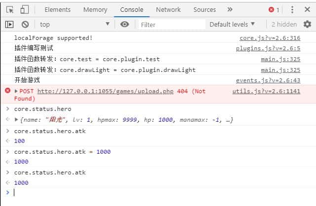

# 脚本

?> 目前版本**v2.6**，上次更新时间：* {docsify-updated} *

在V2.6版本中，基本对整个项目代码进行了重写，更加方便

## 控制台的使用

在Chrome浏览器中，按（Ctrl+Shift+I）可打开控制台。


控制台中有很多的标签，最常用的是`Console`, `Sources`和`Elements`。

有关更详尽的控制台使用可自行搜索[Chrome开发者工具](https://www.baidu.com/s?wd=chrome%20%E5%BC%80%E5%8F%91%E8%80%85%E5%B7%A5%E5%85%B7)了解更多。

### Console：命令行

Console页为命令行。可以在这里输入一些命令进行调试。

比如，进入游戏后，输入`core.status.hero.atk`即可获得勇士的当前攻击力数值。`core.status.hero.atk=100`可以设置攻击力为100。

更多的API可参见[附录：API列表](#附录：API列表)。

除此以外，游戏中的报错等信息也是可以在Console中进行查看的。



### Sources：断点调试

Sources页可以查看JS源代码，并进行断点调试等。

例如，如果相对脚本编辑中的伤害计算函数进行断点调试：
1. 在左边找到`project/functions.js`，单击打开文件
2. 并找到对应的行（可以Ctrl+F搜索），比如搜索`getDamageInfo`
3. 在行号上点一下打断点，会出现一个蓝色标签

之后，当代码运行到你的断点处时，将自动停止运行。


可以将鼠标移动到变量上，将弹窗形式显示这个变量的各项数值，从而查看变量值是否符合预期。

图中红色框内有几个按钮，从左到右分别是：**继续执行**，**执行到下一行**，**进入当前函数**，**跳出当前函数**，**单步执行**。

通过这几个按钮，可以一行一行的对代码进行执行，执行过程中能不断查看各个变量的数值变化，从而定位问题所在。

红圈下方是Call Stack，即当前的函数调用链（从哪些地方调用过来的）。

Sources还有更多有趣的功能，在此不做介绍，有兴趣的可自行网上搜索了解。

### Elements：网页元素查看

Elements页可以查看网页的源代码，调整css布局等。


不过对魔塔样板来说，最重要的是红圈中的按钮。点击此按钮可以进入**手机模式**。

手机模式下，左边可以对屏幕分辨率进行调整和模拟。

这可以很有效的帮我们进行测试样板在手机端的表现。

## 整体项目架构

``` text
├── /_server/        # 为可视化地图编辑器提供一些支持的目录
├── /libs/           # ---- 系统库目录 ----
│ ├─ /thirdparty/    # 游戏所用到的第三方库文件
│ ├─ actions.js      # 用户交互处理
│ ├─ core.js         # 系统核心文件（游戏入口，接口&转发）
│ ├─ control.js      # 游戏逻辑控制
│ ├─ data.js         # 全塔属性等
│ ├─ enemys.js       # 怪物相关处理
│ ├─ events.js       # 各个事件的执行
│ ├─ icons.js        # 图标和素材
│ ├─ items.js        # 道具效果
│ ├─ loader.js       # 各个资源加载
│ ├─ maps.js         # 地图数据和绘制
│ ├─ ui.js           # UI窗口绘制
│ └─ utils.js        # 工具类函数
├── /project/        # ---- 项目目录 ----
│ ├─ /animates/      # 动画目录
│ ├─ /floors/        # 楼层文件
│ ├─ /images/        # 图片素材
│ ├─ /sounds/        # bgm和音效
│ ├─ data.js         # 全塔属性
│ ├─ enemys.js       # 怪物属性
│ ├─ events.js       # 公共事件
│ ├─ functions.js    # 脚本编辑
│ ├─ icons.js        # 素材和ID的对应关系定义
│ ├─ items.js        # 道具的定义和效果
│ ├─ maps.js         # 地图和数字的对应关系
│ └─ plugins.js      # 自定义插件
├── /常用工具/        # 辅助造塔的小工具
├── editor.html      # 地图编辑器
├── editor-mobile.html      # 手机版的地图编辑器
├── index.html       # 主程序，游戏的入口
├── main.js          # JS程序的入口，将动态对所需JS进行加载
├── style.css        # 游戏所需要用到的样式表
└── 启动服务.exe      # 一个本地的HTTP服务器，通过它来运行游戏
```

`_server`为**地图编辑器目录**，里面存放了地图编辑器相关的各项内容。

`libs`为**系统库目录**，里面存放了各个系统核心函数。

从V2.6开始，请勿直接修改libs下的代码，如有需要修改系统库函数请尝试在插件中[复写函数](#复写函数)。

`project`为**项目目录**，你所造的塔的数据全部存放在project下。在不同样板之间接档也是直接迁移project目录即可。

## 函数的转发

在本样板中，`core.js`里面基本是没有定义什么函数的，所有的游戏内函数都在其他几个文件中实现。

例如，常见的获得某个变量值`getFlag`是定义在`control.js`中的：

```js
////// 获得某个自定义变量或flag //////
control.prototype.getFlag = function(name, defaultValue) {
    if (!core.status.hero) return defaultValue;
    var value = core.status.hero.flags[name];
    return value != null ? value : defaultValue;
}
```

也就是，我们可以通过`core.control.getFlag(name, value)`来调用此函数。

但是这样会十分不便，我们希望能直接调用`core.getFlag(name, value)`，而不需要中间的control。

为了达到这个目的，样板设置了**函数转发**，即**将其他文件中定义的函数，转发到core中执行**。

上述`getFlag`代码的转发实际上是增加了如下函数：

```js
////// getFlag函数的转发 //////
core.getFlag = function (name, defaultValue) {
    return core.control.getFlag(name, defaultValue);
}
// 转发后，即可通过 core.getFlag() 来实际调用 core.control.getFlag()
```

转发是自动完成的，其满足如下两条规则：
- **在libs中其他文件定义的函数，如果不以下划线`_`开头，就会进行转发。**
- **如果core中已经存在同名函数，则会在控制台中打出一条报错信息，并不转发该函数。**

具体函数的转发实现代码可参见`core.js`的`_forwardFunc`函数。

!> 除此以外，插件中以`this.xxx`来定义的函数也会被转发！

例如，你可以直接调用`core.drawLight()`来实际调用插件中的`core.plugin.drawLight`。

## 复写函数

样板的功能毕竟是写死的，有时候我们也需要修改样板的一些行为。

在V2.6以前，需要直接打开libs目录下的对应文件并进行修改。但是开libs下的文件就会出现各种问题：
- 不容易随着新样板来接档迁移
- 也不好找到自己改过什么，从而能整理成新的插件在别的塔使用
- ……

好消息的是，从V2.6开始，我们再也不需要开文件了，而是可以直接在插件中对原始函数进行复写。

如果我想对xxx文件中的yyy函数进行重写，其模式一般是：`core.xxx.yyy = function (参数列表) { ... }`

下面是几个例子，从简单到复杂。

### 重写怪物手册的背景图绘制，使用winskin而不是默认的黑色

直接重写怪物手册的背景图绘制，使用`core.drawBackground`来用winskin绘制一个背景图。

```js
// 重写ui.js中的_drawBook_drawBackground函数
core.ui._drawBook_drawBackground = function () {
    // core.__PIXEL__为定义的一个宏，对于13x13的值是416，对于15x15的值是480
    core.drawBackground(0, 0, core.__PIXEL__, core.__PIXEL__);
}
```

### 重写点击楼传事件

重写点击楼传事件，使得点击楼传按钮时能使用一个道具（比如item:fly）。

```js
// 重写events.js的useFly函数，即点击楼传按钮时的事件
core.events.useFly = function (fromUserAction) {
    if (core.isMoving()) {
        core.drawTip("请先停止勇士行动");
        return;
    }
    if (core.status.lockControl || core.status.event.id != null) return;
    
    if (core.canUseItem('fly')) core.useItem('fly');
    else core.drawTip("当前无法使用"+core.material.items.fly.name);
}
```

其他的几个按钮，如快捷商店`openQuickShop`，虚拟键盘`openKeyBoard`的重写也几乎完全一样。

### 楼层切换时根据flag来播放不同的音效

整体复制并重写整个楼传切换前的函数，将`core.playSound('floor.mp3')`替换成根据flag来判定。

```js
// 复制重写events.js中的_changeFloor_beforeChange，修改音效
core.events._changeFloor_beforeChange = function (info, callback) {
    // 直接替换原始函数中的 core.playSound('floor.mp3'); 
    if (core.getFlag("floorSound") == 0) core.playSound('floor0.mp3');
    if (core.getFlag("floorSound") == 1) core.playSound('floor1.mp3');
    if (core.getFlag("floorSound") == 2) core.playSound('floor2.mp3');
    // ...
    
    // 下面是原始函数中的剩余代码，保持不变
    window.setTimeout(function () {
        if (info.time == 0)
            core.events._changeFloor_changing(info, callback);
        else
            core.show(core.dom.floorMsgGroup, info.time / 2, function () {
                core.events._changeFloor_changing(info, callback);
            });
    }, 25)
}
```

### 每次打开全局商店时播放一个音效

打开全局商店是在`events.js`中的`openShop`函数，因此需要对其进行重写。

然而，我们只需要在这个函数执行之前插一句音效播放，所以并不需要重写整个函数，而是直接插入一行就行。

```js
var openShop = core.events.openShop; // 先把原始函数用一个变量记录下来
core.events.openShop = function (shopId, needVisited) {
    core.playSound("shop.mp3"); // 播放一个音效
    return openShop(shopId, needVisited); // 直接调用原始函数
}
```

### 每次绘制地图前在控制台打出一条信息 

绘制地图在`maps.js`的`drawMap`函数，因此需要对其进行重写。

由于只需要额外在函数执行前增加一句控制台输出，所以直接插入一行即可。

但是需要注意的是，`drawMap`中使用了`this._drawMap_drawAll()`，因此使用函数时需要用`call`或者`apply`来告知this是什么。

```js
var drawMap = core.maps.drawMap; // 先把原始函数用一个变量记录下来
core.maps.drawMap = function (floorId, callback) {
    console.log("drawMap..."); // 控制台打出一条信息
    drawMap.call(core.maps, floorId, callback); // 需要使用`call`来告知this是core.maps
}
```

详见[call和apply的用法](https://www.jianshu.com/p/80ea0d1c04f8)。

## 附录：API列表

这里将列出所有被转发到core的API，没有被转发的函数此处不会列出，请自行在代码中查看。

本附录量较大，如有什么需求请自行Ctrl+F进行搜索。

如有任何疑问，请联系小艾寻求帮助。

### core.js

core.js中只有很少的几个函数，主要是游戏开始前的初始化等。

但是，core中定义了很多游戏运行时的状态，这些状态很多都会被使用到。

``` text
core.__SIZE__, core.__PIXELS__
游戏窗口大小；对于13x13的游戏而言这两个值分别是13和416，15x15来说分别是15和480。


core.material
游戏中的所有资源列表，具体分为如下内容：
core.material.animates  （动画）
core.material.bgms    （背景音乐）
core.material.enemys    （怪物信息，来自于 project/enemys.js）
core.material.icons    （图标信息，来自于 project/icons.js）
core.material.images    （图片素材，存放了各项素材图片如items.png等）
    core.material.images.autotile    （所有的自动元件图片）
    core.material.images.tilesets    （所有的额外素材图片）
    core.material.images.images    （用户引入的其他图片）
core.material.items    （道具信息）
core.material.sounds    （音效）


core.animateFrame
主要是记录和requestAnimationFrame相关的一些数据，常用的如下：
core.animateFrame.totalTime    （游戏总的运行时时间）
core.animateFrame.weather    （当前的天气信息）
core.animateFrame.asyncId    （当前的异步处理事件的内容）


core.musicStatus
主要是记录和音效相关的内容，常用的如下：
core.musicStatus.bgmStatus    （音乐开启状态）
core.musicStatus.soundStatus    （音效开启状态）
core.musicStatus.playingBgm    （当前正在播放的BGM）
core.musicStatus.lastBgm    （最近一次尝试播放的BGM）
core.musicStatus.volume    （当前的音量）
core.musicStatus.cachedBgms    （背景音乐的缓存内从）
core.musicStatus.cacheBgmCount    （背景音乐的缓存数量，默认值是4）


core.platform
游戏平台相关信息，常见的几个如下：
core.platform.isPC    （是否是电脑端）
core.platform.isAndroid    （是否是安卓端）
core.platform.isIOS    （是否是iOS端）
core.platform.useLocalForage    （是否开启了新版存档）
core.platform.extendKeyBoard    （是否开启了拓展键盘）


core.domStyle
游戏的界面信息，包含如下几个：
core.domStyle.scale    （当前的放缩比）
core.domStyle.isVertical    （当前是否是竖屏状态）
core.domStyle.showStatusBar    （当前是否显示状态栏）
core.domStyle.toolbarBtn    （当前是否显示工具栏）


core.bigmap
当前的地图的尺寸信息，主要包含如下几个
core.bigmap.width    （当前地图的宽度）
core.bigmap.height    （当前地图的高度）
core.bigmap.offsetX    （当前地图针对窗口左上角的偏移像素x）
core.bigmap.offsetX    （当前地图针对窗口左上角的偏移像素y）
core.bigmap.tempCanvas    （一个临时画布，可以用来临时绘制很多东西）


core.saves
和存档相关的信息，包含如下几个：
core.saves.saveIndex    （上次保存或读取的存档编号）
core.saves.ids    （当前存在存档的编号列表）
core.saves.autosave    （自动存档的信息）
core.saves.favorite    （收藏的存档）
core.saves.favoriteNames    （自定义存档的名称）


core.status
游戏的状态相关，是整个游戏中最重要的东西，其核心是如下几条：
请注意，每次重新开始、存档或读档时，core.status都会重新初始化。
core.status.played    （当前是否在游戏中）
core.status.gameOver    （当前是否已经游戏结束，即win或lose）
core.status.hero    （勇士信息；此项和全塔属性中的hero大体是对应的）
    core.status.hero.name    勇士名
    core.status.hero.lv      当前等级
    core.status.hero.hpmax   当前生命上限
    core.status.hero.hp      当前生命值
    core.status.hero.manamax   当前魔力上限
    core.status.hero.mana    当前魔力值
    core.status.hero.atk     当前攻击力
    core.status.hero.def     当前防御力
    core.status.hero.mdef    当前魔防值
    core.status.hero.money   当前金币值
    core.status.hero.experience    当前经验值
    core.status.hero.loc     当前的位置信息
    core.status.hero.equipment     当前装上的装备
    core.status.hero.items   当前拥有的道具信息
    core.status.hero.flags   当前的各项flag信息
    core.status.hero.step    当前的步数值
    core.status.hero.statistics    当前的统计信息
core.status.floorId    （当前所在的楼层）    
core.status.maps    （所有的地图信息）
core.status.thisMap    （当前的地图信息，等价于core.status.maps[core.status.floorId]）
core.status.bgmaps   （所有背景层的信息）
core.status.fgmaps    （所有的前景层的信息）
core.status.checkBlock    （地图上的阻激夹域信息，也作为光环的缓存）
core.status.lockControl    （当前是否是控制锁定状态）
core.status.automaticRoute    （当前的自动寻路信息）
core.status.route    （当前记录的录像）
core.status.replay    （录像回放时要用到的信息）
core.status.shops    （所有全局商店信息）
core.status.textAttribute    （当前的文字属性，如颜色、背景等信息，和setText事件对应）
core.status.globalAttribute    （当前的全局属性，如边框色、装备栏等）
core.status.curtainColor    （当前色调层的颜色）
core.status.globalAnimateObjs    （当前的全局帧动画效果）
core.status.floorAnimateObjs    （当前的楼层贴图帧动画效果）
core.status.boxAnimateObjs    （当前的盒子帧动画效果，例如怪物手册中的怪物）
core.status.autotileAnimateObjs    （当前楼层的自动元件动画效果）
core.status.globalAnimateStatus    （当前的帧动画的状态）
core.status.animateObjs    （当前的播放动画信息）


core.floorIds
一个数组，表示所有的楼层ID，和全塔属性中的floorIds一致。


core.floors
从楼层文件中读取全部的地图数据。
和core.status.maps不同的是，后者在每次重新开始和读档时都会重置，也允许被修改（会存入存档）。
而core.floors全程唯一，不允许被修改。


core.statusBar
状态栏信息，例如状态栏图片，图标，以及各个内容的DOM定义等。
core.statusBar.images    （所有的系统图标，和icons.png对应）
core.statusBar.icons    （状态栏中绘制的图标内容）


core.values
所有的全局数值信息，和全塔属性中的values一致。
此项允许被直接修改，会存入存档。


core.flags
所有的全塔开关，和全塔属性中的flags一致。
此项不允许被直接修改，如有需要请使用“设置系统开关”事件，或者调用core.setGlobalFlag这个API。


core.plugin
定义的插件函数。


core.doFunc(func, _this)
执行一个函数，func为函数体或者插件中的函数名，_this为使用的this。
如果func为一个字符串，则视为插件中的函数名，同时_this将被设置成core.plugin。
此函数剩余参数将作为参数被传入func。
```

### actions.js

actions.js主要是处理一些和用户交互相关的内容。

``` js
core.registerAction(action, name, func, priority)
注册一个用户交互行为。
action：要注册的交互类型，如 ondown, onclick, keyDown 等等。
name：你的自定义名称，可被注销使用；同名重复注册将后者覆盖前者。
func：执行函数；可以是一个具体的函数体，或者是一个插件中的函数名。
priority：优先级；优先级高的被注册项将会被执行。此项可不填，默认为0。
返回：如果func返回true，则不会再继续执行其他的交互函数；否则会继续执行其他的交互函数。


core.unregisterAction(action, name)
注销一个用户交互行为。


core.doRegisteredAction(action)
执行一个用户交互行为。
此函数将在该交互行为所注册的所有函数中，按照优先级从高到底依次执行。
此函数剩余的参数将会作为参数传入该执行函数中。
当某个执行函数返回true时将终止这一过程。


core.onkeyDown(e)
当按下某个键时的操作，e为KeyboardEvent。
请勿直接覆盖或调用此函数，如有需要请注册一个"onkeyDown"的交互函数。


core.onkeyUp(e)
当放开某个键时的操作，e为KeyboardEvent。
请勿直接覆盖或调用此函数，如有需要请注册一个"onkeyDown"的交互函数。


core.pressKey(keyCode)
当按住某个键不动时的操作，目前只对方向键有效。
如果需要添加对于其他键的长按，请复写_sys_onkeyDown和_sys_onkeyUp。
请勿直接覆盖或调用此函数，如有需要请注册一个"pressKey"的交互函数。


core.keyDown(keyCode)
当按下某个键时的操作，参数为该键的keyCode值。
请勿直接覆盖或调用此函数，如有需要请注册一个"keyDown"的交互函数。


core.keyUp(keyCode, altKey, fromReplay)
当按下某个键时的操作，参数为该键的keyCode值。
altKey标志了Alt键是否同时被按下，fromReplay表示是否是从录像回放中调用的。
请勿直接覆盖或调用此函数，如有需要请注册一个"keyUp"的交互函数。


core.ondown(loc)
当点击屏幕时的操作。loc为点击的信息。
请勿直接覆盖或调用此函数，如有需要请注册一个"ondown"的交互函数。
注册的ondown交互函数需要接受x, y, px, py四个参数，代表点击的位置和像素坐标。


core.onmove(loc)
当在屏幕上滑动时的操作。loc为当前的坐标信息。
请勿直接覆盖或调用此函数，如有需要请注册一个"onmove"的交互函数。
注册的onmove交互函数需要接受x, y, px, py四个参数，代表当前的的位置和像素坐标。


core.onup()
当从屏幕上离开时的操作。请注意此函数是没有参数的。
请勿直接覆盖或调用此函数，如有需要请注册一个"onup"的交互函数。


core.onclick(x, y)
当点击屏幕上的某点位置时执行的操作，请注意这里的x和y是位置坐标。
一般而言，一个完整的ondown到onup将触发一个onclick事件。
请勿直接覆盖或调用此函数，如有需要请注册一个"onclick"的交互函数。


core.onmousewheel(direct)
当滚动鼠标滑轮时执行的操作。direct为滑轮方向，上为1，下为-1。
请勿直接覆盖或调用此函数，如有需要请注册一个"onmousewheel"的交互函数。


core.keyDownCtrl()
当长按Ctrl键不动时执行的操作。
请勿直接覆盖或调用此函数，如有需要请注册一个"keyDownCtrl"的交互函数。


core.longClick()
当长按住屏幕时执行的操作。
请勿直接覆盖或调用此函数，如有需要请注册一个"keyDownCtrl"的交互函数。
注册的交互函数如果某一项返回true，则之后仍然会继续触发该长按，
如果全部返回false则将停止本次长按行为，直到手指离开屏幕并重新进行长按为止。
```

### control.js

control.js将负责整个游戏的核心控制系统，分为如下几个部分：
- requestAnimationFrame相关
- 标题界面，开始和重新开始游戏
- 自动寻路和人物行走相关
- 画布、位置、阻激夹域、显伤等相关
- 录像的回放相关
- 存读档，自动存档，同步存档等相关
- 人物属性和状态、位置、变量等相关
- 天气、色调、音乐和音效的播放
- 状态栏和工具栏相关
- 界面resize相关

```text
// ------ requestAnimationFrame 相关 ------ //

core.registerAnimationFrame(name, needPlaying, func)
注册一个animationFrame。它将在每次浏览器的帧刷新时（约16.6ms）被执行。
name：你的自定义名称，可被注销使用；同名重复注册将后者覆盖前者。
needPlaying：如果此项为true，则仅在游戏开始后才会被执行（标题界面不执行）
func：执行函数；可以是一个具体的函数体，或者是一个插件中的函数名。
func可以接受一个timestamp作为参数，表示从整个页面加载完毕到当前时刻所经过的毫秒数。
如果func执行报错，将在控制台打出一条信息，并自动进行注销。


core.unregisterAnimationFrame(name)
注销一个animationFrame，参数是你的上面的自定义名称。

// ------ 开始界面相关 ------ //

core.showStartAnimate(noAnimate, callback)
重置所有内容并显示游戏标题界面。
noAnimate如果为true则不会有淡入动画，callback为执行完毕的回调。


core.hideStartAnimate(callback)
淡出隐藏游戏标题界面，callback为执行完毕的回调。


core.isPlaying()
当前是否正在游戏中。


core.restart()
重新开始游戏。本质上就是播放标题界面的BGM并调用showStartAnimate。


core.confirmRestart()
确认用户是否需要重新开始。


core.clearStatus()
清除所有的游戏状态和数据，包括状态栏的显示。

// ------ 自动寻路、人物行走 ------ //

core.stopAutomaticRoute()
停止自动寻路的操作


core.saveAndStopAutomaticRoute()
保存剩下的寻路路线并停止自动寻路操作。主要用于打怪开门后继续寻路使用。


core.continueAutomaticRoute()
继续剩下的自动寻路操作。主要用于打怪开门后继续寻路使用。


core.clearContinueAutomaticRoute()
清空剩下的自动寻路操作。


core.setAutomaticRoute(destX, destY, stepPostfix)
尝试开始进行一个自动寻路。stepPostfix是鼠标拖动的路径。
此函数将检测是否在寻路中（在则停止或双击瞬移），检测是否点击自己（转身或轻按），
检测是否能单击瞬移，最后找寻自动寻路路线并开始寻路。


core.setAutoHeroMove(steps)
设置勇士的自动行走路线，并立刻开始行走。


core.setHeroMoveInterval(callback)
设置勇士行走动画。callback是每一步行走完毕后的回调。


core.moveOneStep(x, y)
每走完一步后执行的操作，被转发到了脚本编辑中。


core.moveAction(callback)
尝试执行单步行走。callback是执行完毕的回调。
如果勇士面对的方向是noPass的，将直接触发事件并执行回调。


core.moveHero(direction, callback)
令勇士朝一个方向行走。如果设置了callback，则只会行走一步，并执行回调。
否则，将一直朝该方向行走，直到core.status.heroStop为true为止。


core.isMoving()
当前是否正在处于行走状态


core.waitHeroToStop(callback)
停止勇士的行走，等待行动结束后，再异步执行回调。


core.turnHero(direction)
转向。如果设置了direction则会转到该方向，否则会右转。该函数会自动计入录像。


core.moveDirectly(destX, destY)
尝试瞬间移动到某点，被转发到了脚本编辑中。
此函数返回非负值代表成功进行瞬移，返回值是省略的步数；如果返回-1则代表没有成功瞬移。


core.tryMoveDirectly(destX, destY)
尝试单击瞬移到某点。
如果该点可被直接瞬间移动到，则直接瞬移到该点；否则尝试瞬移到相邻的上下左右点并行走一步。


core.drawHero(status, offset)
绘制勇士。
status可选，为'stop','leftFoot'和'rightFoot'之一，不填或null默认是'stop'。
offset可选，表示具体当前格子的偏移量。不填默认为0。
此函数将重新计算地图的偏移量，调整窗口位置，绘制勇士和跟随者信息。

// ------ 画布、位置、阻激夹域、显伤 ------ //

core.setGameCanvasTranslate(canvas, x, y)
设置某个画布的偏移量


core.addGameCanvasTranslate(x, y)
加减所有系统画布（ui和data除外）的偏移量。主要是被“画面震动”所使用。


core.updateViewport()
根据大地图的偏移量来更新窗口的视野范围。


core.nextX(n) / core.nextY(m)
获得勇士面对的第n个位置的横纵坐标。n可不填，默认为1。


core.nearHero(x, y)
判定某个点是否和勇士的距离不大于1。


core.gatherFollowers()
聚集所有的跟随者到勇士的位置。


core.updateFollowers()
更新跟随者们的坐标。


core.updateCheckBlock(floorId)
更新阻激夹域的信息，被转发到了脚本编辑中。


core.checkBlock()
检查勇士坐标点的阻激夹域信息。


core.updateDamage(floorId, ctx)
更新全地图的显伤。floorId可选，默认为当前楼层。
ctx可选，为画布；如果不为空，则将会绘制到该画布上而不是damage层上。

// ------ 录像相关 ------ //

core.chooseReplayFile()
弹出选择文件窗口，让用户选择录像文件。


core.startReplay(list)
开始播放一段录像。list为录像的操作数组。


core.triggerReplay()
播放或暂停录像，实际上是pauseReplay或resumeReplay之一。


core.pauseReplay() / core.resumeReplay()
暂停和继续录像播放。


core.speedUpReplay() / core.speedDownReplay()
加速和减速录像播放。


core.setReplaySpeed(speed)
直接设置录像回放速度。


core.stopReplay(force)
停止录像回放。如果force为true则强制停止。


core.rewindReplay()
回退一个录像节点。


core.saveReplay() / core.bookReplay() / core.viewMapReplay()
回放录像时的存档、查看怪物手册、浏览地图操作。


core.isReplaying()
当前是否正在录像播放中。


core.registerReplayAction(name, func)
注册一个自定义的录像行为。
name：自定义名称，可用户注销使用。
func：具体执行录像的函数，是一个函数体或者插件中的函数名。
func需要接受action参数，代表录像回放时的当前操作行为。
如果func返回true，则代表成功处理了此次操作，返回false代表没有进行处理。
请注意回放录像时的二次记录问题（即回放时录像会重新记录路线）。


core.unregisterReplayAction(name)
注销一个录像行为。此函数一般不应当被使用。

// ------ 存读档相关 ------ //

core.autosave(remoreLast)
进行一个自动存档，实际上是加入到缓存之中。
removeLast如果为true则会从路线中删除最后一项再存（打怪开门前的状态）。
在事件处理中不允许调用本函数，如有需要请呼出存档页面。


core.checkAutosave()
将缓存的自动存档写入存储中。平均每五秒钟，或在窗口失去焦点时被执行。


core.doSL(id, type)
实际执行一个存读档事件。id为存档编号，自动存档为'autoSave'。
type只能为'save', 'load', 'replayLoad'之一，代表存档、读档和从存档回放录像。


core.syncSave(type) / core.syncLoad()
向服务器同步存档，从服务器加载存档。type如果为'all'则会向服务器同步所有存档。


core.saveData()
获得要存档的内容，实际转发到了脚本编辑中。


core.loadData(data, callback)
实际执行一次读档行为，data为读取到的数据，callback为执行完毕的回调。
实际转发到了脚本编辑中。


core.getSave(index, callback)
获得某个存档位的存档。index为存档编号，0代表自动存档。


core.getSaves(ids, callback)
获得若干个存档位的存档。ids为一个存档编号数组，0代表自动存档。


core.getAllSaves(callback)
获得全部的存档内容。目前仅被同步全部存档和下载全部存档所调用。


core.getSaveIndexes(callback)
刷新全部的存档信息，将哪些档位有存档的记录到core.saves.ids中。


core.hasSave(index)
判定某个存档位是否存在存档。index为存档编号，0代表自动存档。


core.removeSave(index)
删除某个存档。index为存档编号，0代表自动存档。


// ------ 属性、状态、位置、变量等 ------ //

core.setStatus(name, value)
设置勇士当前的某个属性。


core.addStatus(name, value)
加减勇士当前的某个属性。等价于 core.setStatus(name, core.getStatus(name) + value)


core.getStatus(name)
获得勇士的某个原始属性值。


core.getStatusOrDefault(status, name)
尝试从status中获得某个原始属性值；如果status为null或不存在对应属性值则从勇士属性中获取。
此项在伤害计算函数中使用较多，例如传递新的攻击和防御来计算临界和1防减伤。


core.getRealStatus(name)
获得勇士的某个计算属性值。该属性值是在加成buff之后得到的。
该函数等价于 core.getStatus(name) * core.getBuff(name)


core.getRealStatusOrDefault(status, name)
尝试从status中获得某个原始属性值再进行增幅，如果不存在则获取勇士本身的计算属性值。


core.setBuff(name, value)
设置勇士的某个属性的增幅值。value为1代表无增幅。


core.addBuff(name, value)
增减勇士的某个属性的增幅值。等价于 core.setBuff(name, core.getBuff(name) + value)


core.getBuff(name)
获得勇士的某个属性的增幅值。默认值是1。


core.setHeroLoc(name, value, noGather)
设置勇士位置属性。name只能为'x', 'y'和'direction'之一。
如果noGather为true，则不会聚集所有的跟随者。


core.getHeroLoc(name)
获得勇士的某个位置属性。如果name为null则直接返回core.status.hero.loc。


core.getLvName(lv)
获得某个等级对应的名称，其在全塔属性的levelUp中定义。如果不存在则返回原始数值。


core.setFlag(name, value)
设置某个自定义变量或flag。如果value为null则会调用core.removeFlag进行删除。


core.addFlag(name, value)
加减某个自定义的变量或flag。等价于 core.setFlag(name, core.getFlag(name, 0) + value)


core.getFlag(name, defaultValue)
获得某个自定义的变量或flag。如果该flag不存在（从未赋值过），则返回defaultValue值。


core.hasFlag(name)
判定是否拥有某个自定义变量或flag。等价于 !!core.getFlag(name, 0)


core.removeFlag(name)
删除一个自定义变量或flag。


core.lockControl() / core.unlockControl()
锁定和解锁控制。常常应用于事件处理。


core.debug()
开启调试模式。此模式下可以按住Ctrl进行穿墙。

// ------ 天气，色调，音乐和音效 ------ // 

core.setWeather(type, level)
设置当前的天气。type只能为'rain', 'snow'或'fog'，level为1-10之间代表强度信息。


core.setCurtain(color, time, callback)
更改画面色调。color为更改到的色调，是个三元或四元组；time为渐变时间，0代表立刻切换。


core.screenFlash(color, time, times, callback)
画面闪烁。color为色调，三元或四元组；time为单次闪烁时间，times为总闪烁次数。


core.playBgm(bgm, startTime)
播放一个bgm。startTime可以控制开始时间，不填默认为0。
如果bgm不存在、不被支持，或当前不允许播放背景音乐，则会跳过。


core.pauseBgm() / core.resumeBgm()
暂停和恢复当前bgm的播放。


core.triggerBgm()
更改当前bgm的播放状态。


core.playSound(sound) / core.stopSound()
播放一个音效，停止全部音效。
如果sound不存在、不被支持，或当前不允许播放音效，则会忽略。


core.checkBgm()
检查bgm的状态。
有的时候，刚打开页面时，浏览器是不允许自动播放标题界面bgm的，一定要经过一次用户操作行为。
这时候我们可以给开始按钮增加core.checkBgm()，如果之前没有成功播放则重新播放。

// ------ 状态栏和工具栏相关 ------ //

core.clearStatusBar()
清空状态栏的数据。


core.updateStatusBar()
更新状态栏，被转发到了脚本编辑中。此函数还会根据是否在回放来设置工具栏的图标。


core.showStatusBar() / core.hideStatusBar(showToolbox)
显示和隐藏状态栏。
如果showToolbox为true，则在竖屏模式下不隐藏工具栏，方便手机存读档操作。


core.updateHeroIcon()
更新状态栏上的勇士图标。


core.updateGlobalAttribute()
更新全局属性，例如状态栏的背景图等。


core.setToolbarButton(useButtom)
设置工具栏是否是拓展键盘。

// ------ resize 相关 ------ //

core.registerResize(name, func)
注册一个resize函数。
name为自定义名称，可供注销使用。
func可以是一个函数，或插件中的函数名，可以接受一个obj作为参数。
具体详见resize函数。


core.unregisterResize(name)
注销一个resize函数。


core.resize()
屏幕分辨率改变后的重新自适应。
此函数将根据当前的屏幕分辨率信息，生成一个obj，并传入各个注册好的resize函数中执行。
```

### enemys.js

enemys.js中定义了一系列和怪物相关的API函数。

```js
core.hasSpecial(special, test)
判断是否含有某个特殊属性。test为要检查的特殊属性编号。
special为要测试的内容，允许接收如下类型参数：
 - 一个数字：将直接和test进行判等。
 - 一个数组：将检查test是否在该数组之中存在。
 - 一个怪物信息：将检查test是否在该怪物的特殊属性中存在
 - 一个字符串：视为怪物ID，将检查该怪物的特殊属性


core.getSpecials()
获得所有特殊属性的列表。实际上被转发到了脚本编辑中。


core.getSpecialText(enemy)
获得某个怪物的全部特殊属性名称。enemy可以是怪物信息或怪物ID。
将返回一个数组，每一项是该怪物所拥有的一个特殊属性的名称。


core.getSpecialHint(enemy, special)
获得怪物的某个特殊属性的描述。enemy可以是怪物信息或怪物ID，special为该特殊属性编号。


core.canBattle(enemy, x, y, floorId)
判定当前能否战胜某个怪物。
enemy可以是怪物信息或怪物ID，x,y,floorId为当前坐标和楼层。（下同）
能战胜返回true，不能战胜返回false。


core.getDamage(enemy, x, y, floorId)
获得某个怪物的全部伤害值。
如果没有破防或无法战斗则返回null，否则返回具体的伤害值。


core.getExtraDamage(enemy, x, y, floorId)
获得某个怪物的额外伤害值（不可被魔防减伤）。
目前暂时只包含了仇恨和固伤两者，如有需要可复写该函数。


core.getDamageString(enemy, x, y, floorId)
获得某个怪物伤害字符串和颜色信息，以便于在地图上绘制显伤。


core.nextCriticals(enemy, number, x, y, floorId)
获得接下来的N个临界值和临界减伤。enemy可以是怪物信息或怪物ID，x,y,floorId为当前坐标和楼层。
number为要计算的临界值数量，不填默认为1。
如果全塔属性中的useLoop开关被开启，则将使用循环法或二分法计算临界，否则使用回合法计算临界。
返回一个二维数组 [[x1,y1],[x2,y2],...] 表示接下来的每个临界值和减伤值。


core.getDefDamage(enemy, k, x, y, floorId)
获得某个怪物的k防减伤值。k可不填默认为1。


core.getEnemyInfo(enemy, hero, x, y, floorId)
获得某个怪物的实际计算时的属性。该函数实际被转发到了脚本编辑中。
hero可为null或一个对象，具体将使用core.getRealStatusOrDefault(hero, "atk")来获得攻击力数值。
该函数应当返回一个对象，记录了怪物的实际计算时的属性。


core.getDamageInfo(enemy, hero, x, y, floorId)
获得某个怪物的战斗信息。该函数实际被转发到了脚本编辑中。
hero可为null或一个对象，具体将使用core.getRealStatusOrDefault(hero, "atk")来获得攻击力数值。
如果该函数返回null，则代表不可战斗（如没有破防，或无敌等）。
否则，该函数应该返回一个对象，记录了战斗伤害信息，如战斗回合数等。
从V2.5.5开始，该函数也允许直接返回一个数字，代表战斗伤害值，此时回合数将视为0。


core.updateEnemys()
更新怪物数据。该函数实际被转发到了脚本编辑中。详见文档-事件-更新怪物数据。


core.getCurrentEnemys(floorId)
获得某个楼层不重复的怪物信息，floorId不填默认为当前楼层。该函数会被怪物手册所调用。
该函数将返回一个列表，每一项都是一个不同的怪物，按照伤害值从小到大排序。
另外值得注意的是，如果设置了某个怪物的displayIdInBook，则会返回对应的怪物。


core.hasEnemyLeft(floorId)
检查某个楼层是否还有剩余的怪物。等价于 core.getCurrentEnemys(floorId).length > 0
```

### events.js

events.js将处理所有和事件相关的操作。

```js
core.resetGame(hero, hard, floorId, maps, values)
重置整个游戏。该函数实际被转发到了脚本编辑中。


core.startGame(hard, seed, route, callback)
开始新游戏。
hard为难度字符串，会被设置为core.status.hard。
seed为开始时要设置的的种子，route为要开始播放的录像，callback为回调函数。
该函数将重置整个游戏，调用setInitData，执行startText事件，上传游戏人数统计信息等。


core.setInitData()
根据难度分歧来初始化难度，包括设置flag:hard，设置初始属性等。
该函数实际被转发到了脚本编辑中。


core.win(reason, norank)
游戏胜利，reason为结局名，norank如果为真则该结局不计入榜单。
该函数实际被转发到了脚本编辑中。


core.lose(reason)
游戏失败，reason为结局名。该函数实际被转发到了脚本编辑中。


core.gameOver(ending, fromReplay, norank)
游戏结束。ending为获胜结局名，null代表失败；fromReplay标识是否是录像触发的。
此函数将询问是否上传成绩（如果ending不是null），是否下载录像等，并重新开始。


```


### icons.js

### items.js

### loader.js

### map.js

### ui.js

### utils.js
