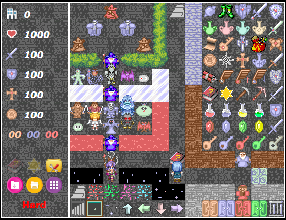
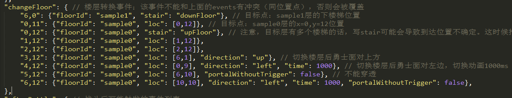

# 元件说明

?> 目前版本**v2.5.4**，上次更新时间：* {docsify-updated} *

在本章中，将对样板里的各个元件进行说明。各个元件主要包括道具、门、怪物、楼梯等等。

请打开样板0层 `sample0.js` 进行参照对比。



## 道具

本塔目前支持的所有道具列表在样板0层中已全部给出。当你在样板0层中拿到某个宝物时会有提示，这里不再赘述，详见拿到该道具的说明。

大多数宝物都有默认的效果，屠龙匕首暂未定义，如有自己的需求可参见[自定义道具效果](personalization#自定义道具效果)。

拿到道具后将触发`afterGetItem`事件，有关事件的详细介绍请参见[事件](event)。

如需修改某个道具的效果，在不同区域宝石数据发生变化等问题，请参见[自定义道具效果](personalization#自定义道具效果)的说明。

**有关轻按，在data.js的系统变量中有定义。如果`enableGentleClick`为true，则鼠标（触摸屏）通过双击勇士，键盘通过空格可达到轻按效果，即不向前移动而获得前方物品。**

## 装备

如果需要让剑盾等变成装备，可以直接在`data.js`中设置`'equipment': true`即可。

从V2.4.1开始，HTML5魔塔样板终于拥有了属于自己的装备页面。

### 装备栏的设置，装备类型

在全塔属性中，有一个`equipName`项，其定义了本塔的所有可装备的装备栏。

其需要是一个不小于1且不大于6的数组，其中每一项为装备栏的名称，**建议是两个汉字**。

例如下面这种写法就是定义了四个装备孔，名称分别为武器、防御、首饰和魔杖。

``` js
"equipName": ["武器","防具","首饰","魔杖"]
```

这么定义好后，装备类型即为每个装备孔的索引（从0开始）。

即，武器的装备类型是0，防御的装备类型是1，首饰的装备类型是2，魔杖的装备类型是3。

### 设置每个装备的属性

如果要将一个道具设置为装备，首先需要将其`cls`设为`equips`。

然后在图块属性的`equip`一项中设置装备的具体属性。该项写法如下:

``` js
{"type": 0, "atk": 0, "def": 0, "mdef"：0, "animate": "hand", "percentage": true}
```

type为该装备的类型，必填，和上面装备栏一一对应。例如，0就是武器，2就是首饰等等。

atk/def/mdef为该装备分别增加的攻防魔防数值（支持负数）；如果不加也可省略不写。

animate为该装备的攻击动画，仅对type为0时有效。具体可参见[动画和天气系统](#动画和天气系统)。

percentage为该装备是否按比例增加属性。

下面是几个写法例子。

``` js
{"type": 0, "atk": 10} // 装备类型是武器，效果是攻击+10，使用默认的攻击动画
{"type": 0, "atk": 40, "animate": "sword"} // 装备类型为武器，效果是攻击+10，攻击动画是sword
{"type": 1, "def": 40, "percentage": true} // 装备类型是防具，效果是防御提升40%
{"type": 1, "def": 100, "mdef": 100} // 装备类型是防具，效果是防御和魔防各+100
{"type": 3, "atk": -20, "def": 50, "mdef": 50} // 装备类型是魔杖，效果是攻击-20，防御和魔防各+50
{"type": 2, "atk": -20, "def": 50, "mdef": 50, "percentage": true} // 装备类型是魔杖，效果是攻击下降20%，防御和魔防各提升50%
```

所有取值全部向下取整。

值得注意的是，如果多个装备同时按比例增加属性，使用加法计算。比如武器增加30%攻击，防具增加10%攻击，最终合起来增加的是40%而不是43%的属性。

### 检测是否存在装备

可以使用`core.hasEquip(itemId)`来检测是否装上某个装备。

使用`core.hasItem(itemId)`来检测是否存在一个未装上的装备。

使用`core.getEquip(equipType)`来获得某个装备类型的当前装备。

更多相关API详见[附录：API列表](api)。

### 多重装备

从V2.5.4开始，允许支持多重装备，即有若干的装备可共用若干的格子（例如永不复还那样）。

要实现这一点，上面的写法有所改变。

在全塔属性中的`equipName`项写法不变，不过可以写重复的装备孔名称。（但仍然最多只能写6个）

``` js
"equipName": ["武器", "武器", "武器", "防具", "防具", "首饰"] 
```

然后对于某个装备，将其`type`（装备类型）写对应的装备孔名称即可。

``` js
{"type": "武器", "atk": 20, "def": 0, ...}
```

这样写的话，则所有该名称的装备孔均可装上此装备。

当尝试装上此装备时，会取最小的一个空的装备孔进行装备。如果没有空闲的装备孔，则会提示“请先卸下装备”。

装备动画仍然会取第一个（装备类型为0）的装备的`animate`项，即使装备了多个有动画的武器。

## 门

本塔支持6种门，黄蓝红绿铁花。前五种门需要有对应的钥匙打开，花门只能通过调用`openDoor`事件进行打开。

开门后可触发该层的`afterOpenDoor`事件，有关事件的详细介绍请参见[事件](event)。

如果要新增自己的门，请参见[新增门和对应的钥匙](personalization#新增门和对应的钥匙)。

## 暗墙

本塔支持暗墙。

要制作一个暗墙非常简单：在该点直接放一个普通墙壁，然后事件写“开门”，坐标为该点就行。

``` js
// 该点画一个普通的墙壁，比如`yellowWall`

// 在该点的事件events中:
"x,y": [
    {"type": "openDoor"} // 直接使用开门事件，坐标可忽略表示当前点
]
```

系统会自动调用animates中的开暗墙动画。

目前只有如下ID支持以这种方式开门：

``` text
yellowDoor, blueDoor, redDoor, greenDoor, specialDoor, steelDoor,
yellowWall, blueWall, whiteWall
```

## 怪物

本塔支持的怪物列表参见`project/enemys.js`。其与images目录下的`enemys.png`素材按顺序一一对应。

如有自己的怪物素材需求请参见[自定义素材](personalization#自定义素材)的内容。

怪物可以有特殊属性，每个怪物可以有多个自定义属性。

怪物的特殊属性所对应的数字（special）在脚本编辑中的`getSpecials`中定义，请勿对已有的属性进行修改。

``` js
function() {
	// 获得怪物的特殊属性，每一行定义一个特殊属性。
	// 分为三项，第一项为该特殊属性的数字，第二项为特殊属性的名字，第三项为特殊属性的描述
	// 可以直接写字符串，也可以写个function将怪物传进去
	return [
		[1, "先攻", "怪物首先攻击"],
		[2, "魔攻", "怪物无视勇士的防御"],
		[3, "坚固", "勇士每回合最多只能对怪物造成1点伤害"],
		[4, "2连击", "怪物每回合攻击2次"],
		[5, "3连击", "怪物每回合攻击3次"],
		[6, function(enemy) {return (enemy.n||4)+"连击";}, function(enemy) {return "怪物每回合攻击"+(enemy.n||4)+"次";}],
		[7, "破甲", "战斗前，怪物附加角色防御的"+Math.floor(100*core.values.breakArmor||0)+"%作为伤害"],
		[8, "反击", "战斗时，怪物每回合附加角色攻击的"+Math.floor(100*core.values.counterAttack||0)+"%作为伤害，无视角色防御"],
		[9, "净化", "战斗前，怪物附加勇士魔防的"+core.values.purify+"倍作为伤害"],
		[10, "模仿", "怪物的攻防和勇士攻防相等"],
		[11, "吸血", function (enemy) {return "战斗前，怪物首先吸取角色的"+Math.floor(100*enemy.value||0)+"%生命作为伤害"+(enemy.add?"，并把伤害数值加到自身生命上":"");}],
		[12, "中毒", "战斗后，勇士陷入中毒状态，每一步损失生命"+core.values.poisonDamage+"点"],
		[13, "衰弱", "战斗后，勇士陷入衰弱状态，攻防暂时下降"+(core.values.weakValue>=1?core.values.weakValue+"点":parseInt(core.values.weakValue*100)+"%")],
		[14, "诅咒", "战斗后，勇士陷入诅咒状态，战斗无法获得金币和经验"],
		[15, "领域", function (enemy) {return "经过怪物周围"+(enemy.range||1)+"格时自动减生命"+(enemy.value||0)+"点";}],
		[16, "夹击", "经过两只相同的怪物中间，勇士生命值变成一半"],
		[17, "仇恨", "战斗前，怪物附加之前积累的仇恨值作为伤害"+(core.flags.hatredDecrease?"；战斗后，释放一半的仇恨值":"")+"。（每杀死一个怪物获得"+(core.values.hatred||0)+"点仇恨值）"],
		[18, "阻击", function (enemy) {return "经过怪物的十字领域时自动减生命"+(enemy.value||0)+"点，同时怪物后退一格";}],
		[19, "自爆", "战斗后勇士的生命值变成1"],
		[20, "无敌", "勇士无法打败怪物，除非拥有十字架"],
		[21, "退化", function (enemy) {return "战斗后勇士永久下降"+(enemy.atkValue||0)+"点攻击和"+(enemy.defValue||0)+"点防御";}],
		[22, "固伤", function (enemy) {return "战斗前，怪物对勇士造成"+(enemy.damage||0)+"点固定伤害，无视勇士魔防。";}],
		[23, "重生", "怪物被击败后，角色转换楼层则怪物将再次出现"],
		[24, "激光", function (enemy) {return "经过怪物同行或同列时自动减生命"+(enemy.value||0)+"点";}]
	];
}
```

多属性可采用数组的写法，比如`'special': [1,3]`视为同时拥有先攻和坚固属性；`'special': [5,10,14,18]`视为拥有3连击、魔防、诅咒、阻击四个属性。

本塔支持战斗动画，在`data.js`中存在三个全局选项：`canOpenBattleAnimate`, `showBattleAnimateConfirm`, `battleAnimate`。

- `canOpenBattleAnimate`代表是否允许用户开启战斗动画。如果你添加了一些自定义属性，且不想修改战斗界面的UI，则可以将其关闭。
- `showBattleAnimateConfirm`代表是否在游戏开始时给用户提供开启动画的选项。对于一些偏向于萌新的塔，可以开启此项。
- `battleAnimate`代表是否默认开启战斗动画。此项会被用户存储的设置给覆盖。
- 如果`canOpenBattleAnimate`为false，则后面两个也强制为false。

怪物可以负伤，在`data.js`的全局变量`enableNegativeDamage`中指定。

下面的`getSpecialHint`函数则给定了每个特殊属性的详细描述。这个描述将在怪物手册中看到。

打败怪物后可以进行加点操作。有关加点塔的制作可参见[加点事件](event#加点事件)。

如果`data.js`中的enableExperience为false，即不启用经验的话，怪物手册里将不显示怪物的经验值，打败怪物也不获得任何经验。

拿到幸运金币后，打怪获得的金币将翻倍。

如果怪物有`"notBomb": true`，则该系列诖怪物均不可被炸。

N连击怪物的special是6，且我们可以为它定义n代表实际连击数。参见样板中剑王的写法。

吸血怪需要给怪物设置value，代表吸血的比例。

可以给吸血怪添加`'add': true`来将吸血的数值加到自身上。

中毒怪让勇士中毒后，每步扣减的生命值由`data.js`中的values定义。

衰弱怪让勇士衰弱后，攻防会下降一定比例或固定数值（直到衰弱状态解除恢复）；其在`data.js`中的values定义。

诅咒怪将让勇士陷入诅咒状态，诅咒状态下杀怪不获得金币和经验值。

领域怪需要在怪物后添加value，代表领域伤害的数值。如果勇士生命值扣减到0，则直接死亡触发lose事件。

领域是十字伤害还是九宫格伤害由`zoneSquare`设定，如设置为true则为九宫格伤害，不指定或为false则为十字伤害。

领域怪还可以设置`range`选项代表该领域怪的范围，不写则默认为1。

**将`flag:no_zone`设置为true可以取消领域效果。**

阻击怪同样需要设置value，代表阻击伤害的数值。如果勇士生命值扣减到0，则直接死亡触发lose事件。

**将`flag:no_snipe`设置为true可以取消阻击效果。**

!> 阻击怪后退的地点不能有任何事件存在，即使是已经被禁用的自定义事件！

激光怪同样需要设置value，代表激光伤害的数值。

请注意如果吸血、领域、阻击中任何两个同时存在，则value会冲突。**因此请勿将吸血、领域、阻击或激光放置在同一个怪物身上。**

**将`flag:no_laser`设置为true可以免疫激光效果。**

退化怪需要设置'atkValue'和'defValue'表示退化的数值；也可以不设置默认为0。

夹击可以通过全塔属性中的`betweenAttackCeil`设为true可以将伤害向上取整。

**将`flag:no_betweenAttack`设置为true可以免疫夹击效果。**

固伤怪则需要设置`damage`选项，代表战前扣血数值。

如有额外需求，可参见[自定义怪物属性](personalization#自定义自定义怪物属性)，里面讲了如何设置一个新的怪物属性。

## 怪物和NPC的朝向问题

从V2.5.2开始，对于人形怪物和NPC的朝向问题已经有着比较好的解决方式。

首先明确一点的是，和RM不同，H5中即使是对同一个怪物/NPC的不同朝向，也需要分别将其各个朝向素材追加对应的图片上，并进行注册。

### 怪物的朝向问题

对于同一个怪物的不同朝向，需要对每个朝向创建一个怪物（属性完全相同），这样就可以在地图上绘制不同朝向的怪物。

但是这样会存在一个问题，就是怪物手册中怪物的每个朝向都会显示成一个单独的怪物。

为了避免这种情况的发生，在怪物的属性中存在一个`displayIdInBook`项，**我们可以指定该项来控制每个怪物在怪物手册中中显示成的怪物。**

举个例子，假设我现在有个怪物，其向下的行走图ID是`E300`，其向左的行走图ID是`E301`，向右的行走图ID是`E302`。分别对这几个怪物填写完全相同的怪物属性。

如果我在地图上同时绘制向下、向左和向右的该怪物，则确实能在地图上显示出来不同的朝向，但是在怪物手册中会同时显示这三种类型的怪物，观感较差。

我们可以给`E301`和`E302`怪物属性中的`displayIdInBook`项填写为`"E300"`。

这样的话，在怪物手册中，所有的E301和E302均会被视为E300并进行合并。即使只有一只朝向左的怪物（E301），怪物手册仍然会按E300进行显示。

从而完美解决了同种怪物不同朝向在怪物手册的显示问题。

### NPC的朝向问题

和怪物不同的是，NPC朝向问题更复杂一点。

在NPC的图块属性中，存在一个`faceIds`的项目，可以用其来绑定一个图块所对应的其他朝向的图块ID。

举个例子，假设我存在一个NPC，其向上的图块ID是N333，向下的图块ID是N334，向左的图块ID是N335，不存在向右的图块ID。

则可以在这几个图块属性中的`faceIds`中写：`{"up": "N333", "down": "N334", "left": "N335"}`。

当勇士从左边撞上此怪物后，将从该图块的图块属性中的faceIds中寻求`left`所对应的ID。
如果存在定义（如N335），则会在触发对话事件前改变当前图块为N335，看起来就是在对话前进行了转向，面向勇士。

!> 请注意，在对话结束后朝向不会切换回来，因此如果有必要切换朝向请在事件结束前调用转变图块事件。

同理，使用移动事件让NPC在行走时，不同朝向的行走会自动调用`faceIds`中不同朝向的ID所对应的行走图，看起来就是在行走时也可以不断转向了。

从而，完美解决了NPC的朝向问题（碰触时面向勇士、行走时改变朝向）。

## 路障，楼梯，传送门

血网的伤害数值、中毒后每步伤害数值、衰弱时暂时攻防下降的数值，都在 `data.js` 的values内定义。

路障同样会尽量被自动寻路绕过。

有关楼梯和传送门，必须在该层样板的changeFloor里指定传送点的目标。



!> **请注意这里的`"x,y"`代表该点的横坐标为x，纵坐标为y；即从左到右第x列，从上到下的第y行（从0开始计算）。如(6,0)代表最上面一行的正中间一列。**

floorId指定的是目标楼层的唯一标识符（ID）。

也可以写`"floorId": ":before"`和`"floorId": ":next"`表示上一楼和下一楼。

后面可以写stair到upFloor或downFloor，表示将前往目标楼层的上楼梯/下楼梯位置。你也可以写loc然后指定目标点的坐标。

请注意的是，如果目标楼层有多个楼梯，写stair可能会导致到达的楼梯不确定，这时候请使用loc方式来指定具体的点位置。

可以指定direction为up/left/right/down，指定后勇士将面向该方向。

可以指定time，指定后切换动画时长为指定的数值。

**从2.1.1开始，楼层属性中提供了`upFloor`和`downFloor`两项。如果设置此项（比如`"upFloor": [2,3]`），则写stair:upFloor或者楼传器的落点将用此点来替换楼梯位置（即类似于RM中的上箭头）。**

## 剧情文本控制与对话框效果

在写剧情文本时，可以：

- 使用`\t[...]`来给文字加上标题和图标。如`\t[老人,man]`。
- 使用`\b[...]`来制作对话框效果，如`\b[up,3,2]`。
- 使用`\r[...]`来动态修改局部文本的颜色，如`\r[red]`。
- 使用`${}`来计算一个表达式的值，如`${status:atk+status:def}`。
- 使用`\f[...]`来同时插入一张立绘图，如`\f[1.png,100,200]`。

从V2.5.2开始，也允许绘制一张头像图在对话框中，只要通过`\t[1.png]`或`\t[标题,1.png]`的写法。

详细信息请参见[剧情文本控制](event#text：显示一段文字（剧情）)中的说明。

从V2.5.2开始，可以用一张WindowSkin图片作为对话框的背景皮肤。

使用时，需要将图片放在images目录下，并在全塔属性中予以注册。

可以使用[设置剧情文本的属性](setText：设置剧情文本的属性)事件将对话框背景设置为需要的皮肤。

!> 关于对话框效果请注意，现在是采用WindowSkin的右下角两个32x32的图片作为对话框尖角进行绘制。因此请尽量使用群文件或网盘的常用素材中给出的WindowSkin素材（均已进行对话框适配）。如需使用来自第三方的WindowSkin素材，请自行注意对话框的尖角问题，或弃用`\b`效果。

另外一点是，V2.5.2以后，对话框`\b`可以根据文字长度来自动控制文本框宽度，其基本控制原理如下：

- 如果用户存在手动换行`\n`，则选取**最长的一段话**作为文本框宽度。
- 如果用户不存在手动换行，则会将文本框宽度调整为X行半的最佳宽度。
- 文本框宽度存在上下界，最终宽度一定会控制在该范围内。

该自动调整仅对`\b`的对话框效果有效。非对话框仍然会绘制整个界面的宽度。

## 大地图

从V2.4开始，H5魔塔开始支持大地图。

大地图在创建时可以指定宽高，要求**宽和高都不得小于13，且宽高之积不超过1000**。

大地图一旦创建成功则不得修改宽高数值。

## 动画和天气系统

现在我们的H5魔塔支持播放动画，也支持天气系统了。

要播放动画，你需要先使用“RM动画导出器”将动画导出，放在animates目录下，然后再data.js中定义。

``` js
"animates": [// 在此存放所有可能使用的动画，必须是animate格式，在这里不写后缀名
    // 动画必须放在animates目录下；文件名不能使用中文，不能带空格或特殊字符
    "hand", "sword", "zone", "yongchang", "thunder" // 根据需求自行添加
]
```

!> 动画必须是animate格式，名称不能使用中文，不能带空格或特殊字符。

导出动画时可能会进行一些压缩以节省流量，因此清晰度可能不如原版。

从2.3.2开始，动画可以同时导出所用的音效。**如果导出音效，请确保将所用到的音效复制到了`sounds`目录下，并且在全塔属性中注册过。**

动画播放时，是按照每秒20帧的速度（即50ms/帧）。

定义完毕后，我们可以调用`animate`事件来播放该动画，有关事件的详细介绍请参见[事件](event)。

!> 播放录像时，将默认忽略所有动画。

目前天气系统只支持雨和雪两种天气。

在每层楼的剧本文件里存在一个weather选项，表示该层楼的默认天气。

``` js
// 该层的默认天气。本项可忽略表示晴天，如果写则第一项为"rain"，"snow"或"fog"代表雨雪雾，第二项为1-10之间的数代表强度。
"weather": ["snow",5] 
```

我们也可以使用`setWeather`事件来设置当前天气，有关事件的详细介绍请参见[事件](event)。

## 背景音乐

本塔支持BGM和SE的播放。

要播放音乐和音效，你需要将对应的文件放在sounds目录下，然后在全塔属性中进行定义

``` js
"bgms": [ // 在此存放所有的bgm，和文件名一致。
    // 音频名不能使用中文，不能带空格或特殊字符；可以直接改名拼音就好
    'bgm.mp3'
];
"sounds": [ // 在此存放所有的SE，和文件名一致
    // 音频名不能使用中文，不能带空格或特殊字符；可以直接改名拼音就好
    'floor.mp3', 'attack.mp3', 'door.mp3', 'item.mp3', 'zone.mp3'
]
```

!> 音频名不能使用中文，不能带空格或特殊字符。

目前BGM支持主流的音乐格式，如mp3, ogg,格式等。不支持mid格式的播放。
<!--
!> mid格式是通过数学方法模拟出来的音乐效果，质量可能会和实际效果差距较大。

!> **警告！** mid格式在手机端播放可能会特别卡，仍推荐直接使用mp3/ogg来播放。
-->
定义完毕后，我们可以调用`playBgm`/`playSound`事件来播放对应的音乐/音效，有关事件的详细介绍请参见[事件](event)。

**另外，考虑到用户的流量问题，将遵循如下规则：**

- **如果用户当前使用的电脑，则默认开启音乐效果，并播放默认BGM**
- **如果用户当前使用的手机，且处于Wifi状态，则默认开启音乐效果，并播放默认BGM**
- **其他情况，将默认关闭音乐效果，只有在用户在菜单栏中点击“音乐开关”后才会播放音乐**

!> iOS平台以及部分浏览器不支持获得当前网络状态，此时即使在使用Wifi也必须要用户点击“音乐开关”才能播放音乐。

从V2.5.3开始，可以使用`loadBgm`事件来预加载一个bgm，这样到播放时无需等待，直接播放。

同时BGM将使用LRU算法增加缓存机制。默认最多缓存4个BGM（在core.js的musicStatus.cachedBgmCount控制）。

系统会自动释放最久未使用的BGM。

也可以使用`freeBgm`事件来手动释放一个无需再用的bgm。

## 录像

HTML5魔塔一大亮点就是存在录像系统，可以很方便进行录像回放。

当你在游戏的过程中，随着你的操作，录像也会被依次记录。游戏结束后将提示是否下载录像，上传成绩时也会上传你的录像信息。

在菜单栏-同步存档中，可以直接对当前录像进行下载。

!> 录像记录的是你当前的路线（本质上是模拟键盘操作），是一个纯文本文件，占用空间很小！

录像的回放主要有两种方式：

1. 保存成的录像文件(.h5route文件)：在标题界面点录像回放，再选择文件即可。
2. 游戏过程中时的当前录像：随时按R可以进行回放；手机端则长按任何位置3秒以上调出虚拟键盘，再按R。

录像播放过程中，可以进行如下操作：

- **暂停/播放：** 按空格可以随时暂停或播放录像。
- **加速：** 按X可以加速录像播放，最高可达6倍速。
- **减速：** 按Z可以减速录像播放，最低可达0.3倍速。
- **停止：** 按ESC可以立刻停止录像播放，并返回正常游戏。
- **回退：** 按A可以回退到上一个录像节点（录像播放过程中每50步存一个录像节点）。
- **存档：** 按S可以在录像播放过程中进行存档。
- **查看手册：** 按C可以在录像播放过程中查看怪物手册。
- **浏览地图：** 按PgUp/PgDn可以在录像播放过程中浏览地图。

如果录像出现问题，请加群539113091找小艾反馈Bug。

## 绘图模式

从V2.5开始，样板提供了绘图模式，可以让玩家在画布上任意进行绘制，标记等。

使用M键，或在菜单栏中可以进入绘图模式。

**绘图的内容会自动保存，且以页面为生命周期，和存读档无关，返回标题并重新开始游戏后绘制的内容仍有效，但刷新页面就会消失。**

你可以将绘制内容保存到文件，也可以从文件读取保存的绘制内容。

绘图模式下，状态栏的图标也会相应改变，铅笔为绘制模式，橡皮为擦除模式，存读档为保存和读取绘图文件，退出为返回默认值。

在浏览地图页面中也可以按楼传按钮或M键来开启/关闭该层的绘图显示。

## 操作说明

本塔主要支持鼠标（触摸屏）操作和键盘操作。

鼠标（触摸屏）操作说明如下：

- **点状态栏中图标：** 进行对应的操作
- **点任意块：** 寻路并移动
- **点任意块并拖动：** 指定寻路路线
- **单击勇士：** 转向
- **双击勇士：** 轻按（仅在轻按开关打开时有效）
- **长按任意位置：** 打开虚拟键盘

键盘操作快捷键如下：

- **[CTRL]** 跳过对话
- **[Z]** 转向
- **[X]** 打开/关闭怪物手册
- **[G]** 打开/关闭楼层传送器
- **[A]** 读取自动存档
- **[S/D]** 打开/关闭存/读档页面
- **[V]** 打开/关闭快捷商店选择列表
- **[T]** 打开/关闭工具栏
- **[Q]** 打开/关闭装备栏
- **[ESC]** 打开/关闭系统菜单
- **[B]** 打开数据统计
- **[H]** 打开帮助页面
- **[R]** 回放录像
- **[E]** 显示光标
- **[SPACE]** 轻按（仅在轻按开关打开时有效）
- **[M]** 绘图模式
- **[PgUp/PgDn]** 浏览地图
- **[1]** 快捷使用破墙镐
- **[2]** 快捷使用炸弹/圣锤
- **[3]** 快捷使用中心对称飞行器
- **[4]** 快捷使用其他道具
- **[Alt+0~9]** 快捷换装

以上快捷键也能在游戏菜单中的操作说明中看到。

&nbsp;

&nbsp;

上面就是整个样板中的各个元件说明。通过这种方式，你就已经可以做出一部没有任何事件的塔了。

尝试着做一个两到三层的塔吧！

==========================================================================================

[继续阅读下一章：事件](event)
