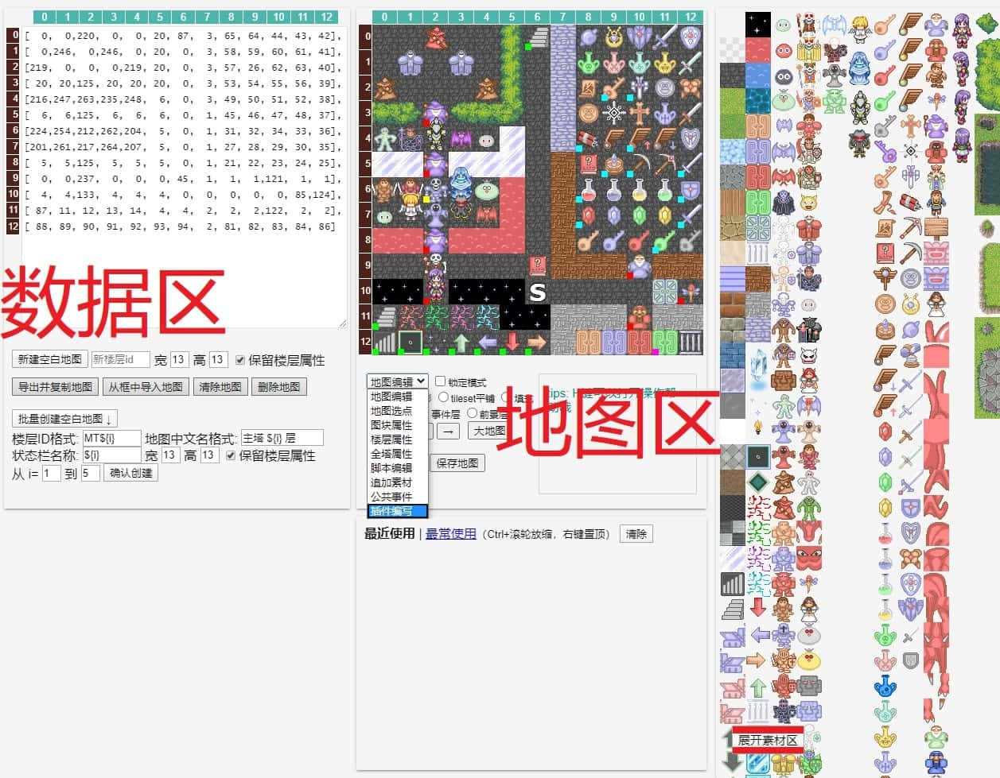
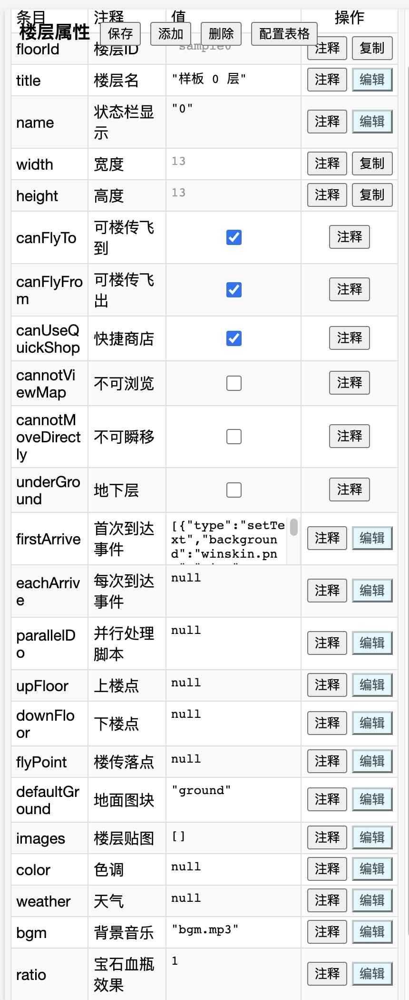
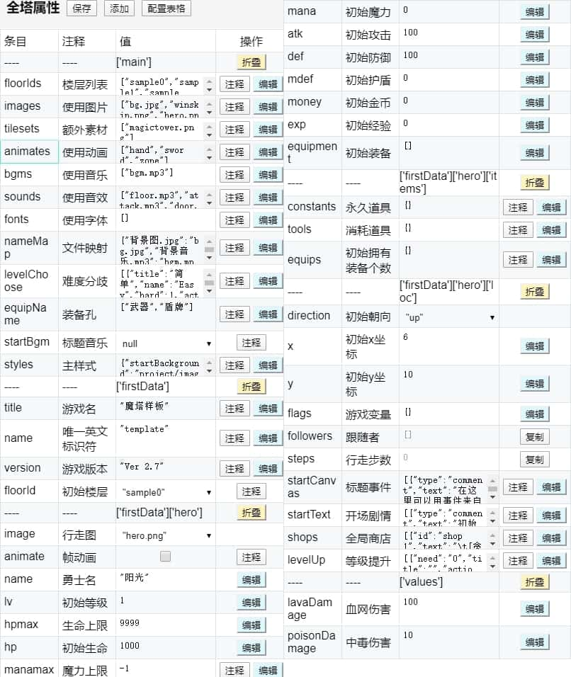
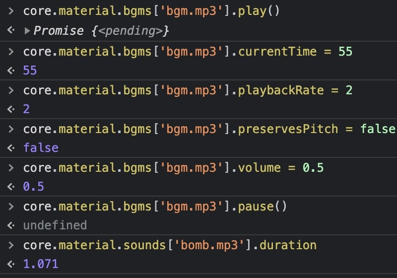
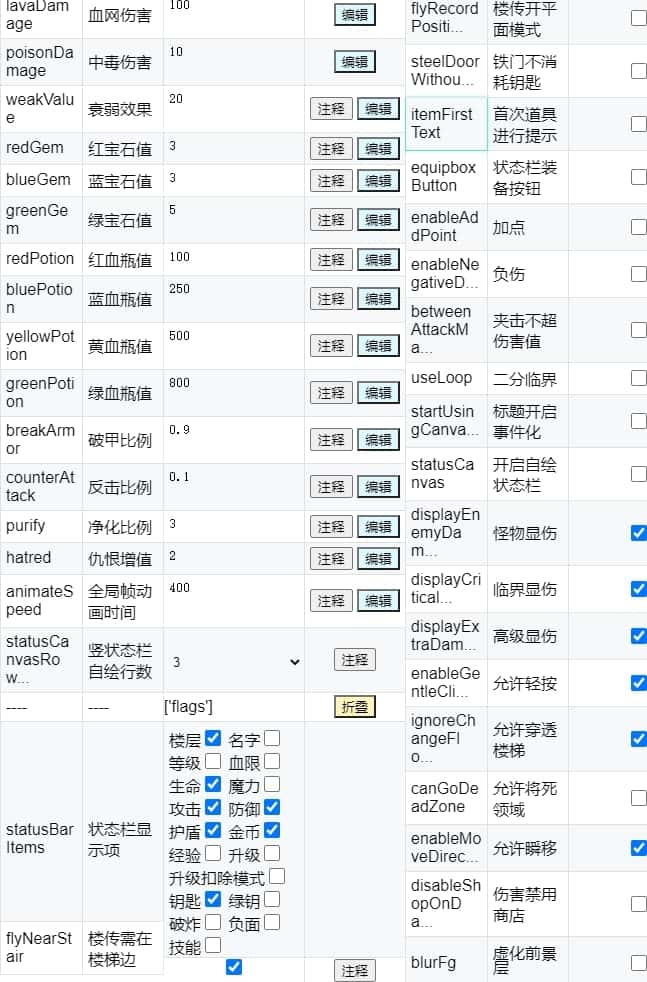

# 元件说明

?> 在这个部分，将详细讲解编辑器的每个部件的用法。

## 素材区

素材区在展开状态下，从左到右分为若干列：

1.  `project\materials\terrains.png`：位于素材区第一列（最上面两个图块不在这张图片里，它们分别是擦除和空气墙），其中从楼梯开始往下有系统含义，请勿随意修改其图块属性。
2.  `project\materials\animates.png`：位于素材区第二列，共4帧。主要为星空、岩浆、三色墙、六色门、四向出入口箭头、四种路障。
3.  `project\materials\enemys.png`：32×32px（像素，下同）的怪物，您可以随意修改它们的任何属性。如果嫌两帧太少，还可以作为32×48px怪物画在靠下2/3部分。
4.  `project\materials\enemy48.png`：32×48px的怪物，自带只有四只。您可以随意修改它们的任何属性。
5.  `project\materials\npcs.png`：32×32px的NPC，如老人、商人、小偷、公主、仙子、木牌、魔龙和章鱼的其他8块，您可以随意修改它们的任何属性。
6.  `project\materials\npc48.png`：32×48的NPC，自带只有样板0层的小姐姐，但您也可以用它来制作32×48px的门。
7.  `project\autotiles`：自动元件，会随着在地图上的连续摆放而自动采取适当的绘制方式。
8.  `project\tilesets`：额外素材，用来突破其他素材合计不得超过10000个的限制。您可以在这个区域拖动来批量框选，再在地图区单击成片绘制或拖动平铺。

V2.7.3中，`terrains.png`追加了薄墙图块（红线），V2.8中它们被挪到了最下方，可供利用。

V2.8中，自动元件在素材区折叠模式下会只显示左上角一格，与RPG Maker一致。

## 地图编辑（快捷键Z）



如图所示，您可以在此对地图进行清空或删除操作，也可以新建或批量新建任意宽高的空白地图。

其中“导出并复制地图”是指显示出左侧的矩阵并复制（一般用来跨塔复制地图），您也可以直接改动其中的数字（例如将绿色史莱姆批量替换为红色史莱姆），再点击“从框中导入地图”就能将改动的结果同步到地图上。

下面的“楼层ID、中文名、状态栏名”分别对应楼层属性（快捷键V）的floorId、title和name，其中floorId也作为文件名（不能使用中文，注意大小写问题），title会显示在楼传界面和楼层切换黑屏，name也允许使用中文但请注意控制字数。

## 图块属性（快捷键C）


如上图，除怪物和道具外，所有素材的图块属性都定义在`project\maps.js`中。道具和怪物属性也支持清空和批量复制，下面逐一讲解各条目的含义和用法：

1.  **图块ID：**图块的唯一标识符`core.getBlockId(x, y, floorId, showDisable)`，不允许使用中文和纯数字。请注意，额外素材`tileset`的图块ID由素材图片的顺序和图块在图片上的位置确定，无法更改，也请勿随意调换图片的顺序。样板已注册的图块中建议只修改怪物和NPC的图块ID，修改方法为上图最下方的**修改图块id为**。
2.  **图块数字：**见前面的描述，额外素材的数字由ID去掉字母X得到。
3.  **图块类别：**图块素材的类型。
4.  **图块名称：**怪物在手册中、道具在道具栏中、其他图块在剧情对话中的默认名称，可以随意修改。但原则上不推荐不同的怪物和道具有重复的名称，否则会影响事件编辑器的中文替换功能。

V2.8中，图块名称在有罗马数字、希腊字母、日文假名的情况下也支持事件编辑器中的中文替换了，这大大方便了一些科幻或魔法题材的作品。

V2.8中，道具名称支持使用${表达式计算}语法，但这样做会使其在事件编辑器中的中文替换失效。

你可以随时使用 `core.getBlockId(x, y, floorId, showDisable)` 获得地图上任何一个点的图块ID；`core.getBlockCls(x, y, floorId, showDisable)` 或的地图上任何一个点的图块类别；详见[API列表](api)。

在讲解其他属性之前，这里简单介绍一下素材的注册机制：

* 除自动元件和额外素材外，其余图块只有在注册后才拥有上面所说的ID和数字。
* 未注册的图块则只有“索引”，索引为n表示该图块在图片的第（n+1）行，
* ID和索引的对应关系定义在`project\icons.js`中。
* 尝试用未注册的图块（如利用便捷PS工具新追加的图块）在地图上绘制，就会出现红色的问号方框。
* 此时请在数据区手动注册此图块，只需填写一个新ID和数字（10000以内）即可。
* 也可以点击“自动注册”按钮批量注册该图片的所有未注册素材，自动注册出的ID无任何语义（一般是一个表示图块类别的大写字母加几个数字），建议手动修改成有语义的内容（如史莱姆以Slime结尾）。

自动元件的注册与此不同，除了替换样板现有的几个外，如果还需要追加新的，请在地图区下方的下拉框中切换到“追加素材”（快捷键M），然后导入文件到画板autotile，再点击“追加”按钮即可。非Windows系统追加其他素材也主要依靠这种方式，具体用法请自行探索。

V2.7起，电脑端支持将文件直接拖动到素材区对应的列，进行追加。具体规则如下：
1. 道具的图片宽高必须为32的倍数，每格会被追加为一个新道具
2. 其他类别的多帧图块（不包括自动元件和tileset），规格必须为128×128、128×192、96×128、96×192之一，分别对应32×32和32×48的四行四列或四行三列（后者为RPG Maker VX Ace格式）。
3. 向两帧的enemys.png或npcs.png追加时，四列的图片取中间两列，三列的图片取两边两列。
4. 向四帧的animates.png、enemy48.png、npc48.png追加时，三列的图片按2123排布。

V2.8起，图块支持“（注销并）删除”操作，执行后将（对已注册的）删除该图块在maps.js和icons.js的信息（如果是怪物和道具则还会删除对应的信息），然后将该图块从图片上删除，图片上更靠下的图块会被统一上移一格。

### 非怪物非道具属性

1. **触发器：**当碰触到地图上此图块时触发的系统事件，详见[事件](event)。
  * **battle**: （未列出）战斗；当撞上一个怪物且没有覆盖触发器时（参见[事件](event)）将自动调用此触发器产生战斗，并触发战前和战后事件。
  * **getItem**: （未列出）拾获道具；当撞上/轻拾一个道具且没有覆盖触发器时（参见[事件](event)）将自动调用此触发器获得它，并触发（拾获）道具后事件。
  * **changeFloor**: （未列出）楼层切换；对于地图上绑定的绿点（常见于楼梯或彩色箭头）将自动调用此触发器产生楼层切换事件。
  * **openDoor**: 用于制作门效果，当撞上此图块时将尝试开门（仅对`animates`和`npc48`生效），并触发开门后事件；具体开门动画参见下面的门信息。
  * **pushBox**: 推箱子；请勿对非箱子使用此触发器。
  * **ski**: 滑冰；拥有此触发器的图块放置在背景层时，走上去将触发滑冰效果。
  * **custom**: 自定义系统触发器；你可以使用 `core.registerSystemEvent` 来自己定义一个系统触发器，参见[API列表](api)。
2. **可通行性：**勾选后勇士才可以踏入此图块，否则只能撞击此图块。（怪物被锁定为不可通行，道具被锁定为可通行，如有需要可以修改点上的不可通行性）
3. **碰触脚本/碰触事件：**勇士踏入或撞击此图块时执行的脚本，该项会被eval，相当于一种自定义的触发器，您可以参考踩灯和四种路障去填写它。V2.8起，新增了“碰触事件”（会覆盖该点的普通事件），使用起来更方便也更安全。
4. **不可出入方向：**对三个图层的图块都有效。不可出方向指的是勇士站在这种图块上不能向哪个方向走（包括撞击），不可入方向指的是勇士不能从哪个方向走向这种图块（包括撞击）。例如，不可入方向勾选了“上”则不能“从上方、向下”走向这个图块。请参考素材区第一列的四个灰色箭头（样板1层右下角也有）。
    * V2.8.1起，编辑器地图区下方提供了“通行度”勾选框，您可以随时勾选它来查看“不可出入方向”（包括图块的和点的）在地图上的实际效果。
5. **可破震：**勾选后，此图块将成为破墙镐（pickaxe）和地震卷轴（earthquake）这两个道具的目标。
6. **动画帧数：**您可以修改此帧数来让本来有4帧的图块只用前2或3帧循环播放，另外制作门时请务必将此帧数改为1，表示门在打开前静止在第1帧。
7. **门信息：**只对`animates`和`npc48`有效，您可以点击“编辑按钮”来填写此图块作为门的开关耗时、开关音效以及需要哪些钥匙各多少把（可以填写任何消耗类道具，也可以选择某些道具只需持有一定数量而不消耗）。修改此信息后，您需要将上面的“动画帧数”改为1，并可能需要将“触发器”改为openDoor（不改的话将无法通过撞击来开门，但可以像三色墙一样用来制作暗墙）。
    * 该项在V2.7首次提供，只支持“同时需要多种钥匙各多少把、消耗其中哪几种”的“且运算”条件。
    * 如果您需要指定“或运算”条件（如优先消耗一种钥匙，没有再消耗另一种），或“消耗量”少于“需要持有量”，或者需要判断的条件不是道具而是其他条件（比如勇士状态或flag），请使用“碰触事件”，但这样将无法自动存档。
    * V2.8新增了（批量）开门后事件，它和（单点）开门后事件的执行先后顺序，由“脚本编辑——开门后脚本”指定，默认先执行单点的。
    * 因此，复杂的开门条件也可以换个角度思考，把开门条件设为什么都不需要（先斩后奏，这一思想在道具使用条件中也很常见），开门后事件中再进行判断，如果开门成功就按照条件扣除钥匙，开门失败就再把门关上就好了，这样就保留了自动存档功能。
    * V2.8.1起，npc48支持绑定大型贴图，您可以制作大型门了，开关门的动画会更为震撼！
8. **行走图朝向：**设置后，当勇士撞击该图块时，图块会尝试转身面向勇士（对话事件结束前请使用“事件转向”指令将其转回去）。走动时也会尝试自动转向，请参考样板0层使用的小姐姐。
    * V2.8起，“行走图朝向”可以用于怪物，绑定后只需手动设置脸朝下的怪物属性（包括下面的绑定贴图）而不用管其他的，手册显示、实际战斗、阻激夹域（尤其是夹击）、漏怪检测（`hasEnemyLeft`）等都会强制读取脸朝下的怪物，游戏中动态修改任何一个朝向的怪物属性都会立即强制同步到四个怪物身上。
    * npc在设置行走图朝向以后，其他属性不具有自同步机制，包括下面的绑定贴图，请自行注意。
    * 该项的四个方向甚至可以写不同的图块类别，后果未知。
9. **绑定贴图：**V2.8.1新增，可以用于NPC和怪物。这很大程度上弥补了H5魔塔比起RPG Maker不能使用大型行走图的缺憾。
    * 点击此项时，将会直接弹窗请求选择文件，文件首先会判断总高度和总宽度的比例是否大于0.5。
    * 【1×4】如果这个比例不大于0.5（这个临界值可以通过复写`core.maps._getBigImageInfo`来修改），那么整张图视为1行4列（每列的高度至多为宽度的2倍），即一个图块的单向4帧行走图。方向默认视为朝下，如需修改，可以在其“行走图朝向”只绑定一个需要的方向（id写自己）。
    * 【4×4】如果这个比例大于0.5，那么整张图视为4行4列共16块，即4个朝向图块各自的4帧行走图（从上到下的朝向分别为“下、左、右、上”），因此您需要注册四个（最好是同类别的）图块并绑定好行走图朝向，贴图则都绑定这一张。
    * 该图块放在地图的事件层以后本体会透明化，并且根据朝向（默认向下）选择行走图的绘制偏移量。
    * 例如，朝下的图块，行走图在绘制时会让本体位于图片下缘中央，其他方向同理。
    * 而在编辑器中，1:1显示模式下大贴图会被缩小到1格，如需预览原始尺寸的效果，请点击地图区下方的“大地图”按钮。
    * 游戏中该图块会全程使用绑定的贴图（选择项的子选项图标和文本的`\\i[]`转义序列仍然使用本体）进行显示，包括在怪物手册和显示文章的`\t[]`效果（这两种都会被缩小到一定尺寸）。而显示文章的`\b[]`效果则还是根据图块类别使用原始高度，不过V2.8.1中您可以手动去掉尖角然后指定对话框的左上角坐标和限宽。
    * 对该图块执行“显隐事件、转变图块、开关门（npc48）、不透明度设置和渐变、移动跳跃”都会直接操作大贴图，这比起2.7.x的楼层贴图要好用许多！
    * 但是，如果您有一张图片希望分成16小格，但是每行对应完全独立的四个图块而不具有行走图朝向关系，该怎么做呢？
    * “插件编写”的第一项init中，提供了“资源加载后的操作”，您可以在里面用`splitImage`将该图的四行提前裁剪成四张图片并重新命名，就可以使用啦！
    * 手动使用脚本切分出的新图片无法通过弹窗选取，必须手动填写，敬请谅解。
    * 如果希望能够弹窗选取，可以使用全塔属性中的“图片切分”功能。
``` js
	this._afterLoadResources = function () {
        // 这是一个将4by4.png（假设为384*384）按行拆分成四个图片并保存的样例，
        // 可以用来在没有条件ps（如原图尺寸不支持便捷ps或者手机造塔时）的条件下，
        // 预处理图片来得到独立朝向的大型行走图（1of4.png到4of4.png）。
        var arr = core.splitImage('4by4.png', 384, 96); // 以宽386高96进行切分图片
        for (var i = 1; i <= arr.length; ++i)
            core.material.images.images[i + 'of4.png'] = arr[i - 1];
	}
```
### 道具属性

样板自带的道具都在样板0层摆好了，您可以直接进入游戏捡起它们，就会看到该道具的注意事项，这里不再赘述。

1. **道具类别：**虽然和图块类别的英文缩写都是cls，但有本质区别，请注意区分。道具的图块类别都是items，而道具类别分为以下几种：
    * items：是的你没看错，又是`items`这个词，请注意和图块类别的`items`相区分。它表示即捡即用类不进背包的道具，如四种血瓶、三种宝石等。这类道具需要用到的其他属性有“即捡即用效果”、“即捡即用提示”、“碰触或使用事件”。
    * tools：进背包的消耗类道具，如钥匙和解药瓶、便携式血瓶蓝瓶（生命魔杖）、破震炸飞和跳跃靴等。这类道具需要用到的其他属性有“道具描述”、“不显示在道具栏”、“回放不绘制道具栏”、“碰触或使用事件”、“使用效果”、“能否使用或装备”。
    * constants：进背包的永久道具（每件在背包的数量要么为1要么为0），如手册、楼传、幸运金币、十字架、护符、二倍斩等，这类道具需要用到的其他属性和tools一致。
    * equips：装备，它需要用到的其他属性有“道具描述”、“道具的装备属性”、“能否使用或装备”。
    * 例如：如果您想把四种血瓶和三种宝石改为便携式，只需把其道具类别改为tools（当然，楼层属性中的ratio一项也就失效了）。
    * 如果想把大黄门钥匙变为钥匙盒（红黄蓝钥匙各一把），只需把其道具类别从tools改为items
    * 如果想把剑盾变成装备，只需把其道具类别改为`equips`；
    * 如果想修改破墙镐/炸弹/冰冻徽章的目标个数（V2.8支持改为八方向，使用`core.utils.scan2`即可）或让炸弹能够获得金经/触发战后事件，请修改它们的使用效果。
2. **道具描述：**对除即捡即用类外的道具都有效。一个字符串，为道具在道具栏里的描述，也作为首次捡到时的提示信息的一部分（如果全塔属性中开启了这一提示功能的话）。支持使用`${表达式计算}`语法（如四种血瓶和三种宝石那样，但不支持中文替换），此语法的详细规则见“显示文章正文的转义序列”，和“值块和冒号缩写量”。
3. **不显示在道具栏：**对tools和constants有效，勾选此项后，该道具在背包中将不显示出来。常用于不能主动使用或已有专门的使用按钮的道具来节省显示篇幅，如手册、楼传、幸运金币、十字架、护符和钥匙等。该属性的详细原理，见“脚本编辑（N键）”最下面的“道具栏显示项”。
4. **回放不绘制道具栏：**勾选此项后，录像回放中使用此道具将不显示黑黑的道具栏。常用于频繁使用的道具，如楼传、技能和冰冻徽章等。
5. **即捡即用效果：**如题，该项会被eval，一般为一行下述的代码： `core.status.hero.xxx += yyy * core.status.thisMap.ratio`
    * 其中xxx为勇士的某种状态（如生命hp、生命上限hpmax、魔力mana、魔力上限manamax、护盾mdef、攻防、金经）
    * yyy为此道具的基础效果（如四种血瓶和三种宝石的基础效果定义在了全塔属性中）
    * `core.status.thisMap.ratio`则是指该道具所在楼层的“楼层属性”最下面的“宝石血瓶效果”。
    * 此效果会在“B键数据统计”被模拟执行（使用道具所在楼层的ratio）然后计算执行前后勇士状态差异，因此请尽量只在里面用脚本直接操作`core.status.hero`，而不要使用tip或特效。
    * 可以在此项中使用`core.insertAction([...])`或`core.insertCommonEvent()`插入事件或公共事件，但不会计入数据统计。
6. **即捡即用提示：**实际显示时会被接在“获得xxx”后面，所以该项总是一个以逗号开头的字符串，同样支持`${表达式计算}`语法。
7. **碰触或使用事件：**对除equips外都有效。该项用于代替“即捡即用效果”（但会使勇士停下脚步，且会晚于地图上的afterGetItem事件被执行，且不计入B键数据统计）和“使用效果”，如样板中的黄宝石和生命魔杖。如果您的js语法基础薄弱，那么它将是您的不二之选。
8. **使用效果：**对tools和constants有效。该项会被eval，一般为一个js函数，较为简单的使用效果（如解药瓶）也可能是一行代码，破炸冰的目标个数请直接在该项中修改。总的来说因为事件比起脚本更容易实现异步特效且录像安全性更好，所以如非必要，不建议用此项。
9. **能否使用或装备：**对tools、constants、equips有效。该项也会被eval，一般为一个js函数，较为简单的使用条件（如解药瓶）也可能是一行形如`"core.hasFlag('xxx')"`的代码。
    * 如果该道具在任何情况下都不能主动使用，请留`null`（并最好勾选“不显示在道具栏”以节约显示篇幅）。如果该道具在任何情况下都可以主动使用，请填`"true"`。
    * 如果使用条件较为复杂，也推荐直接填`"true"`先斩后奏，在使用效果中再行判定，并在使用失败的场合使用`core.addItem('xxx')`静默返还一件该道具，如样板中的破墙镐和炸弹。
    * 如果用于装备，那么`null`表示任何情况下都可以装备。但是请注意装上以后，即使条件变得不满足也不会自动脱下。
10. **道具的装备属性：**在介绍此项之前，请先留意一下“全塔属性”中的“装备孔”一项。该项为一个字符串数组，最多允许6项（13×13样板）或8项（15×15样板）。每一项为装备的类型名称，建议是两个汉字（如“武器”、“防具”）。类型允许重复，如可以让勇士最多同时装备两块盾牌。
    * 装备类型：一个自然数，和前面的“装备孔”对应，如0表示武器，1表示防具。如果装备孔有重复的名称则这里也直接写名称（不用加引号），穿戴时会自动尝试寻找第一个同类型的空闲装备位（如果同类型的装备位唯一则会不管空闲与否直接替换），没有空闲的话会提示玩家先卸下一件。
    * 普攻动画：`project\animates`文件夹中任何一个文件的名称（不带后缀，但需要在全塔属性中注册过，支持别名），只对第一个装备孔有效。普攻动画会播放在和勇士战斗的怪物位置处，如果是强制战斗的天降怪物，则会播放在勇士身上并跟随，请自行注意。详见“文件注册”使用动画。
    * 数值提升项：若干个键值对，表示该装备增加属性的常数值（支持负数）。7个常用属性可以通过下拉框选取，自定义的新属性也可以手动输入。
    * 百分比提升项：若干个键值对，表示该装备增加属性的百分比（支持负数，如填-10就表示减少10%），修改方法同上。
    * 请注意，两种提升项只能写常数，请不要认为写个flag变量就能自动变化了。
    * V2.8中，两种提升项可以在游戏过程中通过事件指令来修改（包括已经穿在身上的装备，但是修改后的值仍然视为常数），同时每件装备新增了“穿脱时事件”属性，该事件以自动事件方式实现，在换好装备后关闭装备栏的瞬间触发。而且下述各种buff可以使用冒号缩写量来读写了，详见[事件](event)。
    * “穿脱时事件”指的是身上某件装备“从无到有”和“从有到无”，不包括“从多到少”和“从少到多”（在装备孔有重复名称的情况下）。
    * “穿脱时事件”的自动事件定义在`libs\core.js`，如需修改（例如改为检测“多少”而不是“有无”），请在插件“init”中直接修改`core.initStatus.autoEvents`。
    * 这是一个一维数组，数组的每项为一个自动事件对象，对象的`symbol`属性含有`"equipEvent_"`时就表明这是一个穿脱时事件。您可以修改其触发条件以及执行内容的第一项（flag变化）。
    * 装备对属性的影响原理：在穿脱装备时，会根据数值提升项和百分比提升项，分别调用`core.status.hero.xxx += yyy`和`core.addBuff('xxx', yyy)`这两个API（衰弱的附加和解除同理），而状态栏的显示值和战斗中的使用值则是`core.getStatus('xxx')`和buff值相乘再向下取整所得。
    * 可以按Alt+0~9快速更换套装（在装备界面按这个组合键则是保存套装），手机端的Alt键在V2.8被提供为粘滞键，点击状态栏右下角的难度标签就能看到。

道具相关API请阅读[API列表](api)。

### 怪物属性

1.  **手册ID：**【已弃用】，原本是V2.8以前用来不完全实现多朝向怪物和大型怪物缩略图的手段，现在建议全部用新增的“行走图朝向”属性和“单点图块不透明度设置”代替。
    * 该项设置后怪物将在手册中不显示为原怪物而显示为对应的怪物ID（比“行走图朝向”更优先），如果对应ID的怪物在本楼层恰好也存在，那么看上去就像原怪物在手册中消失了（即RMXP魔塔的“伪装”属性），可以适当利用这一点。
    * 漏怪检测（`hasEnemyLeft`）和阻激夹域（尤其是夹击）依然只会使用原怪物ID，如有需求，请使用“行走图朝向”属性。
2.  **生命、攻防、金经：**如题，注意金经必须在“全塔属性”（快捷键B）中的“状态栏显示项”中也勾选才能真正被启用。持有幸运金币时打怪获得的金币翻倍，附加诅咒状态时打怪不获得金经。
3.  **加点：**若全塔属性勾选了“加点”，则此项为正数时将作为与该怪物每场战斗胜利后传递给“公共事件——加点事件”的参数（即那里的`flag:arg1`，默认表示加点的倍率），您可以自行修改该事件。
4.  **不可炸：**勾选后该怪物不会成为炸弹的目标，有阻击怪在场的情况下请务必给有（单点）战后事件的怪物（如机关门守卫和boss）勾选此项，否则玩家可能会偷梁换柱地炸掉该怪物并把阻击怪推过去打死来触发战后事件。不过V2.8.1起，炸弹的使用效果中提供了炸单点怪物触发战后事件的示例，可供利用。
5.  **（批量）战前/战后事件：**V2.8新增，用于解决阻击怪等会移动的怪物不能使用地图上的战前/战后事件的问题。
    * 两种战前事件都会在“撞击怪物、判定可以战胜、自动存档”后触发，这比起曾经的“覆盖触发器+天降强制战斗”对玩家更为友好。
    * 批量战前事件默认晚于单点战前事件（修改需要复写函数），批量战后事件与单点战后事件的执行顺序可以直接在“脚本编辑——战后脚本”中调整，默认也是单点先执行。
    * 两种战前事件在强制战斗时都不会触发，并且都早于支援怪的跳跃动画，因此捕捉怪的战前事件也不会触发。
    * 两种战前事件中如果使用“立刻结束当前事件”就会取消战斗，必要时您可以利用这一点制作回合制战斗。
    * 批量战前事件可以方便地制作“怪物先打一下勇士，再被勇士打死”的效果，同时延迟了怪物的消失，使得怪物根据“行走图朝向”转身后的效果能够来得及被看到。
    * 批量战后事件可以方便地制作“被打败后立即变身为另一种怪物/路障，或掉落一种道具”的效果。
    * 您新增加的类似先攻、破甲、净化、吸血、仇恨、固伤的属性可以使用战前/战后事件更便捷地实现并无视护盾，同时也避免了下面提到的各项value冲突的问题，但这样做的后果是不计入显伤，详见下面的解释。如果一定要这样实现，建议通过额外的说明提醒玩家。
6.  **特殊属性：**一个由正整数组成的一维数组，您可以点击“多选框编辑”按钮来修改它。所有特殊属性都定义在“脚本编辑——怪物特殊属性”，您可以在那里追加新的。它们大体分为四类：
    1.  手册中属性值的修正：（按照结算顺序）模仿、坚固、光环，修正后的属性也将被用于战斗，详见“脚本编辑——怪物真实属性”。
    2.  战损的修正：这类最多，先攻、魔攻、连击（次数为n）、破甲（比例为defValue）、反击（比例为atkValue，回合数为勇士的攻击回合数）、净化（倍数为n，1表示单纯无视护盾）、吸血（比例为value，是否加到自身为add）、仇恨（每场战斗的仇恨增值由全塔属性指定）、无敌、固伤（数值为damage）、支援。其中又以仇恨和固伤不能被护盾直接抵消而和无敌较为特殊，详见“脚本编辑——战斗伤害信息”。
    3.  战后的影响：中毒、衰弱、诅咒、仇恨（的累加和减半）、自爆、退化（扣减值分别为atkValue和defValue）、重生，详见“脚本编辑——战后脚本”和“脚本编辑——毒衰咒处理”。由于上面的“批量战前/战后事件”的存在，这种技能不再推荐由脚本实现。
    4.  阻激夹域捕捉：即对主角行走的妨害，详见“脚本编辑——阻激夹域伤害”，该函数也负责了血网（图块ID为lavaNet，请勿修改）的伤害。

您会发现一个可怕的事情，那就是上述1和2会影响显伤，而3（例如自爆）和战前/战后事件不会（且后者对勇士生命的影响默认是无视护盾的）。这对于魔塔来说可能是致命的，毕竟没有玩家想看到“一个明明显伤不是红色的怪物打了却会死”等情况。当然，也有一种办法是像flash版新新魔塔1和2那样“战斗过程带有随机性或QTE，手册只显示预估伤害”，这种设计模式在rm和h5魔塔界并不常用，请谨慎尝试。

支援怪在进行支援时（护盾默认只计算一次）不具有坐标（类似天降强制战斗），因此不支持V2.8的“定点设置怪物属性”，同时基于坐标的一些判定也会失效。

发生支援时，金经（以及加点塔的加点值）都会累加，但加点事件只执行一次，也就是这次所有点数必须加在同一项属性，如需修改，请修改公共事件。

阻激域的伤害都为value且在夹击之前结算，领域的形状和半径与光环一致。如果需要更复杂的形状（如米字形激光），请自行研究该函数。

V2.8起，阻击和捕捉支持九宫格形状，由zoneSquare属性指定。如需实现九宫格夹击，请仿照它们。阻击默认可以推到已隐藏的事件处，如需禁止，请修改所在的函数。

您甚至可以给同一种怪物设置阻击和捕捉，那么它会先后退然后在原位置留下一个残影和勇士战斗，从而起到刷金经的作用。

样板的光环是作用于怪物的，如果想制作作用于勇士的光环，需要注意缓存问题以免卡顿。

可以看到，怪物属性中有很多值是彼此互相冲突的。请自行注意，比如设计新属性时分散给各项而不要都吊死在三个value上。最后介绍一些和怪物相关的API：
``` js
    core.status.hero.flags.no_repulse = true; // 禁用阻击，包括伤害和后退效果
    core.status.hero.flags.no_laser = true; // 禁用激光
    core.status.hero.flags.no_betweenAttack = true; // 禁用夹击
    core.status.hero.flags.no_zone = true; // 禁用领域
    core.status.hero.flags.no_ambush = true; // 禁用捕捉
    core.getItem('amulet'); // 禁用血网等路障
    core.setEnemy('greenSlime', 'atk', 100); // 设置怪物属性，并计入存档
    core.getDamageString(enemy, x, y, floorId); // 获取某只怪的地图显伤字符串和颜色
    core.getCurrentEnemys(floorId); // 获取某层楼的（映射后）怪物列表，按战损递增排列
    core.hasEnemyLeft(enemyId, floorId); // 漏怪检测，两个参数都允许使用一维数组
    core.hasSpecial(special, test); // 检测special是否有test这一个特殊属性
```

如果您想在数据区的表格中追加新的属性项，或修改已有项的格式、范围和长短注释，请点击数据区顶部的“配置表格”按钮，并参照已有的项去追加和修改，具体可查阅[修改编辑器](editor)。

至此您会发现，每种怪物不管出现在地图上的什么地方，其属性都是一样的（除非受到局部光环的影响）。所幸的是，V2.8提供了读写/移动单点怪物属性的API和事件，这种属性会在“脚本编辑——怪物真实属性”中最早生效，战后脚本中重置。此外，因受此属性或光环影响而导致同层多个同种怪物在手册中的数值不一致时，玩家可以选择作为多种怪物分别显示（包括具体坐标），详见游戏中的Esc菜单。

## 楼层属性（快捷键V）



V2.7.1起，楼层支持使用最大128×128的超大地图，您可以在地图区下方点击“大地图”按钮切换到全景进行绘制，或在1:1模式下使用wsad进行视角移动。

V2.8.1新增了怪物的大贴图绑定，编辑器1:1模式下大贴图会被缩小到一格中，您可以点击“大地图”按钮让大贴图按原始尺寸绘制。

1. **楼层ID：**`project/floors`中的文件名，不允许使用中文也不能直接修改。修改方法见上图底部，修改后必须立即刷新浏览器页面，该项需要注意大小写问题。另外，作品发布时会统计楼层总数，如果有一些剧情层或连载塔半成品层不希望被统计进去，请使用“sample”+纯数字楼层ID即可，就像三个样板层一样。
2. **楼层名：**楼层在楼传、上下楼黑屏和浏览地图界面的名称。
3. **状态栏显示：**勇士在此楼层时状态栏左上角“上楼梯”图标右边的文字，允许使用中文，但请注意控制字数。
4. **地图宽度和高度：**可在表格最下方修改。
    * 如果地图被加宽或加高，则“偏移”表示右移或下移的格子数（左边缘或上边缘用空格子填补）。
    * 如果地图被减窄或减矮，则“偏移”表示左移或上移的格子数（被移出左边缘或上边缘的图块将丢失）。
    * 在大地图中，您可能需要对地图中的绝对坐标和视野中的相对坐标进行互相转换。这需要用到`core.bigmap`的以下几个属性：
    * `core.bigmap.width`和`core.bigmap.height`表示大地图的宽高（单位为格子）。
    * `core.bigmap.offsetX`和`core.bigmap.offsetY`表示视野左上角在大地图中的绝对像素坐标，再除以32就是格子坐标。
    * 因此，对于任意绝对坐标(x,y)，它在视野中的相对坐标就是(x-offsetX/32,y-offsetY/32)。
    * 在大地图的非边缘区域，`hero.loc.x-core.bigmap.offsetX/32`和`hero.loc.y-core.bigmap.offsetY/32`总是都为6或7（样板尺寸的一半）。
    * 反之，已知相对坐标求绝对坐标就用加法，请举一反三。
5. **几个勾选框：**
    * 可楼传飞到：如果不勾选，则此楼层禁止成为楼传的目标楼层。该项的具体原理见“脚本编辑——flyTo楼层飞行”。
    * 可楼传飞出：如果不勾选，则勇士在此楼层禁止使用楼传。
    * 快捷商店：如果不勾选，则勇士在此楼层禁止快捷使用全局商店。事件中的“启用全局商店同时打开”不受影响，详见“插件编写——全局商店”。
    * 不可浏览：如果勾选，则此楼层无法通过滚轮/PageUp/PageDown键浏览，也不会计入全塔B键数据统计。
    * 不可瞬移：如果勾选，则勇士在此楼层无法用E键和点击瞬移，常用于用自动事件去监听勇士坐标时，或者需要严格的计步属性时（如每走10步失去一把黄钥匙）。
    * 是否是地下层：如果勾选，则楼传非平面模式下（或平面模式下该层还没有锚点时）勇士在此楼层原地使用楼传会传送到上楼点，详见“脚本编辑——楼层飞行”。
6. **首次到达事件、每次到达事件：**如题，详见“脚本编辑——切换楼层后”。每层的这两个事件是共用独立开关的，常见用法有“进入新区时清空已到达的楼层列表，只保留当前楼层”从而实现勇士不能再飞回从前区域的效果。
7. **并行处理脚本：**一个字符串，为勇士在此楼层时浏览器每帧都会执行一次（eval）的脚本，最快每秒60次。一般用来制作一些定时特效如bgs、bgv，详见“脚本编辑——并行脚本”。
8. **上下楼点：**两个自然数构成的一维数组，将作为“楼层转换”事件（在地图上以图块左下角出现绿色小方块作为标记）和“楼层切换”指令中“上下楼梯”以及非平面楼传的目标坐标。
    * 如果不设置，则在传送时会尝试从地图中搜索上下楼梯图块。因此当某个楼层没有楼梯或有多个楼梯时（如《[新新魔塔](http://h5mota.com/games/xinxin/editor.html)》），请务必设置这个属性。点击“编辑”按钮从地图选点即可。
9.  **楼传落点：**格式和设置方法同上。如果设置了此项，则楼传在此层的落点将强制变为该点，无视平面模式下的离开点和上面的上下楼点以及该层实际的楼梯位置。
10. **地面图块：**可以填写任何一个图块ID（需要加引号）或数字（如1是墙6是冰块），此项也会作为手册和剧情对话中的帧动画背景。填写tileset时可直接填写数字，不需要带字母X和引号。
11. **色调：**一行四列的数组，前三项为小于256的自然数（分别表示红、绿、蓝），最后一项为0到1的浮点数表示不透明度，可以点击“编辑”按钮用调色器调色。
    * 值得一提的是，很多事件也以颜色作为参数，这些都是可以使用调色器调色的。
12. **天气：**一行两列的数组，第一项为字符串“rain”、“snow”、“fog”、“cloud”、“sun”，第二项为不大于10的正整数，分别表示1—10级的雨天（雨丝数量和等级正相关）、雪天（由大小不一的白色实心圆组成，详见样板1层，雪花的数量和横飘速度和等级正相关）、雾天、多云、晴天（左上角洒下金色的阳光）。
    * 色调层在天气层上方、UI层下方（如不透明色调会遮盖天气，浏览地图看不到色调），关于图层的详细说明，参见“个性化”
13. **背景音乐：**如题，当在游戏中触发楼层切换时（包括读档），如果`flag:__color__、flag:__weather__、flag:__bgm__`没有值，游戏当时的画面色调、天气、背景音乐就会变为楼层属性中的这三个设置项，详见“脚本编辑——切换楼层中”。
    * V2.8起，该项允许多选，会随机播放其中一个。
14. **宝石血瓶效果：**如题，必须填写且必须为正数。此项的用法为`core.status.thisMap.ratio`，请参考四种血瓶和三种宝石的捡拾效果。
    * V2.8起，手册中的“1防”改为“加防”，表示加ratio点防御能减伤多少。
    * 您还可以将其用于其他各种场合作为系数，如血网的伤害、中毒后每步的损血等。
15. **楼层贴图：**【V2.8.1起】，怪物和npc可以直接绑定4帧大贴图了，因此楼层贴图主要用于布景。
    * 由于样板提供的图块只有32×32px和32×48px两种尺寸，且后者只能画在事件层，每个图块最多只能有4帧，因此对于一些多帧大图块十分不便，如npcs.png中被大卸八块的魔龙和章鱼。
    * 你可以使用“楼层贴图”，该项允许您使用任何尺寸、任何帧数的素材，唯一的缺点是不支持移动跳跃和淡入淡出效果。
    * 点击“编辑”按钮进入事件编辑器，每张图片的写法为（可从入口方块拖出，然后双击预览第一帧的效果）：
        1.  图片名（name）：如题，图片需要放在`project/images`文件夹并注册。
        2.  翻转（:x/:y/:o）：您可以对贴图的每帧进行三种翻转，当然，帧顺序在原图中依然是从左到右的。
        3.  图层（bg/fg/auto）：此项决定贴图绘制在哪个图层，您可以全部画在背景层或前景层。也可以选择“自适配”让贴图的上半部分画在前景层，下半部分画在背景层，比如树木等。如果选择了自适配，最好让下面的绘制坐标和宽高都是32的倍数。
        4.  绘制坐标（x，y）：贴图在地图中的左上角像素坐标，譬如x和y都填32则表示贴图左上角和“地图左上角格子的右下角”重合。
        5.  初始禁用（Y/N）：如果勾选了此项，则此贴图初始时不显示，您可以在事件中再将其显示出来。
        6.  裁剪起点坐标（x，y）和宽高（w，h）：此项规定了贴图在按帧切分前从原图中取哪一部分，x和y为所取部分在原图中的左上角坐标（不填视为两个0），w和h为所取部分的宽高（不填表示一直取到右下角）。
        7.  帧数（frame）：不填视为1，如果填写了大于1的整数，就会把上述裁剪得到的结果再从左到右等分为若干份，并在实际绘制时从左到右逐帧（可能还带有翻转）循环绘制，每帧的持续时间和其他图块一致。
    * 贴图本身只具有观赏性，您仍然需要使用空气墙等手段去控制其绘制区域各个点的通行性。
    * 在使用贴图来表现魔龙和章鱼这类大型怪物时，需要预先准备一种32×32（2帧）或32×48（4帧）的行走图，并注册为怪物，放在地图上时指定该点的不透明度为0，最后在该点的战后事件中隐藏贴图即可。
    * 你可以在插件中复写`drawBg`和`drawFg`函数以控制贴图和图块的绘制顺序（默认先绘制图块），详见[脚本](script)。
    ``` js
    ////// 绘制背景层 //////
    core.maps.drawBg = function (floorId, ctx) {
        var onMap = ctx == null;
        if (onMap) {
            ctx = core.canvas.bg;
            core.clearMap(ctx);
        }
        this._drawBg_drawBackground(floorId, ctx);
        // ------ 调整这两行的顺序来控制是先绘制贴图还是先绘制背景图块
        // 后绘制的覆盖先绘制的。
        this._drawFloorImages(floorId, ctx, 'bg');
        this._drawBgFgMap(floorId, ctx, 'bg', onMap);
    }
    ```

## 全塔属性（快捷键B）

全塔属性共分为四部分：文件注册、初始勇士、全局数值、系统开关，您可以随时折叠其中任何一个部分。



### 文件注册

这部分基本上都是经由多选框半自动完成的，下面逐一讲解：
1. **楼层列表：**`project/floors`文件夹中的文件名（不含后缀，但请务必注意大小写问题），此数组的顺序决定了楼传和上下楼器（fly、upFly、downFly）的顺序。
    * 如果您不慎将勇士的出生楼层注销了或不慎删除了某些楼层的js文件，导致编辑器页面打开后一片白屏，请手动打开`project/data.js`去小心地修改floorIds以和实际的文件名相匹配，并将出生楼层改为一个存在的楼层。
    * 其他更复杂的白屏请在控制台根据报错信息（安卓手机则使用ES文件浏览器查看日志）去小心地修改文件（如某个楼层文件有问题则可以注销它），如果难以独立解决，欢迎加QQ群959329661寻求帮助。
2. **分区指定：**一行两列的数组，可以使用事件编辑器编辑，每行表示塔的一个区域，该行的两列分别表示该区域的第一层和最后一层（后者不填表示到塔顶），不在任何区域的楼层组成公区。
    * 游戏中，除了公区和勇士当前所在区以外的地图都将处于冻结状态，无法被浏览、无法被飞到、无法触发其自动事件、地图中的图块无法被读写。冻结状态的地图不会存入存档，从而节约了存档大小并加快了存读档速度，上百层的高层塔必备！
3. **使用图片、图片切分：**`project/images`文件夹中的文件名（需要后缀，必须全英数），单击“编辑”按钮，编辑器会自动扫描文件系统中格式合适的图片（如jpg、png和gif）。
    * 您可以预览并将需要的图片勾选。请注意，勇士的初始行走图必须在这里注册。另外，`winskin.png`只许替换为相同规格的图片而不要注销，否则道具商店等插件无法正常绘制。
    * V2.8.1起，新增了“图片切分”功能，用于代替插件init中的“资源加载后操作”函数。
    * 该项最核心的用法就是将4行4列共16块的大型行走图切成4行，绑定给没有朝向关系的独立图块。
    * 具体用法是，指定一张宽高分别为mw和nh的图片（限png格式），按照w和h的单位宽高裁剪，就会得到mn个小图。
    * 每个小图会被重命名为您指定的前缀+数字（从0起），按正常的Z字形文本顺序逐行从左到右编号。
4. **额外素材：**`project/tilesets`中的文件名（需要后缀，只支持png）。
    * 注册方法同上，最大的区别在于这个数组的顺序必须保持好。如果随意调换其中的顺序，或注销不在数组末尾的图片，就会导致地图上最终呈现的素材发生错位。因此，新勾选的图片总会被自动追加到数组的末尾。
    * 比起常规素材，额外素材最大的好处有几点：
        1. 图片没有数量限制。常规素材的总数量最多只允许不到10000个，而额外素材每张图片上的图块数量最多允许3000个。
        2. 查看和绘制更为方便。常规素材每个图块独占一行，每列为一帧，导致不方便观察，且用多个图块拼图必须逐图块绘制。额外素材都是静止的，所以每个图块只占一格，多个图块可以在准备素材时就直接以相邻的样子绘制在同一张图片上，绘制地图时直接从素材区拖动来批量框选，再在地图区单击成片绘制或拖动平铺。
        3. 批量替换也更为方便。譬如您如果想制作形如“一场大战/天灾过后/多年以后，村庄/城镇化为了一片废墟”的效果，可以预先准备两张甚至更多张相同规格的额外素材图片，然后在适当的时候遍历某个/某些楼层的图块ID，将以“X1”开头的图块统一替换为“X2”开头等。发布单机版游戏时，您也可以提供多张相同规格的额外素材图片供玩家直接替换皮肤风格。
5. **使用动画：**`project/animates`文件夹中的文件名（不含后缀，请注意与`animates.png`相区分）。
    * 要使用动画，您可以使用“RM动画导出”工具从RPG Maker XP 1.03及其制作的游戏中导出动画，也可以用动画编辑器修改已有的动画或用图片新建。但这些办法都只适用于Windows系统，非Windows系统建议直接从我们的官网下载他人的作品取用其中的动画。
    * 每个动画将其用到的各张图片直接以base64硬编码进同一个animate文件，每个动画为一个animate文件。这样做的缺点是如果多个动画使用了相同的图片那么图片会被重复存储，优点则是跨作品迁移动画更加方便。
    * animate文件为json格式的文本文件，文件末尾记录了动画的帧信息，文件开头则记录了动画的伸缩比和所有音效（第几帧用什么音效，音调是多高）。
    * 在导出动画时，会出现一个输入框并提示动画的第一音效文件名。不管该文件名是什么语言，请直接点击下一步。音效文件会被尝试自动复制，随后您只需手动注册该动画并在编辑器中预览，然后重新按帧绑定需要的音效。
    * 可以使用如下动画相关的脚本对动画进行播放，或在事件中使用「播放动画」事件。
    ``` js
        core.drawAnimate(name, x, y, alignWindow, callback);
        // 播放一个动画，name为不带后缀的动画文件名，x和y为播放的格子坐标。
        // alignWindow表示在大地图中该坐标是绝对坐标还是视野中的相对坐标，填true表示相对坐标。
        // 相对坐标模式下，坐标应填写为小于13或15的自然数，譬如对13×13样板来说，
        // 填两个6就会强制播放在视野中心。
        // callback为动画播放完毕后(和音效无关)的回调函数，因为动画播放本身是异步的。
        core.drawHeroAnimate(name, callback); // 和上面类似，但该动画会跟随勇士移动。
        // 每场战斗后，都会根据怪物坐标尝试用前者播放普攻动画。若坐标不存在，
        // （即天降强制战斗），则会尝试用后者播放。看上去就像勇士在打自己，请自行注意。
        core.stopAnimate(id, doCallback); // 停止一段动画，id为上面两个函数的返回值，
        // 第二个参数表示本次停止后是否依然执行前两个函数的回调

        // 您可以用前两个函数回调自己，从而做到一个动画反复循环，
        // 但务必要将每次的id记录在flags中，以便于第三个函数去停止它。
    ```
6. **使用音乐：**`project/bgms`文件夹中的文件名（需要后缀，默认只支持wav、mp3、ogg、m4a、flac）。
    * 如果玩家使用的是手机且没有连接WiFi（iOS和部分浏览器无法获知网络状态，将始终视为流量党），那么背景音乐默认不会开启，可以在标题画面点击右下角的圆形按钮来开启。
    * V2.8起，这个圆形的音乐开关旁边还增加了一个放大镜按钮，您可以在标题画面连续点击它来获得一个最佳的屏幕缩放倍率。
    * 发布到官网的作品还可以从<https://dl.h5mota.com/music/>远程加载背景音乐，您可以点击此链接试听和下载其他作品的背景音乐。
    * 是否启用远程加载、以及启用时远程加载的根目录，由main.js指定。因此从官网下载其他作品的离线版本后请先关闭远程加载功能，才能正常加载本地注册的音乐。
    * 使用`core.material.bgms`可以查看所有的背景音乐，如果需要（不存档的情况下）同时播放多个背景音乐并独立控制时刻、音量、速度、音调，请直接对它们使用`play()`和`pause()`方法并按照下图操作。
    * `duration`表示总时长（秒，音效也适用），`currentTime`表示当前进度（秒，可读写）
    * `volume`表示音量（0到1），`playbackRate`表示播放的倍速
    * `preservesPitch`表示变速播放时是否不变调，`false`表示变调
    * V2.8起，背景音乐“变速不变调”和“变速且变调”、音效“变速且变调”正式作为样板API提供，同时也有对应的事件指令，这是样板在追逐RPG Maker上迈出的一大步，且行且珍惜！
    * V2.8.1起，动画的音效支持“变速且变调”，同时编辑器中试听音频也支持了（但bgm试听不能只变速不变调）。
    
7. **使用音效：**`project/sounds`文件夹中的文件名（格式要求和写法同上）。
    * V2.8起，音效的播放和动画一样会返回一个ID并且有回调。音效不能像bgm一样只变速不变调，而是必须一起变。
    * 可以指定ID来提前停止某个音效（不指定ID则全部停止），但不能像停止动画时一样取消回调。
    * 对玩家来说音效的音量和bgm是绑定的，无法分开调节。此外，样板没有背景音效（bgs、bgv）的默认实现。如有需求，请使用并行脚本或自我回调处理。
    * 音乐和音效在使用多选框注册时都支持试听（但此时不支持变速变调），您可以看到它们的总时长和已播时长（精确到秒），从而指定音乐的开播秒数或配合使用“等待n毫秒”事件或并行脚本处理。
8. **使用字体：**project\fonts文件夹中的文件名（只支持ttf格式，不写后缀）。不建议给在线游戏版本添加中文字体，因为文件真的很大...
9.  **文件别名：**如前所述，样板所有需要加载的文件名都必须全部是英文或数字。这一项允许你给文件取别名，别名可以使用任何语言的文字。
    * V2.8起，此项改由事件编辑器编辑，同时样板新增了大量系统音效，可供灵活配置，务必善用！
10. **装备孔：**见“道具的装备属性”。
11. **标题音乐：**如题，请注意部分浏览器不会在刚打开某个页面时就播放音频，必须用户操作一下才行。
    * V2.8起背景音乐支持“变速不变调”或“变速且变调”，但无法直接用于标题音乐。如有需求，请复写`core.control.showStartAnimate`函数。
12. **主样式：**一些css设置项，单击“编辑”按钮可以看到具体含义和用法，这里不再赘述（横竖屏标题画面背景支持gif动图）。
13. **游戏名：**标题画面和网页选项卡上显示的名字，可以和官网别的作品重名。
14. **唯一英文标识符：** **必须修改，且不得和官网别的作品重名**。只能使用字母数字下划线，如果您不确定一个标识符是否已被别的作品使用，请输入`https://h5mota.com/games/xxx`，如出现404就说明此名称未被使用。
15. **游戏版本：**当您的游戏发生版本更迭后，旧版本的存档直接读取可能会出现bug.因此届时您可以修改此项来让旧存档无法直接读取，只能回放其录像。
16. **难度分歧：**单击“编辑”按钮进入事件编辑器，每个难度分为以下几项。
    * 名称：标题界面单击“开始游戏”后出现的二级菜单中的文字。一般为该难度的最简要的介绍，如减伤比例、初始福利等。
    * 简写：横屏状态栏左下角（竖屏右下角，也作为数字键切换按钮）和存读档界面缩略图上的文字，也会出现在在线游戏排行榜和旧版官网的作品卡片上。允许使用中文但请注意控制字数，用`core.status.hard`表示。
    * 变量hard值：即`core.status.hero.flags.hard`的值，建议填自然数。若同一结局有多个难度有人通关，则站点排行榜只统计其中此值最高的难度。请务必保证有一个难度的此值为0，理由见下。
    * 颜色：上述“简写”的颜色，用`core.status.hero.flags.__hardColor__`表示，默认为红色。详见“脚本编辑——更新状态栏”。
    * 事件：此事件比下述的“开场剧情”更早执行，一般用来设置初始福利。
    * 如果将难度分歧数组留空，那么标题界面单击“开始游戏”就会直接进入开场剧情。
    * 请注意，游戏中的难度分歧最好只通过`core.status.hero.flags.hard`进行，这是因为除非开启了标题界面事件化，否则`core.status.hard`是可以由玩家在标题画面任意指定的，而未定义过的难度的“变量：hard”值都会为0，这也是为什么上面要求务必要有一个难度指定0值的原因。
    * 关于如何在标题画面任意指定难度和随机种子，参见[事件](event)一章的最底部。
    
### 初始勇士

1. **初始楼层、朝向和坐标：**如题，请注意初始楼层必须在上述的“楼层列表”中。初始坐标一般通过右击地图上的空地快速绑定，但您也可以手动在这里填写负数或超出初始楼层宽高的值。然后使用“无视地形移动勇士”或“跳跃勇士”等改变勇士位置的事件指令，做出“勇士从地图外进入”的演出效果。
    * 如需根据难度分歧或用户选项等条件来改变它们，请在“开场剧情”中修改`core.firstData.floorId`和`core.firstData.hero.loc`
2. **行走图：**如题，必须在“使用图片”中注册过。宽高必须为4的倍数，宽度至少为128px（即每帧32px）。高度不限，剧情对话中和状态栏中会尝试保持比例压缩到每帧32px宽。
    * 在游戏中，勇士当前的行走图文件名用`core.status.hero.image`表示（只读）
    * 游戏中如需更改行走图请使用事件指令，但请注意它并不会计入站点录像验证，而且更换新行走图后如果立即重绘勇士就会重置视角。
3. **帧动画：**勾选此项后，勇士在剧情对话中（朝上视为朝下）和原地不动时会循环播放四帧踏步动画，一般用于长翅膀的勇士。但是勾选后会导致视角随时锁定在勇士身上，也就是说大地图中操作视角的指令都会失效！
4. **勇士名：**如题，也会作为剧情对话中`\t[hero]`的默认标题。
5. **初始等级：**如果开启了自动进阶功能，请不要修改此项。
6. **生命上限、魔力上限、初始生命/魔力/攻防/护盾/金经：**如题。注意生命上限和金经需要在系统开关中勾选后才会启用，魔力上限填负数代表没有上限。
7. **初始装备、游戏变量：**建议留空（事件中的变量初始时都会视为0，脚本中也有办法做到）。
8. **永久道具、消耗道具、初始拥有装备个数：**点击“注释”按钮，按照提示进行修改。
9. **标题事件：**需要配合系统开关中勾选“标题开启事件化”来使用，可以在“开始游戏”、“读取存档”之余添加一些额外的功能。如成就系统、音像和回想鉴赏，但这并不是唯一的方法，请自行研究。
    * 使用此项的后果主要是开局的若干操作也会计入录像，观感较差。
    * 使用此项后，难度分歧会通过用户操作（如显示选择项）实现，因而成为了录像的一部分。
    * 使用此项后，会导致因为无法像默认标题一样做成长方形，只能采用“黑色边框+状态栏黑底+隐藏状态栏”的妥协方法得到一个偏右的正方形画面。
    * V2.8提供了一个插件，可以将这个正方形画面暂时居中，这是没有办法的办法。
10. **开场剧情：**会在难度分歧事件之后执行，可以在这里设置各种变量的初始值、穿上初始拥有的装备、隐藏勇士和一些初始不希望显示的图层块、追加跟随者等。
    * 需要注意的是，此时`core.status.floorId`还没有值，因此无法进行相关操作，包括存档！
11. **全局商店：**详见“QTE与全局商店”。
12. **等级提升：**需要配合系统开关中勾选“等级”、“经验”和“升级”来使用，每个等级分为以下几项：
    * 需求：刷新状态栏时，如果勇士当前等级是此等级的前一级，且经验值大于等于此需求，就会触发升级。
    * 称号：状态栏显示的等级默认是个正整数，会尝试替换为这里的称号（调用core.getLvName()函数），请注意控制字数。
    * 是否扣除经验：如果勾选了此项，则触发升级时经验值会扣除需求值，这一项主要是为了应对一次升多级的情况。
    * 事件：触发升级时执行的事件，如全面提升属性。事件中甚至可以降低等级，从而反复触发升同一级。

### 全局数值



这个类型的数值会保存在core.values中，可以直接在游戏中修改。

1. **血网伤害和中毒伤害：**如题，如果不想用常数，请修改“脚本编辑”的“阻激夹域伤害”和“每步后操作”。
2. **衰弱效果：**填小于1的正数代表扣减的比例，否则为扣减的常数。扣减和恢复的原理和装备相同，详见“脚本编辑——毒衰咒处理”。
3. **三种宝石和四种血瓶的值：**如题，此值为基础值。实际效果还需乘以楼层属性最下面的“宝石血瓶效果”（限即捡即用类，详见这七种道具的属性）。
4. **反击、破甲、净化比例：**如果反击、破甲、净化怪物没有指定atkValue、defValue和n，就会用这三个值。请注意反击的总回合数是勇士的攻击回合数，净化比例填1表示单纯无视护盾。
5. **仇恨增值：**每进行一场战斗，core.status.hero.flags.hatred的增加量。如果不想用常数，请修改“脚本编辑——战后脚本”。
6. **全局帧动画时间：**即怪物和NPC的振动速度，建议改为300毫秒。
7. **竖状态栏自绘行数：**需要配合系统开关“开启自绘状态栏”使用，建议改为4.
8. **楼层切换时间：**此项可被玩家更改，单位为毫秒，必须为0.1秒的0到10倍。

如有需求，可以把勇士移速（可被玩家更改）通过“配置表格”追加到这里，并修改`libs\core.js`对上述数值的初始化行为。

### 系统开关

这个类型的开关会保存在core.flags中（只读），请注意和core.status.hero.flags相区分。如需在游戏中修改，请使用“设置系统开关”事件。

1. **状态栏显示项：**如题，总个数请控制在12个以内，否则竖屏可能塞不下。
    * 这些项的图标都在`project\materials\icons.png`中。该文件夹下也提供了一个`icons_old.png`可供替换。
    * “血限”、“金币”和“经验”必须勾选才会启用（指会处理生命溢出、金经会显示在手册、打怪也会掉落），
    * 必须勾选“升级”才会启用自动进阶，“升级扣除模式”如果不勾选就会同时显示下一级的需求（NEXT）和当前经验（EXP，如果勾选了的话），否则会只显示两者的差（依然用NEXT图标），“扣除”这个词用的不太好。
    * 如果同时勾选了“钥匙”和“绿钥”，则每种钥匙的数量都会被缩小尺寸显示，因此如非必要请不要勾选“绿钥”。
2. **楼传需在楼梯边：**如果勾选了此项，则只有勇士在楼梯旁边（包括六种portal旁边）时才允许使用楼传。
    * 请注意，此项是在楼传道具使用条件之外额外进行的判定，目的是给出不同的提示信息。
    * 因此如果您要修改楼传的使用条件（指总的使用条件，具体能否飞到某层的条件则在“脚本编辑——楼层飞行”），则可能需要一并取消此勾选。
    * V2.8起，浏览地图界面按下G键或点击楼传图标则会尝试飞到当前正在浏览的楼层，这大大方便了玩家。
3. **楼传开平面模式：**如果勾选了此项，则勇士在使用楼传飞往某层时会落在上次离开该层的位置（锚点）。
    * 此项和上一项建议要么同时勾选要么同时不勾选，同时勾选以后建议在“脚本编辑——flyTo楼层飞行”中禁止同层传送，否则可能有意想不到的后果。
    * 楼层切换过程中可以根据局部变量`fromLoad`和`isFlying`进行不同的处理（例如播放不同的音效），前者表示是否为读档，后者表示是否为楼传，建议由这两者导致的楼层切换一律不更新锚点。
4. **铁门不消耗钥匙：**如果勾选了此项，则铁门无需钥匙也能撞开。【不建议使用！】因为此项会导致撞铁门时不再自动存档，因此建议修改铁门的`doorInfo`属性将钥匙栏留空即可。
5. **首次道具进行提示：**勾选后，首次捡到非即捡即用类道具都会弹窗提示（晚于`afterGetItem`事件被执行）。
6. **状态栏装备按钮：**勾选后，状态栏的楼传按钮会变为装备栏按钮，但玩家仍然可以双击道具栏来呼出装备栏。
7. **加点：**勾选后怪物的加点值会在“脚本编辑——战后脚本”中作为参数`core.status.hero.flags.arg1`被传递给“公共事件——加点事件”。
8. **负伤：**勾选后，战斗结束时如果勇士的护盾没有完全被打破，则剩余的护盾值会加到其生命上。所以勾选此项后，护盾可以这样“间接”抵消掉仇恨伤害和固伤。
9.  **夹击不超伤害值：**勾选此项后，夹击伤害将封顶至夹击怪的战损。同时被四只怪夹击时，取两个战损中较小的。
10. **二分临界：**我们知道，打败怪物所需的回合数，取决于勇士的攻击减去怪物的防御。这个值并非每增大1都能使回合数减少，因而有了“临界”的说法，即“再至少增加多少攻击力，才能减少回合数”。然而，当您修改“脚本编辑——战斗伤害信息”函数后，攻击力的增加可能反而导致回合数也增加，于是临界值计算出错。您可以勾选此开关来修复，代价是游戏可能较卡，请自行权衡。
    * 目前样板的临界只有回合数法和二分法被真正采用，而循环法则只是保留了代码。如需启用，请修改`main.js`中“循环临界的分界”。
    * V2.8.1起，未破防怪的临界表中，第一项将用负数表示刚刚破防时的伤害，后面的项正常表示破防后再加攻击的减伤。
11. **标题开启事件化：**勾选此项后，标题画面将改为执行前述的“标题事件”，请自行研究，V2.8起建议配合“标题事件居中”插件。
12. **开启自绘状态栏：**勾选此项后，状态栏将改用“脚本编辑——自绘状态栏”来绘制，同时“脚本编辑——点击状态栏”也将启用，请自行研究。
13. **四个显伤：**略，玩家依然可以在设置菜单中开关之，其中“定点怪显”指的是手册中把受到额外影响而数值不同的同种怪物分开显示。
14. **允许轻按：**勾选此项后，玩家可以按下空格/大键盘数字7/双击勇士来拾取相邻的道具（优先面前）。
15. **允许穿透楼梯：**在狭窄的区域拦路放置一个可通行的“楼层转换”事件时（图块左下角出现绿色标记），玩家可能希望勇士能直接走过去。您可以逐个去设置其能否被这样走过，或者让其依据本勾选项。
    * 值得注意的是，当玩家从允许穿透的楼梯向一个不可走的方向（如旁边是墙，或不勾选下一个开关时的致命领域）手动寻路时，可以停在楼梯上（进而再轻按拾取周围物品等）。不建议您利用这类极端情况去迫使玩家进行非常规操作，毕竟穿透楼梯和不能踏入致命领域的本意是方便玩家，不是么？
    * 确切地说，即使旁边没有障碍物，录像意义下勇士也一定能停在任何可穿透的楼梯上。因此笔者再次强调，非常不建议利用这样的盲点戏弄玩家。
16. **允许将死领域：**“脚本编辑——阻激夹域伤害”会将地图中每个点的阻激夹域和血网伤害加总，如果不勾选此开关，则当勇士生命小于等于相邻空格子的总伤害（没有伤害则没关系）时，勇士无法走向该格子。
    * 值得注意的是，这种判定方式并没有考虑“走这一步后、结算该点伤害前”可能的加血或该点伤害变化，因此如有必要可根据“脚本编辑——每步后操作”去修改core.canMoveHero()函数。
    * 另外，此项的保护作用只会在“勇士可以自由行动”（`core.status.lockControl`为`false`）时生效，因此事件中（滑冰等场合）踩到致命领域仍然会死亡。
17. **允许瞬移：**若不勾选此开关，将全程禁用瞬移功能。一般只建议在需要的楼层逐层勾选禁止瞬移，或通过`flags.cannotMoveDirectly`来控制。
18. **录像折叠：**勾选此项后，将开启录像折叠功能。录像折叠将尽可能优化掉在一个地方无意义的行走，从而减少录像长度并提升播放观感。
    * 当经过一段时间的行走、转向和瞬移后，若勇士的坐标、朝向和状态（步数除外）和之前某个时刻完全相同，那么将会直接删除这中间的录像记录。
    * 当中毒状态、触发任何系统或自定义事件、图块脚本、楼层切换、受到阻激夹域伤害等等时，将清除录像折叠信息。
    * 请注意：录像折叠将会优化步数，所以如果游戏和步数有直接关系（比如步数算分）请关闭录像折叠功能。另外，如果你的塔存在楼层并行脚本且对游戏数据有直接影响，也请关闭录像折叠功能。
19. **伤害禁用商店：**勾选此项后，每当勇士踩到阻激夹域和血网并受到伤害时，所有全局商店都将被禁用，需要重新去启用（譬如勇士去撞击该商店的实体NPC）。
20. **虚化前景层：**前景层会遮挡事件层，这对魔塔来说有时可能不太友好。勾选此项后，事件层有东西（如道具）时将虚化该格子的前景层，使得该东西以半透明状态可见。
    * 出于布景需要，某点事件层为自动元件或tileset时，必须有“碰触脚本/碰触事件”，该点前景层才会虚化。

上面就是整个样板中的各个元件说明。通过这种方式，你就已经可以做出一部没有任何事件的塔了。

尝试着做一个两到三层的塔吧！

==========================================================================================

[继续阅读下一章：事件](event)
