# 事件
?> 目前版本**v2.7**，上次更新时间：* {docsify-updated} *<br>
本章内将对样板所支持的事件进行介绍。

## 事件的机制
本塔所有的事件都是依靠触发器 `trigger` 完成的。例如，勇士碰到一个门可以触发一个事件 `openDoor` ，勇士碰到怪物可以触发一个事件 `battle` ，勇士碰到一个（上面定义的）楼层传送点可以触发一个事件 `changeFloor` ，等等。上面说的这些事件都是系统本身自带的，即类似于RMXP中的公共事件。<br>
上述这些默认的事件已经存在处理机制，不需要我们操心。我们真正所需要关心的，其实只是一个自定义的事件。
<br>所有普通事件（红）、楼层传送事件（绿）和重生怪，都存在两种状态：启用和禁用。
- 启用状态下，该事件才处于可见状态，可被触发、交互与处理。  
- 禁用状态下该事件相当于不存在，不可见、不可被触发、不可交互。

所有普通事件（红）默认情况下都是启用的，除非取消了“启用”的勾选。<br>
在事件列表中使用“显示事件”和“隐藏事件”可以将一个禁用事件给启用，或将一个启用事件给禁用（如果不是红、绿或重生怪，则会直接永久从地图中删除）。<br>
因此，非常不推荐仅仅为了初始隐藏一个图块，就去给它绑定一个本身没有任何指令的普通事件。<br>
如有需求，请使用“转变图块”或“关门”事件
## 关于V2.0的重要说明

在V2.0以后版本中，所有事件均可以使用blockly来进行块的可视化编辑。

它能通过拖动、复制粘贴等方式帮助你快速生成事件列表，而不用手动打大量字符。

下述所说的都是在事件编辑器右边所展示的，该事件的代码化写法；部分增加了可视化事件编辑器的截图示意（感谢秋橙的制作）。
<br>强烈建议要对每个事件的写法进行了解，因为在脚本编辑，`insertAction` 等地方需要插入临时事件组时，还是很有必要的。
## 普通事件
打开样板1层（`sample1.js`）有着一些介绍。下面是更为详细的说明。
<br>所有普通事件都是如下的开头：<br>
覆盖触发器（Y/N）启用（Y/N）通行状态（不改变/不可通行/可以通行）显伤（Y/N）
1. 覆盖触发器：如果该点原本是道具或怪物等有着系统触发器的图块，那么必须勾选此项，表示用此普通事件中的指令覆盖原本的行为（拾获和战斗等，但炸弹、光环和阻激夹域捕不受影响），如果是在原本的系统行为结束后执行其他行为，请使用三个 `afterXxx` 事件。
2. 启用：如果不勾选此项，就表示此普通事件初始时是隐藏的。
3. 通行状态：可以使用此设定来覆盖该点图块的通行性，如果不指定则以图块为准（道具可通行，怪物不可通行，其他图块由图块属性的 `canPass` 项指定）
4. 显伤：如果不勾选此项，则该点为怪物时将取消显伤。
``` json
{
    "trigger": "action", // 触发的trigger, action代表覆盖触发器
    "enable": true, // 该事件初始状态下是否处于启用状态
    "noPass": true, // 该点是否不可通行。true代表不可通行，false代表可通行。
    "data": [ // 实际执行的事件列表
        {"type": "xxx", ...}, // 事件1
        {"type": "xxx", ...}, // 事件2
        // ...
        // 按顺序写事件，直到结束
]
```

`"type"`为该自定义事件的类型；而后面的`...`则为具体的一些事件参数。
<br>每次，系统都将取出数组中的下一个事件，并进行处理；直到数组中再无任何事件，或遇到“立刻结束当前事件”，才会完全结束本次普通事件，恢复游戏状态。<br>
下面将依次对所有自定义事件类型进行介绍。

### text：显示一段文字（剧情）

使用`{"type": "text"}`可以显示一段文字。后面`"text"`可以指定文字内容。

``` json
[
    {"type": "text", "text": "在界面上的一段文字"}, // 显示文字事件，按空格或单击屏幕继续
    "这是第二段文字", // 显示第二个文字事件，可以简写为字符串
    // 请注意insertAction函数接收单个字符串作为参数时会优先识别为公共事件，建议改用drawText
    // 按顺序写事件，直到结束
]
```

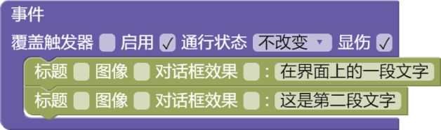

值得注意的是，系统会自动对文字进行换行；不过我们也可以手动加入`\n`来换行。

``` json
[
    "这一段文字特别特别长，但是系统可以对它进行自动换行，因此我们无需手动换行",
    "这是第一行\n这是第二行\n这是第三行",
    // ...
    // 按顺序写事件，直到结束
]
```

我们可以给文字加上标题或图标，只要以`\t[...]`开头就可以。
<br>其一般写法是 `\t[名字,ID]` ，其中名字为你要显示的标题，ID为图块ID，也可以填 `hero` 。<br>如果不需要可以不写ID，则只会显示标题。对于非道具，也可以不写名字代表使用默认值。<br>
从V2.5.2以后，新增了绘制大头像的功能。绘制大头像图的基本写法是`\t[1.png]`或者`\t[标题,1.png]`。
<br>从V2.6开始，所有图块都允许只写ID，对于非怪物也非道具则仅当图块属性中设置了 `name` 才有标题（否则不显示标题）。另外注意的是，名字可以用null从而只显示动画而不显示标题。
``` json
[
    "一段普通文字",
    "\t[勇士,hero]这是一段勇士说的话",
    "\t[hero]如果使用勇士默认名称也可以直接简写hero",
    "\t[黑暗大法师,magicMaster]我是黑暗大法师",
    "\t[magicMaster]如果使用怪物的默认名称也可以简写怪物id",
    "\t[小妖精,fairy]这是一段小妖精说的话，使用仙子(fairy)的图标",
    "\t[你赢了]直接显示标题为【你赢了】",
    "\t[1.png]绘制1.png这个头像图",
    "\t[标题,1.png]同时绘制标题和1.png这个头像图",
    "\t[sword1]获得铁剑，没有标题",
    "\t[man]没有标题的npc动画",
    "\t[null,greenSlime]只绘制怪物动画而不显示标题"
]
```

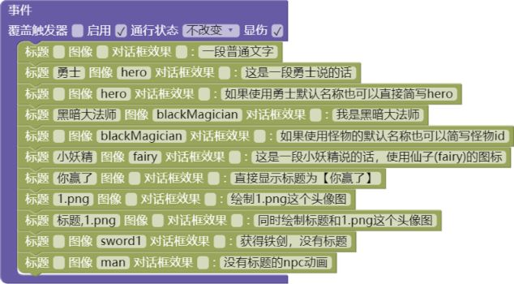

!> 大头像的头像图需要在全塔属性中注册，且必须是png格式，不可以用jpg或者其他格式，请自行另存为。<br>
除此以外，我们还能实现“对话框效果”，只要有`\b[...]`就可以。
- `\b[up]` 直接显示在当前点上方。`up` 换成 `down` 则为下方，换成 `null` 则根据当前点在视野中的位置自动选择上下
  - 如果不存在当前点（如在`firstArrive`或`eachArrive`中调用），则显示在屏幕最上方（最下方）
  - `\b[up,null]`和`\b[center]`可以无视当前点存在与否，强制显示在屏幕最上方（最下方）或中央
- `\b[up,hero]` 显示在勇士上方。同样把这里的 `up` 换成 `down` 则为下方。
  - 从V2.6开始，也允许写`\b[hero]`来根据勇士在视野中的位置自动决定上方还是下方
- `\b[up,x,y]` 显示在(x,y)点的上方（下方）；x和y都为整数，表示该点的绝对坐标
  - 从V2.6开始，也允许写`\b[null,x,y]`来根据(x,y)位置自动决定上方还是下方
- `\b[up,x]` 显示在勇士的第x个跟随的行走图的上方（下方）；也允许把 `up` 换成 `down` ，`hero`或`null` 来自动适配
``` json
[
    "\b[up]这段文字显示在当前点上方",
    "\b[down]这段文字显示在当前点上方",
    "\t[hero]\b[up,hero]这是一段勇士说的话，会显示在勇士上方",
    "\t[hero]\b[hero]这是一段勇士说的话，根据勇士位置自动适配上下",
    "\t[小妖精,fairy]\b[down,2,2]这是一段小妖精说的话，会显示在(2,2)点下方",
    "\t[null,1,3]根据坐标位置自动适配上下",
    "\t[up,1]显示在勇士第一个跟随的行走图上方",
    "\t[null,2]显示在勇士第二个跟随的行走图，自动适配上下",
]
```

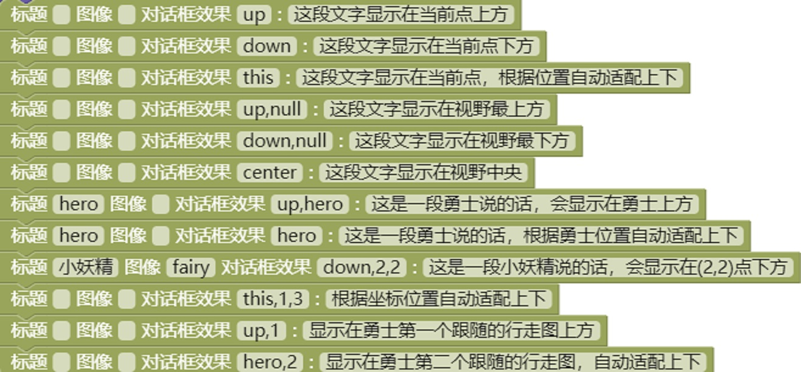

!> `\t[...]`必须在`\b[...]`前面！不然两者都无法正常显示。
<br>还可以使用`\r[...]`来调整剧情文本的颜色，颜色的英文名详见[w3school](https://www.w3school.com.cn/cssref/css_colornames.asp)。样板也会帮你自动补全最标准的这17个：aqua, black, blue, fuchsia, gray, green, lime, maroon, navy, olive, orange, purple, red, silver, teal, white, yellow
``` json
[
    "这句话是默认颜色，\r[red]将颜色变成红色，\r[blue]将颜色变成蓝色",
    "\r[#FF00FF]还可以使用RGB值来控制颜色，\r如果不加中括号则回到默认颜色",
    "\t[hero]\b[up,hero]啊啊啊，别过来，\r[red]别过来！！！\n\r你到底是什么东西！"
]
```


从V2.5.3以后，也可以使用`\f[...]`来同时绘制一张图片。

其基本写法是`\f[img,x,y]`，或者`\f[img,x,y,w,h]`，或者`\f[img,sx,sy,sw,sh,x,y,w,h]`。

从V2.6.3开始，也可以在最后加上alpha值，即`\f[img,sx,sy,sw,sh,x,y,w,h,alpha]`。

需要注意的是，这个图片是绘制在UI层上的，下一个事件执行时即会擦除；同时如果使用了\t的图标动画效果，重叠的地方也会被图标动画给覆盖掉。
``` json
[
    "\t[勇士]\b[up,hero]\f[1.png,100,100]以(100,100)为左上角绘制1.png图片",
    "\t[hero]\f[1.png,100,100]\f[2.png,300,300]同时绘制了两张图片",
    "\f[1.png,100,100,300,300]也可以填写宽高，这样会把图片强制进行放缩到指定的宽高值",
    "\f[1.png,64,64,128,128,100,100,128,128]裁剪1.png上以(64,64)开始的128x128图片，并绘制到画布的(100,100)处",
    "\f[1.png,64,64,128,128,100,100,128,128,0.5]同上，不透明度0.5",    
]
```

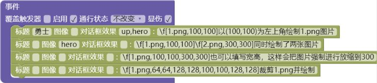

从V2.5.5以后，也可以使用`\\i[...]`来在对话框中绘制一个图标。

这里可以使用一个合法ID（32x48图块除外），或使用一个系统图标（`core.statusBar.icons`中的内容）。
``` json
[
    "\t[勇士]\b[up,hero]这是一个楼层传送器\\i[fly]，这是一个破墙镐\\i[pickaxe]",
    "\t[hero]也可以使用系统图标，比如这是存档\\i[save]，这是工具栏\\i[toolbox]",
]
```

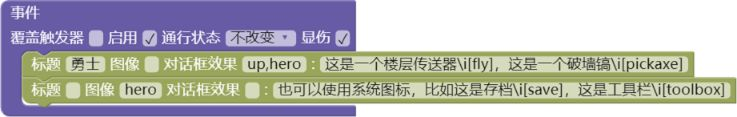

**可以在控制台中输入`core.statusBar.icons`以查看所有的系统图标定义。**
<br>!> 注意，在事件块中，允许只写一个反斜杠`\i`，系统会自动转义成`\\i`；但是在脚本中必须两个反斜杠都写上！`\c`、`\d`、`\e` 和 `\z` 同理<br>
从V2.6.3开始，也可以使用`\\c[...]`来切换当前字体，`\\d`来加粗或取消粗体，`\\e`来加斜体或取消斜体。<br>从V2.7开始，还可以使用`\\z[...]`来调节打字速度。
``` json
[
    "这是原始字体，\\c[20]使用20号字体，\\c[10]使用10号字体",
    "\\c如果不加中括号则切换回原始字体。",
    "\\d这是粗体\\d取消粗体，\\e加斜体\\e取消斜体",
    "\t[hero]\b[hero]让我想想...\\z[10]有了！" // 打出省略号后，暂停相当于打10个字的时间
]
```
另外值得一提的是，我们是可以在文字中计算一个表达式的值的。只需要将表达式用 `${ }`整个括起来就可以。
``` json
[
    "1+2=${1+2}, 4*5+6=${4*5+6}", // 显示"1+2=3, 4*5+6=26"
]
```

我们可以使用 `status:xxx` 代表勇士的一个属性值；`item:xxx` 代表某个道具的个数；`flag:xxx` 代表某个自定义的变量或flag值；`switch:A-Z`代表某个独立开关的值。

从V2.6开始，也可以使用`global:xxx`代表全局存储（和存档无关的存储）。

从V2.6.5开始，也可以使用`enemy:id:xxx`来获得某个怪物的属性，`blockId:x,y`来获得某个点的图块ID，`blockCls:x,y`来获得某个点的图块类别，`equip:N`来获得某个装备孔的装备ID。

从V2.7开始，也可以使用`temp:A-Z`来获得某个临时变量，一般在循环遍历中使用。
``` json
[
    "你当前的攻击力是${status:atk}, 防御是${status:def}，坐标是(${status:x},${status:y})",
    "你的攻防和的十倍是${10*(status:atk+status:def)}",
    "你的红黄蓝钥匙总数为${item:yellowKey+item:blueKey+item:redKey}",
    "你访问某个老人的次数为${flag:man_times}",
    "当前的存档编号是${global:saveIndex}",
    "绿色史莱姆的攻击力是${enemy:greenSlime:atk}",
    "(2,3)点的图块ID是${blockId:2,3}，图块类型是${blockCls:2,3}",
    "装备孔0的当前装备ID是${equip:0}",
    "当前的临时变量A的值是${temp:A}", // blockly中还可以使用中文，如图
]
```

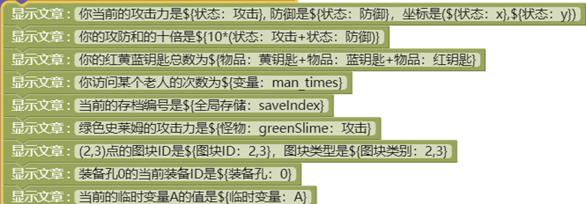
- `status:xxx` 获取勇士属性时如下几个较为特殊：x（勇士的横坐标），y（勇士的纵坐标），direction（勇士的方向）。其他的单词 `xxx` 会直接解析为 `core.status.hero.xxx` 的值。
- `item:xxx` 中的 `xxx `为道具ID。所有道具的ID定义在 `project\items.js` 中，请自行查看。例如，<br>`item:centerFly` 代表中心对称飞行器的个数。
- `flag:xxx` 中的xxx为一个自定义的变量/Flag（支持中文）；如果没有对其进行赋值则默认值为0。
- `global:xxx` 中的xxx为一个全局存储的名称（支持中文）；如果没有对其进行赋值则默认值为0。
- `enemy:xxx:yyy` 中的xxx为怪物ID；yyy为要获得的项，比如hp, atk, def等等
- `blockId:x,y` 和 `blockCls:x,y` 中的x,y为坐标值
- `equip:x` 中的x为装备孔编号，从0开始。

### autoText：自动剧情文本

使用`{"type": "autoText"}`可以使用剧情文本。
``` json
[
    {"type": "autoText", "text": "一段自动显示的剧情文字", "time": 5000}
]
```

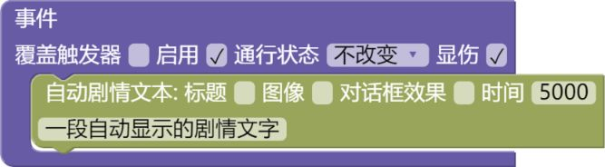

text为文本正文内容，和上面的写法完全一致。

time为可选项，代表该自动文本的时间。可以不指定，不指定默认为3000毫秒。

用户无法跳过自动剧情文本，只能等待time时间结束后自动过。

回放录像时将忽略自动剧情文本的显示。
<br>!> 由于用户无法跳过自动剧情文本，因此对于大段剧情文本请自行塞进“是否跳过剧情”的确认框分支，否则可能会非常不友好。
### scrollText：滚动剧情文本

使用`{"type": "scrollText"}`可以使用滚动剧情文本，即将一段文字从屏幕最下方滚动到屏幕最上方。
``` json
[
    {"type": "scrollText", "text": "第一排\n第二牌\n\n空行后的一排", "time": 5000, "lineHeight": 1.4, "async": true},
]
```

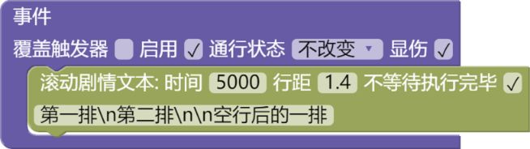

text为正文文本内容。可以使用`${ }`来计算表达式的值，且使用`\n`手动换行。系统不会对滚动剧情文本进行自动换行。

time为可选项，代表总的滚动时间。默认为5000毫秒。

lineHeight为可选项，代表行距。默认为1.4。

async可选，如果为true则会异步执行（即不等待当前事件执行完毕，立刻执行下一个事件）。

可以使用下面的[设置剧情文本的属性](event#setText：设置剧情文本的属性)来对文字颜色、文字大小、粗体、距离左边的偏移量进行设置。

!> 滚动剧情文本会绘制在UI层（和对话框冲突）！如果是异步处理请注意不要和对话框混用。

### setText：设置剧情文本的属性

使用`{"type": "setText"}`可以设置剧情文本的各项属性。
``` json
[
    {"type": "setText", "title": [255,0,0], "text": [255,255,0], "background": [0,0,255,0.3], "time": 70},
    {"type": "setText", "position": "up", "offset": 15, "bold": true, "titlefont": 26, "textfont": 17},
    "这段话将显示在上方（距离顶端15像素），标题为红色，正文为黄色粗体，背景为透明度0.3的蓝色，标题26px，正文17px，70毫秒速度打字机效果",
    {"type": "setText", "background": "winskin.png"} // 还可以一张使用WindowSkin作为皮肤。
]
```

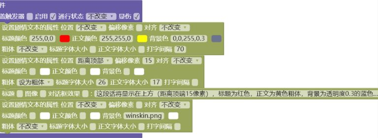

title为可选项，如果设置则为一个RGB三元组或RGBA四元组，表示标题（名字）颜色。 默认值：`[255,215,0,1]`，

可以通过单击RGBA值后面的色块呼出调色器，进行16进制转换等复杂取色操作，其他使用RGBA的事件也是类似的。

text为可选项，如果设置则为一个RGB三元组或RGBA四元组，表示正文颜色。 默认值：`[255,255,255,1]`

background为可选项，如果设置可为一个RGB三元组或RGBA四元组，表示背景色。 默认值：`[0,0,0,0.85]`

V2.5.2以后，background也可以为一个WindowSkin的文件名。详见[剧情文本控制与界面皮肤](element#剧情文本控制与界面皮肤)。

position为可选项，表示设置文字显示位置。只能为up（上），center（中）和down（下）三者。 默认值： `center`

offset为可选项，如果设置则为代表距离如果显示位置是上/下的话，距离顶端/底端的像素值。也作为滚动剧情文本时距离左边的像素值。

bold为可选项，如果设置则为true或false，表示正文是否使用粗体。 默认值：`false`

titlefont为可选项，表示标题字体大小（px为单位）。默认值：`22`

textfont为可选项，表示正文字体大小（px为单位）。默认值：`16`

time为可选项，表示文字添加的速度。若此项设置为0将直接全部显示，若大于0则会设置为相邻字符依次显示的时间间隔。 默认值：`0`

interval为可选项，表示文字之间的间距。单位为像素值。默认值：`0`

lineHeight为可选项，表示行距。单位为像素值。
### tip：显示一段提示文字

`{"type": "tip"}`可以在左上角显示一段提示文字。
``` json
[
    {"type": "tip", "text": "这段话将在左上角以气泡形式显示", "icon": "book"}
]
```


text必填，为显示的内容，支持`${}`的表达式计算。

icon是可选的，如果设置则会绘制图标，其可以是一个有效的ID，或者`core.statusBar.icons`中的系统图标。

### comment：添加注释

使用`{"type": "comment"}`可以添加一段注释
``` json
[
    {"type": "comment", "text": "这是一段会被跳过的注释内容"}
]
```

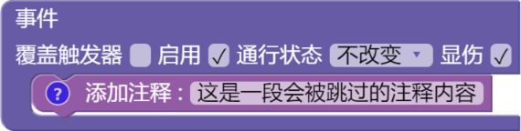

这个事件将在运行时被游戏跳过。

### setValue：设置勇士的某个属性、道具个数，或某个变量/Flag的值

`{"type": "setValue"}` 能修改勇士的某个属性、道具个数、或某个自定义变量或`Flag`的值。

其大致写法如下：
``` json
[ // 设置一个属性、道具、自定义Flag、独立开关、全局存储、临时变量
    {"type": "setValue", "name": "...", "operator": "...", "value": "..."},
]
```
使用 `setValue` 需要指定 `name`、`operator` 和 `value` 选项。<br>
`name` 为你要修改的属性/道具/Flag/独立开关/全局存储/临时变量，每次只能修改一个值。写法和 `${}` 中完全相同，`status:xxx` 表示勇士一个属性，`item:xxx` 表示某个道具个数，`flag:xxx` 表示某个变量或flag值。参见上面的介绍。<br>
`operator` 为运算的类型，目前支持八种，详见下面的例子和图示。<br>
`value` 是一个表达式，将通过这个表达式计算出的结果作为另一个运算量。该表达式同样可以使用`status:xxx`, `item:xxx`, `flag:xxx`, `global:xxx`等的写法表示勇士当前属性，道具个数，某个变量/Flag值和某个全局存储值等。
``` json
[
    {"type": "setValue", "name": "global:一周目已通关", "value": "true", "norefresh": true}, // 设置全局存储“一周目已通关”为true，用于二周目中触发隐藏分支
    {"type": "setValue", "name": "status:name", "operator": "+=", "value": "'之王'", "norefresh": true}, // 勇士名称结尾增加两个字“之王”，不立即刷新状态栏
    {"type": "setValue", "name": "flag:hatred", "operator": "-=", "value": "10", "norefresh": true}, // 减少10点仇恨值
    {"type": "setValue", "name": "status:hp", "operator": "*=", "value": "2", "norefresh": true}, // 生命值加倍，即圣水道具的效果
    {"type": "setValue", "name": "switch:A", "operator": "/=", "value": "10", "norefresh": true}, // 独立开关A的值缩小到原来的十分之一，可能产生小数
    {"type": "setValue", "name": "item:yellowKey", "operator": "**=", "value": "3", "norefresh": true}, // 黄钥匙的数量变为它原来值的立方
    {"type": "setValue", "name": "temp:A", "operator": "//=", "value": "3", "norefresh": true}, // 临时变量缩小到原来的三分之一，向靠近0的方向取整
    {"type": "setValue", "name": "status:atk", "operator": "%=", "value": "100"},
 ] // 攻击力对100取余数，即只保留最后两位，然后刷新状态栏
```

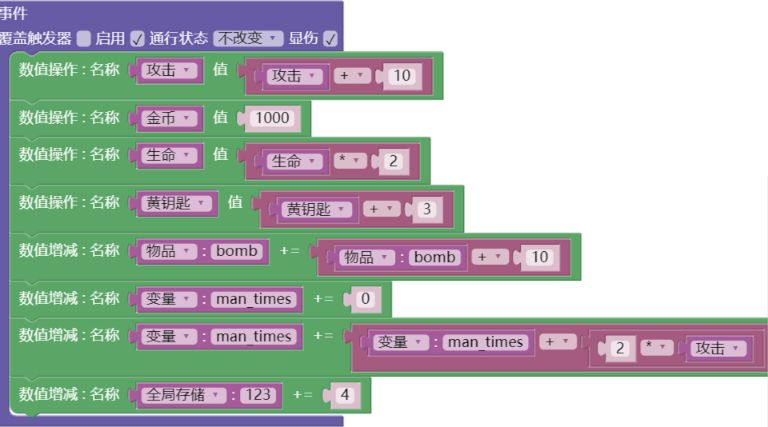

从V2.6.5开始，当设置了`"norefresh": true`后可以不刷新状态栏、地图显伤和自动事件，从而加速事件执行。


在刷新的情况下，如果hp被设置成了0或以下，将触发lose事件，直接死亡。

### setEnemy：设置怪物属性

使用`{"type":"setEnemy"}`可以设置某个怪物的某个属性

``` json
[
    {"type": "setEnemy", "id": "greenSlime", "name": "hp", "value": "1000"}, // 设置绿色史莱姆生命1000
    {"type": "setEnemy", "id": "redSlime", "name": "special", "value": "[1,2]"}, // 设置红色史莱姆先攻魔攻
    {"type": "setEnemy", "id": "redSlime", "name": "name", "value": "'小史莱姆'"}, // 设置怪物名称
]
```

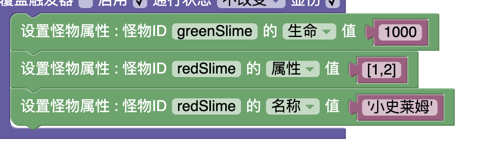

id为必填项，代表要修改的怪物ID。

name为必填项，代表要修改的项，例如`hp`, `atk`, `def`, `money`, `exp`, `point`, `special`, `name`。

value为必填项，代表要修改到的内容。对于修改名称的，必须加单引号。

### setFloor：设置楼层属性

使用`{"type":"setFloor"}`可以设置某层楼的楼层属性。

``` js
[
    {"type": "setFloor", "name": "title", "value": "'主塔 0 层'" } // 设置当前楼层的中文名为主塔0层
    {"type": "setFloor", "name": "canFlyTo", "floorId": "MT2", "value": "false" } // 设置MT2层不可飞行
    {"type": "setFloor", "name": "cannotViewMap", "floorId": "MT0", "value": "true" } // 设置MT0层不可被浏览地图
    {"type": "setFloor", "name": "item_ratio", "value": "5" } // 设置当前楼层的宝石血瓶属性加成为5
    {"type": "setFloor", "name": "images", "value": "[[0,0,'tree.png',2]]" } // 设置当前楼层的楼层贴图
    {"type": "setFloor", "name": "upFloor", "value": "[2,3]" } // 设置当前楼层的上楼梯
    {"type": "setFloor", "name": "bgm", "floorId": "MT10", "value": "'233.mp3'" } // 设置当前楼层的背景音乐
]
```

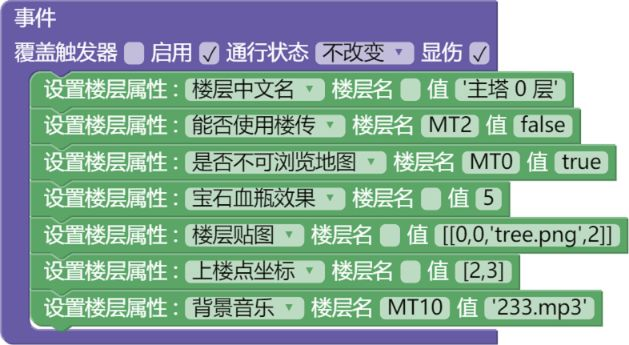

name为必填项，代表要修改的楼层属性，和楼层属性中的一一对应。

floorId为可选项，代表要修改的楼层ID；可以省略代表当前楼层。

value为必填项，代表要修改到的数值。其应该和楼层属性中的对应数值类型完全一致，对于字符串需要加单引号，其他类型（数字、true/false、数组）等则不需要引号。

!> 如果修改到的是字符串类型，比如楼层中文名、状态栏名称、地面素材ID、背景音乐等，必须加引号，否则会报错。

### setGlobalAttribute：设置一个全局属性

使用`{"type":"setGlobalAttribute"}`可以设置一个全局属性。

``` js
[
    {"type": "setGlobalAttribute", "name": "font", "value": "Verdana"}, // 设置字体为Verdana
]
```


name必填项，代表要修改的全局属性。

value为必填项，代表要修改到的结果。此项无需再手动加单引号。

### setGlobalValue：设置一个全局数值

使用`{"type":"setGlobalValue"}`可以设置一个全局数值。

``` js
[
  {"type": "setGlobalValue", "name": "lavaDamage", "value": 200}, // 设置血网伤害为200
]
```

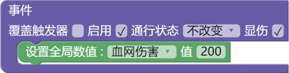

name必填项，代表要修改的全局数值，其和全塔属性中的values一一对应。

value为必填项，代表要修改到的结果。该项必须是个数值。

### setGlobalFlag：设置一个系统开关

使用`{"type":"setGlobalFlag"}`可以设置一个系统开关。

``` js
[
  {"type": "setGlobalFlag", "name": "enableMDef", "value": false}, // 不在状态栏显示护盾值
]
```


name必填项，代表要修改的系统开关，其是全塔属性中的flags中的一部分。

value为必填项，只能为true或false，代表要修改到的结果。

### show：将一个禁用事件启用
我们上面提到了，除自动事件外，事件都必须靠其他事件驱动来完成，不存在当某个 `flag` 为 `true` 时自动执行的说法。那么，我们自然要有启用事件的写法。<br>
使用`{"type":"show"}`可以将一个本身禁用的事件启用。
``` json
[
  {"type": "show", "loc": [3,6], "floorId": "MT1", "time": 500}, // 启用MT1层[3,6]位置事件，动画500ms
  {"type": "show", "loc": [3,6], "time": 500}, // 如果启用目标是当前层，则可以省略floorId项
  {"type": "show", "loc": [3,6]}, // 如果不指定动画时间，则立刻显示，否则动画效果逐渐显示，time为动画时间
  {"type": "show", "loc": [[3,6],[2,9],[1,2]], "time": 500}, // 我们也可以同时动画显示多个点。
  {"type": "show", "loc": [3,6], "time": 500, "async": true} // 可以使用异步动画效果
]
```

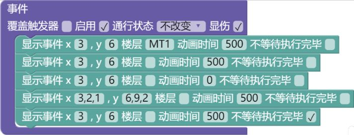

show事件需要用loc指定目标点的坐标，可以简单的写[x,y]代表一个点，也可以写个二维数组[[x1,y1],[x2,y2],...]来同时显示多个点。

从V2.2开始，loc也可以用变量来代替，例如 `"loc": ["flag:x", "flag:y"]`。下同。

floorId为目标点的楼层，如果不是该楼层的事件（比如4楼小偷开2楼的门）则是必须的，如果是当前楼层可以忽略不写。

time为动画效果时间，如果指定了某个大于0的数，则会以动画效果慢慢从无到有显示，动画时间为该数值；如果不指定该选项则无动画直接立刻显示。

async可选，如果为true则会异步执行（即不等待当前事件执行完毕，立刻执行下一个事件）。

!> **要注意的是，调用show事件后只是让该事件从禁用状态变成启用，从不可见不可交互变成可见可交互，但本身不会去执行该点的事件。**
### hide：将一个启用事件禁用，或将非红非绿非重生的图块删除
`{"type":"hide"}`和show刚好相反，它会让一个已经启用的事件被禁用。

其参数和show也完全相同，loc指定事件的位置，floorId为楼层（同层可忽略），time指定的话事件会以动画效果从有到无慢慢消失，async代表是否是异步效果。

loc同样可以简单的写[x,y]表示单个点，或二维数组[[x1,y1],[x2,y2],...]表示多个点。

但是和show事件有所区别的是：loc选项也可以忽略；如果忽略loc则使当前事件禁用。（即使禁用当前事件，也不会立刻结束当前正在进行的，而是仍然会依次将列表中剩下的事件执行完）

请注意，一次性事件必须要加 `{"type":"hide"}`，尤其是例如走到某个点，触发对话或机关门（陷阱）这种，否则每次都会重复触发。

NPC对话事件结束后如果需要NPC消失也需要调用 `{"type": "hide"}`，可以不写loc选项代表当前事件，可以指定time使NPC动画消失。
``` json
[
    {"type": "hide", "loc": [3,6], "floorId": "MT1", "time": 500}, // 禁用MT1层[3,6]位置事件，动画500ms
    {"type": "hide", "loc": [3,6], "time": 500}, // 如果启用目标是当前层，则可以省略floorId项
    {"type": "hide", "loc": [3,6]}, // 如果不指定动画时间，则立刻消失，否则动画效果逐渐消失，time为动画时间
    {"type": "hide", "loc": [[3,6],[2,9],[1,2]], "time": 500}, // 也可以同时指定多个点消失
    {"type": "hide", "time": 500}, // 如果不指定loc选项则默认为当前点， 例如这个就是500ms消失当前对话的NPC
    {"type": "hide"}, // 无动画将当前事件禁用，常常适用于某个空地点（触发陷阱事件、触发机关门这种）
    {"type": "hide", "loc": [3,6], "time": 500, "async": true} // 可以使用异步动画效果
] // 此事件实际直接调用的函数是core.removeBlock(x, y)，开门打怪捡道具后也会自动调用此函数
```

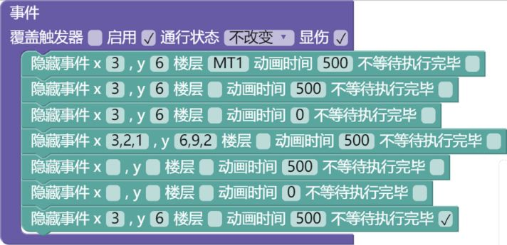

### trigger：立即触发另一个地点的事件

`{"type":"trigger"}` 会立刻触发当层另一个地点的自定义事件。

其基本写法如下：
``` json
[
    {"type": "trigger", "loc": [3,6]}, // 立即触发loc位置的事件，当前剩下的事件全部不再执行
    {"type": "trigger", "loc": [3,6], "keep": true}, // 触发loc位置的事件，不结束当前事件
]
```

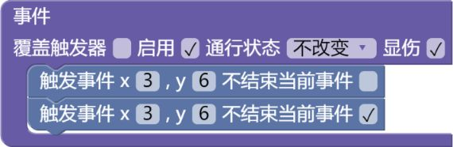

其后面带有loc选项，代表另一个地点的坐标。

keep可选，如果此项为true则不会结束当前的事件列表，否则会中断当前的事件流。

从V2.5.4开始允许执行另一个点的系统事件，如打怪开门拾取道具等等，对应点的战后等事件也会被插入执行。

值得注意的是，此事件会**改变当前点坐标**为目标点。

### insert：插入公共事件或另一个地点的事件并执行

`{"type":"insert"}` 会插入公共事件或另一个地点的事件并执行。

其基本写法如下：
``` json
[
    {"type": "insert", "name": "加点事件", "args": [10] }, // 插入公共事件：加点事件，传入参数10
    {"type": "insert", "name": "毒衰咒处理", "args": [0]}, // 插入公共事件：毒衰咒处理，传入参数0
    {"type": "insert", "loc": [3,6]}, // 插入[3,6]点的事件并执行
    {"type": "insert", "loc": [10,10], "floorId": "MT1"}, // 插入MT1层[10,10]点的事件并执行
    {"type": "insert", "loc": [2,2], "args": [1,"flag:abc","status:atk+status:def"]}, // 传入三个参数
    "上面的插入事件执行完毕后会接着继续执行后面的事件"
]
```

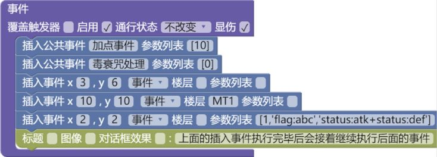

`insert`的写法有两种，可以写`name`，或者`loc`。

- 如果写了`"name": "xxx"`，则会去公共事件列表中找寻对应的事件，并执行。
  - name为公共事件的名称，如果对应公共事件不存在则跳过。
- 否则，如果写了`"loc": [x,y]`，则会插入另一个地点的事件
  - loc为另一个地点的坐标
  - floorId可选，代表另一个地点所在的楼层；如果不写则默认为当前层。
  - 从V2.6开始，还可以传可选的which，可以为`afterBattle`/`afterGetItem`/`afterOpenDoor`，代表插入该点的战后/获得道具后/开门后事件。

和`type:trigger`不同点如下：
- `type:trigger`只能指定当前楼层且会改变当前点坐标，`type:insert`可以跨楼层且不会改变当前点坐标。
- `type:trigger`如果不设置`keep:true`则还会结束当前事件，`type:insert`而是将另一个点的事件插入到当前事件列表中执行。
- `type:trigger`可以触发系统事件，`type:insert`只能触发该点的普通事件或 `afterXxx` 事件等。
- `type:trigger`要求目标点启用，`type:insert`会无视目标点启用与否。

插入的事件执行完毕后，会继续执行接下来的内容。

从V2.6开始，插入事件允许传参。如果需要传参，则需要增加一个`args`数组。

例如： `"args": [1,"flag:abc","status:atk+status:def"]` 传入了三个参数。

系统会自动把`flag:arg1`设置为第一个参数数值，`flag:arg2`设置为第二个参数数值，等等。

（`flag:arg0`则会被置为公共事件名称，或者插入的点的坐标）

即可在事件中直接取用`flag:arg1`等等来获得各项参数值！。
### exit：立刻结束当前事件
可以使用`{"type":"exit"}`立刻结束事件。调用 `exit` 后，将立刻结束一切事件，清空事件列表，并返回游戏。<br>
例如玩家点击商人的"离开"选项，则可以调用exit返回游戏。
``` json
[
    {"type": "exit" }, // 立即结束事件并恢复游戏，一切列表中的事件都将不再被执行
    "执行exit后，这段文字将不会再被显示"
]
```


### setBlock：设置某个图块

我们可以采用 `{"type": "setBlock"}` 来改变某个地图块。
``` json
[
    {"type": "setBlock", "floorId": "MT1", "loc": [3,3], "number": 233}, // 将MT1层的(3,3)点变成数字233
    {"type": "setBlock", "loc": [2,1], "number": 121}, // 省略floorId则默认为本层
    {"type": "setBlock", "number": 57}, // loc也可省略，默认为当前点
    {"type": "setBlock", "number": "yellowDoor"}, // 从V2.6开始也允许写图块ID
]
```


floorId为可选的，表示要更改的目标楼层。如果忽略此项，则默认为当前楼层。

loc为可选的，表示要更改地图块的坐标。如果忽略此项，则默认为当前事件点。

number为**要更改到的数字**，有关“数字”的定义详见参见[素材的机制](personalization#素材的机制)。

从V2.6开始，number也允许写图块的ID，将自动转成对应的数字。

从V2.7开始，还可以指定转变的淡入动画时间，用于该点原本是空地或空气墙的场合，从而避免“仅仅为了做个淡入效果，就去创建了一个本身没有任何指令的普通事件”。<br>
图块更改后：

 - 其启用/禁用状态不会发生任何改变。原来是启用还是启用，原来是禁用还是禁用。
 - 可通行状态遵循覆盖原则，即**首先取该图块的 `canPass` 属性（道具和怪物没有此属性，道具可通行，怪物不可通行），如果该点的普通事件中定义了 `noPass` 则覆盖**。
 - 触发器（ `trigger` ）亦采用覆盖原则，即**首先取该图块的默认触发器（例如怪物是battle，道具是getItem，门是openDoor），如果该点绑定了楼层转换事件（绿）或普通事件（红）中覆盖触发器，则覆盖**。
图块更改往往与[同一个点的多事件处理](#同一个点的多事件处理)相关。
### showFloorImg / hideFloorImg：显隐楼层贴图
使用`{"type":"hideFloorImg"}`可以隐藏某个楼层的贴图。使用`{"type":"showFloorImg"}`可以显示楼层的贴图。<br>
有关贴图说明请参见[使用自己的图片作为某层楼的背景/前景素材](personalization#使用自己的图片作为某层楼的背景前景素材)。
``` json
[
  {"type": "hideFloorImg", "loc": [32,64], "floorId": "MT1"}, // 隐藏[32,64]的贴图
  {"type": "hideFloorImg", "loc": [32,64]}, // 如果是当前层，则可以省略floorId项
  {"type": "showFloorImg", "loc": [[32,64],[256,96],[128,256]]} // 我们也可以同时显隐多个贴图。
]
```

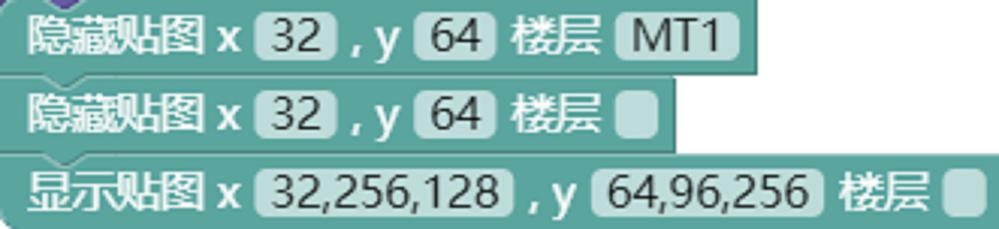
loc为要显隐的贴图的左上角像素坐标，可以简单的写[x,y]代表一个点，或二维数组[[x1,y1],[x2,y2],...]来同时显隐多个点。<br>
如果同时存在若干个贴图都是是该坐标为左上角，则这些贴图全部会被显隐。<br>
floorId为目标点的楼层，如果是当前楼层可以忽略不写。
### showBgFgMap / hideBgFgMap：显隐楼层的某些背景或前景图块
使用`{"type":"hideBgFgMap"}`可以隐藏背景或前景图块。使用`{"type":"showBgFgMap"}`可以显示背景或前景图块。<br>
从V2.4.1开始，允许绘制三层图层（背景层，事件层和前景层）。
``` json
[
  {"type": "hideBgFgMap", "name": "bg", "loc": [3,6], "floorId": "MT1"}, // 隐藏MT1层[3,6]的背景层图块
  {"type": "hideBgFgMap", "name": "bg", "loc": [3,6]}, // 如果是当前层，则可以省略floorId项
  {"type": "showBgFgMap", "name": "fg", "loc": [[3,6],[2,9],[1,2]]} // 我们也可以同时显隐多个图块。
]
```

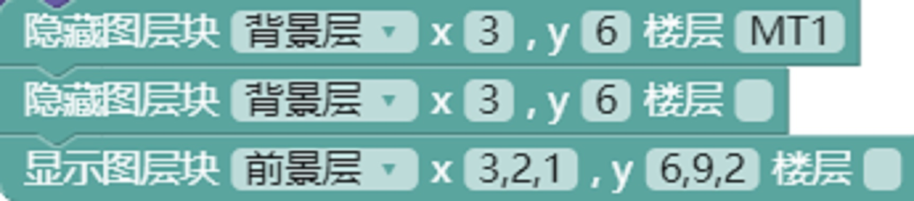

name为必选的，且只能是`bg`和`fg`之一，分别代表背景图层和前景图层。
<br>`loc` 为要显隐的图块的坐标，可以简单的写[x,y]代表一个点，也可以写个二维数组[[x1,y1],[x2,y2],...]来同时显示多个点。<br>
floorId为目标点的楼层，如果是当前楼层可以忽略不写。
### setBgFgBlock：设置某个背景或前景层图块

我们可以采用 `{"type": "setBgFgBlock"}` 来改变某个背景或前景层地图块。
``` json
[
    {"type": "setBgFgBlock", "name": "bg", "floorId": "MT1", "loc": [3,3], "number": 233}, // 将MT1层背景层的(3,3)点变成数字233
    {"type": "setBgFgBlock", "name": "bg", "loc": [2,1], "number": 121}, // 省略floorId则默认为本层
    {"type": "setBgFgBlock", "name": "fg", "number": 57}, // loc也可省略，默认为当前点
]
```

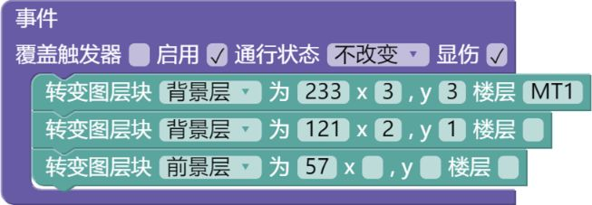

name为必选的，且只能是`bg`和`fg`之一，分别代表背景层和前景层。

floorId为可选的，表示要更改的目标楼层。如果忽略此项，则默认为当前楼层。

loc为可选的，表示要更改地图块的坐标。如果忽略此项，则默认为当前事件点。

图块更改后，其隐藏/显示状态不会发生任何改变，即原来是隐藏还是会不显示。可以使用`showBgFgMap`事件将其显示出来。

### setHeroIcon：更改角色行走图

使用`{"type": "setHeroIcon"}`可以更改角色行走图。
``` json
[
    {"type": "setHeroIcon", "name": "hero2.png"}, // 将勇士行走图改成hero2.png；必须在全塔属性的images中被定义过。
    {"type": "setHeroIcon"}, // 如果不加name则恢复最初默认状态
    {"type": "setValue", "name": "status:name", "value": "'可绒'"}, // 修改勇士名；请注意value必须加单引号。
]
```

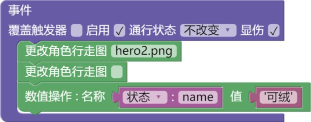

name是可选的，代表目标行走图的文件名。
<br>!> **目标行走图必须在全塔属性的this.images中被定义过，且宽度至少是128像素（高度不限）。**<br>
如果不加name，则恢复默认的角色行走图。

如果你需要同时修改勇士的名称，可以使用`setValue`事件来修改`status:name`，但请注意value必须加单引号，不然会报错。

如果你需要获取当前的行走图文件名，可以使用 `flags.heroIcon` ，但不要直接修改它。
### update：立刻更新状态栏和地图显伤
如果你需要刷新状态栏和地图显伤，只需要简单地调用 `{"type": "update", "doNotCheckAutoEvents": true}` 。
### showStatusBar / hideStatusBar：显隐状态栏
使用`{"type": "hideStatusBar"}`可以隐藏状态栏。读档或重新开始游戏时，状态栏会重新显示。
<br>可以添加`"toolbox": true`来不隐藏竖屏模式下的工具栏。使用`{"type": "showStatusBar"}`会重新显示状态栏。
### showHero / hideHero：显隐勇士
使用`{"type": "hideHero"}`可以隐藏勇士。使用`{"type": "showHero"}`会重新显示勇士。
### sleep：等待多少毫秒
等价于RPG Maker中的"等待x帧"，不过是以毫秒来计算。<br>
基本写法：`{"type": "sleep", "time": xxx}` ，其中xxx为指定的毫秒数。
``` json
[
    {"type": "sleep", "time": 1000}, // 等待1000ms
    "等待1000ms后才开始执行这个事件",
    {"type": "sleep", "time": 2000, "noSkip": true}, // 等待2000毫秒，且不可被跳过
]
```

<br>默认的等待事件可以被Ctrl跳过，下面两种情况下不可被跳过：
 - 加上`"noSkip": true`后
 - 当前存在尚未执行完毕的异步事件。

### battle：强制战斗

调用battle可强制与某怪物进行战斗（而无需去触碰到它）。
``` json
[
    {"type": "battle", "id": "blackKing"}, // 强制战斗黑衣魔王
    {"type": "battle", "loc": [2,3]}, // 强制战斗(2,3)点的怪物
],
```

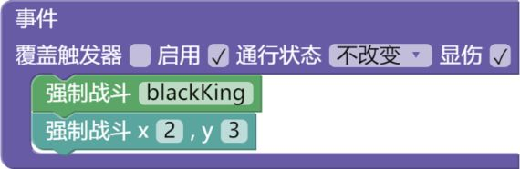

从V2.6开始，有两种写法：
- 写id，则视为和空降怪物进行强制战斗，不会执行一些战后事件，也不会隐藏任何点。
- 写loc（可选，不填默认当前点），则视为和某点怪物进行强制战斗，会隐藏该点并且插入该点战后事件执行。

强制战斗不会自动存档，如果战斗失败则立刻死亡。

值得注意的是，如果是和某个点的怪物强制战斗，并且该点存在战后事件，执行时会**修改当前点坐标**为目标点。

### openDoor：开门

调用`{"type":"openDoor"}`可以打开一扇门。
``` json
[
    {"type": "openDoor", "loc": [3,6], "floorId": "MT1"}, // 打开MT1层的[3,6]位置的门
    {"type": "openDoor", "loc": [3,6]}, // 如果是本层则可省略floorId
    {"type": "openDoor", "loc": [3,6], "needKey": true, "async": true} // 打开此门需要钥匙，异步执行
]
```

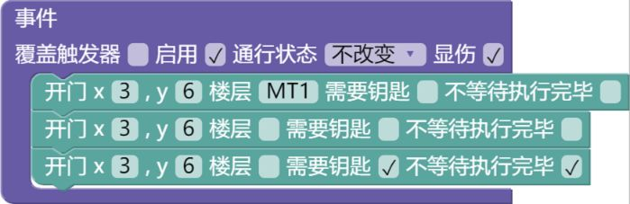

loc指定门的坐标，floorId指定门所在的楼层ID。如果是当前层则可以忽略floorId选项。

如果loc所在的点是一个墙壁，则作为暗墙来开启。

如果loc所在的点既不是门也不是墙壁，则忽略本事件。

needKey是可选的，如果设置为true且门在当前楼层则需要钥匙才能打开此门。如果没有钥匙则跳过此事件。

async可选，如果为true则会异步执行（即不等待当前事件执行完毕，立刻执行下一个事件）。

!> needKey仅对当前楼层开门有效！跨楼层的门仍然不需要钥匙即可打开，如有需求请自行判定。

值得注意的是，如果该点存在开门后事件，执行时会**修改当前点坐标**为目标点。
### closeDoor：关门

从V2.6开始提供了关门事件`{"type": "closeDoor"}`，拥有关门动画和对应的音效。
``` json
[
    {"type": "closeDoor", "id": "yellowDoor", "loc": [3,6]}, // 给(3,6)点关上黄门
    {"type": "closeDoor", "id": "specialDoor"}, // 不写loc则视为当前点
]
```
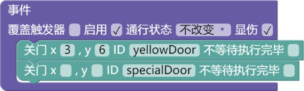<br>id为你要关门的ID，需要是一个合法的门，系统自带支持如下几种：
```
yellowDoor, blueDoor, redDoor, greenDoor, specialDoor, steelDoor,
yellowWall, blueWall, whiteWall
```

如果需要自己添加门，请参考[新增门和对应的钥匙](personalization#新增门和对应的钥匙)。

loc可选，为要关的位置，不填默认为当前点。

async可选，如果为true则会异步执行（即不等待当前事件执行完毕，立刻执行下一个事件）。

关门事件需要保证该点是空地，否则将无视此事件。

### changeFloor：楼层切换
在事件中也可以对楼层进行切换。一个比较典型的例子就是51层魔塔中，勇士在三楼的陷阱被扔到了二楼，就是一个楼层切换事件。<br>
changeFloor的事件写法大致如下。
``` json
[
    {"type": "changeFloor", "floorId": "sample0", "loc": [10, 10], "direction": "left", "time": 1000 },
    //后面几项依次为楼层id，楼层位置（这两项为必填）；勇士方向可选，切换时间也是可选。
]
```
<br>可以看到，与之前的楼梯、传送门的写法十分类似。
但是相比那个而言，这个不支持穿透选项。<br>
direction为可选的，指定的话将使勇士的朝向变成该方向

time为可选的，指定的话将作为楼层切换动画的时间。

**如果time指定为小于100，则视为没有楼层切换动画。**
### changePos：当前位置切换/勇士转向
有时候我们不想要楼层切换的动画效果，而是直接让勇士从A点到B点。

这时候可以用changePos。其参数和changeFloor类似，但少了floorId和time两个选项。
``` json
[
    {"type": "changePos", "loc": [10,10], "direction": "left"}, // 直接切换勇士的坐标，loc为目标地点，后面勇士换位后方向
    {"type": "changePos", "loc": [10,10]}, // 如无需指定方向则direction可省略
    {"type": "changePos", "direction": "left"} // loc也可省略，只指定direction；此时等价于当前勇士转向到某个方向。
]
```

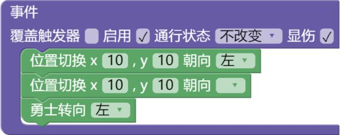

### useItem：使用道具

调用`{"type": "useItem"}`可以使用一个道具。
``` json
[
    {"type": "useItem", "id": "pickaxe"}, // 尝试使用破
    {"type": "useItem", "id": "bomb"}, // 尝试使用炸
    {"type": "useItem", "id": "centerFly"} // 尝试使用飞
]
```

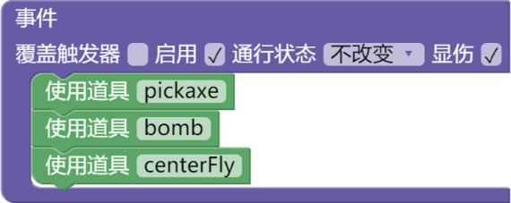

使用道具事件会消耗对应的道具。

如果当前不可使用该道具（如没有，或者达不到使用条件），则会进行提示并跳过本事件。

不可使用“怪物手册”（请使用【呼出怪物手册】事件）或楼层传送器（如果[覆盖楼传事件](personalization#覆盖楼传事件)则可忽视本项）。
### loadEquip / unloadEquip：装脱装备
使用`{"type": "loadEquip"}`可以装上一个装备。使用`{"type": "unloadEquip"}`卸下某个装备孔的装备。
``` json
[
    {"type": "loadEquip", "id": "sword1"}, // 尝试装上铁剑
    {"type": "unloadEquip", "pos": 0}, // 卸下装备孔0的装备
]
```

id必填，为需要装备的ID。

使用装备时仍会检查条件（比如装备是否存在，能否装备等等）。
pos必填，为要卸下的装备孔编号，从0开始。
### openShop / disableShop：启用或禁用一个全局商店
使用openShop可以启用一个全局商店。使用disableShop可以永久禁用全局商店直到再次被openShop启用为止。<br>有关全局商店的说明可参见[全局商店](#全局商店)。
### follow / unfollow：跟随勇士或取消跟随
使用 `{"type": "follow"}` 可以让一个npc加入跟随。
``` json
[
    {"type": "follow", "name": "npc48.png"}, // 将 npc48.png 这个行走图加入跟随
    {"type": "follow", "name": "enemy48.png"}, // 再将另一个行走图加入跟随
    {"type": "unfollow", "name": "npc48.png"}, // 将第一个 npc48.png 行走图取消跟随
    {"type": "unfollow"} // 不填name，表示取消所有跟随
]
```
`name` 为要加入或取消跟随的行走图文件名，取消跟随时取第一个，不填则取消所有。<br>
`name` 所指定的图片必须存在，在全塔属性中的 `images` 中注册，且为一个合法的行走图（宽至少为128像素，高不限）
### vibrate：画面震动

使用 `{"type": "vibrate", "time": 2000, "async": true}` 可以造成画面震动效果。
<br>`time` 可以指定震动时间，必须为500毫秒的倍数，且至少要1000毫秒。<br>
async可选，如果为true则会异步执行（即不等待当前事件执行完毕，立刻执行下一个事件）。

### animate：显示动画

我们可以使用 `{"type": "animate"}` 来显示一段动画。

有关动画的详细介绍可参见[动画和天气系统](element#动画和天气系统)。
``` json
[
    {"type": "animate", "name": "yongchang", "loc": [1,3]}, // 在(1,3)显示“咏唱魔法”动画
    {"type": "animate", "name": "zone", "loc": "hero"}, // 在勇士位置显示“领域”动画
    {"type": "animate", "name": "hand"}, // 可以不指定loc，则默认为当前事件点
    {"type": "animate", "async": true}, // 异步，不等待动画绘制完毕
]
```


name为动画名，**请确保动画在全塔属性中的animates中被定义过。**
<br>loc为动画的位置，可以是`[x,y]`表示在(x,y)点显示，也可以是字符串`"hero"`表示跟随勇士显示（就像踩到血网时）。<br>
loc可忽略，如果忽略则视为事件当前点。

如果async指定为true，则不会等待动画绘制完毕，立刻执行下个事件。

否则，在动画播放结束后才会继续执行下一个事件。
<br>从V2.7开始，增加了一个勾选项表示该坐标是绝对坐标还是在视野中的相对坐标，譬如13×13样板中，勾选此项并填写坐标 `[6,6]` 就能无视大地图，强制在视野正中心播放动画。
### showImage：显示图片

我们可以使用 `{"type": "showImage"}` 来显示一张图片。
``` json
[
    {"type": "showImage", "code": 1, "image": "bg.jpg", "loc": [231,297], "opacity": 1, "time" : 0}, // 在(231,297)显示bg.jpg
    {"type": "showImage", "code": 12, "image": "1.png", "loc": [209,267],  "opacity": 0.5, "time" : 1000}, // 在(209,267)渐变显示1.png，渐变时间为1000毫秒，完成时不透明度为0.5，这张图片将遮盖上一张
    {"type": "showImage", "code": 8, "image": "hero.png", "loc": [349,367],  "opacity": 1, "time" : 500, "async": true}, // 在(209,267)渐变显示hero.png，渐变时间为500毫秒，异步执行；这张图片将被上一张遮盖
    {"type": "showImage", "code": 10, "image": "hero.png", "sloc": [100,100,100,100], "loc": [0,0,100,100], "opacity": 1, "time": 0} // 截取原图的一部分绘制到画布上的一部分。
]
```


code为图片编号，如果两张图片重叠，编号较大会覆盖编号较小的。该值需要在1~50之间。

图片编号的真正意义，请参阅[个性化](personalization)。

image为图片名。**请确保图片在全塔属性中的images中被定义过。**

sloc为可选项；如果设置了则是个2或4元组，代表裁剪原始图片的左上角像素位置和宽高。

loc为2或4元组，代表要绘制的画布上的左上角像素位置和宽高。

opacity为图片不透明度，在0~1之间，默认值为1，即不透明。

time为渐变时间，默认值为0，即不渐变直接显示。

async可选，如果为true则会异步执行（即不等待当前事件执行完毕，立刻执行下一个事件）。

### showTextImage：显示图片化文本

我们可以使用 `{"type": "showTextImage"}` 以图片的方式显示文本。
``` json
[
    {"type": "showTextImage", "code": 1, "text": "第一排\n第二排\n\n空行后的一排", "loc": [231,297], "opacity": 1, "time" : 0}, // 在(231,297)显示"第一排\n第二排\n\n空行后的一排"
]
```

code为图片编号，如果两张图片重叠，编号较大会覆盖编号较小的。该值需要在1~50之间。

text为要显示的文本。默认行宽为416（15×15样板为480）。

loc为图片左上角坐标，以像素为单位进行计算。

opacity为图片不透明度，在0~1之间，默认值为1，即不透明。

lineHeight为可选项，代表行距。默认为1.4。

time为渐变时间，默认值为0，即不渐变直接显示。

async可选，如果为true则会异步执行（即不等待当前事件执行完毕，立刻执行下一个事件）。

文本通过图片的方式显示后，即视为一张正常图片，可以被清除或者移动。

### hideImage：清除图片

我们可以使用 `{"type": "hideImage"}` 来清除一张图片。
``` json
[
    {"type": "hideImage", "code": 1, "time" : 0}, // 使1号图片消失
    {"type": "hideImage", "code": 12, "time" : 1000}, // 使12号图片渐变消失，时间为1000毫秒
]
```

time为渐变时间，默认值为0，即不渐变直接消除。

code为显示图片时输入的图片编号。

async可选，如果为true则会异步执行（即不等待当前事件执行完毕，立刻执行下一个事件）。

### showGif：显示动图

我们可以使用 `{"type": "showGif"}` 来显示一张图片。
``` json
[
    {"type": "showGif", "name": "timg.gif", "loc": [231,297]}, // 在(231,297)显示一张动图
    {"type": "showGif"} // 如果不指定name则清除所有动图。
]
```

name为图片名。**请确保图片在全塔属性中的images中被定义过。**

loc为动图左上角坐标，以像素为单位进行计算。

如果不指定name则清除所有显示的动图。

### moveImage：图片移动

我们可以使用 `{"type": "moveImage"}` 来造成图片移动，淡入淡出等效果。
``` json
[
    {"type": "moveImage", "code": 1, "to": [22,333], "opacity": 1, "time": 1000}, // 将1号图片移动到(22,333)，动画时间为1000ms
    {"type": "moveImage", "code": 12, "opacity": 0.5, "time": 500}, // 将二号图片的透明度变为0.5，动画时间500ms
    {"type": "moveImage", "code": 1, "to": [109,167], "opacity": 0, "time": 300, "async": true}, // 将1号图片移动到(109,167)，透明度设为0（不可见），动画时间300ms，异步执行
]
```

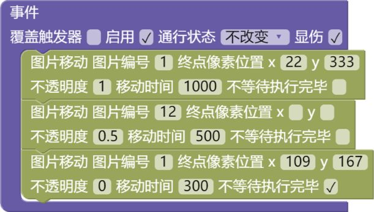

code为图片编号。该值需要在1~50之间。

to为终点图片左上角坐标，以像素为单位进行计算，不填写则视为当前图片位置。

opacity为完成时图片不透明度，移动过程中逐渐变化。在0~1之间。

time为总移动的时间。

async可选，如果为true则会异步执行（即不等待当前事件执行完毕，立刻执行下一个事件）。

### setCurtain：更改画面色调

我们可以使用 `{"type": "setCurtain"}` 来更改画面色调。
``` json
[
    {"type": "setCurtain", "color": [255,255,255,0.6], "time": 1000}, // 更改画面色调为纯白，不透明度0.6，动画时间1000毫秒
    {"type": "setCurtain", "color": [0,0,0], "async": true}, // 更改画面色调为纯黑，不透明度1，不指定动画时间（使用默认时间），且异步执行
    {"type": "setCurtain"} // 如果不指定color则恢复原样。
]
```

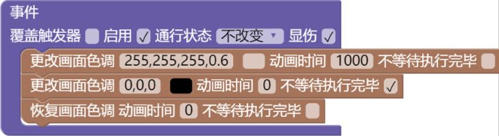

color为需要更改画面色调的颜色。它是一个数组，分别指定目标颜色的R,G,B,A值。
- 常见RGB颜色： 纯黑[0,0,0]，纯白[255,255,255]，纯红[255,0,0]，等等。
- 第四元为Alpha值，即不透明度，为一个0到1之间的数。可以不指定，则默认为Alpha=1

如果color不指定则恢复原样。

time为可选的，如果指定，则会作为更改画面色调的时间。

async可选，如果为true则会异步执行（即不等待当前事件执行完毕，立刻执行下一个事件）。

从V2.7开始，色调、天气和bgm的更改都提供了“持续到下个本事件”勾选项，勾选此项后，设置的结果将分别计入 `flags.__color__ , flags.__weather__ , flags.__bgm__` ，也会计入存档，并无视楼层切换带来的色调、天气和bgm变化，直到再次遇到本事件。但您也可以随时手动干预或清除这三个 `flag`
### screenFlash：画面闪烁

我们可以使用 `{"type": "screenFlash"}` 来进行画面闪烁。
``` json
[
    {"type": "screenFlash", "color": [255,255,255,0.6], "time": 500, "times": 1}, // 闪光为白色，不透明度0.6，动画时间1000毫秒
    {"type": "screenFlash", "color": [255,0,0,1], "time": 100, "times": 2, "async": true}, // 闪光为红色，强度最大，动画时间100毫秒，闪烁两次且异步执行
]
```

color为闪光的颜色。它是一个数组，分别指定目标颜色的R,G,B,A值。
- 常见RGB颜色： 纯黑[0,0,0]，纯白[255,255,255]，纯红[255,0,0]，等等。
A即闪光的不透明度，为一个0到1之间的数，值越高闪烁效果越强。默认为1

time为闪烁时间，默认值为500

times为闪烁次数，两次闪烁会连续进行，默认值为1

async可选，如果为true则会异步执行（即不等待当前事件执行完毕，立刻执行下一个事件）。

### setWeather：更改天气

我们可以使用 `{"type": "setWeather"}` 来更改天气。
``` json
[
    {"type": "setWeather", "name": "rain", "level": 6}, // 更改为雨天，强度为6级
    {"type": "setWeather", "name": "snow", "level": 3}, // 更改为雪天，强度为3级
    {"type": "setWeather"} // 更改回晴天
]
```
name为天气名。起初只支持 `rain` 和 `snow` ，即雨天和雪天。从V2.5.3开始，也支持雾天 `fog`

level为天气的强度等级，在1-10之间。1级为最弱，10级为最强。

如果想改回晴天则直接不加任何参数。
### move：让某个NPC/怪物移动

如果我们需要移动某个NPC或怪物，可以使用`{"type": "move"}`。

下面是该事件常见的写法：
``` json
[
    {"type": "move", "time": 750, "loc": [x,y], "steps": [
    // 动画效果，time为移动和淡出速度(比如这里每750ms一步)，loc为位置可选，steps为移动数组
        "right", "right", "down" // 向右两格，向下一格
    ], "keep": true, "async":true }, // keep可选，如果为true则不消失，否则渐变消失；async可选，如果为true则异步执行。
]
```

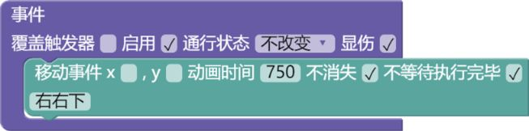
<br>time选项必须指定，为每移动一步和淡出所需要用到的时间。

loc为需要移动的事件位置。可以省略，如果省略则移动本事件。

steps为一个数组，其每一项是`up, down, left, right`之一，表示这一步应该朝哪个方向走。

对于有 `faceIds` 的NPC，也支持 `forward, backward` ，表示前进和后退

keep为一个可选项，代表该事件移动完毕后是否消失。如果该项指定了并为true，则移动完毕后将不消失，否则以动画效果消失。

值得注意的是，当调用move事件时，实际上是使事件脱离了原始地点。为了避免冲突，规定：move事件会自动调用该点的hide事件。

换句话说，当move事件被调用后，该点本身的事件将被禁用。

如果指定了 `"keep": true` ，则相当于会在目标地点触发一个 `setBlock` 和一个 `show` 事件；<br>如需能继续对话交互请在目标地点再写事件。<br>
阻击属性的移动效果就是这样，推箱子和阻击类似但目标点只 `setBlock` 不 `show` ，请自行注意可能的隐患。<br>
如果想让move后的NPC/怪物仍然可以被交互，需采用如下的写法：
``` json
"4,3": [ // [4,3]是一个NPC，比如小偷
    {"type": "move", "time": 750, "steps": [ // 向上移动两格，每步750毫秒
        "up", "up"
    ], "keep": true}, // 移动完毕后不消失
],
"4,1": { // [4,1]为目标地点
    "enable": false, // 初始时需要是禁用状态，被show调用后将显示出来
    "data": [
        "\t[杰克,thief]这样看起来就好像移动过去后也可以被交互。"
    ]
}
```

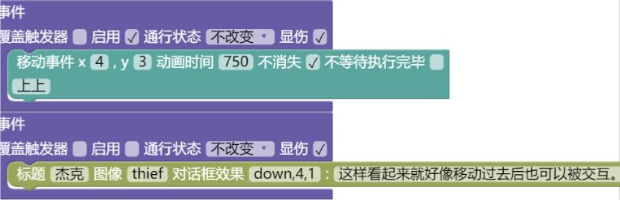

即，在移动的到达点指定一个事件，然后move事件中指定"keep":true，然后就可以触发目标点的事件了。

async可选，如果为true则会异步执行（即不等待当前事件执行完毕，立刻执行下一个事件）。

### moveHero：移动勇士

如果我们需要移动勇士，可以使用`{"type": "moveHero"}`。

下面是该事件常见的写法：
``` json
"x,y": [ // 实际执行的事件列表
    {"type": "moveHero", "time": 750, "async": true, "steps": [// 动画效果，time为移动速度(比如这里每750ms一步)，steps为移动数组
        "down", "right", "forward", "backward" // 向下、右、前、后各走一步
    ]},
]
```

可以看到，和上面的move事件几乎完全相同，除了不能指定loc，且少了keep选项。

勇士的steps也允许`forward`和`backward`，即前进和后退。

不过值得注意的是，用这种方式移动勇士的过程中将无视一切地形，无视一切事件，中毒状态也不会扣血。

async可选，如果为true则会异步执行（即不等待当前事件执行完毕，立刻执行下一个事件）。
### moveAction：移动一步
如果我们需要像事件外一样移动一步，可以使用`{"type": "moveAction"}`。
下面是该事件常见的写法：
``` json
"x,y": [ // 实际执行的事件列表
    {"type": "moveAction", "time": 750, "direction": "forward"}
]
```
`time` 可选，为移动的用时，单位是毫秒，不填则取玩家设置值。`direction` 可选，为移动的方向，不填则取 `forward`<br>
用这种办法移动时会检查通行性，也会正常触发阻激夹域捕和地形效果，如果不可通行则会去撞击（如开门打怪）
### jump：让某个NPC/怪物跳跃

如果我们需要移动某个NPC或怪物，可以使用`{"type": "jump"}`。

下面是该事件常见的写法：
``` json
[
    {"type": "jump", "from": [3,6], "to": [2,1], "time": 750, "keep": true, "async": true},
]
```
from为需要跳跃的事件起点。可以省略，如果省略则跳跃本事件。

to为要跳跃到的坐标。可以省略，如果省略则跳跃到当前坐标。

time选项必须指定，为全程跳跃所需要用到的时间。

keep为一个可选项，同上代表该跳跃完毕后是否不消失。如果该项指定了并为true，则跳跃完毕后不会消失，否则以动画效果消失。

如果指定了`"keep": true`，则相当于会在目标地点触发一个 `setBlock` 和一个 `show` 事件；<br>
和移动一样，如需能继续对话交互请在目标地点再写事件。

async可选，如果为true则会异步执行（即不等待当前事件执行完毕，立刻执行下一个事件）。

### jumpHero：跳跃勇士

如果我们需要跳跃勇士，可以使用`{"type": "jumpHero"}`。

下面是该事件常见的写法：
``` json
[
    {"type": "jump", "loc": [3,6], "time": 750, "async": true},
]
```

loc为目标坐标，可以忽略表示原地跳跃（请注意是原地跳跃而不是跳跃到当前事件点）。

time选项为该跳跃所需要用到的时间。

async可选，如果为true则会异步执行（即不等待当前事件执行完毕，立刻执行下一个事件）。

### playBgm：播放背景音乐

使用playBgm可以播放一个背景音乐。

使用方法：`{"type": "playBgm", "name": "bgm.mp3"}`
<br>音乐文件放在 `project\sounds` 文件夹，文件名在全塔属性中注册，不得使用中文。<br>
目前支持 `mp3/ogg/wav/flac/m4r` 等多种格式的音乐播放，不支持 `mid` 格式。

从V2.6.3开始，还提供了keep项。如果此项为真，则会记录该bgm，并且持续到下次调用本事件位置（楼层切换不改变bgm，读档也有效）。

从V2.7开始，还提供了“从第几秒开始”的参数，可加以利用。

有关BGM播放的详细说明参见[背景音乐](element#背景音乐)

### pauseBgm：暂停背景音乐

使用`{"type": "pauseBgm"}`可以暂停背景音乐的播放。

### resumeBgm：恢复背景音乐

使用`{"type": "resumeBgm"}`可以恢复背景音乐的播放。

从V2.7开始，还提供了一个勾选项，您可以选择从上次暂停的位置继续播放。
### loadBgm：预加载一个背景音乐

使用loadBgm可以预加载一个背景音乐。

使用方法：`{"type": "loadBgm", "name": "bgm.mp3"}`

有关BGM播放的详细说明参见[背景音乐](element#背景音乐)

### freeBgm：释放一个背景音乐的缓存

使用freeBgm可以预加载一个背景音乐。

使用方法：`{"type": "freeBgm", "name": "bgm.mp3"}`

### playSound：播放音效

使用playSound可以立刻播放一个音效。

使用方法：`{"type": "playSound", "name": "item.mp3"}`
<br>音乐文件放在 `project\sounds` 文件夹，文件名在全塔属性中注册，不得使用中文。<br>
从V2.6开始，也可以加`"stop": true`来停止之前正在播放的音效。

### stopSound：停止所有音效

使用`{"type": "stopSound"}`可以停止所有音效。

这在人物对话音效时很有用。

### setVolume：设置音量

使用setVolume可以设置音量大小。

使用方法： `{"type": "setVolume", "value": 90, "time": 500, "async": true}`

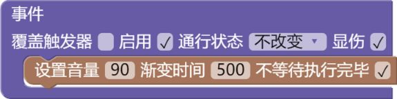
<br>`value` 为音量大小，在0到100之间（玩家设置值为这个值的平方根），默认为100。设置后，BGM将使用该音量进行播放。SE的音量大小不会发生改变。

可以设置time为音量渐变时间。

async可选，如果为true则会异步执行（即不等待当前事件执行完毕，立刻执行下一个事件）。

### win：获得胜利
`{"type": "win", "reason": "xxx"}` 将会直接调用脚本编辑中的 `win` 函数，并将 `reason` 作为结局传入。<br>
该事件会显示获胜页面，并重新游戏。

可以增加`"norank": 1`来表示该结局不计入榜单。

!> 如果`reason`不为空，则会以reason作为获胜的结局!

从V2.6.6起，也提供了一个“不结束游戏”勾选项（但录像依然会停止录制），您可以勾选它然后做一些结局演出。
### lose：游戏失败
`{"type": "lose", "reason": "xxx"}` 将会直接调用脚本编辑中的lose函数，并将reason作为参数传入。<br>
该事件会显示失败页面，并重新开始游戏。

### restart：直接回到标题界面

`{"type": "restart"}` 会中断一切执行的事件，并直接直接返回标题界面。

### callBook：呼出怪物手册

`{"type": "callBook"}` 可以呼出怪物手册，玩家可以自由查看当前楼层怪物数据和详细信息。

返回游戏后将继续执行后面的事件。没有怪物手册或在录像播放中，则会跳过本事件。

### callSave：呼出存档界面

`{"type": "callSave"}` 可以呼出存档页面并允许玩家存一次档。

在玩家进行一次存档，或者直接点返回游戏后，将接着执行后面的事件。录像播放将会跳过本事件。

### autoSave：自动存档

`{"type": "autoSave"}` 可以立刻进行一次自动存档。录像播放不会跳过本事件。

### callLoad：呼出读档界面

`{"type": "callLoad"}` 可以呼出读档页面并允许玩家进行读档。

如果玩家没有进行读档而是直接返回游戏，则会继续执行后面的事件。录像播放将会跳过本事件。

### input：接受用户输入数字

使用`{"type": "input"}`可以接受用户的输入的数字。
``` json
[
    {"type": "input", "text": "请输入一个数"}, // 显示一个弹窗让用户输入数字
    "你刚刚输入的数是${flag:input}" // 输入结果将被赋值为flag:input
]
```

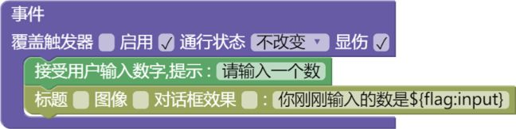

text为提示文字，可以在这里给输入提示文字。这里同样可以使用${ }来计算表达式的值。

当执行input事件时，将显示一个弹窗，并提示用户输入一个内容。
<br>!> 该事件只能接受非负整数输入，所有非法的输入将全部变成 `0` 。例如用户输入“你好”或者 `-3` ，都将实际得到 `0` 。<br>
输入得到的结果将被赋值给flag:input，可以供后续if来进行判断。

### input2：接受用户输入文本

类似于input事件，使用`{"type": "input2"}`可以接受用户的输入的文本。
``` json
[
    {"type": "input2", "text": "请输入你的ID"}, // 显示一个弹窗让用户输入文本
    "你好，${flag:input}，欢迎来到本塔" // 输入结果将被赋值为flag:input
]
```


text为提示文字，可以在这里给输入提示文字。这里同样可以使用${ }来计算表达式的值。

当执行input2事件时，将显示一个弹窗，并提示用户输入一个内容。

该事件可以接收任何形式的文本输入，包括中文，空格，标点符号等等。如果用户点击取消按钮，则视为空字符串。

输入得到的结果也将被赋值给flag:input，可以供后续使用。

### if：条件判断
使用`{"type": "if"}`可以对条件进行判断，根据判断结果将会选择不同的分支执行。其大致写法如下：
``` json
[
    {"type": "if", "condition": "...", // 测试某个条件
        "true": [ // 条件成立则执行true里面的事件
            
        ],
        "false": [ // 条件不成立则执行false里的事件

        ]
    },
]
```
我们可以在condition中给出一个表达式（能将`status:xxx, item:xxx, flag:xxx`等来作为参数），并进行判断是否成立。

如果条件成立，则将继续执行`"true"`中的列表事件内容。

如果条件不成立，则将继续执行`"false"`中的列表事件内容。

例如下面这个例子，每次将检查你的攻击力是否大于500，不是的场合将给你的攻击力加100点。
``` json
[
    {"type": "if", "condition": "status:atk>500", // 判断攻击力是否大于500
        "true": [ // 条件成立则执行true里面的事件
            "你的攻击力已经大于500了！",
            {"type": "exit"} // 立刻结束本事件
        ],
        "false": [ // 条件不成立则执行false里的事件
            "你当前攻击力为${status:atk}, 不足500！\n给你增加100点攻击力！",
            {"type": "setValue", "name": "status:atk", "operator": "+=", "value": "100"},
        ] // 攻击力加100， 接着会执行trigger事件
    },
    {"type": "trigger", "loc": ["core.nextX()","core.nextY()"]}
] // 立刻重新触发勇士面前的本事件， 直到攻击力大于500后结束
```

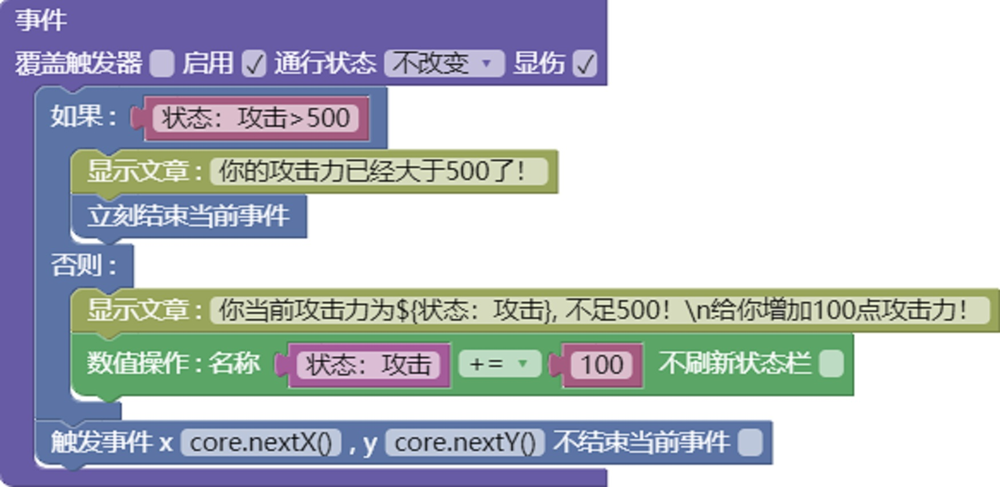

需要额外注意的几点：

- 给定的表达式（condition）一般需要返回true或false。
- `0、null、undefined、NaN`、空字符串，也会被理解为 `false`
- `flag:xxx` 可取用一个自定义变量或flag。如果从未设置过该flag，则其值默认为0。
- 即使条件成立的场合不执行事件，对应的 `true` 数组也需要存在，不过简单的留空就好。
- if可以不断进行嵌套，一层套一层；如成立的场合再进行另一个if判断等。
- if语句内的内容执行完毕后将接着其后面的语句继续执行。


### switch：多重条件分歧

使用`{"type": "switch"}`可以比较判别值和不同分支的条件，根据判断结果选择不同的分支执行。

其大致写法如下：
``` json
[
    {"type": "switch", "condition": "...", // 计算某个表达式
        "caseList": [
            {"case": "a", "action": [// 若表达式的值等于a则执行该处事件
            
            ]},
            {"case": "b", "nobreak": true, "action": [// 若表达式的值等于b则执行该处事件，不跳出
            
            ]},
            {"case": "default", "action": [ // 没有条件成立则执行该处里的事件

            ]}
        ]
    },
]
```

我们可以在condition中给出一个表达式（能将`status:xxx`, `item:xxx`, `flag:xxx`来作为参数），并计算它的值

如果某条件中的值与其相等，则将执行其对应的列表事件内容。

如果没有符合的值，则将执行`default`中的列表事件内容。

nobreak是可选的，如果设置，则在当前条件满足并插入事件后，不跳出多重分歧，而是无视接下来的一切条件，挨个插入事件，直到插入完一组没有nobreak的事件，或抵达多重分歧的最底部。

例如下面这个例子，将检查当前游戏难度并赠送不同属性。
``` json
[
    {"type": "switch", "condition": "flag:hard", // 判断当前游戏难度
         "caseList": [
            {"case": "0", "action": [// 若表达式的值等于0则执行该处事件
                "当前为简单难度，赠送100点攻防！",
                {"type": "setValue", "name": "status:atk", "value": "status:atk+100"},
                {"type": "setValue", "name": "status:def", "value": "status:def+100"},
            ]},
            {"case": "1", "action": [// 若表达式的值等于1则执行该处事件
                "当前为普通难度，赠送50点攻防！",
                {"type": "setValue", "name": "status:atk", "value": "status:atk+50"},
                {"type": "setValue", "name": "status:def", "value": "status:def+50"},
            ]},
            {"case": "default", "action": [ // 其他难度下不赠送属性

            ]}
        ]
    },
]
```

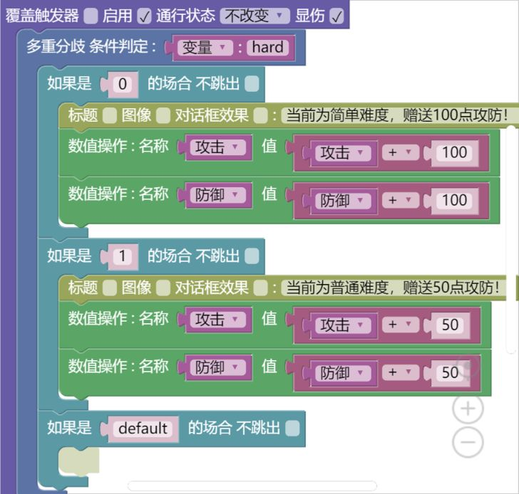

需要额外注意的几点：

- 各个条件分支的判断是顺序执行的，因此若多个分支的条件都满足，将只执行最靠前的分支。
  - 同理，请不要在`default`分支后添加分支，这些分支将不可能被执行。
- `default`分支并不是必要的，如果删除，则在没有满足条件的分支时将不执行任何事件。
- 即使某个场合不执行事件，对应的action数组也需要存在，不过简单的留空就好。
- switch语句内的内容执行完毕后将接着其后面的语句继续执行。

另外由于`case`中的内容是会被计算的，因此如下写法也是合法的
```json
[
    {"type": "switch", "condition": "true", // 条件：某一项为真时
         "caseList": [
            {"case": "flag:a==1", "action": [ // 如果 flag:a == 1
                "走进了 flag:a==1 分支！"
            ]},
            {"case": "flag:b>=3", "action": [ // 如果 flag:a != 1 && flag:b >= 3
                "走进了 flag:a!=1 && flag:b>=3 分支！"
            ]},
            {"case": "default", "action": [ // 上述两条均不成立
                "上述两条均不成立"
            ]}
        ]
    },
]
```

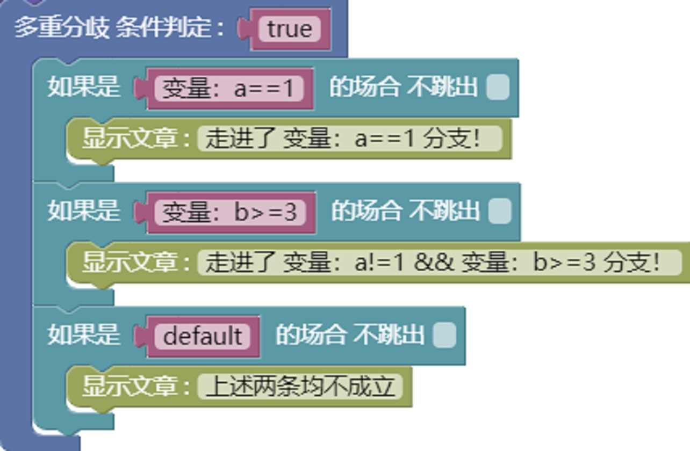

### choices：给用户提供选项

choices是一个很麻烦的事件，它将弹出一个列表供用户进行选择。

当用户做出了不同的选择，可以有着不同的分支处理。

其完全类似于RPG Maker中的"显示选择项"，"XX的场合"，只不过同样是需要使用数组来定义。

其大致写法如下：
``` json
[
    {"type": "choices", "text": "...",  // 提示文字
        "choices": [
            {"text": "选项1文字", "action": [
                    // 选项1执行的事件
            ]},
            {"text": "选项2文字", "color": [255,0,0,1], "action": [
                    // 选项2执行的事件
            ]},
            {"text": "选项3文字", "icon": "fly", "action": [
                    // 选项3执行的事件
            ]},
        ]
    },
]
```

其中最外面的"text"为提示文本。同上面的`"type":"text"`一样，支持`${}`表达式的计算，和\t显示名称、图标，\r更改颜色。text可省略，如果省略将不显示任何提示文字。

choices为一个数组，其中每一项都是一个选项列表。

每一项的text为显示在屏幕上的选项名，也支持${}的表达式计算，但不支持`\t[]`的显示。

action为当用户选择了该选项时将执行的事件。

color为可选的，可以是一个字符串（#FF0000），或者一个RGBA数组（[255,0,0,1]）。

icon是可选的，如果设置则会在选项前绘制图标，其可以是一个有效的ID，或者`core.statusBar.icons`中的系统图标。

选项可以有任意多个（没有提示信息时最多为13或15个），但一般不要超过6个，否则屏幕可能塞不下。

从V2.6.3开始，每个子选项允许附加一个“出现条件”，从而做出类似“怒气值满才显示开大招按钮”的效果。
### confirm：显示确认框

`{"type": "confirm"}`将提供一个确认框供用户选择，其基本写法如下：
```json
[
    {"type": "confirm", "text": "...",  // 提示文字
        "default": false, // 是否默认选中【确定】
        "yes": [
            // 点击确定时执行的事件
        ],
        "no": [
            // 点击取消时执行的事件
        ]
    },
]
```

text为必填项，代表提示的文字，支持${}的表达式计算和\n的手动换行。

text暂时不支持自动换行、变色\r、图标绘制\i等效果。如有需求请使用choices事件。

default可选，如果为true则显示选择项时默认选中【确定】，否则默认选中【取消】。

yes和no均为必填项，即用户点击确认或取消后执行的事件。

从V2.7开始，“选择项”、“确认框”和后面要讲的“等待用户操作”事件，都允许提供一个限制时间，效果是如果玩家在若干毫秒内不做出选择，就视为什么都没选，并继续后面的事件。
<br>您可以使用这个功能去制作如《新新魔塔2》那样的QTE战斗。
### while：前置条件循环
从V2.2.1开始，我们提供了循环处理（ `while` 事件）。其大致写法如下：
``` json
[
    {"type": "while", "condition": "...", // 循环测试某个条件
        "data": [ // 条件成立则执行data里面的事件
            
        ]
    },
]
```
它和 `if` 事件非常相似，最大的区别是，每次 `data` 事件列表执行完毕后，都将再次测试 `condition` ，
<br>如果还为 `true` ，则将再次执行 `data` 的内容。下面是一个输出1到10之间的数字，每隔1秒显示一个的例子。
``` json
[
    {"type":"while", "condition": "flag:i<=10", // 循环处理；注意flag未设置则默认为0
        "data":[
            {"type": "setValue", "name": "flag:i", "operator": "+=", "value": "1"}, // 递增i
            "${flag:i}", // 输出i
            {"type": "sleep","time":1000}, // 等待1秒
        ]
    },
]
```


### dowhile：后置条件循环
`type:dowhile`可以制作一个后置条件循环。其写法与参数和 `type:while` 完全一致，不过与其不同的是，<br>
会先执行一次事件列表（即首次执行是无条件的），再对条件进行判定，和脚本中的 `do {...} while (...);` 一样。
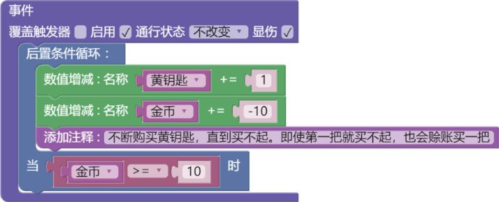
### for：计数循环
从V2.7开始，`type:for` 可以制作一个计数循环，其基本写法为：
``` json
[
    {"type": "for", "name": "temp:A-Z", "from": "...", "to": "...", "step": "...", "data": [
        // 可以在这里引用临时变量A-Z，循环执行一些内容
    ]},
]
```
其中 `name` 为循环的计数器，只能使用临时变量 `A-Z` ，`from` 和 `to` 为两个表达式，表示计数器的初始值和边界值

`step` 为每轮循环结束后计数器的增量，也允许填表达式甚至负数，填负数的话 `from` 当然就要比 `to` 更大或相等了。

当计数器以正步长越过（即大于）边界值时，循环终止；当计数器以负步长越过（即小于）边界值时，循环也终止。

下面是13×13小地图中，模拟大黄门钥匙的使用效果：
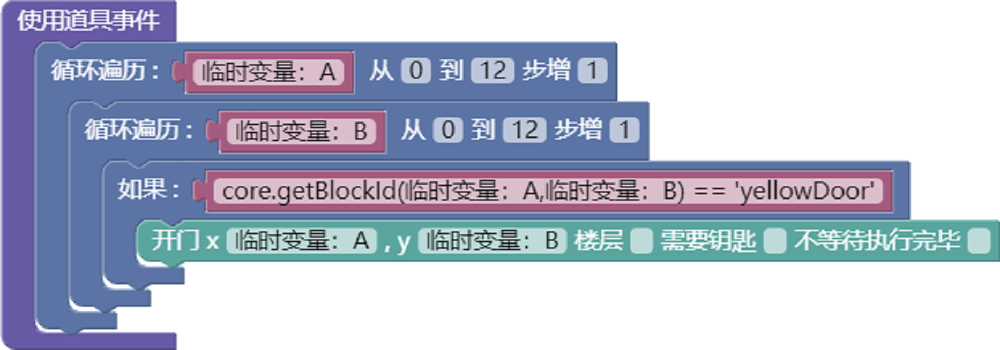
### forEach：数组迭代
从V2.7开始，`type: forEach` 可以循环迭代一个数组，逐项读取其每个元素，其基本写法为：
``` json
[
    {"type": "forEach", "name": "temp:A-Z", "list": [..., ..., ..., ...], "data": [
        // 可以在这里引用临时变量A-Z，循环执行一些内容
    ]},
]
```
和 `for` 一样只能使用临时变量，实际执行时，每轮循环会从 `list` 的开头移除第一项，代入临时变量，直到 `list` 变空。

要注意的是，`list` 中的字符串不会被自动解释为那些带冒号的缩写量，你需要手动调用 `core.calValue()` 去求值：

这个事件会让勇士说出“我的`status:atk`属性为`10`”这样的句子。
### break：跳出当前循环或公共事件
使用 `{"type": "break"}` 可以跳出当前循环或公共事件。<br>
跳出公共事件的原理是，公共事件实际上是作为一个“条件为 `false` 的后置条件循环”去执行的。<br>
!> 如果break事件不在任何循环或公共事件中被执行，则和exit等价，即会立刻结束当前事件！
### continue：提前结束本轮循环
使用 `{"type": "continue"}` 可以提前结束本轮循环。上面的输出例子也可以这么写：
``` json
[
    {"type":"while", "condition": "true", // 循环处理；永远为真
        "data":[
            {"type": "setValue", "name": "flag:i", "operator": "+=", "value": "1"}, // 递增i
            "${flag:i}", // 输出i
            {"type": "sleep","time":1000}, // 等待1秒
            {"type": "if", "condition": "flag:i<10", // 测试i是否小于10
                "true": [{"type": "continue"}], // 是，提前结束本轮循环，避免被后面的break跳出
                "false": []
            },
            {"type": "break"}, // 跳出循环
        ]
    },
]
```

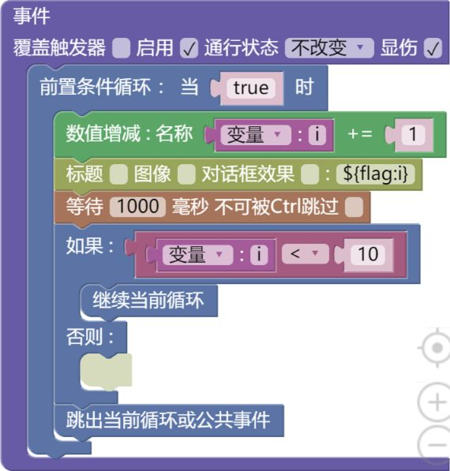
<br>!> 如果continue事件不在任何循环或公共事件中被执行，则和exit等价，即会立刻结束当前事件！
### wait：等待用户操作

使用 `{"type": "wait"}` 可以等待用户进行操作（如点击、按键等）。

当用户执行操作后：
- 如果是键盘的按键操作，则会将flag:type置为0，并且把flag:keycode置为按键的keycode。
- 如果是屏幕的点击操作，则会将flag:type置为1，并且设置flag:x和flag:y为点击的位置坐标，flag:px和flag:py为点击的像素坐标。

下面是一个while事件和wait合并使用的例子，这个例子将不断接收用户的点击或按键行为，并输出该信息。
如果用户按下了ESC或者点击了屏幕正中心，则退出循环。
``` json
[
    {"type": "while", "condition": "true", // 永久循环
        "data": [
            {"type": "wait"}, // 等待用户操作
            {"type": "if", "condition": "flag:type==0", // flag:type==0，键盘按键
                "true": [
                    "你当前按键了，keycode是${flag:keycode}",
                    {"type": "if", "condition": "flag:keycode==27", // ESC的keycode是27
                        "true": [{"type": "break"}], // 跳出循环
                        "false": []
                    }
                ],
                "false": [ // flag:type==1，鼠标点击
                    "你当前点击屏幕了，位置坐标是[${flag:x},${flag:y}]，像素坐标是[${flag:px},${flag:py}]",
                    {"type": "if", "condition": "flag:x==6 && flag:y==6", // 点击(6,6)
                        "true": [{"type": "break"}], // 跳出循环
                        "false": []
                    }
                ]
            }
        ]
    }
]
```

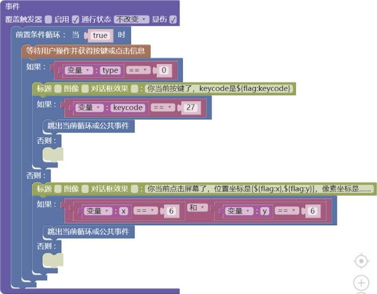

从V2.6.6开始，也允许直接在`type:wait`中增加`data`项判定按键或点击坐标。
```json
[
  {"type": "wait", "data": [
    {"case": "keyboard", "keycode": "13,32", "action": [
      {"type": "comment", "text": "按下回车(keycode=13)或空格(keycode=32)时执行此事件"},
    ]},
    {"case": "mouse", "px": [0,32], "py": [0,32], "action": [
      {"type": "comment", "text": "当点击地图左上角时执行此事件"},
    ]},
  ]},
]
```

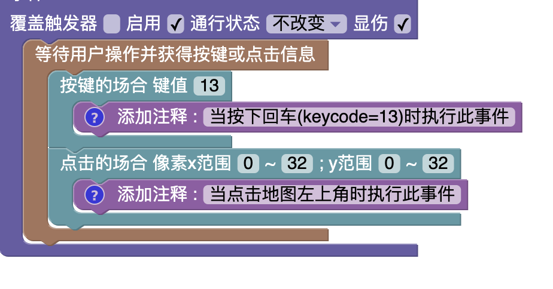

`data`是一个数组，每一项中，case只能为`keyboard`和`mouse`二选一，分别对应键盘和鼠标（即`type=0`和`type=1`）。

如果是键盘，则可以指定`keycode`为键盘的按键内容；否则指定`px`和`py`为点击的像素区间。

action为如果满足该条件时应该执行的事件列表。

从V2.7开始，提供了“限制时间”，如果玩家在若干毫秒内不做出响应，就会跳过这些场合，直接继续执行后面的事件。
### waitAsync：等待所有异步事件执行完毕

上面有很多很多的异步事件（也就是执行时不等待执行完毕）。

由于录像是加速播放，且会跳过`{"type":"sleep"}`（等待X毫秒）事件；因此异步行为很有可能导致录像播放出错。

例如，异步移动一个NPC去某格，然后等待X毫秒，再勇士走过去对话；
但是录像播放中，等待X毫秒的行为会被跳过，因此勇士可能走过去时异步还未执行完成，导致录像出错。

我们可以使用`{"type":"waitAsync"}`来等待所有异步事件执行完毕。

该事件会进行等待，直到所有可能的异步事件（异步动画除外）执行完毕。

### previewUI：UI绘制并预览

此项可在地图编辑器中预览UI界面的绘制效果。

在编辑器中将会把此项包含的所有UI绘制事件进行绘制从而可以进行预览。

值得注意的是，在游戏中，UI绘制事件都是绘制在uievent层上的。

### clearMap：清除画布

UI绘制事件。

`{"type": "clearMap"}`可以清除`uievent`画布的内容。
```json
[
    {"type": "clearMap", "x": 0, "y": 0, "width": "flag:width", "height": 416}, // 清除画布的一部分
    {"type": "clearMap"}, // 清空并删除画布
]
```

x, y, width, height均可选，表示要清除的坐标和长宽。也可以使用`flag:xxx`。

如果存在某一项不填则会清空全部画布并删除。

### setAttribute：设置画布属性

UI绘制事件。

此项可以设置`uievent`画布的各项属性。
```json
[
    {"type": "setAttribute", "font": "17px Verdana", "fillStyle": [255,0,0,1]},
]
```

可以选择性的设置如下几项内容：
- `font`：字体，必须是`[italic] [bold] 14px Verdana`这种形式
- `fillStyle`：填充样式，必须是三元组RGB或四元组RGBA
- `strokeStyle`：边框样式，必须是三元组RGB或者四元组RGBA
- `lineWidth`：线宽度，必须是正整数
- `alpha`：不透明度，必须是0到1之间的浮点数
- `align`：对齐方式，只能是`left`, `center`, `right`，分别代表左对齐，居中和右对齐
- `baseline`：基准线，只能是`top`, `middle`, `alphabetic`, `bottom`, `ideographic`, `hanging`，分别代表顶部，居中，标准值、底部、中文和悬挂。
- `z`：画布的z值，必须是正整数。初始创建时画布的z值是135。请注意，闪烁光标所在画布的z值永远比该画布大1。

### fillText：绘制文本

UI绘制事件。

此项可以绘制一行文本。
```json
[
    {"type": "fillText", "text": "要绘制的文本", "x": 10, "y": 20, "maxWidth": 50}
]
```

text必填，为要绘制的文本，支持`${}`的写法，不支持一切转义字符或换行符。

x和y必填，为要绘制的左上角坐标。请使用`setAttribute`来设置绘制的对齐方式和基准线。

style可选，如果设置需要是三元组RGB或四元组RBGA，代表绘制样式。

font可选，如果设置则是要绘制的字体。

maxWidth可选，如果设置且不为0，则代表要绘制的最大宽度；超过此宽度会自动放缩。

### fillBoldText：绘制描边文本

UI绘制事件。

此项可以绘制一行描边文本。
```json
[
    {"type": "fillText", "text":"要绘制的描边文本", "x": 10, "y": 20, "style": [255,0,0,1]}
]
```

text必填，为要绘制的文本，支持`${}`的写法，不支持一切转义字符或换行符。

x和y必填，为要绘制的左上角坐标。请使用`setAttribute`来设置绘制的对齐方式和基准线。

style可选，如果设置需要是三元组RGB或四元组RBGA，代表绘制样式。

font可选，如果设置则是要绘制的字体。

从V2.7开始，可以选择描边的颜色，初始为黑色。描边原理是先用描边色绘制4份一样的偏移文本，再以文本色覆盖。
### drawTextContent：绘制多行文本

UI绘制事件。

此项可以绘制多行文本。
```json
[
    {"type": "drawTextContent", "text": "要绘制的多行文本", "left": 10, "top": 20, "maxWidth": 100}
]
```

text必填，为要绘制的文本，支持所有的文字效果（如\n，${}，\r，\\i，\\c，\\d，\\e等），但不支持支持\t和\b的语法。

left和top必填，为要绘制的起始像素坐标。实际绘制时会将textBaseline设置为'top'，因此只需要考虑第一个字的左上角位置。

maxWidth可选，为单行最大宽度，超过此宽度将自动换行，不设置不会自动换行。

color可选，表示绘制时的颜色，为三元组RGB或四元组RGBA。如果不设置则使用剧情文本设置中的正文颜色。

bold可选，是否粗体。如果不设置默认为false。

align可选，文字对齐方式，仅在maxWidth设置时有效，默认为'left'。

fontSize可选，为字体大小，如果不设置则使用剧情文本设置中的正文字体大小。

lineHeight可选，绘制的行距值，如果不设置则使用fontSize*1.3（即1.3倍行距）。

此项不支持字体样式的设置，使用的是全塔属性中的全局字体；如有需要请使用“设置全局属性”事件来设置字体样式。
### fillRect：绘制实心矩形
UI绘制事件。此项可以绘制一个实心矩形。
```json
[
    {"type": "fillRect", "x": 100, "y": 100, "width": 120, "height": 120, "style": [255,0,0,1]}
]
```

x, y, width, height必填，为要绘制的起点坐标和宽高；也可以用`flag:xxx`。

color可选，表示绘制时的颜色，为三元组RGB或四元组RGBA。
### strokeRect：绘制空心矩形
UI绘制事件。此项可以绘制一个空心矩形。
```json
[
    {"type": "strokeRect", "x": 100, "y": 100, "width": 120, "height": 120, "style": [255,0,0,1], "lineWidth": 4}
]
```

x, y, width, height必填，为要绘制的起点坐标和宽高；也可以用`flag:xxx`。

style可选，表示绘制时的颜色，为三元组RGB或四元组RGBA。

lineWidth可选，表示边框的线宽。

### drawLine：绘制线段
UI绘制事件。此事件可以绘制一条直线段，循环使用的话您甚至可以画出带渐变色的复杂曲线。
```json
[
    {"type": "drawLine", "x1": 0, "y1": 0, "x2": "flag:x", "y2": 200, "style": [255,0,0,1]}
]
```

x1, y1, x2, x2必填，为要绘制的起点和终点坐标；也可以用`flag:xxx`的写法。

style可选，表示绘制时的颜色，为三元组RGB或四元组RGBA。

lineWidth可选，表示边框的线宽。

下面是一个循环绘制直线段形成抛物线的例子：<br>
`for (var x = 0; x < 20; ++x) core.drawLine('ui', x * 20, x * x, (x + 1) * 20, (x + 1) ** 2)`
### drawArrow：绘制箭头

UI绘制事件。此事件可以绘制一个箭头。

参数和写法与`drawLine`完全一致，只不过是会多画一个箭头标记。
### fillPolygon：绘制实心多边形
UI绘制事件。此事件可以绘制一个多边形。
```json
[ // 实际绘制原理是把顶点依次用直线段连起来，因此请自行注意顶点的顺序
   {"type": "fillPolygon", "nodes": [[0,0],[0,100],[100,0]], "style": [255,0,0,1]}
]
```

nodes必填，为一个二维数组，其中每一项都是多边形一个顶点坐标。（与显示/隐藏事件写法相同）

style可选，表示绘制时的颜色，为三元组RGB或四元组RGBA。
### strokePolygon：绘制空心多边形
UI绘制事件。此事件可以绘制一个多边形边框。

参数列表和`fillPolygon`基本相同，不过多了一个`lineWidth`表示的绘制线宽。
### fillCircle：绘制实心圆盘
UI绘制事件。此项可以绘制一个圆
```json
[
    {"type": "fillCircle", "x": 100, "y": 100, "r": 10, "style": [255,0,0,1]}
]
```

x, y, r必填，为要绘制的圆心和半径；也可以用`flag:xxx`。

color可选，表示绘制时的颜色，为三元组RGB或四元组RGBA。
### strokeCircle：绘制空心圆环
UI绘制事件。此项可以绘制一个圆边框。

参数列表和`fillCircle`基本相同，不过多了一个`lineWidth`表示的绘制线宽。

如果您需要绘制椭圆，可以使用参数方程。譬如：
``` js
for(var x = 0; x < 6.28; x += .01)
    core.drawLine('ui', 208 + 200 * Math.cos(x), 208 + 100 * Math.sin(x), 208 + 200 * Math.cos(x + .01), 208 + 100 * Math.sin(x + .01))
```
### drawImage：绘制图片

UI绘制事件。此事件可以绘制一个图片。
```json
[
    {"type": "drawImage", "image": "bg.jpg", "x": 0, "y": 0}, // 在(0,0)绘制bg.jpg
    {"type": "drawImage", "image": "bg.jpg", "x": 0, "y": 0, "w": 100, "h": 100}, // 在(0,0)绘制bg.jpg，且放缩到100x100
    // 裁剪并放缩图片
    {"type": "drawImage", "image": "bg.jpg", "x": 0, "y": 0, "w": 100, "h": 100, "x1": 0, "y1": 0, "w1": 100, "h1": 100}
]
```

image必填，为图片名。图片必须在全塔属性中被注册过。

此函数有三种写法：

- 只写x和y：表示要绘制到的位置。
- 写x, y, w, h：表示要绘制到的位置，且将图片放缩到指定宽高。
- 写x, y, w, h, x1, y1, w1, h1：从原始图片上裁剪[x,y,w,h]的图片，并绘制画布上的[x1,y1,w1,h1]

可以查看下面的文档以了解各项参数的信息：
http://www.w3school.com.cn/html5/canvas_drawimage.asp

### drawIcon：绘制图标

UI绘制事件。此事件可以绘制一个图标。
```json
[
    {"type": "drawIcon", "id": "yellowKey", "x": 100, "y": 100}, // 在(100,100)绘制黄钥匙
]
```

id必填，为要绘制的图标ID。可以是一个注册过的图标ID，也可以使用状态栏的图标ID，例如lv, hp, up, save, settings等。

x, y必填，为要绘制的左上角坐标。width和height可选，如果设置则会将图标放缩成对应的宽高。

从V2.7开始，对于多帧图块，允许指定绘制哪一帧，默认绘制第 `0` 帧。
### drawBackground：绘制背景图

UI绘制事件。此事件可以绘制一个背景图。
```json
[
    {"type": "drawBackground", "background": "winskin.png", "x": 0, "y": 0, "width": 100, "height": 100},
]
```

background必填，为要绘制的背景图内容。其可以是一个三元组RGB或四元组RGBA（纯色绘制），或一个WindowSkin的图片名。

x, y, width, height必填，分别为要绘制的起点坐标和长宽。

可以使用“设置画布属性”来设置不透明度和纯色绘制时的边框颜色。

### drawSelector：绘制闪烁光标

UI绘制事件。此事件可以绘制闪烁光标。
```json
[
    {"type": "drawSelector", "image": "winskin.png", "code": 1, "x": 0, "y": 0, "width": 100, "height": 100},
    {"type": "drawSelector", "code": 1} // 清除1号闪烁光标
]
```

image为要绘制的WindowSkin图片名；如果不填则视为“清除闪烁光标”。

`x, y, width, height` 分别为要绘制的起点坐标和长宽。`code` 为要绘制或清除的光标编号，必须为正整数。

闪烁光标将会一直存在即使事件流结束；请使用本事件并只填 `code` 来清除闪烁光标。
### function: 自定义JS脚本

上述给出了这么多事件，但有时候往往不能满足需求，这时候就需要执行自定义脚本了。
``` json
[
    {"type": "function", "function": "function(){ // 执行一段js脚本
        // 这里写js代码
        alert(core.getStatus('atk')); // 弹窗显示勇士的攻击力
    }"},
]
```

`{"type":"function"}`需要有一个`"function"`参数，它是一个JS函数，里面可以写任何自定义的JS脚本；系统将会执行它。

系统常见可能会被造塔所用到的的API都在[API列表](api)中给出，请进行参照。

**警告：自定义脚本中只能执行同步代码，不可执行任何异步代码，比如直接调用core.changeFloor(...)之类都是不行的。**

[API列表](api)中的所有异步API都进行了标记；如果你不确定一个函数是同步的还是异步的，请向小艾咨询。

如果需要异步的代码都需要用事件（insertAction）来执行，这样事件处理过程和录像回放才不会出错。

举个例子，如果我们想随机切换到某个楼层的某个点，我们可以这么写自定义脚本：

``` js
var toFloor = core.floorIds[core.rand(core.floorIds.length)]; // 随机一个楼层ID
var toX = core.rand(13), toY = core.rand(13); // 随机一个点
core.insertAction([
    {"type": "changeFloor", "floorId": toFloor, "loc": [toX, toY]} // 插入一个changeFloor事件，并在该脚本结束后执行。
]) // 你会注意到此时事件参数允许使用var型变量，这也是insertAction的强大之处
// 请勿直接调用 core.changeFloor(toFloor, ...)，这个代码是异步的，会导致事件处理和录像出问题！
```

!> 从V2.5.3开始，提供了一个"不自动执行下一个事件"的选项（`"async": true`）。如果设置了此项，那么在该部分代码执行完毕后，不会立刻执行下一个事件。你需要在脚本中手动调用`core.events.doAction()`来执行下一个事件。可以通过此项来实现一些异步的代码，即在异步函数的回调中再执行下一个事件。使用此选项请谨慎，最好向开发者寻求咨询。

## 自动事件

从V2.6.4开始，提供了自动事件。每个点都可以绑定若干个自动事件，其类似于RM的事件页。

自动事件可以设置一个触发条件，当满足此条件时将自动执行。

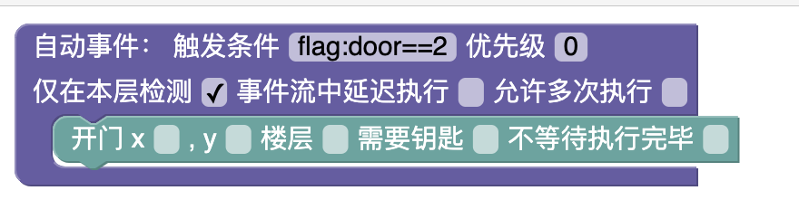

自动事件可以设置如下几项内容：

- 条件：当满足此条件时将自动执行
- 优先级：当多个自动事件的条件同时满足时，将按照优先级从大到小执行；相同优先级的按照楼层和坐标排序。
- 仅在本层检测：是否仅在本层检测该条件。
- 事件流中延迟执行：如果此项为true，则若满足条件时正在事件流的处理中，则将该自动事件延迟到事件流结束时执行。
- 允许多次执行：如果此项为true，则该自动事件允许被多次触发；否则只会被触发一次。值得注意的是，即使允许多次触发，也不允许在正在执行本自动事件时再触发。（即在执行本自动事件时将暂时禁用自身，直到执行完毕为止）

自动事件的检测时机为刷新状态栏，即每次刷新状态栏时都会进行检测。

可以给自动事件加上【转变图块】，从而达到类似RM的多事件页并转变图块的效果

## 独立开关

从V2.5.3开始，针对每个事件都提供了独立开关。

独立开关的写法是`switch:A`, `switch:A`直到`switch:Z`，共计26个。

独立开关算是特殊的flag，它在事件中使用时会和事件的楼层及坐标进行绑定；换句话说每个事件对应的`switch:A`都是不同的。

事实上，在某个楼层某个点的事件的独立开关A对应的系统flag为`floorId@x@y@A`，
比如在`MT0`层的`[2,5]`点事件，对应的`switch:B`独立开关，实际会被映射到`flag:MT0@2@5@B`。

如果在事件外想访问某个事件的独立开关也需要通过上面这个方式。

通过独立开关的方式，我们无需对某些NPC的对话都设立单独的互不重复flag，只需要关注该事件自身的逻辑即可。

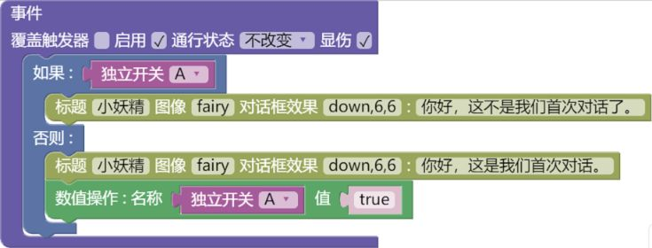

## 同一个点的多事件处理

我们可以发现，就目前而且，每个点的事件是和该点进行绑定，并以该点坐标作为唯一索引来查询。

而有时候，我们往往需要在同一个点存在多个不同的事件。这涉及到同一个点的多事件处理。
<br>我们可以依靠两种指令来实现。**`setBlock` 事件**和 **`if+flag` 的条件判断**。<br>
下面以几个具体例子来进行详细说明。

### 打怪掉宝

我们注意到怪物和道具都是系统默认事件，因此无需写events，而是直接在afterBattle中setBlock即可。
``` json
"afterBattle": {
    "x,y": [
        {"type": "setBlock", "number": 21} // 变成黄钥匙。注意是当前点因此可省略floorId和loc
    ]
}
```

### 打怪变成楼梯

因为涉及到多事件处理，因此我们不能写changeFloor那一项，而是使用events（自定义事件里写楼层转换）。

注意到events中不覆盖trigger，则还是怪物时，存在系统trigger因此会战斗并触发afterBattle；变成NPC后没有系统trigger因此会触发自定义事件（楼层转换）。

请注意打死怪物时默认会禁用该点，因此替换后需要手动进行show来启用。
``` json
"events": {
    "x,y": [
        {"type": "changeFloor", "loc": [0,0], "floorId": "MT1"}
    ]
},
"afterBattle": {
    "x,y": [
        {"type": "setBlock", "number": 87}, // 变成上楼梯
        {"type": "show"} // 启用该点
    ]
}
```


### 获得圣水后变成墙

这个例子要求获得圣水时不前进（也就是不能走到圣水地方），然后把圣水位置变成墙。

因此需要我们需要覆盖系统trigger（getItem），并覆盖noPass。

通过if来判断有没有获得圣水，没有则触发圣水（生命x2）然后变成墙，否则不执行。
``` json
"events": {
    "x,y": {
        "trigger": "action", // 覆盖系统trigger，默认的getItem不会执行
        "noPass": true, // 覆盖可通行状态，不允许走到该点
        "data": [
            {"type": "if", "condition": "flag:hasSuperPotion", // 条件判断：是否喝过圣水
                "true": [], // 喝过了，不执行
                "false": [
                    {"type":"setValue", "name":"status:hp", "value":"status:hp*2"},
                    {"type":"setBlock", "number": 1}, // 生命翻倍，将该点变成墙
                    {"type":"setValue", "name":"flag:hasSuperPotion", "value": "true"}
                ] // 标记已经喝过了。你会发现这种写法并不涉及圣水道具本身，它只是个素材
            }
        ]
    }
}
```

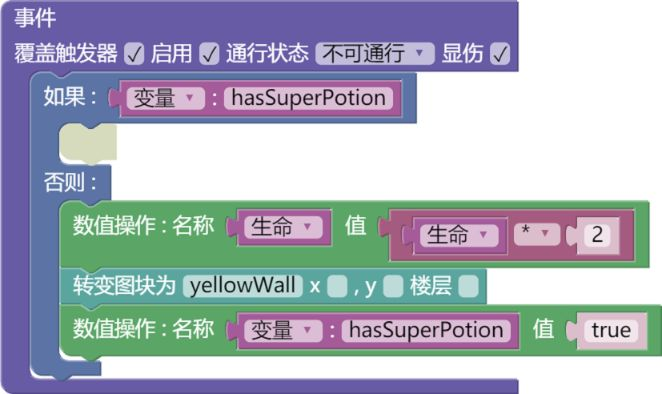

总之，记住如下两点：

 - 可以使用setBlock来更改一个图块。
   - 可通行状态遵循覆盖原则，即**首先取该图块的默认 `canPass` 属性，如果该点的普通事件中定义该点的 `noPass` 则覆盖**。
   - 触发器(trigger)亦采用覆盖原则，即**首先取该图块的默认触发器（例如怪物是 `battle` ，道具是 `getItem` ，门是 `openDoor` ），如果该点绑定了楼层转换事件（绿）或普通事件（红）中覆盖触发器则覆盖**。
 - 可以通过if语句和flag来控制自定义事件具体走向哪个分支。
   - 如果弄不清楚系统trigger和覆盖触发器的区别，也可以全部覆盖为自定义事件，然后通过type:battle，type:openDoor等来具体进行控制。
   - 如果弄不清楚通行性，也可以全部覆盖为不可通行，并在本该通行的场合用事件让勇士前进。
   - 在上述两种覆盖的情形下，请善用“图块ID：x,y”和“图块类别：x,y”这两个缩写量去判断该图块是什么。
 - 多事件处理时请不要使用`changeFloor`那一项，而是使用`events`或者`afterXXX`来处理。
## 并行脚本处理
从V2.4.3后，H5样板开始支持并行脚本处理。<br>
在脚本编辑里面提供了一个parallelDo函数，这个函数可以用来做并行处理内容。

从V2.5.2开始，每层楼的楼层属性中也增加了一个parallelDo选项，可以在里面写任何脚本代码。该部分代码仅在人物在该楼层时才会被反复执行。

``` js
"parallelDo": function (timestamp) {
	// 并行脚本处理，可以在这里写任何需要并行处理的脚本或事件
	// 该函数将被系统反复执行，每次执行间隔视浏览器或设备性能而定，一般约为16.6ms一次
	// 参数timestamp为“从游戏资源加载完毕到当前函数执行时”的时间差，以毫秒为单位

	// 检查当前是否处于游戏开始状态
	if (!core.isPlaying()) return;

	// 执行当前楼层的并行事件处理
	if (core.isset(core.status.floorId)) {
		try {
			eval(core.floors[core.status.floorId].parallelDo);
		} catch (e) {
			main.log(e);
		}
	}
	
	// 下面是一个并行事件开门的样例
	/* V2.6.4起，提供了自动事件，不再推荐用并行脚本去做这样的处理
	// 如果某个flag为真
	if (core.hasFlag("xxx")) {
		// 千万别忘了将该flag清空！否则下次仍然会执行这段代码。
		core.removeFlag("xxx");
		// 使用insertAction来插入若干自定义事件执行
		core.insertAction([
			{"type":"openDoor", "loc":[0,0], "floorId": "MT0"}
		])
		// 也可以写任意其他的脚本代码
	}
	 */
}
```
该函数将被系统反复执行，执行间隔试浏览器或设备性能而定，一般约为16.6ms一次（60fps）。

此函数有个参数timestamp，为**从游戏资源加载完毕到当前函数执行时**的时间差，以毫秒为单位。可以使用此参数来制作一些时间相关内容或者特效等。

如果要执行并行的自定义事件，请使用if+flag判断的形式，然后insertAction将自定义事件插入到事件列表中。

!> 判定flag后千万别忘了将该flag清空！否则下次仍然会执行这段代码。

每层楼的并行脚本处理类似，只有角色在当前楼层时才会反复执行当前楼层中parallelDo部分的代码。

下面是一个打怪开门的样例：（假设每打一个怪的战后事件把`flag:door`+1）

``` js
// 每层楼的并行事件处理代码样例
if (core.getFlag("door",0)==2) {
    // 将该flag清空
    core.removeFlag("door");
    // 开门，如果是当前层则无需写floorId
    core.insertAction([
        {"type":"openDoor", "loc":[0,0]}
    ]);
}
```

## 加点事件
打败怪物后可以进行加点。要启用加点，首先需要在全塔属性中勾选“启用战后加点”。

如果要对某个怪物进行加点操作，则首先需要修改该怪物的`point`数值，代表怪物本身的加点数值。

从V2.5.5开始，加点事件移动到了[公共事件](personalization#公共事件)之中，会通过传参的形式来传递怪物的加点值。

```js
// 如果有加点
var point = core.material.enemys[enemyId].point;
if (core.flags.enableAddPoint && point > 0) {
    core.push(todo, [{ "type": "insert", "name": "加点事件", "args": [point] }]);
}
```

## 全局商店

我们可以采用上面的choices方式来给出一个商店。这样的商店确实可以有效地进行操作，但是却是"非全局"的，换句话说，只有在碰到NPC的时候才能触发商店事件。

我们可以定义"全局商店"，其可以直接被快捷栏中的"快捷商店"进行调用。换句话说，我们可以定义快捷商店，让用户在任意楼层都能快速使用商店。
<br>全局商店定义在全塔属性中，找到shops一项。<br>
从V2.2以后，全局商店也可以使用图块进行编辑，但仍需知道每一项的使用。
``` json
"shops": [{
    "id": "shop1",
    "text": "\t[贪婪之神,moneyShop]勇敢的武士啊, 给我${20+2*flag:shop1}金币就可以：",
    "textInList": "1F金币商店",
    "mustEnable": false,
    "disablePreview": false,
    "choices": [
        {"text": "生命+800", "need": "status:money>=20+2*flag:shop1", "action": [
            {"type": "setValue", "name": "status:money", "operator": "-=", "value": "20+2*flag:shop1"}, // 从V2.7起，全局商店由自带插件实现。标准商店中需要手动扣减金币和增加访问次数
            {"type": "setValue", "name": "flag:shop1", "operator": "+=", "value": "1"},
            {"type": "setValue", "name": "status:hp", "operator": "+=", "value": "800"}]}]}]
```
- id 为商店的唯一标识符（ID），请确保任何两个商店的id都不相同
- text 为商店所说的话。可以使用\t效果和${}表达式求值。
- textInList 为其在快捷商店栏中显示的名称，如"3楼金币商店"等
- mustEnable 是否必须是只在开启状态才在列表显示；如果此项为true则未开启的快捷商店不予显示
- disablePreview 是否禁止预览，如果此项为true则不能预览
- choices 为商店的各个选项，是一个list，每一项是一个选项
  - text 为显示文字。同样支持 ${} 的表达式计算，预览时、或未满足购买条件的项则会显示为灰色。
  - need 和 condition 分别为该选项的购买条件和出现条件，“出现条件”的含义和“显示选择项”事件中一致。
  - action 为该选项的效果；从V2.7开始，选项效果支持任意类型的事件，当然也就不再支持长按连续购买。

像这样定义了全局商店后，即可在V键（从V2.7开始，不再支持K键）菜单或非自绘状态栏点击金币图标时看到。

请注意，快捷商店默认是不可被使用的。直到至少调用一次自定义事件中的 `{"type": "openShop"}` 打开商店后，才能真正在快捷栏中被使用。
``` json
// 事件列表
[
    // 打开商店前，你也可以添加自己的剧情
    // 例如，通过if来事件来判断是不是第一次访问商店，是的则显示一段文字（类似宿命的华音那样）
    {"type": "openShop", "id": "moneyShop1"}, // 这里的id要和全塔属性中你定义的商店ID完全一致
    {"type": "disableShop", "id": "moneyShop1"} // 如果需要禁用商店，则需要调用disableShop事件
],
```

如果需要禁用一个全局商店，则简单的在事件中调用 `{"type": "disableShop"}` 即可。

禁用商店后商店将无法从快捷栏中进行使用，直到再次使用openShop打开商店为止。

另外需要注意的一点就是，每层楼都有一个 canUseQuickShop 选项。如果该选项置为false则无法在该层使用快捷商店。

从V2.7开始，`canUseQuickShop` 函数被挪动到了插件编写中，且对三种全局商店都有效，您也可以加以利用。

**从V2.6开始，也提出了“公共事件化的全局商店”，即打开使用全局商店实际上是执行一个公共事件。**
```json
"shops": [
    // 定义公共事件化的全局商店
    {
        "id": "keyShop1", // 商店唯一ID
        "textInList": "回收钥匙商店", // 在快捷商店栏中显示的名称
        "mustEnable": false, // 如果未开启则不显示在状态栏中
        "commonEvent": "回收钥匙商店", // 公共事件名
        "args": [], // 向该公共事件传递的参数
    }
]
```

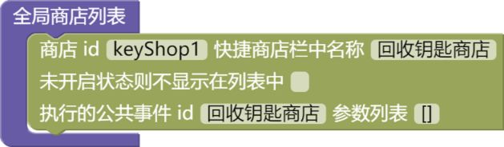

`id`, `textInList`, `mustEnable`和上述完全相同。

`commonEvent`为公共事件名，即选择此项时要执行的公共事件。

`args`可选，为向该公共事件传递的参数，参见[type:insert](#insert：插入公共事件或另一个地点的事件并执行)的说明。

从V2.6.4开始，自带了道具商店插件，您可以自由设置道具的价格、出售和回收价、进货数量、出现条件等。
## 系统引发的自定义事件
我们知道，所有普通事件都是需要定义在`"x,y"`处，并且得让用户经过或撞上才能触发的。

但是有一系列的事件，例如战斗、获取道具、开门等，是系统已经预先设定好的事件，我们如果将其覆盖触发器，原本的战斗等事件就会被覆盖。

为了解决此问题，在每个点的事件中引入了三个元素：`afterBattle`, `afterGetItem`, `afterOpenDoor`。
- 当某个战斗结束后，将执行`afterBattle`中，对应位置的事件。
- 当获取某个道具后，将执行`afterGetItem`中，对应位置的事件。您还可以指定该事件能否被轻按触发。
- 当开了某个门后，将执行`afterOpenDoor`中，对应位置的事件。

例如，下面就是一个典型的杀怪开门的例子。每当杀死一个守卫机关门的怪物，将检查是否满足打开机关门的条件。如果是，则开启机关门。
``` json
"afterBattle": { // 战斗后可能触发的事件列表
    "9,6": [ // 初级卫兵1
        {"type": "setValue", "name": "flag:door", "value": "flag:door+1"}, // 将"door"这个自定义flag加一
        {"type": "if", "condition": "flag:door==2", // 一个条件判断事件，条件是"door"这个flag值等于2
            "true": [ // 如果条件成立：打开机关门
                {"type": "openDoor", "loc": [10,5]}
            ],
            "false": [] // 如果条件不成立则无事件触发
        },
    ],
    "11,6": [ // 初级卫兵2；注意由于打怪顺序问题，可能都得写一遍。
        {"type": "setValue", "name": "flag:door", "value": "flag:door+1"}, // 将"door"这个自定义flag加一
        {"type": "if", "condition": "flag:door==2", // 一个条件判断事件，条件是"door"这个flag值等于2
            "true": [ // 如果条件成立：打开机关门
                {"type": "openDoor", "loc": [10,5]}
            ],
            "false": [] // 如果条件不成立则无事件触发
        },
    ], // 从V2.6.4起，提供了右击快速绑定机关门的操作，绑定以后，战后事件只负责累加杀怪数，
}, // 而判定杀怪数是否足够、以及开门的操作则由机关门处的自动事件执行
```

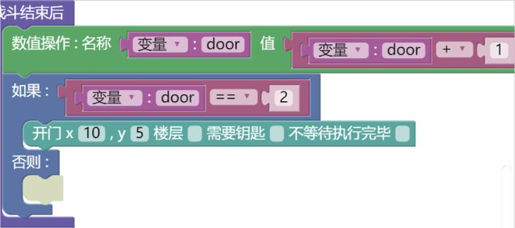

!> 多个机关门请分别设置开门变量如door1, door2等等。请勿存在两个机关门用相同的变量！

除此以外，每层楼还提供了`firstArrive`和`eachArrive`事件，分别为首次到达该楼层和每次到达该楼层时执行的事件。

## 滑冰事件

从V2.6开始，滑冰事件被重写。现在的滑冰由公共事件执行。

在新版本中，冰面应该放在背景层上，上面可以放置道具、怪物、门等图块。

角色走上冰面后，将一直向前滑行，直到撞上不可通行的图块，或触发事件为止。

如果撞上怪物将自动进行战斗，此战斗是强制的，打不过将直接死亡。

默认情况下，拾取冰面上道具后将停止滑冰行为。如果要继续滑冰，请在`afterGetItem`中插入公共事件：滑冰事件。打怪和开门同理。

!> 滑冰图块的默认触发器是 `ski` ，您可以将别的图块也改为这个默认触发器并画在背景层，从而做出五颜六色的冰面。
## 推箱子事件
关于推箱子，存在三种状态：花（flower），箱子（box）和已经推到花的箱子（boxed）。

!> 推箱子的前方不允许存在任何事件（花除外），包括已经禁用的红绿事件或者重生怪。（会导致箱子消失）

推完箱子后将触发脚本编辑中的afterPushBox函数，你可以在这里进行开门判断。

``` js
////// 推箱子后的事件 //////
"afterPushBox" = function () {
    // 推箱子后的事件
	if (core.searchBlock('box').length == 0) {
		// 可以通过if语句来进行开门操作
		/*
		if (core.status.floorId=='xxx') { // 在某个楼层
			core.insertAction([ // 插入一条事件
				{"type": "openDoor", "loc": [x,y]} // 开门
			])
		}
		*/
	}
}
```

## 战前剧情

有时候光战后事件`afterBattle`是不够的，我们可能还需要战前剧情，例如Boss战之前和Boss进行一段对话。

要使用战前剧情，你需要在该点创建普通事件并覆盖触发器，然后在战前剧情后调用`{"type": "battle"}`强制战斗。

顺便一说，普通事件中还提供了是否显伤的勾选框，您可以不勾选，从而使该怪物在地图上不显示预估伤害。
``` json
{
    "trigger": "action", // 覆盖触发器
    "data": [ // 该点的自定义事件列表
        // ... 战前剧情
        {"type": "battle", "id": "xxx"}, // 强制战斗
        // ... 战后剧情；请注意上面的强制战斗不会使怪物消失，如有需要请调动{"type": "hide"}
    ]
}
```

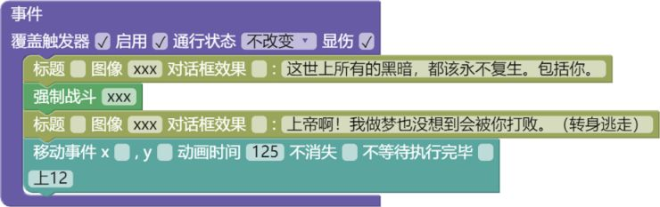

另外，从V2.6开始，脚本编辑中提供了战前事件`beforeBattle`，这里不再详细展开，如有需求可自行前往研究。

## 经验升级（进阶/境界塔）

本塔也支持经验升级，即用户杀怪获得经验后，可以到达某些数值自动进阶，全面提升属性。

要经验升级，你需要在全塔属性中同时勾选“显示等级称号”、“显示经验值”、“开启自动进阶”。

同时，你还需要在全塔属性中的 `levelUp` 来定义每一个进阶所需要的经验值，以及进阶时的效果。
``` json
"levelUp": [ // 经验升级所需要的数值，是一个数组
    {"need": "0", "title": "", "action": []}, // 第一项为初始等级，仅title生效
    // 每一个里面可以含有四个参数 need, title, clear, action
    // need为所需要的经验数值，可以是个表达式。请确保need依次递增
    // title为该等级的名称，也可以省略代表使用系统默认值；本项将显示在状态栏中
    // clear如果为true则自动扣除经验
    // action为本次升级所执行的事件列表
    {"need": "20", "title": "第二级", "clear": true, "action": [ // 加上clear则自动扣除经验
		{"type": "setValue","name": "status:atk","value": "status:atk+10"}, // 攻击+10
        {"type": "setValue","name": "status:def","value": "status:def+10"}  // 防御+10
    ]},
    {"need": "40", "effect": [
        {"type": "tip", "text": "恭喜升级"}, 
    ]},
    // 依次往下写需要的数值即可
]
```

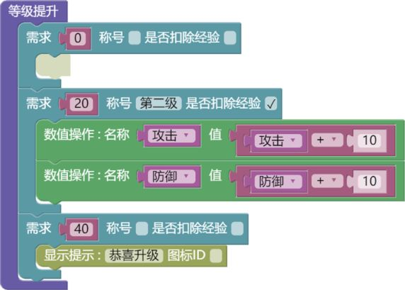

`levelUp`是一个数组，里面分别定义了每个等级的信息。里面每一项有三个参数`need`, `title`, `effect`
- `need` 该等级所需要的经验值，可以是个表达式。请确保数组中的need依次递增。
- `title` 该等级的名称，比如“佣兵下级”等。该项可以忽略，以使用系统默认的等级。该项将显示在状态栏中。
- `clear` 是否扣除经验。如果此项为true，则升级时自动扣除经验。
- `action` 为本次等级要执行的事件流。

## 开始游戏与难度分歧
游戏开始时将调用全塔属性中的 `startText` 事件，我们可以修改它的内容来对于不同难度分别设置初始属性。

其中 `core.status.hard` 为全塔属性“难度分歧”二维数组的第二列（四个单词），会以红色显示在状态栏一角。
``` json
////// 不同难度分别设置初始属性 //////
"startText": [ // 根据难度分歧设置<变量：hard>并给其他初始值
    {"type": "switch", "condition": "core.status.hard", "caseList": [
        {"case": "'Easy'", "action": [ // 可以在这里修改初始道具或属性，比如赠送黄钥匙等
        {"type": "setValue", "name": "flag:hard", "value": "1"},
        {"type": "hide", "loc": [[6,6]], "floorId": "MT10"} // 简单难度删除主塔10层中央的图块
    ]},
    {"case": "'Normal'", "action": [
        {"type": "setValue", "name": "flag:hard", "value": "2"}
    ]},
    {"case": "'Hard'", "action": [
        {"type": "setValue", "name": "flag:hard", "value": "3"}
    ]},
    {"case": "'Hell'", "action": [
        {"type": "setValue", "name": "flag:hard", "value": "4"}
    ]}
  ]}, // 初始剧情
  "Hi，欢迎来到 HTML5 魔塔样板！\n本样板由艾之葵制作，可以让你在不会写任何代码\n的情况下也能做出属于自己的H5魔塔！",
  "这是游戏开始时的剧情。\n你可以在这里写上自己的内容。\n赶快来试一试吧！"
]
```
`flag:hard` 为计榜难度系数，即在线游戏排行榜中只统计此值最大且有人通关的难度。游戏过程中请勿二次修改它。

==========================================================================================

[继续阅读下一章：个性化](personalization)
