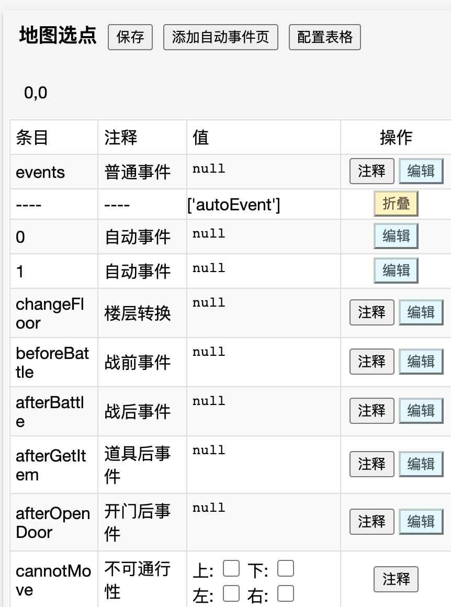
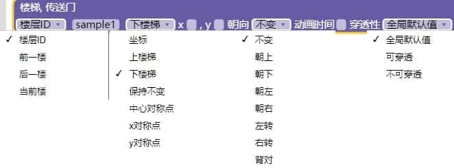
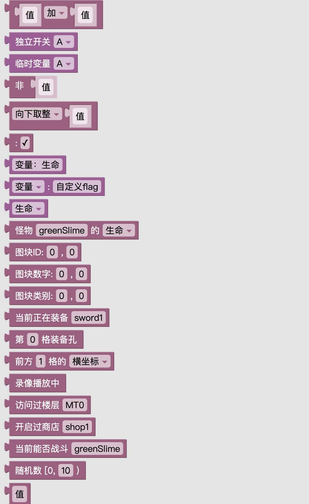

# 事件

?> 在这一节中，让我们来了解事件系统的基本原理

## 事件编辑（地图选点，快捷键X）



样板所有的事件都是依靠“触发器”完成的。例如，勇士踩到（绑定好的）楼梯可以触发changeFloor，碰到门可以触发openDoor，碰到怪物可以触发battle，踩到/轻拾道具可以触发getItem，推到箱子可以触发pushBox，走上冰面（背景层）可以触发ski.

这些触发器都是系统自带的（称为系统事件），已经存在处理机制，不需要我们操心。我们真正所需要关心的，其实只是自定义的事件（如NPC）。

地图选点（快捷键X）一共有八项，在地图中以图块左下角用八色小方块标记。

* **红色：**普通事件，也包括该点的一些特效。
* **橙色：**自动事件，可以设置为“仅执行一次”、“仅在本层检测”。
* **暗绿色：**战前事件，强制战斗时不触发。
* **黄色：**战后事件。
* **亮绿色：**楼层转换，可以设置为“可穿透”。
* **青色：**获得道具后事件，可以设置为“轻按时不触发”。
* **靛色：**不是事件，为勇士站在该点不能朝哪些方向走。
* **紫（粉）色：**开门后事件。

此外还有一些事件不在地图上，如“首次/每次到达”（这两个的触发原理，详见“脚本编辑——切换楼层后”）、“道具效果”、“碰触事件”、“（批量）战前/战后事件”、“公共事件”和全塔属性中那五个事件。

### 事件的机制

地图上的所有事件都存在两种状态：启用和禁用。

* 启用状态下，该事件才处于可见状态，可被触发、交互与处理。
* 禁用状态下，该事件几乎相当于不存在（默认可以被阻击怪和箱子推上去），不可见、不可被触发、不可交互，只能通过“插入事件”指令远程调用。

所有事件默认情况下初始都是启用的，只有普通事件可以通过不勾选“启用”来初始隐藏。

在事件列表中使用“显示事件”和“隐藏事件”可以将一个禁用事件给启用，或将一个启用事件给禁用，甚至直接从地图中删除。

**【重要警告】：**
1.  打怪开门捡道具后，如果有对应的坐标，则该点的事件会被从地图中删除（重生怪除外，它只会被暂时隐藏）。然后会尝试执行该点的战后事件、开门后事件或（拾获）道具后事件（您可以勾选“轻按时不触发”）。如果执行，则“当前点坐标”（`core.status.event.data`的坐标）也会变为该点。
    * 所以，这三个XX后事件，其实是有可能被多次触发或意外触发的（如打死或炸掉某个有战后事件的怪，推了个阻击怪过去打死），请自行注意。
2.  “移动事件”（如阻击和捕捉）和“跳跃事件”（如支援）会将起点处的事件从地图中删除，如果不勾选“不消失”（如阻击），则会在终点处“转变图块”并“显示事件”。但事件的内容不会被跟着移动到终点，推箱子同理，但在终点只转变图块而不予显示。

### 楼梯、传送门事件



当您在地图上绘制楼梯、或绘制四种三帧箭头并右击绑定后，就创建了一个“楼层转换”事件，您可以在事件编辑器右侧看到一行代码（json），请注意对照。

此事件与`core.changeFloor(floorId, stair, heroLoc, time, callback)`函数相对应，只是多了一项“穿透性”。

每个这样的事件都是上图的写法，下面逐一讲解其各项的含义和用法：

1.  **目标楼层（floorId）：**如题，如果选择了“楼层ID”就需要在第二个框中输入目标楼层的ID（会自动提示补全，也可以双击整个紫色块从地图选点）。如果选择了其他三种，则json代码中`:before`、`:next`、`:now`分别表示“前一楼”、“后一楼”（顺序由“全塔属性——楼层列表”指定，上下楼器同理）和“当前楼”，函数中也是一样的写法。
2.  **目标位置（stair）：**如果选择了“坐标”则需要在后面两个框里输入（同样可以地图选点，在函数中则将`stair`填`null`并填写`heroLoc`），也可以选择下拉框中的其他几项（在函数中则将`heroLoc`填`null`），如保持不变（`:now`）、中心对称（`:symmetry`）、左右对称（`:symmetry_x`）、上下对称（`:symmetry_y`）或任何一个图块ID.
    * 填写三种对称位置时请注意，坐标计算以【当前楼层的勇士】位置（对不可踏入的楼梯来说，这个位置与楼梯相邻而不重合）而不是目标楼层或该楼梯为准，注意防止勇士出界。
    * 填写图块ID时请注意，“上下楼梯”和“楼传落点”提供在了下拉框中，实际传送时会优先尝试取用目标层的“楼层属性——上下楼点”。其次尝试像其他ID（必须写在右侧的json区再点击解析）一样从目标楼层搜索，因此请确保该图块在目标楼层中存在且唯一。
3.  **朝向：**有八种写法，可以直接填写改变后的朝向（`up, down, left, right`），也可以填写转身的角度（`:left, :right, :back`）或不变。
4.  **动画时间：**指黑屏的毫秒数，可以填0或不小于100的整数，不填则使用玩家设定值。
    * V2.8起，楼层切换的音效被延迟到了“屏幕完全变黑”的瞬间（脚本编辑——切换楼层中）才播放，以方便作者根据条件设置不同音效，因此上下楼时间建议尽量缩短。
5.  **穿透性：**见[系统开关](start)允许穿透楼梯。

值得注意的是，绑定了楼层转换事件的门、怪物、道具、箱子，其系统行为（开门、战斗、拾取、推行）将不再发生（阻激夹域等地图属性不受影响），而是被覆盖为上下楼。

## 普通事件（红）

普通事件在启用后可以被勇士碰触而触发，它们都有着这样的开头：
```
覆盖触发器(Y/N) 启用(Y/N) 通行状态(Y/N?) 显伤(Y/N)
V2.8新增：不透明度(0~1) 虚化 色相(0~359) 灰度(0~1) 反色(Y/N) 阴影
```
1.  **覆盖触发器：**如前所述，门、怪物、道具、箱子都已经被绑定了系统触发器。如果您需要让地图上的个别这类图块在被勇士碰触时不发生系统行为（开门、战斗、拾取、推行），而是执行您在下面自定义的事件（比如需要制作一个“怪物中的叛徒”，它虽然有显伤但其实是个npc），请勾选此项。（阻激夹域捕捉支援等地图属性不受影响）
2.  **启用：**如果不勾选此项，则此事件初始时是隐藏的。
    * 非常不推荐仅仅为了初始隐藏一些图块（如战利品、陷阱门墙、埋伏怪等）就去绑定一堆没有指令的普通事件。
    * 更安全的做法是“从0转变图块”（支持淡入效果）和“关门”（这样还有音效，多香）。
    * 事实上，除“覆盖触发器”外，其余所有参数本不该作为“普通事件”的一部分而应该移出去放在表格中，这是样板的历史遗留问题。
    * 如今V2.8加入了六项特效，可能导致无指令的普通事件越来越不可避免，请自行注意。
3.  **通行状态：**除怪物和道具外，所有图块本身都具有“可通行性”属性。
    * 您可以设置此项去覆盖地图中这一点的可通行性，譬如强行让一格空地不可通行，勇士撞击时出现一堵墙（51层魔塔第23层的效果）。
4.  **显伤：**在对怪物使用覆盖触发器后，表面上看不出它和一般怪物的不同。
    * 如有必要（比如触碰这怪物根本不战斗），可不勾选显伤以示区别。
    * 如数量较多，可注册一个相同素材的NPC，比如样板中的仙子。
    * 如需在一段剧情中关闭所有显伤，可以简单地暂时移除怪物手册
5.  **不透明度：**如题，0表示完全不透明，1表示完全隐身。可以设为1用来配合楼层贴图实现大型怪物，或者设为半透明来表示灵魂等状态的角色。本属性可以在事件中用指令动态修改，支持渐变。
6.  **虚化：**必须为自然数，设定后图块会变模糊，可以用来配合快速移动/跳跃来表示幻影状态的角色。不建议对多帧图块长时间使用，因为会随着不断的抖动把周围越描越黑。
7.  **色相：**必须为0～359的整数，180表示互补色。常用于npc以避免过于单调，也可以在游戏的教学环节用此项高亮强调部分图块。
8.  **灰度：**如题，1表示完全变灰，必要时可以全图变灰来表示回忆/梦境/濒死等场合。
9.  **反色：**勾选后此图块将反色，必要时可以全图瞬间反色来表示惊吓。
10. **阴影：**必须为自然数，设定后图块周围将出现阴影描边，在草地上效果更佳哦。

可以使用`core.setBlockFilter`更改任何一点的最后五项特效。

## 自动事件（橙）

在“右键绑定机关门”中，我们已经初见了自动事件的端倪。

在游戏中，我们经常需要监听大量乱七八糟的状态，根据状态的变化去做出及时的处理，比如勇士生命小于等于0会触发游戏失败。比如51层魔塔第39层监听9扇黄门的状态来触发中心对称飞行器的出现、第49层监听8名魔法警卫的状态来封印假魔王。

如果给9扇黄门都绑定类似的开门后事件、给8名警卫都绑定类似的战后事件，就非常繁琐。

而自动事件则不然，它不需要您去主动考虑所有“改变状态”的原因，而是简单地在每次刷新状态栏时，检查是否满足触发条件，满足的话就执行。

每个自动事件具有以下几个属性：

1.  **触发条件：**自动事件最重要的属性，为支持“冒号缩写量”的逻辑表达式。
    * 譬如上述两个例子中，触发条件就是“某两个点没有图块而某7个点图块为黄门”和“某四个点没有图块而某四个点图块为魔法警卫”。
    * 关于冒号缩写量，详见下面的“值块和冒号缩写量”。
    * V2.8起，自动事件的触发条件和“值块”支持多行编辑（eval时会忽略\n）。
    * 因此高级作者可以将此条件写成无名函数，这样就可以在里面使用var进行复杂的多步计算了。
2.  **优先级：**一般不需要改动。当多个自动事件的条件同时满足时，优先执行此级别较大的。
    * 此级别也相等时，允许跨层触发则优先执行楼层较矮的。
    * 同一楼层优先执行横坐标较小的，横坐标相等时优先执行纵坐标较小的，同一点处优先执行页码较小的。
3.  **仅在本层检测：**如题，一般不需要改动。除非您要制作一些全局的效果，如“勇士生命低于上限的1/3时改变背景音乐”。
    * V2.8起，即使不勾选此项，也不会在分区砍层模式下触发冻结状态楼层的自动事件！
4.  **事件流中延迟执行：**勾选此项后，在执行其他事件时触发此自动事件则会将其内容追加到待执行事件的末尾，否则插队到待执行事件的开头。
5.  **允许多次执行：**如果不勾选，则此事件最多只会被触发一次。即使勾选了，每次执行的过程中也会暂时禁止自己被触发。勾选后，请记得在此事件的指令中将条件变得不满足。

每个点初始提供了两个自动事件页，您还可以再在数据区最上面单击“添加自动事件页”。

## 公共事件（逗号键）

有几个事件，如战后加点、回收钥匙商店，会在战后脚本或全局商店等处频繁用到。于是它们被整理成了公共事件，您也可以追加自己的。

公共事件在内容上和其他事件并无不同，只是在插入公共事件时（如`core.insertCommonEvent("回收钥匙商店",[...])`）可以提供一个`参数列表`。

参数列表是一个一维数组，其每项会被依次代入`core.status.hero.flags.arg1、arg2、……`，而`arg0`则会记录公共事件的中文名。

在整个事件流结束后（即勇士恢复行动，请注意不是公共事件结束后），这些以arg加纯数字命名的变量、以及以@temp@开头的临时变量都会被清空。

## 滑冰事件

滑冰（ski）是一个非常特殊的触发器，使用此触发器的图块需要画在背景层。

冰上可以画门、怪物、道具等任何图块，您还可以在前景层画上四种单向通行箭头（样板1层右下方那些）或红线薄墙（素材区第一列最下方那些），把三个图层的游戏性都发挥出来。

勇士走上冰面后，将一直“前进一格或撞击”。直到滑出冰面或无法再前进，如撞到墙或事件。

比如撞到怪物会强制战斗，打不过直接游戏失败。走到道具上会捡起来，撞到门则要看有没有钥匙，有的话会把门打开。V2.7.3起，踩到致命领域会死亡而不是停在前一格。

默认情况下，触发事件后勇士会停下来。如果要继续滑冰，可以在这些点的战后事件、开门后事件、（拾获）道具后事件（这里最好勾选“轻按时不触发”）中判断勇士还在不在冰上（`core.onSki()`函数），在冰上的话就命令“勇士前进一格或撞击”。

## 事件编辑器


当您从数据区单击任何一个事件类属性的“编辑”按钮时，就会呼出事件编辑器，上图给出了事件编辑器的全貌。

图中左下角为指令类别，可以点击它们呼出各类指令菜单，如左上方的值块菜单。

中央为指令区，被一个标识事件类型的紫色块包覆（即左下角的“入口方块”，图中为开门后事件），所有的指令都塞在里面。

右上角为json区，会随着指令区的编辑而自动变化。`core.insertAction()`函数的自变量就是它们，所以学有余力的话也建议您经常左右对照去了解每个指令对应的json写法。

右下角为调色器，当您单击指令块中的颜色按钮时（如图中“画面闪烁”指令的白块）就会自动呼出，可以进行诸如十进制和十六进制颜色格式互转并预览等操作。

左上角为功能区，各功能的含义和用法如下：

1.  **确认（Ctrl+S）：**将指令区的指令组翻译为json写回表格和文件，并关闭事件编辑器。如果手动修改了json区却没有点击变黄的解析按钮，或指令区存在异步事件没有用“等待所有异步事件执行完毕”（图中第二条褐色指令）去等待，则单击确认按钮会弹窗警告。此时如果想放弃对json区的修改，请随便点一下指令区的一个块即可。
2.  **解析：**将手动修改后的json区翻译回指令组同步到指令区，一般用于跨作品复制事件，或长距离批量挪动和复制指令。此外，由于下拉框不支持任意输入（如新增的怪物属性、楼层切换的任意目标图块ID），所以也必须这样做。
3.  **取消：**放弃本次编辑，关闭事件编辑器，表格和文件会停留在打开事件编辑器前的状态。
4.  **搜索事件块：**当您想不起来需要的指令在哪个类别时，请使用此项，如输入“勇”字就会列出所有带有“勇士”一词的指令。
5.  **地图选点：**在编辑事件尤其是大篇幅事件的过程中，如果需要频繁保存并退出事件编辑器去浏览地图尤其是浏览别的楼层就很不方便。单击此按钮，您可以浏览所有楼层及其全景。通过点击地图去确认一个点的坐标，并复制任何一个楼层ID以填入需要的地方。需要填坐标的指令也可以直接双击其指令块从地图选点填入坐标和楼层，从而避免了肉眼数格子和手敲的麻烦和出错的隐患。
6.  **变量出现位置搜索：**您可以搜索所有以“变量：xxx”形式出现在事件中的变量的出现位置，形式必须是冒号缩写量，位置必须是事件而不是脚本。也就是说，`flags.xxx`和`core.insertAction([...])`中的变量都是搜索不到的。
7.  **开启中文名替换：**勾选此项后，“flag、status、item、switch、temp、global、enemy”等冒号缩写量的前缀以及怪物和道具的ID才会允许用中文在指令块中书写，如“变量、状态、物品、独立开关、临时变量、全局存储、怪物”。当然，json中还是只能用英文的。此外，如果您需要使用名称相同的道具或怪物，或在`${}`以外的文本中将上述几个词和冒号连用，则也可能需要关闭此功能以避免blockly和json互译出错。
8.  **展开值块逻辑运算：**在值块菜单中我们可以看到第一个就是二元运算块，但是它并不完整，比如没有位运算。因此如果解析的优先级与js的优先级不一致，请在表达式中适当的位置添加圆括弧，或取消勾选此项。

## 值块和冒号缩写量

值块并不能单独构成指令，但它们可以被嵌入数值操作、设置怪物属性和很多事件控制类指令。而冒号缩写量的用法就更多了，比如用于`${表达式计算}`和其他任何支持填表达式的地方。

值块大体上分为三种：勾选框与运算块、只读块、可读写块，其中后两类对应着冒号缩写量。

### 勾选框与运算块（附js比较运算大图鉴）

包括勾选框块（`true`和`false`两个逻辑常量）、否定运算块和二元运算块。

否定运算块（一个“非”字，脚本中写作一个叹号）会把`false、0、null、undefined、NaN`和空字符串”（以下简称广义`false`）变为`true`，而把别的量都变为`false`.

二元运算块包括四则运算、取余、乘方、比较运算和三种逻辑运算。

四则运算中，两个整数相除会得到小数，两个0的乘方会得到1（数学上无意义）。

八种比较运算中，四种比大小的运算如果两项中有一项是数字，就会把另一项也转换成数字去比，所以会出现这些：

`'2' < 10; 10 <= '10'; '10' < 2; null >= 0; null <= 0; 1/0 > 1/-0`


弱（不）等于（==和!=）非常难用，建议放弃，统一使用（不）等于（===和!==）。

`NaN`一般是`0/0`或字符串瞎做减乘除得到的，它跟谁都没有可比性，包括自己。

纯数字字符串（包括十六进制）和对应的数字，都是弱相等关系。如`'0x10' == 16`

数组和对象，跟自己都是既大于等于又小于等于的关系（因为不是同一个）。

单个数字（或什么都没有）用方括号还是引号括起来，对外的比较行为都一致。

`undefined`倒是不用担心，它除了和`null`弱相等外，和其他值都没有可比性。

三种逻辑运算的原则是，“且”的优先级高于“或”，它俩都不满足交换律。

若干个由“且”（&&）连起来的量中，取第一个广义`false`（没有则取最后一个量），

若干个由“或”（||）连起来的量中，取第一个不是广义`false`的量（没有则同上），

若干个由“异或”(^)连起来的`true`或`false`，总结果取决于其中`true`的个数的奇偶，奇数个`true`则总结果为1，偶数个`true`则总结果为0.

所以样板中充斥着形如`x=x||y`和`z=x||y`的代码，y算是x的默认值。

这种做法并不安全，如果您的作品不打算发布到我们的`h5mota.com`，则更建议使用`x??y`，它只会在“x为`null`或`undefined`时”才用y代替x。

双问号运算在早期浏览器并不被支持，因此如需在我们的站点发布则需要写`if(x==null){x=y;}`。

再次强调，广义`false`不一定和`false`弱相等（比如`null`），而和`false`弱相等的也不一定是广义`false`（如`[]==![]`）。

V2.7.3起，一元运算块追加了一些数学函数，如四种取整、开平方、绝对值。还追加了“变量类型”(typeof)，只有两个类型相同的变量才有可能满足“相等”（===）。

V2.8起，二元运算块追加了一些js函数，如“取较大/较小”（`Math.max`和`Math.min`）、“开始于/结束于”（字符串的`startsWith`和`endsWith`）、“包含”（数组和字符串的`includes`），进阶作者可以学习使用。
### 只读块（怪物属性、图块ID、图块类别、装备孔）

尽管这几个值块是只读的，但您仍然可以使用“设置怪物属性”、“穿脱装备”和“转变图块”等指令去改变它们。

1.  **怪物属性：**冒号缩写量写作`怪物：绿头怪：生命`，json代码中写作`enemy:greenSlime:hp`。怪物名称有重复的话可以在事件编辑器顶部关闭中文替换功能，道具名称同理。
    * 常见的怪物属性都提供在了下拉框中，如果下拉框里没有（如通过配置表格新增的属性），可以修改`_server\MotaAction.g4`文件最后的那些表来追加其中文简称，也可以放弃解析回中文块而是就用缩写量。
    * V2.8起，怪物支持“行走图朝向”绑定，此值块将始终获取脸朝下的怪物属性。
2.  **图块ID：**冒号缩写量写作`图块ID：x,y`，json代码中写作`blockId:x,y`。请注意逗号始终要用英文的，此值块实际直接调用的API为`core.getBlockId(x,y)`，即本值块和对应的冒号缩写量只支持本层，可以获知本层某个点的图块ID.
3.  **图块数字：**冒号缩写量写作`图块数字：x,y`，json代码中写作`blockNumber：x,y`。同上，实际调用`core.getBlockNumber(x,y)`，可以获知本层某个点的图块数字。
4.  **图块类别：**冒号缩写量写作`图块类别：x,y`，json代码中写作`blockCls:x,y`。同上，实际调用`core.getBlockCls(x,y)`，可以获知本层某个点的图块类别。
    * V2.8起，这三个值块中的坐标支持填写表达式，会在json区直接翻译为API调用，但这样填写也意味着无法再解析回值块，而且本质上这已经不是冒号缩写量了，不能直接用于${表达式计算}等场合。
5.  **第n格装备孔：**冒号缩写量写作`装备孔：n`，json代码中写作`equip:n`。实际调用`core.getEquip(n)`，可以获知勇士第n个装备孔中的装备ID，n从0开始！

### 可读写块（status、item、flag、switch、temp、global、buff）

比起只读块，可读写块允许作为“数值操作”指令的左块：
1.  **状态：**冒号缩写量为`状态：生命`等，json代码中写作`status:hp`等。
    * 作为左块时会调用`core.setStatus()`，其他时候会调用`core.getStatus()`
2.  **物品：**冒号缩写量为`物品：炸弹`等，json代码中写作`item:bomb`等
    * 作为左块时会调用`core.getItem()`或`core.setItem()`，其他时候会调用`core.itemCount()`来统计背包中的道具数量。
    * 此外，最常用的一些勇士状态（包括坐标和朝向）、三色钥匙、三围增益都提供在了下拉框中。您可以修改`_server/MotaAction.g4`文件最后的`FixedId_List`来追加，向“楼层转换”、“门信息”和“装备属性”的下拉框追加新的楼梯ID、钥匙ID和勇士状态名也是一样的道理，当然不追加也不影响手写（如果指令只提供了下拉框版本，那就必须写在json区再解析）。
3.  **变量：**冒号缩写量为`变量：hatred`等，json代码中写作`flag:hatred`等。
    * 作为左块时会调用`core.setFlag()`，其他时候会调用`core.getFlag(’xxx’, 0)`
    * 请注意：变量类型支持中文，如`变量：开门个数`
    * 这两个API实际操作的就是前文多次提到的`core.status.hero.flags`，只不过在事件中未定义的变量都视为0，更为安全。
    * 如果您忘记了自己在哪些事件用过哪些变量，请善用事件编辑器顶部的“搜索变量出现位置”。
4.  **独立开关：**如果您有一大批NPC都具有“首次对话不同于之后各次对话”之类的特点，那么为他们设置一大批不重名的变量就很繁琐。独立开关（叫独立变量更准确）就是为这种场合而生的，它对每层楼（首次到达和每次到达中）和每个坐标都是独立的。
    * 冒号缩写量写作`独立开关：A—Z`，json代码中写作`switch:A—Z`。
    * 每个坐标处的独立开关有26个，用大写拉丁字母A—Z表示。MTn层（x，y）点的独立开关A，本质上是一个flag变量——`flag:MTn@x@y@A`，如果需要在其他点访问，就需要用这样的写法。
    * 首次到达/每次到达楼层的事件中，上述x和y会保留小写字母而不代入任何数字。
    * 标题事件/开场剧情中，前缀的“楼层ID”视为“`:f`”。
    * 可以在事件编辑器左侧菜单的“常用事件模板”中看到一个仿51层/新新魔塔的一次性商人的例子。
5.  **临时变量：**冒号缩写量写作“临时变量：A—Z”，json代码中写作`temp:A-Z`，
    * 临时变量泛指所有以`@temp@`开头的flag变量，一共也有26个。
    * 临时变量一般用于计数循环和数组迭代，每当事件流结束（勇士恢复行动）时，临时变量和参数变量（以arg+纯数字命名）都会被清空。
    * 全局商店状态下，临时变量`@temp@shop`会被启用，从而实现长按连续购买等操作。
    * 上面提到的“一次性商人”模板中多次出现出售数量和价格常数，如果使用临时变量就很方便，不需要修改多个地方了。
6.  **全局存储：**冒号缩写量写作`全局存储：xxx`，json代码中写作`global:xxx`，
    * 和变量一样，冒号右侧本身支持中文。全局存储一般用来保存一些跨存档的信息，如成就系统、回想和音像鉴赏的收集进度、多周目数据等。
    * 用于左块时会调用`core.setGlobal()`，其他时候会调用`core.getGlobal()`。
    * `core.setGlobal()`在录像中会被忽略，`core.getGlobal()`在正常游戏中会将读取到的值写进录像，而在录像播放中直接读取这个写进去的值，从而复原了那次游戏时的样子。
    * 然而，由于`core.getGlobal()`的调用频率在正常游戏和录像播放中可能不一致，因而可能会导致录像中的记录次数过多、过少或位置不合适。
    * V2.8对这个问题进行了一定的修复，请放心使用。
7.  **增益：**冒号缩写量写作`增益：生命上限`等，json代码中写作`buff:hpmax`等，冒号右侧支持自定义的勇士新属性英文名。
    * 用于左块时会调用`core.setBuff()`，其他时候会调用`core.getBuff()`。
    * 增益这个概念在前面讲解装备属性时提到过，所有的百分比装备和百分比衰弱都是靠它发挥作用。
    * `buff:xxx`本质上就是`flag:__buff_xxx__`，但前者更安全（默认值为1）。

## 随机数（扩展内容，了解即可）

此外，V2.8还新增了几个样板API的值块，包括“当前是否身穿某装备”、“当前是否在录像播放中”、“是否到达过某楼层”、“是否开启了某全局商店”、“能否打败某怪物”、“勇士面前第n格的坐标（负数表示身后）”、“随机数”。

样板包括两种随机数，一种是上面说的值块提供的`core.rand(n)`，会得到小于正整数n的随机自然数，n不填则会得到小于1的随机正小数。

一种则是`core.rand2(n)`，同样会得到小于n的随机自然数，n必须填正整数，不要省略！

rand本质上是`flag:__rand__`不断一步步推进的结果，初始值为`flag:__seed__`，初始值（又叫随机种子）和游戏难度可以在标题画面通过`core.startGame(hard,seed)`函数指定（如果开启了标题界面事件化，则该函数还必须作为游戏重启函数`core.hideStartAnimate()`的回调来使用，但这样只能指定种子），种子必须为正整数。

rand2则是通过js自带的`Math.random()`函数得到的真随机小数经过整数化处理的结果，会被直接写入录像（`random:n`），因此多次调用会导致录像（和存档）变得很庞大。而且正因为是写入录像，所以玩家也可以直接编辑录像文件或`core.status.route`来控制随机的结果。

直观地说，rand的结果只和它的调用次数有关，因此玩家不能通过简单的SL操作来优化结果，必须调整路线或干脆重开游戏。

而rand2的结果可以通过SL来改变，如果需要连续大量使用“可被SL改变的随机数”（期间不能存档）但又不希望录像变得太庞大，可以先在存档后使用一次`n=core.rand2(114514)`，再使用n次`core.rand()`来推进，效果就能让人满意了。（新新魔塔1就是这样的思路，每次撞怪时先自动存档然后生成n值，战斗中只使用rand）。

然而，如果rand和rand2的使用场合不当，那么其调用频率在正常游戏中和录像回放时可能不一致。rand会因为推进步数不一致而导致游戏流程发生变化，rand2则会导致录像中记录的随机数出现多余或缺失。

V2.8对rand2（以及“全局存储”、“弹窗输入”、“选择项”、“确认框”）的此问题进行了一定的修复，如果录像中出现了多余的随机数记录，就会在播放时跳过并在控制台警告，如果需要rand2但未记录或记录越界则会现场重新随机生成并补录。在V2.8之前这两种情况都会直接报错，而在V2.8中会导致首次播放结果的二次记录不一致，请不要惊慌，按R键从头再次播放一遍即可。

总之，不计入录像的纯观赏性的随机效果（如捡到某道具随机播放一个音效甚至随机指定音调高低，以及样板雨雪效果中的随机）建议直接用`Math.random()`实现（例如V2.8每次上下楼后会在楼层属性的背景音乐中随机播放一个）。

## 录像回放（扩展内容，了解即可）

魔塔具有时空离散性和完全可重复性，因此可以像棋类运动一样记录类似棋谱的东西，我们称之为【录像】。

正常游戏中，已录制的内容被保存在一维数组`core.status.route`中并不断从尾部延长，录像回放时，即将播放的内容会保存在一维数组`core.status.replay.toReplay`中并不断从头部缩减。

V2.8.1起，录像中勇士死亡将会报错并询问是否回到上一个节点，比起只能读取自动存档更为友好。

您可以在正常游戏中自由行动时随时按下R键进行回放，上述数组具体的内容含义如下：

```
up down left right 勇士向某个方向行走一步
item:ID 打开背包使用某件道具，如item:bomb表示使用炸弹
unEquip:n 卸掉身上第n件装备（n从0开始），如unEquip:1默认表示卸掉盾牌
equip:ID 打开背包穿上一件装备，如equip:sword1表示装上铁剑
saveEquip:n 将身上的当前套装保存到第n套快捷套装（n从0开始）
loadEquip:n 快捷换上之前保存好的第n套套装
fly:ID 使用楼传飞到某一层，如fly:MT10表示飞到主塔10层
choices:none 确认框/选择项界面超时（作者未设置超时时间则此项视为缺失）
choices:n 确认框/选择项界面选择第n项（选择项中n从0开始，确认框界面0表示确定，1表示取消），此项越界将报错。此项缺失的话，确认框将选择作者指定的默认项（初始光标位置），选择项将弹窗请求补选（后台录像验证中则选默认项）。
shop:ID 打开某个全局商店，如shop:itemShop表示打开道具商店。因此连载塔千万不要中途修改商店ID！
turn 单击勇士（Z键）转身
turn:dir 勇士转向某个方向，dir可以为up down left right，注意此项在正常游戏中无法随意触发。
getNext 轻按获得身边道具，优先获得面前的，身边如果没有道具则此项会被跳过。
input:none “等待用户操作事件”中超时（作者未设置超时时间则此项会导致报错）
input:xxx 可能表示“等待用户操作事件”的一个操作，也可能表示一个“接受用户输入数字”的输入，后者的情况下xxx为输入的数字。此项缺失的话前者将直接报错，后者将用0代替
input2:xxx 可能表示“读取全局存储（core.getGlobal）”读取到的值，也可能表示一个“接受用户输入文本”的输入，两种情况下xxx都为base64编码。此项缺失的话前者将重新现场读取，后者将用空字符串代替
no 走到可穿透的楼梯上不触发楼层切换事件，注意正常游戏中勇士无法随意停在旁边没有障碍物的楼梯上。
move:x:y 尝试瞬移到[x,y]点，注意正常游戏中勇士无法随意瞬移到相邻格，而回放时连续的瞬移操作将被合并。
key:n 按下键值为n的键，如key:49表示按下大键盘数字键1，默认会触发使用破墙镐
click:n:px:py 点击自绘状态栏，n为0表示横屏1表示竖屏，[px,py]为点击的像素坐标
random:n 生成了随机数n，即core.rand2(num)的返回结果，n必须在[0,num-1]范围，num必须为正整数。此项缺失或越界将导致现场重新随机生成数值，可能导致回放结果不一致！
作者自定义的新项（一般为js对象，可以先JSON.stringify()再core.encodeBase64()得到纯英文数字的内容）需要用(半角圆括弧)括起来。
```

[在线插件库](https://h5mota.com/plugins/)中提供了“录像自助精修”插件，手机也适用，可供研究。

开门打怪前会先转身再自动存档，因此该存档被读取后，已录制内容的最后一步将变成转身，导致录像变长，请自行注意。

==========================================================================================

[继续阅读下一章：事件指令](instruction)
