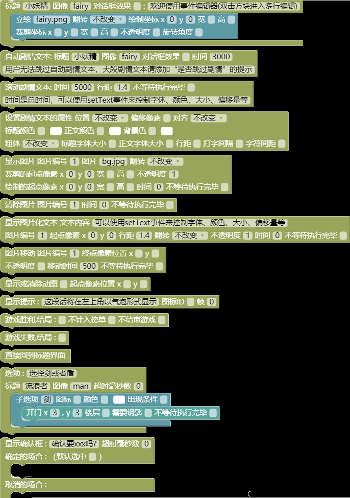
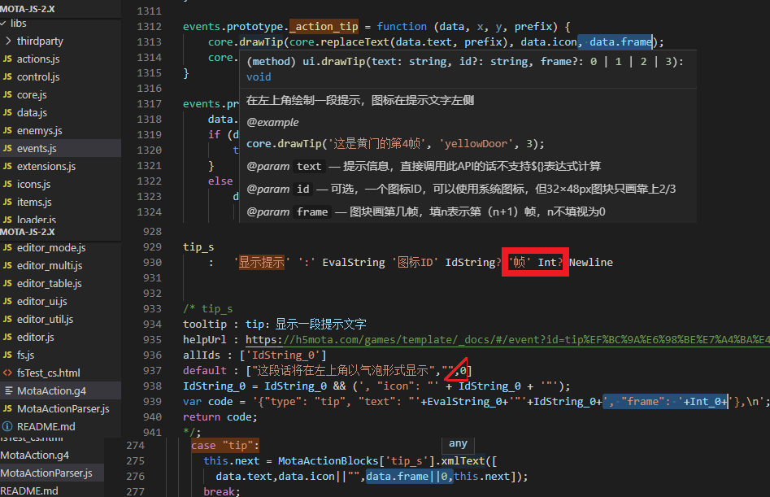
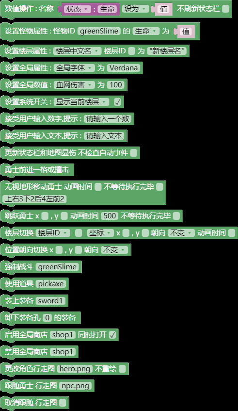
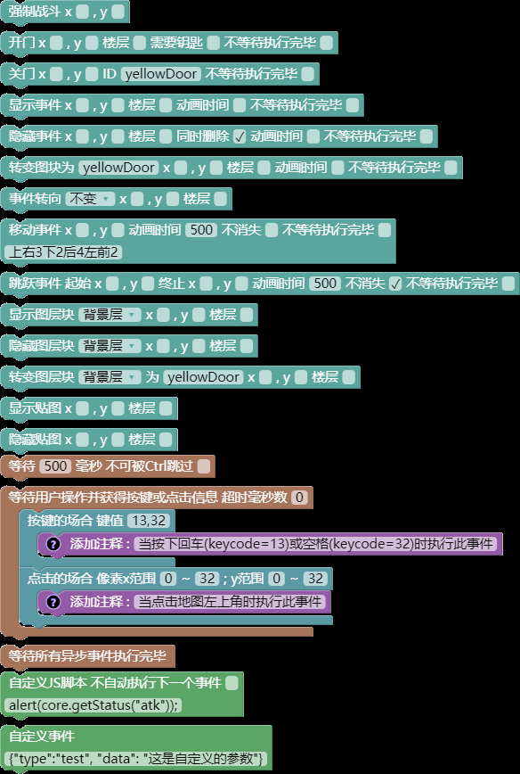
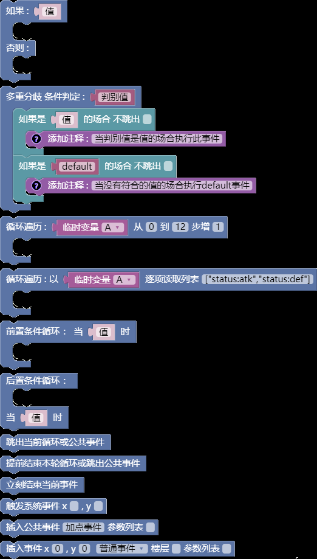
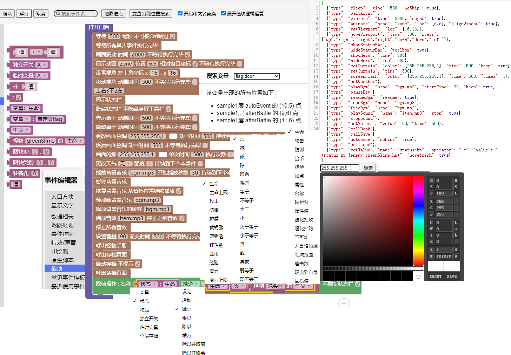
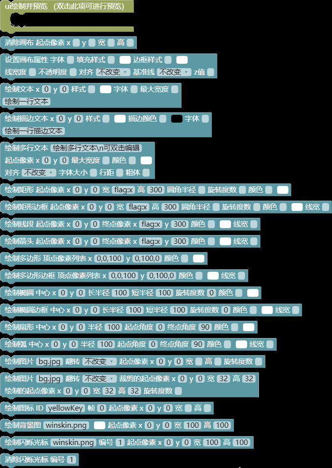
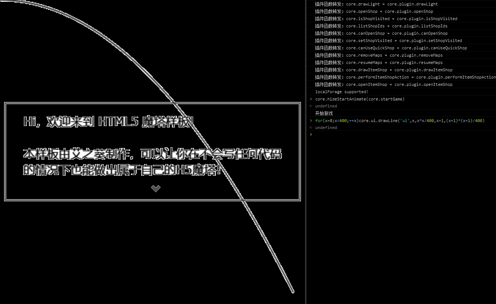

# 事件指令
?> 目前版本**v2.7**，上次更新时间：* {docsify-updated} *

本样板之所以敢宣称“零编程基础的您也能大展身手”，就是因为它搭载了强大的图形化json编辑器（blockly）。

熟悉Antlr语法的读者可以根据@zhaouv的另一篇文档去自行修改`_server\MotaAction.g4`等文件去扩展其功能。

json代码本身则可以作为core.insertAction()函数的自变量，去执行临时事件。

## 指令的分类（注意区分块的颜色和地图的七彩点）

尽管本章的标题暗示了事件指令和`core.events._action_xxx()`函数是一一对应的，但它们进一步调用的底层函数却分布在libs文件夹的不同文件中。

大致上，显示文字类（严格来说需要玩家操作的事件还涉及到actions.js）和UI绘制类在ui.js，数据相关类（这类也有不少道具相关在items.js）和特效声音类在control.js，地图处理类在maps.js，事件控制类（或许应该叫流程控制类）则在events.js，请注意区分libs和project的同名文件。

另一种分类方法则是按照同步和异步，分成以下几类：
1.  瞬间就能执行完的：如UI绘制、设置XX属性、显隐和转变图层块等。
2.  阻塞直到玩家操作的：如显示文章/选择项/确认框、接受用户输入、等待用户操作、呼出xxx等。
3.  阻塞一段固定时间的：如开关门、显示动画、移动跳跃、淡入淡出等。
4.  耗时但不阻塞的：如播放音效、显示提示等，会和后面的指令同时执行。

上述第3类指令都可以勾选“不等待执行完毕”（即前面提到的异步事件）变为第4类，从而实现诸如同步开关多个门的效果。

在json区，每条指令的格式为：`{"type": "xxx", "param1": ..., "param2": ..., ......}`，
实际执行的函数为`core.events._action_xxx(data, x, y, prefix)`

data为整个指令对象，x和y为当前点坐标，prefix为独立开关的楼层前缀。

您可以自行在libs\events.js中追加这样的函数，这样就可以自定义新指令啦。

如果需要把新指令做成像已有的指令一样有类别、名称、取色器、勾选框、下拉框、输入框等部件，请查阅@zhaouv撰写的另一篇文档。

## 显示文字类（黄色）
这个类别的指令会负责UI层图文的处理，如图片的移动和淡入淡出，游戏的胜败和重启等。
### 显示文章
最基本的就是最灵活的。本指令的讲解将占用大量篇幅，请做好准备。

上述函数中，第一个自变量为字符串数组或单个字符串，每个字符串为一段需要玩家按下确认键或点击屏幕才会消失的剧情文本，第二个自变量（可选）为全部文本消失后的回调函数。

每条显示文章分为五部分：标题、图像、对话框效果、正文、立绘。

写成一个字符串就是“\t[标题,图像]\b[对话框效果]\f[立绘]正文”。
1.  标题：可选，一般填说话人的名字。如果不填，则尝试根据图像取中文名（道具除外，如图像填hero但不填标题则以勇士名字作为标题）。还可以填null强制不显示标题。
2.  图像：可选，可以填hero（勇士行走图，如果勇士开了帧动画则会取当前朝向，但朝上会视为朝下）或任何图块ID，或者填this来尝试取当前点图块。也可以填一个png格式的图片文件名（需要后缀），甚至还可以填null来避免以图块ID为标题被解释成图像。
3.  对话框效果：可选，填法非常灵活，如下。
    1.  up,x,y：对话框显示在点（x，y）上方，尖角朝下指着这个点（绝对坐标，具体指的高度取决于图像。没有图像则判断该点是32×32px还是32×48px的图块，该点没有图块则没有尖角）。
    2.  down,x,y：对话框显示在点（x，y）下方，尖角朝上指着这个点。比起上面，这个没有高度问题，不过该点没有图块的话则还是没有尖角。

        上述两种写法中，如果把坐标换成hero则显示在勇士上方或下方。

        上方时如果没有图像则勇士高度视为32×32px.
    3.  this,x,y：在大地图中，点（x，y）可能位于视野上半部分也可能位于下半部分，写this就能让对话框自动适配上下来防止越界。
    4.  hero：在大地图上下边缘或小地图，勇士可能在上半或下半场，只写hero也能自动适配。
    5.  hero,n：n为正整数，显示给勇士的第n名跟随者，自动适配上下。
    6.  up,null：显示在屏幕最上方，同理up换成down则为最下方。
    7.  center：强制显示在屏幕中央，宽度为视野宽度。
    除最后两种外，其余写法都会给对话框进行宽度自适配：

    如果正文没有自动换行，则会先尝试取一个让文本总行数最接近“几行半”的宽度，可能会再适当加宽来防止标题出界。

    如果正文有自动换行，则会尝试连同标题在内取最长的一行作为宽度。

    最终绘制时会尽量让尖角居中，除非尖角所指的点实在太靠左或太靠右。

    值得注意的是，使用project\images\winskin.png或类似的图片作为文章背景时，尖角的绘制用的是用图片右下角64×32的两格进行的，所以往往需要您自己准备好。
4.  正文：双击指令块，进入多行编辑。正文中允许使用很多转义序列，当您键入一个\字符时就会提示补全，后面逐一介绍。
5.  立绘：显示文章的同时可以绘制一张或多张立绘图，请双击预览各张图的效果。每张立绘由一大堆参数组成：

\f[name(:x/:y/:o,sx,sy,sw,sh,)x,y(,w,h,alpha,angle)]
1.  文件名：需要放在project\images文件夹中并注册，这里需要带后缀。
2.  翻转：和楼层贴图一样，支持三种翻转，在json代码中以文件的后缀名之后追加“:x、:y、:o”来表示。
3.  绘制坐标：立绘在视野中的左上角像素坐标，后面的参数一旦省略其中一个则必须省略其后所有。
4.  绘制的宽高：立绘被伸缩后在视野中实际显示的宽高，必须同时填写，不填则不伸缩。
5.  裁剪坐标和宽高：必须同时填写，为从原图中裁剪区域的左上角坐标和区域宽高，不填则取全图。
6.  不透明度和旋转角度：可选，前者填一个不大于1的正数，请自行双击预览。

立绘是画在UI层的，下一个指令执行前就会擦除。如需持续显示请使用“显示图片”指令，另外立绘会被“图像”遮挡。
### 显示文章正文的转义序列
除变色和换行外，使用其余转义序列（`\\c, \\d, \\e, \\i, \\z`）时请注意：
1.  表达式计算：使用`${}`可以计算一个js表达式，式子中允许使用所有的冒号缩写量和API，详见core.calValue()函数。此语法也可以用于“道具描述”和“即捡即用提示”，只不过那里就不支持中文替换了。

    如“勇士当前的攻防相乘是\${状态：攻击\*状态：防御}”（中文替换），

    “持有三色钥匙共\${item:yellowKey+item:blueKey+item:redKey}把。”（json）
2.  局部文字变色：使用\r[颜色英文名]或\r[\#RrGgBb]（十六进制）来将这之后的文本变为另一种颜色。

    最常用的17种颜色提供了自动补全，十六进制颜色可以随便找个有颜色参数的指令，呼出调色器去自己调配。只使用\r不带方括号则变回默认颜色。
3.  局部字号调节：使用`\\c[正整数]`改变这之后文本的字号，只使用`\\c`不加方括号则恢复默认字号。
4.  手动换行、局部加粗和斜体：退出多行编辑后，手动换行写作\n，另外可以使用`\\d`将局部文本加粗或取消加粗，使用`\\e`将局部文本变为斜体或取消斜体。
5.  32×32px图标的绘制：使用`\\i[图标ID]`绘制一个32×32px的图块的第一帧或系统图标，您可以使用core.statusBar.icons查看所有的系统图标。
6.  打字速度调节：开启打字机效果后，文本的打字速度总是匀速的。

    所以样板提供了名为“时间占位符”的转义序列，使用`\\z[正整数]`可以暂停相当于打这么多个字的时间。

### 其他文字类指令

1.  自动剧情文本：和上面的显示文章基本相同，只不过不是由玩家按下确认键或点击屏幕，而是一定毫秒后自动消失，录像回放中则忽略。

    比起那个，这个不能通过长按Ctrl键或长按屏幕快进，大量使用时一般用来搭配语音。否则对魔塔这种快餐游戏来说可能会非常不友好，建议统一塞进“显示确认框”指令的场合之一。
2.  滚动剧情文本：将一段文字从屏幕最下方滚动到最上方，不支持自动换行，常用于op和ed.
3.  显示提示：即诸如打败怪物、捡到道具、打不开门时左上角的提示，只支持`${表达式计算}`。

    可以填写一个图标ID显示在提示文本的左侧（支持32×48px但只画靠上的2/3，也可以使用系统图标）。

    此指令对应core.drawTip(text, icon, frame)函数，这里text就不支持`${}`表达式计算了。自然数frame表示绘制第几帧，默认为0表示第一帧。

    帧参数在事件中默认没有提供，图中那个是小秋橙自己加的。加的方法也非常简单，在@zhaouv撰写的另一篇文档中有讲解。只不过那篇文档中的两个例子更为复杂，所以小秋橙决定在这里亲自讲一下这个例子。

    首先，事件编辑器和事件执行的原理是：
    1.  点击数据区表格的“编辑”按钮，如果这一项是json类型就会跳转到事件编辑器，并根据初始的json内容解析出初始的blockly指令块。

        这一步由`_server\MotaActionParser.js`完成，每次修改完json区点击变黄的“解析”按钮时也是如此。

    2.  拖拽拼接并填写blockly指令块，实时同步到json区。

        这一步由`_server\MotaAction.g4`完成，刚打开事件编辑器时初始解析出的指令块也会立即再同步到json区，所以可能和表格中看到的不一样。

    3.  最后，事件的执行就和blockly没有任何关系了。所有`{"type": "xxx"}`的事件都是由`libs\events.js的core.events._action_xxx(data, x, y, prefix)`函数执行的，其中data就是json指令对象。

    
    搞清楚这个以后，就可以开始动手修改了。首先打开上面所说的events.js，搜索`_action_tip`，鼠标悬停在其中的drawTip一词上，就能查看这个API的参数注解。可以看到有第三个参数frame没有使用，于是补上一项data.frame（蓝色选中区）。

    接下来要去修改`_server\MotaAction.g4`，搜索“显示提示”。可以看到指令块的参数有很多类型，比如EvalString（支持`${}`表达式计算的文本）、IdString（填写图块ID）、Bool（勾选框）、expression（值块）等，而我们需要的是类型是Int（整数）。

    于是补写在指令文本中，同时还要修改下面的default（默认模板）和最后的json拼接式子。

    这个式子比较难改，要注意双引号的匹配和冒号、逗号的位置。

    在这个例子中需要追加蓝色选中区以及两个红框中的内容。

    最后要去修改`_server\MotaActionParser.js`，搜索“`case "tip":`”，简单地追加蓝色选中区的内容。
4.  游戏胜败和重启：游戏胜败分别对应“脚本编辑”（快捷键N）的win和lose函数，在线游戏排行榜中每个结局的每个难度都有一张榜。

    但同一结局只有最高难度有效，您可以勾选“不计入榜单”来让这个本来有效的结局也无效。还可以勾选“不结束游戏”来先停止录制，再演出ed.

    重启游戏对应的函数为core.showStartAnimate()
5.  设置剧情文本的属性：

可用core.status.textAttribute获取当前的剧情文本属性（只读）。各项含义：
1.  位置：“显示文章”不使用\b对话框效果时文本的位置，默认为屏幕中央。如果您有大量集中的剧情文本都欲使用“up,null”的对话框效果，则可以直接将此项设置为“顶部”，而将剩余的个别剧情文本使用“center”或“down,null”的对话框效果，反之亦然。
2.  偏移像素：上面的“位置”选择“顶部”或“底部”时和屏幕上下边缘的距离，也作为滚动剧情文本和左边缘的距离。
3.  对齐：默认为左对齐，可以修改此项来让显示文章的标题和正文都居中或都右对齐。
4.  标题色：准确地说是“标题和图像边框色”，格式和楼层画面色调一致，可以点击调色器按钮呼出调色器调色。
5.  正文色：如题，修改方法同上，从而避免频繁使用\r进行局部文本变色。
6.  背景色：如题，修改方法同上。但比起前两个，这个也允许填写一个类似winskin.png的图片文件名。
7.  标题和正文字号：如题，正文字号推荐设置为偶数。
8.  行距和字符间距：如题，单位都是像素，行距推荐为正文字号的一倍半。
9.  粗体（Y/N）：文本是否默认加粗，推荐在大量粗体文本中穿插少量细体文本时使用，以免频繁的`\\d`切换。
10. 打字间隔：0表示不启用打字机效果而是一次显示完，正整数表示每打一个字的毫秒数，也作为`\\z`暂停的单位时间。

### 图片类指令

1.  显示图片：和立绘的语法基本类似，只不过多了编号（1—50）和淡入时间。

    可以双击预览效果，还可以勾选“不等待执行完毕”来和后面的指令同时执行，比如同时淡入两张图片，或者淡入一张同时淡出/移动另一张。

    编号较大的图片会遮盖较小的，1—24号图片会被色调层遮盖，25—40号图片会遮盖UI层，41—50号图片会遮盖UI层。

    此指令对应core.showImage()函数，编号真正的意义，详见“个性化”
2.  清除图片：如题，需要指定要清除的图片编号和淡出时间。

    此指令对应core.hideImage(code, time, callback)
3.  图片移动：其实还包括了透明度渐变，“终点像素位置”指移动结束后的图片在视野中的左上角像素坐标（不填则表示单纯的透明度渐变），“不透明度”指渐变结束后的新的不透明度（不填表示单纯的移动），移动和透明度渐变都是匀速直线进行的。对应`core.moveImage(code, to, opacityVal, time, callback)`
4.  显示或清除动图：需要填写动图的文件名（带.gif后缀），“起点像素位置”含义如前且必须填写，可以双击指令块来预览第一帧的效果。

    动图不支持淡入淡出和伸缩移动，如果不填任何参数则清除所有动图。

    该指令对应core.showGif(name, x, y)函数。
5.  显示图片化文本：这是您唯一显示镜像文字或旋转180°文字的机会。

    显示出来后就会视为一张通常的图片，可以被清除和移动。

    该指令对应core.drawScrollText(content, time, lineHeight, callback)

### QTE与全局商店

QTE，即快速反应事件。一般表现为需要玩家在收到某信号后尽快做出正确操作，如新新魔塔2中面对白银史莱姆王的猜拳战斗就需要根据其出拳的颜色尽快按下相克的数字键。

样板同样支持这类事件，一共有三种，这里先介绍两种。

一是“显示确认框”，它会显示一段支持`${表达式求值}`但不支持自动换行和其他转义序列的文字。然后要求玩家在一定毫秒数内选择“确定”或“取消”之一，如果超时就视为哪个都没选，直接继续执行后面的事件。\
您可以指定闪烁光标的初始停留位置是确定还是取消，还可以指定超时毫秒数为0表示不限时间但玩家必须做出二选一。

此指令对应core.drawConfirmBox(text, yesCallback, noCallback)函数，其中两个Callback分别为选择确定和取消后的回调函数。

二是“显示选择项”，和RPG Maker不同，我们的选择项不会和它之前的“显示文章”同时出现，可以直接配上除对话框和打字机外的所有文字效果。

此指令对应core.drawChoices(content, choices)函数，其中content为提示文字，choices为各子选项文字组成的字符串数组。是的，比起上面的函数，这个不直接支持回调。

在没有提示文字的情况下，一次能同时显示的子选项最多为13或15个。

和确认框一样，选择项的超时值填0表示不限时间但玩家必须从中选择一个。

大于0的话超时视为什么都没选，直接继续执行后面的事件。

每个子选项的文字只支持`${表达式求值}`和整行变色，请注意控制字数。

文字左侧也支持追加一个图标（多帧图块取第一帧），支持系统图标。

每个子选项还可以指定“出现条件”（不指定则一定出现），条件的写法和自动事件的触发条件一样，从而做出形如“怒气值满才显示大招选项”的效果。

如果实际执行时所有子选项都不满足出现条件，则直接跳过。

当然，如果非要做出“显示但选了没反应”的禁用项也不是不可以，

只不过往往需要套在一个死循环里并让其他子选项负责跳出这个循环。

为了方便地做出这种效果，样板提供了“全局商店”。

在“全塔属性——全局商店”中可以编辑各个商店，商店一共有三种：

1.  公共事件商店：最简单的一种商店，或者应该叫做给玩家准备的快捷功能更合适，因为它的内容完全不一定非得是个做买卖做交易的“商店”，也可以是诸如“开启或关闭主动技能”、“快速换上最强套装”之类的便捷功能。

    多说一句，鉴于全局商店列表最多只能同时显示12或14项（还有一项是关闭列表），因此您也可以准备一些永久道具，设置适当的使用条件，并在使用效果事件中去实现这些给玩家的快捷功能。当然全局商店的使用条件更加统一，请自行权衡。

    公共事件商店在用法上和一般的“插入公共事件”并无二致，同样可以提供一个参数列表。

2.  道具商店：这种商店也很简单，由第三种QTE指令实现但没有限时。

    您可以在其中随意填写买卖的道具ID、存量、买卖价和出现条件。

    存量不填视为无限，买入价不填视为只能卖（回收），卖出价不填视为只能买，出现条件的含义和选择项一致。

    如果需要在游戏中对买卖价和对存量进行读写，请读写core.status.shops

    请注意，使用道具商店的话务必保留project\images\winskin.png及其注册信息，可以换成相同规格的同名图片。
3.  新版商店：用法非常灵活的一种商店，其外形酷似“显示选择项”但有一些不同。

    首先和其他两种商店一样，它多出了“商店id、快捷名称、未开启不显示”。

    商店id只能使用全英数，且必须两两不同。

    “快捷名称”为显示在V键快捷菜单的名称，请注意控制字数，最好也两两不同以免玩家混淆。

    勾选“未开启不显示”则此商店在开启前或禁用后不会出现在V键菜单中，当商店总个数超过12或14个且随着游戏流程进度依次开新的关旧的时，这个勾选项就很有必要了。

其次，和其他两种商店不同，您可以允许玩家预览它（前提是V键菜单中显示了），这对魔塔这种倡导完全信息的游戏来说非常有意义。

最后，比起常规的“显示选择项”，它不能指定超时毫秒数，每个子选项除“出现条件”外还多出一个“使用条件”。

实际执行中在所有子选项的最后会自动追加一个“离开”选项，选择其他子选项并执行后商店并不会立即关闭而是停在那个界面。就像胖老鼠和两部新新魔塔一样，只不过不支持长按连续购买。

“出现条件”和“使用条件”相搭配，让您能够很轻松地做出形如“消耗金币和各种材料的装备合成路线”这样的设定。

在预览模式下除“离开”外的子选项、以及交易模式下不满足“使用条件”的子选项，都会显示为灰色。

子选项的执行内容中需要手动处理扣费等问题，此外，在制作像两部新新魔塔一样会涨价的商店时，您也需要自己准备变量（变量名不必与商店id相同）去记录已购次数或者直接记录价格，并手动处理涨价问题。

有关全局商店的详细实现，请参见“插件编写”（句号键，project\plugin.js）。

其中还提供了一个core.canUseQuickShop(id)函数来控制勇士什么时候可以通过V键菜单快捷使用哪些商店，自变量id为商店id.

本质上，新版商店是套在一个死循环里的。您可以在子选项的执行内容中使用“跳出当前循环”指令来打断该子选项剩余的未执行内容而强制离开商店，

或使用“提前结束本轮循环”来打断未执行内容而强制重启商店。

同理，公共事件（包括公共事件商店）和自动事件本质上是“一次性”的条件为false的后置条件循环，因此使用这两个指令都能跳出它们。

## 数据相关类（绿色）

这类的指令会设置各种数据（如怪物属性、楼层属性、全塔属性、六大可读写块），处理弹窗输入和开关全局商店，以及控制玩家最最关心的勇士的各种行为。

### 设置各种数据的指令

1.  数值操作：最简单的就是最灵活的，本指令能够修改六大可读写块（状态、物品、变量、独立开关、临时变量、全局存储）的值。

    修改的运算符有八种，“设为”会将右块的值代入左块，

    “增加、减少、乘以、除以”则是对左块的值进行增减和扩大缩小，

    除法如想只保留整数商（向零靠近）则改用“除以并取商”，

    如想要余数（例如想取勇士生命值的后两位）则使用“除以并取余”，

    “乘方”指的是将若干个（不一定是正整数）左块连乘起来的积代入左块。

    如将黄钥匙数量变为其立方（3），则4把黄钥匙会变成64把（4×4×4）。

    指令的右块为一表达式，可以使用任何值块和运算块，甚至直接使用API.

    如果需要连续使用本指令，建议除最后一个外都勾选“不刷新状态栏”，

    以免意外触发自动事件、生命和魔力溢出甚至死亡（生命小于等于0）。

2.  设置怪物属性：可以设置怪物的任何一项属性并计入存档。

    怪物ID在blockly块中也可以填中文（要求没有重复，有的话请在事件编辑器顶部关闭“中文替换”功能），需要设置的属性项在下拉框中选取。通过配置表格自行新增的属性下拉框里没有，但可以写在json区再单击变黄的“解析”按钮，或修改`_server\MotaAction.g4`文件最后的部分去追加。

    本指令对应core.setEnemy(id, name, value)函数，完全等价。

    最后的“值”和“数值操作”的右块写法一致（只支持写变化后的结果值，下同），注意设置怪物名字、映射名等字符串类型需要加引号。

3.  设置楼层属性：除了贴图和两个到达事件，其他属性都可以方便地修改。

    楼层ID不填则视为当前楼层，可以去“地图选点”浏览各楼层并复制ID.

    注意修改“楼层中文名”、“状态栏中名称”、“默认地面ID”、“背景音乐”（需要后缀名）这些字符串类型都需要加引号，几个“能否/是否”只支持修改为true或false，三个坐标和天气、色调这些数组类型都需要加方括弧。本指令对应`core.events.setFloorInfo(name, value, floorId, prefix)`

4.  设置全局属性：即全塔属性中的“主样式”（无需再加引号）和装备孔列表。

    修改装备孔列表时请注意，如果装备的道具属性中填写的装备类型是自然数，则可以【在列表结尾】随着游戏流程的推进解锁新的装备孔或移除装备孔（请先将身上的此类装备脱下）。

    而如果装备的道具属性中填写的装备类型是装备孔名称，则可以随着游戏流程的推进修改装备孔的类型组成，如本来是两把剑一块盾改成一把剑两块盾（同样需要注意已经穿上的装备问题）。

    总的来说，进行这种修改后，快速换装功能（Ctrl/Alt+大键盘数字键）可能会出问题，请注意提醒玩家。

    本指令对应core.events.setGlobalAttribute(name, value)函数。

5.  设置全局数值：如题，可以修改四种宝石和三种血瓶的基础值等。

    如需使用脚本，请直接修改core.values，完全等价。

6.  设置系统开关：如题，可以用来随着游戏流程的推进解锁/移除状态栏的显示项或改动其他开关。

    比如中途开关生命上限、加点和负伤，中途显隐魔力、技能、绿钥匙和破炸飞毒衰咒。

    在游戏胜利时会将生命值作为分数上传到在线游戏排行榜，因此请在胜利前关闭生命上限再修改生命，比如根据钥匙等道具的持有情况进行加分。

    请注意，即使您在游戏中途才将楼传变为平面塔模式，访问过的楼层依然已经记录了最后离开的位置。

    如果想制作万能铁门钥匙，可以在适当的时候修改“铁门是否需要钥匙”。

    本指令对应core.setGlobalFlag(name, value)函数，实际会修改core.flags

### 导致勇士位置（core.status.hero.loc）变化的指令

这类指令都支持填写负坐标、超出地图宽高的坐标或小数坐标，

当勇士在这些异常坐标时【除第一个指令外】都可以正常执行。

可以用于一些特殊演出，但请记得在事件结束（玩家恢复行动）前改回正常。
1.  勇士前进一格或撞击：如题，会让勇士像自由行动时一样尝试前进一格。

    如果可以前进但前方不可被踏入（如门、怪物、箱子、NPC）则会撞击并触发事件，走到道具、踩灯或路障或用普通事件制作的陷阱等也会触发。

    本指令可以正常触发跑毒和阻激夹域捕，滑冰事件就是在冰上执行了它。

    本指令对应core.moveAction(callback)函数，请勿直接调用它。
2.  无视地形移动勇士：“动画时间”为每步的时间，不填则取玩家设定值。

    可以勾选“不等待执行完毕”来和后面的指令同时执行，比如让勇士和一个NPC肩并肩走。

    本指令不会触发跑毒和阻激夹域捕，且会无视地形可进出性、可通行性，

    不会触发任何事件，就像“变量：debug”为true时按住Ctrl键移动一样。

    debug模式下勇士不会因为Ctrl键走出地图，但本指令可以做到。

    指令的最后一个参数为步伐口诀，支持“上下左右前后”六种移动方向。连续的相同字可以合并，如“上上”可以写作“上2”。勇士后退时，跟随者们会照常前进。数不清楚格子时记得善用地图选点功能浏览地图。\
    本指令对应core.eventMoveHero(steps, time, callback)函数，请注意不是`core.moveHero()`
3.  跳跃勇士：可以填写目标点坐标（支持双击从地图选点），

    可以用带有冒号缩写量甚至API的表达式，比如`["core.nextX(2)", "core.nextY(2)"]`（json）表示勇士越过面前一格，即道具“跳跃靴”的效果。

    跳跃高度和距离有关，原地跳跃的高度只有半格（可在下述函数中修改）。跳跃过程中跟随者消失，跳跃结束时跟随者聚集。

    跳跃也支持异步效果（如和NPC一起跳），对应core.jumpHero(ex, ey, time, callback)函数，其中callback为异步跳跃完毕的回调函数。

    跳跃默认没有音效，您可以自行像支援怪和道具“跳跃靴”一样配上音效。

    和无视地形移动勇士一样，勇士跳跃也会无视目标点的地形和阻激击域捕，不会触发目标点的任何事件。
4.  楼层切换：和前面的“楼梯、传送门”事件用法完全一样，但不可穿透。

    此指令同样支持双击从地图选点（坐标支持表达式）和在json区填写传送的目标点图块ID（在目标层唯一）再点击变黄的“解析”按钮。

    另外，正如本小节开头提到的，本指令比起“楼梯、传送门”事件更多地用于演出，因此您可以填写异常坐标。
5.  位置朝向切换：“跳跃勇士”不会改变勇士朝向，“楼层切换”又会导致重生怪复活。且这两个都会导致跟随者聚集，所以同楼层内改变勇士位置可以使用本指令（坐标和跳跃一样支持双击从地图选点以及表达式）。

    本指令还可以用来让勇士原地转身（不填坐标，这样也不会聚集跟随者），支持4种绝对朝向和4种相对转向。

### “数据相关”类的其他杂牌指令

以下杂牌指令负责弹窗输入、显伤战斗、道具装备、全局商店、行走图和队伍：
1.  接受用户输入：弹窗请求用户输入一个自然数或字符串，提示文字允许使用`${表达式计算}`。

    请求输入自然数（支持十六进制）时，负整数会被取绝对值。小数会被向0取整，其他非法输入会变为0.

    请求输入字符串时，玩家点击取消则视为输入了空字符串。

    输入的结果会保存在值块“变量：input”中，可供后续处理。

    比如样板的生命魔杖就是一个例子，它允许玩家一次使用多个同种道具。
2.  更新状态栏和地图显伤：如题，可以勾选“不检查自动事件”来不检查。

    本指令实际执行“脚本编辑——更新状态栏”，即core.updateStatusBar()
3.  强制战斗（点名）：和天降怪物（指定ID，中文替换只支持不重复的中文名）强制战斗，不会从地图删除图块也不会触发各点的战后事件（黄点）。

    此指令一般用于覆盖触发器的boss，可以制作战前剧情，然后强制战斗。

    战后boss不立即消失，可以继续进行一些演出，如51层魔塔四区骑士队长的逃跑效果。

    值得注意的是，因为是天降怪物（没有坐标），所以对这只怪物在属性修正以及战损计算等处涉及到怪物坐标的代码一律不起作用（比如它不会受局部光环的加成，也不会被任何怪支援）。

    另一种强制战斗指令在“地图处理类”，指定的是坐标而不是怪物ID.
4.  尝试使用道具和穿脱装备：使用道具和穿戴装备需要指定ID（中文替换规则和强制战斗一样）。

    不能使用怪物手册（请使用“特效声音类”的“呼出怪物手册”指令）和楼层传送器（如果“覆盖楼传事件”则没有关系），使用中心对称飞行器则会跳过确认画面。实际对应core.useItem(itemId)函数。

    穿脱装备对应core.loadEquip(equipId)和core.unloadEquip(type)函数。

    道具使用失败或穿不上装备（比如没有或不满足条件）时会提示。

    脱下装备需要指定类型，这里只能写自然数不能写名称。
5.  开关全局商店：本指令可以设置一个全局商店的启用和禁用状态，设为启用时也支持立即打开。

    一般用于商店的实体NPC处，再配合独立开关可以让勇士首次接触时先进行一些对话，然后启用（并打开）全局商店。
6.  更改角色行走图：如题，文件名必须填写（支持双击选文件）。

    文件必须放在project\images文件夹并注册，且规格必须符合要求（4帧总宽度至少128px，高度不限。宽高必须为4的倍数）。

    如果勾选“不重绘”就不会立即刷新，从而避免大地图视角重置到以勇士为中心。本指令对应core.setHeroIcon(image,
    noDraw)函数。
7.  跟随者入队和离队：您可以用这一对指令来让跟随者入队和离队，同样支持双击选文件。本指令对应core.follow()和core.unfollow()函数。

    行走图和勇士的规格要求（尺寸不需要一样）、文件位置和注册方法相同。

    离队可以不填文件名表示解散队伍只留勇士，如果填写文件名则尝试踢出队伍中第一个以此为行走图的跟随者。

    入队成功后、以及尝试离队后队伍都会聚拢，大地图视角也会重置。
## 地图处理类（浅蓝）

这个类型的指令会影响三层地图矩阵的阵元，如果您觉得三层还不够用，“插件编写”（句号键）五图层插件欢迎您。

开始介绍前，首先明确一点：改变阵元不会立即影响事件的进程（自动事件除外）。

比如因为踩灯、路障和阻激夹域捕怪的分布变化导致勇士行走被妨害的区域发生变化，但不会立即触发妨害效果，而是要等到勇士下次行走。

在勇士所在点转变成（显示）一个门/怪物/道具/箱子/楼梯什么的（包括在脚下转变成/显示冰面）都不会立即触发事件，把这些图块移动/跳跃到勇士身上也是。
反之，“隐藏事件”（转变图块为0）也不会立即中止当前的事件处理，只是下次不会触发。
1.  强制战斗（定点）：这是另一种强制战斗，它指定坐标而不是怪物ID.

    可以双击从地图选点（只能选当前楼层的，不填则取当前点），也可以用表达式指定坐标，坐标一次只能写【一个点】。

    战斗后会自动从地图删除该点的怪物，并尝试插入该点的战后事件（黄点），成功触发时会改变当前点坐标到该点。

2.  开关门：坐标写法同上（限1个点），同层开门时楼层ID可以略去不写。

    关门的位置必须是空地，“需要钥匙”只对同层开门有效。跨层开门请自己加判定，本指令对应core.openDoor(x, y, needKey, callback)函数。

    这对指令支持所有完整填写了“门信息”的四帧图块（自动元件除外），比如样板自带的三色墙和六色门。

    可以勾选“不等待执行完毕”来实现异步效果（如同时开关多个门，具体速度取决于门信息）。

    和上面的强制战斗一样，开门后将尝试插入该点的开门后事件（紫点），成功触发时会改变当前点坐标到该点。
3.  显隐事件和图层块：这两对指令可以令三层地图矩阵的某些阵元在0与非0之间切换。

    还以51层魔塔为例，二楼右下角的小偷在游戏开始时是不显示的，勇士进入四区后才出现。

    也就是说这个小偷是一个“普通事件”（红），内容是一些对话和打开35层魔龙处的暗道，只不过没有勾选“启用”。

    在适当的时候（这个例子中是和29楼小偷对话后），执行一个“显示MT2层（12，12）点处的事件”指令，就能显示出二楼的小偷。

    同理，勇士接触此小偷并处理事件，事件结束前执行一个“隐藏（同时删除）当前点事件，500毫秒”指令，小偷就会从画面中淡出，勇士可以任意在小偷存在过的位置走来走去而不会再触发什么。

    所以，一次性陷阱（走到某个地方关上墙/机关门、冒出埋伏怪）在触发后一定要及时隐藏。不然就会反复触发，样板1层有例子可供参考。

    “显隐事件”都可以双击从地图选点，但是这样只能选一个点（只想要楼层ID的话可以点击“复制楼层ID”按钮）。在指令块中可以使用表达式作为坐标，甚至可以将若干个点的横坐标依次填在x处而纵坐标对应填在y处（json中写作多行两列的二维数组），从而同时显隐多个点。

    楼层ID省略则取当前楼层，“动画时间”用于同层显隐，从而表现出淡入淡出的效果。

    “不等待执行完毕”的含义如前，您可以淡入一些点同时淡出另一些点。

    值得注意的是，“隐藏事件”还提供了一个“同时删除”勾选框，勾选后无法再用“显示事件”指令显示出来。

    删除后该点本身依然是启用状态，您可以把该点安全地直接转变为别的图块或让别的图块移动/跳跃到此点，比如把箱子/阻击怪推过来。

    其他两个图层的图块也支持显隐，对游戏性的影响主要体现在显隐背景层的滑冰图块以及两个图层的单向通行箭头。

    坐标和楼层ID的填法同上，只不过这两个就没有淡入淡出效果了。

    因为其他两个图层的图块不支持什么初始隐藏，如有需要，可以在“开场剧情”中统一提前隐藏。

    显隐事件对应core.showBlock(x, y, floorId)和core.hideBlock(x, y, floorId)

    同时删除对应core.removeBlock(x, y, floorId)函数，

    显隐图层块对应`core.maps._triggerFloorImage(type, loc, floorId, callback)`

4.  转变图块和图层块、事件转向：这组指令可以修改三层地图矩阵的阵元。

    先说图层块吧（前景、背景），坐标和楼层的填法同上，不支持淡入淡出。

    转变图层块后，块的显隐状态不变，原来是隐藏还是隐藏。

    接着说事件层，坐标和楼层的填法同上。有几个注意事项：
    1.  新图块为0时“动画时间”全部用来淡出，用于没有普通事件和“楼梯、传送门”的点会视为删除。
    2.  转变图块也不影响显隐状态，该点原来是隐藏还是隐藏。
    3.  同层把一种非0图块转变为另一种非0图块，“动画时间”的前一半用来淡出原图块，后一半用来淡入新图块。
    4.  同层把0图块转变为非0图块，“动画时间”全部用来淡入。

    这对指令可以填写新图块的ID也可以填写数字（如17是空气墙，201起是怪物）。

    如需让绑定了“行走图朝向”的npc48转向，也可以直接使用“事件转向”指令（和勇士一样支持7种转法），从而避免一个个手写行走图ID的麻烦。

    转变图块和图层块对应core.setBlock(number, x, y, floorId)和

    `core.maps._triggerBgFgMap(type, name, loc, floorId, callback)`

5.  显隐贴图：这个指令可以用来显隐之前在“楼层属性”中介绍的楼层贴图。

    显隐贴图不支持淡入淡出，坐标为贴图左上角的【像素坐标】，楼层ID不填则取当前层。实际执行`core.maps._triggerFloorImage(type, loc, floorId, callback)`

6.  移动和跳跃事件：这两个指令可以将地图一点的图块转移到另一点。

    首先明确一点，这两个指令转移的【仅仅是图块】。起点的七彩事件不会被一同转移，终点的七彩事件也不会被覆盖。

    从游戏性上讲，最终的效果是起点被“隐藏事件+同时删除”，勾选“不消失”时终点被“转变图块+显示事件”（终点原来的图块被覆盖）。

    比如，阻击怪是“移动后不消失”，捕捉怪是“移动后消失”，支援怪是“跳跃后消失”。

    这两个指令一次只能转移一个图块，双击从地图选点选择的是移动的起点和跳跃的终点（跳跃的起点请右击选取）。

    任何一个坐标不填都视为当前点，比如“跳跃事件”什么坐标都不填就会让当前点图块原地跳跃。

    和无视地形移动勇士一样，“移动事件”也没有碰撞效果，移动过程中会穿过勇士和一切地形。

    “动画时间”为每步移动的时间和跳跃的用时，以及不勾选“不消失”时淡出的时间。

    和“跳跃勇士”一样，“跳跃事件”默认也没有音效，可以自己搭配。

    移动和跳跃实际对应core.moveBlock(x, y, steps, time, keep, callback)和core.jumpBlock(sx, sy, ex, ey, time, keep, callback)函数。

    “移动事件”的步伐口诀只支持“上下左右”四个方向，不支持“前后”，即使是绑定了行走图朝向的NPC48也一样。

    “不等待执行完毕”的用法如前，但几个图块再加上勇士以各异的速度和总步数移动时安排起来很麻烦，需要用到下述的“等待三姐妹”。

### 等待三姐妹、注释和原生js/json

在讲解“事件控制”（流程控制）类指令之前，这里插播几个比较杂牌的指令。
1.  等待固定时间：如题，可以用来实现复杂的集体移动效果。

    比如说51层魔塔一区结尾的骷髅埋伏圈，就是九只骷髅和四扇机关门组成的复杂演出。

    每只骷髅开始移动时都不等待执行完毕，但又需要等待一小段时间再让下一只骷髅开始移动。

    本指令还提供了一个勾选项“不可被Ctrl跳过”，如果不勾选此项且当前【没有】正在执行的异步事件（动画不算），则Ctrl可以跳过等待。

2.  等待所有异步事件执行完毕：让我们来想象这样一个情景。

    您使用了“移动事件”来移动一只怪物到勇士面前，并且“不等待执行完毕”。而下一条指令是“勇士前进一格或撞击”，以期触发战斗。

    然而因为怪物移动需要时间，两个指令同时执行，所以战斗没法触发。

    类似地，如果您在一个异步事件执行完毕之前就结束了整个事件流，让勇士恢复行动，那么可能这些异步事件还没来得及在游戏性方面生效，导致接下来会发生的事取决于玩家操作的时机和勇士的移速。

    尽管这在RPG Maker中很正常（怪物在地图上走来走去，主角要躲着走），但在我们的作品中是致命的。因为我们有录像系统，在录像回放时很多耗时的东西和所有需要用户响应的东西会被跳过。

    勇士的移速又可以很快（倍速播放），导致回放结果和原游戏不一致。

    总之，当您希望确保一些异步事件完全生效后再开始执行新的指令或结束事件流，“等待所有异步事件执行完毕”就是您的不二之选了，事件编辑器也会在发现缺少本指令时弹窗警告。
3.  等待用户操作并获得键鼠信息：前面提到三种QTE指令，这是最后一种。

    此指令的下一条指令为“清除所有动图”的话，会先清除再开始等待。

    之前提到的“确认框”和“选择项”可以复现RPG Maker的回合制战斗，

    但没法做出更复杂的交互界面，比如技能/天赋树，以及样板的道具商店。

    本指令会阻塞事件的执行，直到玩家按下键盘上的某个键（滚轮视为PageUp/PageDown键）、或点击【视野】中的某个点、或经过了超时毫秒数（不设置则不限时）。

    解除阻塞后，下列值块可能发生变化：
    1.  “变量：type”，解除的原因，0表示按键，1表示点击，-1表示超时。
    2.  “变量：keycode”，按键情况下的键值，48—57为大键盘0—9，65—90为字母键A—Z，其他键自己搜一下。
    3.  “变量：x”和“变量：y”，点击情况下所点格子的相对坐标，一定在0—12或0—14范围。
    4.  “变量：px”和“变量：py”，点击情况下所点像素的相对坐标，一定在0—415或0—479范围。

    您可以根据这些值块去做流程控制，较为简单的场合（如几个键执行同一段指令，或横平竖直的单个矩形点击区）也可直接使用图中的场合块。

    其中点击的场合块还支持双击预览判定区，用半透明的红色标出。
4.  添加注释：在上述的场合块里您还可以看到两个注释块。

    注释块在游戏中会被忽略，一般用来帮您记住写的指令是用来做什么的。
    请注意，右击块加注释的功能有问题用不了，请忽略那个功能。

5.  原生js/json脚本：自带的指令毕竟有限，但事件可以与脚本任意联动。

    原生脚本分为两种，原生js和原生json.其中后者会实际执行您自定义的`core.events._action_xxx(data, x, y, callback)`函数，请注意这类函数在执行结束前务必调用core.doAction()函数去继续执行下一条指令。

    如果学有余力，还可根据@zhaouv撰写的另一篇文档自定义新的blockly指令块来代替原生json，就可以使用调色器、地图选点、选文件等功能啦。
    
    原生js的用法就更广了，首先它可以做一些事件做不到的事，比如：

    core.addItem(itemId, n); // 静默增加n个道具，n可为负数，不填视为1

    如果用事件增加道具的话就会有提示和音效，而这有时不是我们需要的，

    尤其是在设计新道具时将“能否使用”填“true”并在使用效果事件中使用失败的场合返还道具时。

    其次，受制于Antlr—blockly的数据类型，很多指令的参数只能写常数，比如楼层ID.

    这时我们就需要在原生js中使用万能的core.insertAction()大法，来突破这些限制。

    比如说我们有一座20层高的塔，楼层ID为MT0—MT19，

    某个事件中我们想让勇士随机传送到某个楼层，坐标不变。

    那么就可以使用下列原生js：

    `core.insertAction({"type": "changeFloor", "floorId": "MT" + core.rand2(20)})`

    连续使用多条json指令时，请先声明一个空的指令数组（`let todo = [];`）然后将需要的指令逐条追加到其末尾（`todo.push({"type": "xxx", ...});`），最后再一次性core.insertAction(todo)

    上述core.rand2(20)表示随机获取一个小于20的自然数，另外您可能会问：

    既然都用js了，为什么不直接用之前提到的core.changeFloor()函数呢？

    这是因为，原生js在不勾选“不自动执行下一个事件”的情况下，

    只能使用瞬间完成的函数（或者drawTip、动画和音效这种虽然耗时但不影响游戏性的），不能使用任何异步函数（包括阻塞直到玩家操作的）！

    系统常见可能会被造塔用到的API都在runtime.d.ts中给出，

    一般而言异步API的最后一个自变量都叫callback（回调）。

    在勾选“不自动执行下一个事件”的情况下，原生js可以使用一个异步API，只需将其callback参数填core.doAction，请谨慎使用。

    比如说，我们知道天降强制战斗没有坐标所以不受光环等影响也无法触发战后事件，那捕捉怪的战斗是怎么实现的呢？答案是在原生js中使用了异步的core.battle(id, x, y, force, callback)函数，这里force填true表示强制战斗，callback填core.doAction表示战斗结束后继续处理事件。

    熟练运用后，还可以使用多个异步API，每个以下一个作为回调。
## 事件控制类（深蓝）

在三个QTE指令中，我们已经初见了流程控制的端倪。

只不过，它们的流程走向是由玩家的选择直接左右的。

能否通过对值块的比较等操作自动走向不同的流程分支呢？答案是肯定的。
1.  条件分歧：和“显示确认框”很相似，只不过这个是自动的。

    和js的`if (...) {...;} else {...;}`完全等价，本指令需要内嵌一个值块（可以填逻辑表达式，常常是两个值块的比较，比如某道具是否足够）。

    当此值块的值不为“false、0、null、undefined、NaN和空字符串”时，

    执行“如果：”和“否则：”之间的指令。

    当此值块的值为这六个值之一时，执行“否则：”后面的指令。
2.  多重分歧：本指令和js的switch语句有一定差别，即使您有js基础也请仔细阅读接下来的说明。

    事件执行到多重分歧指令时，会先计算一次“判别值”，结果记作key.

    然后准备一个空的指令数组，记作list.接下来从上到下扫描每个场合块，

    如果一个场合块的“值”为default或计算结果和key相等，

    就把这个场合的指令组追加到list的末尾，`core.push(list, [...])`，

    每次成功追加后，如果被追加的此场合块未勾选“不跳出”，

    则无视下面的所有场合块直接结束扫描，否则继续扫描下一个场合块。

    扫描完全结束后，调用core.insertAction(list)付诸执行。

    所以各场合块的顺序一定要安排好，比如default（可以没有此场合）如果不勾选“不跳出”则一定要放在最后。

    多重分歧常见的用法是，判别值填常量，各场合块填未知量且都勾选“不跳出”。把所有相等的场合筛选出来依次执行，类似js的filter语法。

    或者，判别值填未知量，所有场合块都不勾选“不跳出”且“值”填写为两两不同的常量（如果有相同的则只有第一个有效）。从而执行唯一的相等场合，没有的话还可以补一个default场合，类似js的else
    if语法。
3.  循环遍历（计数）：使用临时变量A—Z（事件流结束时会和arg+纯数字的变量一起被清空）可以进行循环遍历，它们都属于前置条件循环。

    循环遍历有两种，第一种是计数型。“从”和“到”之间的框填写临时变量的初始值，“到”和“步增”之间的框填写临时变量允许的边界值。

    每轮循环开始前会【重新计算】边界值和步增，如果临时变量位于界外（减去边界值后和步增同号）则跳出循环。

    每轮循环结束时，临时变量会加上步增值（可以为负数，请注意变号问题）。
4.  循环遍历（迭代）：这是另一种循环遍历，可以迭代一个列表。

    每轮循环前，会检查列表是否已空。已空则跳出循环，否则将列表的第一项【移除并代入】临时变量。

    使用此项时请注意，列表中的字符串不会被自动解释为冒号缩写量。

    显示文章等处如有需求，请使用`${core.calValue(temp:A-Z)}`来计算。

    分歧和循环都可以嵌套，嵌套循环遍历请给内外层使用不同的临时变量。

    此指令对应的js语法为`for (let term of list) {...;}`
5.  前/后置条件循环：在《仙剑奇侠传1》中，有一个非常经典的场景。

    男主角李逍遥在扬州封城期间抓小偷不成反被失主诬告，县太爷命令衙役刑讯逼供。在游戏中就表现为玩家需要对一个确认框选择“NO”，如果选择“YES”就会再次弹出同一个确认框，如此往复。

    当然，这一节的流程控制都是自动的，不会这样欺负玩家。

    客观上，前置条件循环和一个没有“否则”分支的条件分歧很相似，区别仅仅在于每次执行完分支内容后都会【跳转】回到条件检测之前，从而再次检测条件，还满足就再执行，如此往复。

    而后置条件循环比起前置，区别在于第一轮循环是无视条件强制执行的。

    它们对应的js语法分别为`while (...) {...;}和do {...;} while(...);`
6.  跳出当前循环：如题，遇到此指令时，将检测当前是否在某个循环中（还包括自动事件、公共事件、全局商店），并跳出所在的【最内层】循环。如果不在任何循环中，则什么也不做。大致相当于js的break;
7.  提前结束本轮循环：生效范围同上，不过是结束最内层的【本轮】循环。

    换言之，对一般的前/后置条件循环会立刻跳转到下次检测条件前，

    对循环遍历（计数）会立刻跳转到下次计算边界和步增并累加前，

    对循环遍历（迭代）会立刻跳转到下次检查列表是否为空前。

    还可用来“重启新版商店或道具商店”。若不在任何循环中，则什么也不做。

    完全等价于js的continue;
8.  立刻结束当前事件：此指令将清空临时变量（以@temp开头）和参数变量（arg+纯数字），清空事件列表，中断一切事件处理，恢复勇士行动。
9.  触发系统事件：模拟勇士撞击/踩踏本楼层的某个点，把触发的事件（包括图块属性的script，不包括阻激夹域捕和血网）插队到当前事件列表中。

    譬如该点是道具则会捡起来，是怪物则会强制战斗，是门则会尝试开门，

    还会连带触发对应的afterXxx事件。实际执行core.trigger(x, y, callback)

    而如果该点是楼梯则会直接触发传送（目标点是“保持不变”或三种对称点也以勇士位置而不是楼梯位置计算），是路障则会触发对应的毒衰咒（血网除外，它的原理是把伤害加到了阻激夹域里所以只有真实的行走才能触发）。是踩灯则会把勇士脚下变成踩过的灯，是普通事件（红）则会触发。滑冰在背景层，所以无法触发。至于推箱子...请自行探索。
10. 插入公共事件：如题，“参数列表”为一数组，其各项会被依次代入值块“变量：arg1”、“变量：arg2”...而“变量：arg0”会记录公共事件的名称。

    实际执行core.insertCommonEvent(name, args, x, y, callback, addToLast)
11. 插入事件：此指令可以无视目标点启用与否，跨楼层插入任何点的普通事件或afterXxx事件执行。

    这本是两年前公共事件尚未问世的权宜之计，楼层ID不填视为当前楼层。参数列表意义同上，只不过“变量：arg0”这次是坐标。

其中“触发系统事件”和“插入事件”支持双击从地图选点。

## 特效声音类（褐色）

这个类别的指令会负责动画、视角、色调、天气、音频等其他一些细节。
1.  画面震动：会让画面左右震动，时间必须为500毫秒的倍数且至少1秒。

    实际执行core.vibrate(time, callback)函数。
2.  显示动画：如题，可以双击选文件并预览（预览的坐标锁定为视野中心）和试听/修改音效。

    如需从地图选点请右击指令块，坐标也可写hero令动画跟随勇士移动。

    坐标不写则取当前点，如果勾选“相对窗口坐标”则坐标应填写为0—12或0—14表示视野中的相对坐标（如13×13样板填两个6表示视野中心）。

    另外，即使勾选了“不等待执行完毕”，此指令也不会被视为通常意义上的异步事件，换言之没有其他异步事件的风险。

    如果不勾选“不等待执行完毕”，则等待的实际时长只取决于动画，和音效无关（同时开播）。实际调用core.drawAnimate(name, x, y, alignWindow, callback)和core.drawHeroAnimate(name, callback)
3.  设置和移动视角：设置视角支持双击从地图选点，不填坐标则重置视角。

    移动视角的动画时间为每动一格的时间，步伐数组只支持“上下左右”。

    请注意，勇士重绘时（core.drawHero()函数）视角也会随之重置。所以视角变化后勇士的坐标、朝向、显隐、行走图（事件和API都提供了不重绘参数）和跟随者情况暂时都不要动。

    实际调用core.setViewport(x, y)和`core.moveViewport(steps, time, callback)`，
    其中前者的自变量为【像素坐标】且不必为32的倍数，必要时可作为原生js使用来实现特殊的演出。
4.  显隐状态栏：如题，如果隐藏状态栏期间勇士需要恢复行动，则建议不隐藏竖屏工具栏以方便手机玩家。

    实际调用core.showStatusBar()和core.hideStatusBar(showToolbox)
5.  显隐勇士：如题，动画时间为淡入淡出时间，异步勾选框用法如前。

    实际调用core.triggerHero(type, time, callback)
6.  更改画面色调：色调可以用调色器调配，“动画时间”为渐变的总时间。

    请注意渐变是在RGBA颜色空间中匀速直线运动，因此效果可能不好，画面闪烁同理。
7.  恢复画面色调：指将更改后的色调恢复到楼层的默认色调。
8.  画面闪烁：“单次时间”必须为3的倍数，前1/3时间用于将画面色调转变为目标色调，后2/3时间用于恢复当前色调，执行次数如题。

    实际调用screenFlash(color, time, times, callback)
9.  更改天气：如题，可以选择“无、雨、雪、雾”之一，强度需填小于等于10的正整数。
10. 播放背景音乐：如题，可以双击选文件并试听，并指定开始播放的秒数。

    如前所述，当在游戏中触发楼层切换时（包括读档），如果    `flag:__color__、flag:__weather__、flag:__bgm__`这三个值块没有值，游戏当时的画面色调、天气、背景音乐就会变为楼层属性中的这三个设置项。

    以上几个指令都提供了“持续到下个本事件”勾选框，勾选后，本次设置的值将会计入这三个值块。它们的拦截行为在“脚本编辑——切换楼层中”。

    若不勾选，或恢复画面色调、设置天气为无（晴），就会清除对应的值块。您也可以随时对这三个值块进行手动干预。
11. 暂停和恢复背景音乐：如题，暂停时会记录暂停在了第几秒，恢复时可以选择从这个秒数继续或从头重播。
12. 预加载背景音乐和释放其缓存：在线游戏使用，前者的原理是静音播放。

    最多同时缓存四首背景音乐（由libs\core.js控制），会自动释放最久未使用的，但您也可以手动释放。
13. 播放音效和停止所有音效：如题，开播一个音效的同时可以停止其他的。
14. 设置音量：只对背景音乐有效，音量为小于等于100的自然数（玩家设置值其实被开了平方），渐变时间如题。
15. 呼出怪物手册和SL界面：呼出手册只在勇士持有手册时生效，关闭手册后事件继续。

    呼出存档界面最多只能存一个档然后事件继续（读档后事件现场会恢复）

    呼出读档界面如果不读档则事件继续，录像回放中这组指令被忽略。
16. 自动存档：读档后也会恢复事件现场，录像回放中会照常存档。

    如不勾选“不提示”则会core.drawTip(“已自动存档”)，此指令一般用于选择项/确认框之前。
## UI绘制类（瞬间）

这个类别的指令全部是瞬间完成的，有一一对应的API，请放心使用，除“绘制多行文本”外都可以逐个双击预览。游戏中，这些指令都是画在uievent层的。
1.  UI绘制并预览：您可以把一堆UI绘制类指令塞进去然后双击黄框整体预览

    请注意，“绘制多行文本”双击是多行编辑，必须塞到这里才能预览。
2.  清除画布：擦除uievent层的一部分，x和y为左上角坐标。

    四个参数都支持使用表达式，任何一个参数不填都会删除整个uievent层。
    实际调用core.clearMap(“uievent”,x,y,width,height)和core.deleteCanvas(“uievent”)，熟练后对其他画布使用也是可以的。
3.  设置画布属性：
    1.  字体：`italic和bold`表示斜体和加粗，可省略，字号和字体用于绘制文本。
    2.  填充样式：绘制实心图形时的默认填色，可用调色器调配。
    3.  边框样式：绘制空心图形时的默认边框颜色，可用调色器调配。
    4.  线宽度：绘制线段、箭头和空心图形时的默认线宽，单位为像素。
    5.  不透明度：不大于1的非负数，此项为“画笔”的不透明度。

        只影响接下来画的内容，已经画上去的不受影响。
    6.  对齐：绘制单行文本的对齐方式，左对齐、左右居中、右对齐。
    7.  基准线：绘制单行文本的基准线，有六种写法。

        绘制单行文本的坐标其实是文本的基准点，

        而对齐方式和基准线决定了基准点在单行文本矩形区的相对位置，

        就像Windows“画图”的画布周围的八个拖动点一样：

        ----------------- ------------------- -----------------
            左对齐+顶部       左右居中+顶部       右对齐+顶部
        ----------------- ------------------- -----------------
            左对齐+上下居中   左右居中+上下居中   右对齐+上下居中
        ----------------- ------------------- -----------------
            左对齐+底部       左右居中+底部       右对齐+底部
        ----------------- ------------------- -----------------

        基准线的“标准值”（alphabet，默认值）比“底部”略高，另外两种为“悬挂”和“表意文字”，具体效果请自行双击预览。
    8.  $z$值：初始为135，$z$值较大的画布将覆盖较小的，详见“个性化”。

        闪烁光标的$z$值总是比上述的值大1，即默认为136.
4.  绘制文本：

    单行，坐标为基准点的像素坐标，需配合上述“对齐”和“基准线”使用。

    如果设置了最大宽度，那么在超出此宽度时就会保持比例压缩到这个宽度。

    正文只支持`${js表达式求值}`，不支持其他一切转义序列，更不能手动换行。

    实际执行core.fillText(’uievent’, text, x, y, style, font, maxWidth)
5.  绘制描边文本：同上，但不支持限宽，描边效果同状态栏数字的黑边。

    实际原理是向四个方向各偏移1px以描边色绘制了四份一样的文本，中央再以文本色覆盖一份。

    本指令对应的`js函数为core.ui.fillBoldText('uievent', text, x, y, style, font)`

6.  绘制多行文本：双击进入多行编辑，预览请塞进黄框。

    起点像素为左上角，只有设置了最大行宽才会对齐、居中和自动换行。

    如果不设置颜色和字号，就会采用“设置剧情文本的属性”中的正文设置。

    不设置行距就会采用字体大小的1.3倍，建议采用偶数字号和1.5倍行距。

    多行文本不支持字体样式的设置，使用的是全塔属性中的全局字体`Verdana`，

    如有需要，请使用“设置全局属性”指令来设置字体样式。

7.  绘制几何图形：对应的`js函数为core.ui.fillXxx()和core.ui.strokeXxx()`

    更复杂的曲线要用很多折线来拟合，譬如我想画抛物线$y=x^2/400$：

    `for(x=0;x<400;++x)core.ui.drawLine('uievent',x,x*x/400,x+1,(x+1)*(x+1)/400)`
    图中绘制在了UI层，`uievent`层也是一样的道理。
8.  绘制图片：同“显示图片”指令但功能有出入，比如这个支持旋转。

    实际执行`core.drawImage('uievent',img,x,y,w,h,x1,y1,w1,h1)`
9.  绘制图标：支持图块id和系统图标，支持伸缩和选择哪一帧

    支持32×32和32×48两种尺寸，实际执行`core.drawIcon(name, id, x, y, w, h, frame)`

10. 绘制背景图：背景色支持颜色数组，也支持类似winskin.png的图片名。

    使用图片时不透明度，纯色背景时的边框颜色，由“设置画布属性”指定。

    本指令对应的`js函数为core.ui.drawBackground(left, top, right, bottom, posInfo)`
11. 绘制和清除闪烁光标：如题，光标的$z$值总是比`uievent`层大1.