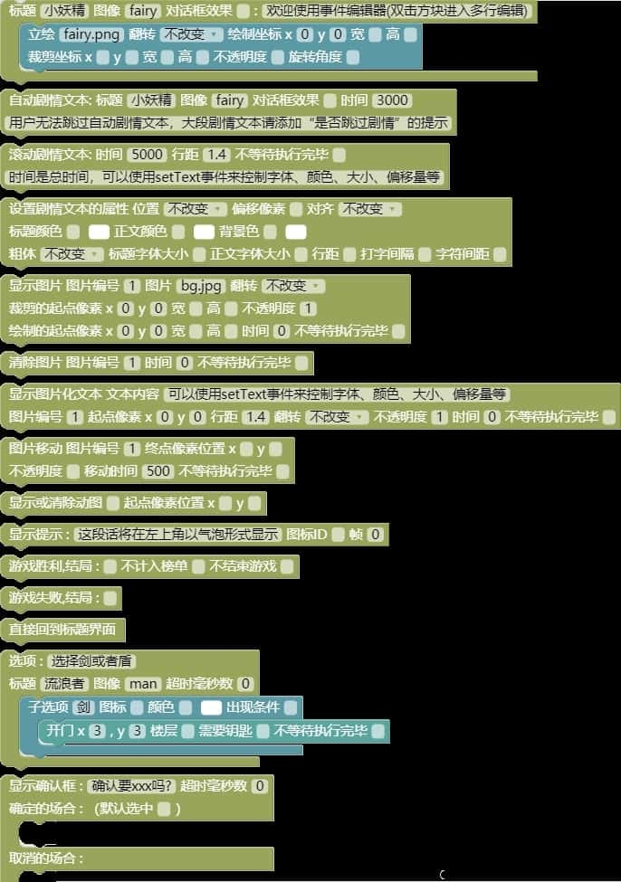
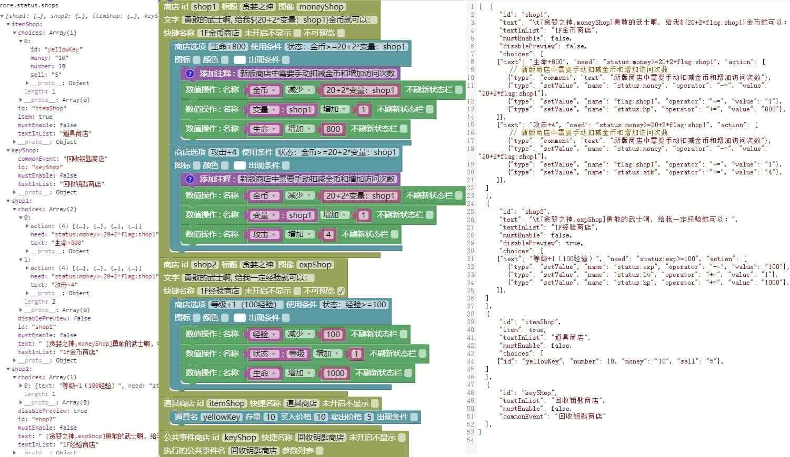
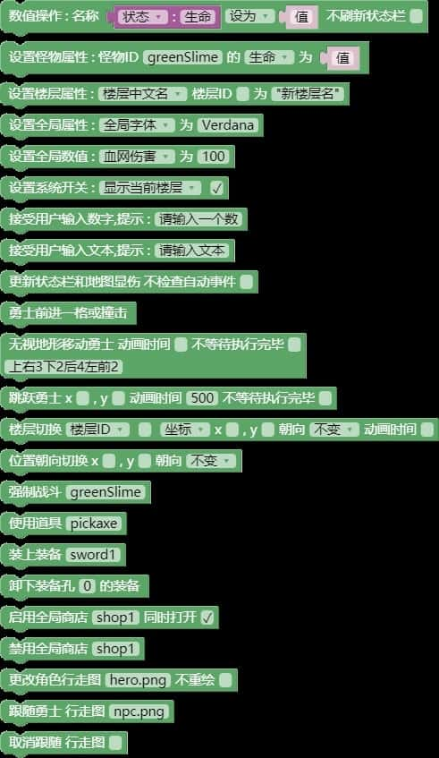
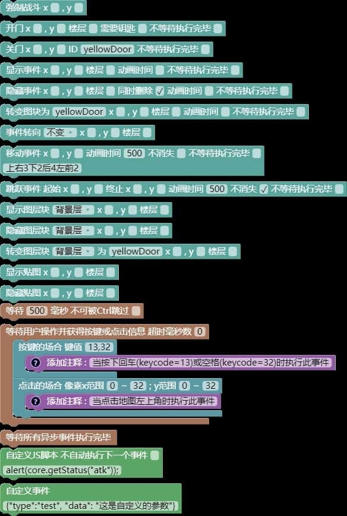
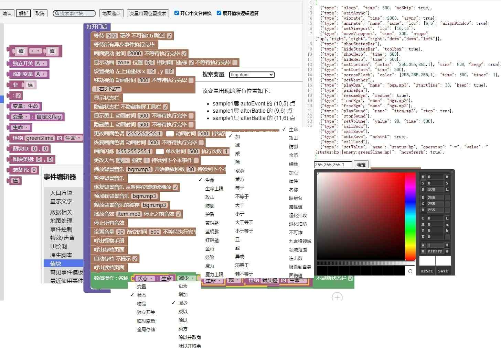
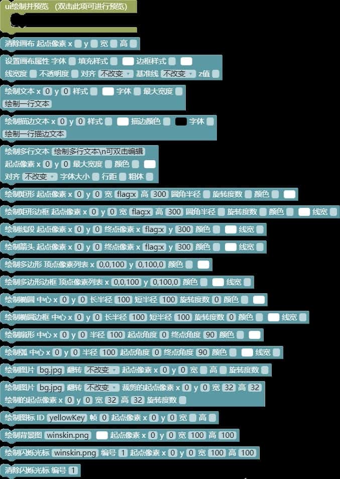

# 事件指令

?> 在这一节中，让我们来了解每一类事件的具体介绍

本样板之所以敢宣称“零编程基础的您也能大展身手”，就是因为它搭载了强大的图形化json编辑器（blockly）。

熟悉Antlr语法的读者可以根据[修改编辑器](editor)去自行修改`_server\MotaAction.g4`等文件去扩展其功能。

json代码本身则可以作为`core.insertAction()`函数的自变量，去插入一段事件执行。

下述提到的“当前点”坐标均指`core.status.event.data.x`和`core.status.event.data.y`。

## 指令的分类（注意区分块的颜色和地图的七彩点）

尽管事件指令和`core.events._action_xxx()`函数是一一对应的，但它们进一步调用的底层函数却分布在libs文件夹的不同文件中，大致上：

* 显示文字类（严格来说需要玩家操作的事件还涉及到actions.js）和UI绘制类在ui.js
* 数据相关类（这类也有不少道具相关在items.js）和特效声音类在control.js
* 地图处理类在maps.js
* 事件控制类（或许应该叫流程控制类）则在events.js，请注意区分libs和project的同名文件。

另一种分类方法则是按照同步和异步，分成以下几类：
1.  **瞬间就能执行完的：**如UI绘制、设置XX属性、显隐和转变图层块等。
2.  **阻塞直到玩家操作的：**如显示文章/选择项/确认框、接受用户输入、等待用户操作、呼出xxx等。
3.  **阻塞一段固定时间的：**如开关门、显示动画（观赏性）、移动跳跃、淡入淡出等。
4.  **耗时但不阻塞的：**如播放音效（V2.8支持阻塞）、显示提示等，一般为纯观赏性指令，会和后面的指令同时执行。

上述第3类指令都可以勾选“不等待执行完毕”（即前面提到的异步事件）变为第4类，从而实现诸如同步开关多个门的效果。

在json区，每条指令的格式为：`{"type": "xxx", "param1": ..., "param2": ..., ......}`，
实际执行的函数为`core.events._action_xxx(data, x, y, prefix)`

data为整个指令对象，x和y为当前点坐标，prefix为独立开关的楼层前缀。

您可以自行使用`core.registerEvent`注册一个新的事件。如果需要把新指令做成像已有的指令一样有类别、名称、取色器、勾选框、下拉框、输入框等部件，请查阅[修改编辑器](editor)。

V2.8.1起，下拉框中没有的项都可以通过在json区输入并点击“解析”按钮来临时追加（刷新网页后失效），如需永久追加请查阅[修改编辑器](editor)。

与此同时，显示文章、显示选择项、显示确认框都支持双击预览，预览前请先摆一个“设置剧情文本的属性”设置您预览时需要的属性然后双击它。

另外，原本“显示文字类”的图片相关指令，和“特效声音类”的音频相关指令，在V2.8.1被移出来合并到了一个新类“音像处理类”，请知悉。

## 显示文字类（黄色）



这个类别的指令会负责UI层图文的处理，如图片的移动和淡入淡出，游戏的胜败和重启等。

### 显示文章

最基本的就是最灵活的。本指令的讲解将占用大量篇幅，请做好准备。

上述函数中，第一个自变量为字符串数组或单个字符串，每个字符串为一段需要玩家按下确认键或点击屏幕才会消失的剧情文本，第二个自变量（可选）为全部文本消失后的回调函数。

每条显示文章分为五部分：标题、图像、对话框效果、正文、立绘。

写成一个字符串就是`\t[标题,图像]\b[对话框效果]\f[立绘]正文`。

1.  **标题：**可选，一般填说话人的名字。如果不填，则尝试根据图像取中文名（道具除外，道具不会说话所以只填图像不填标题就会没有标题）。如图像填hero但不填标题则以勇士名字作为标题，标题还可以填`null`强制不显示标题（如`\t[null,hero]`只显示勇士头像）。
2.  **图像：**可选，可以填hero（勇士行走图，如果勇士开了帧动画则会取当前朝向，但朝上会视为朝下）或任何图块ID，或者填this来尝试取当前点图块。
    * 也可以填一个png格式的图片文件名（需要后缀），图像甚至还可以填null来避免以图块ID为标题被解释成图像（如`\t[bomb,null]`会以英文单词bomb为标题而没有图像，但单独的`\t[bomb]`则会没有标题但以炸弹道具为图像）。
    * 只填写图像而不填写标题时，会被优先解析到标题框中，请不要惊慌，这并不影响效果。
3.  **对话框效果：**可选，填法非常灵活，如下（坐标在大地图中均为绝对坐标，省略则取当前点）。
    1.  `up,x,y`：对话框显示在点(x,y)上方，尖角朝下指着这个点（具体指的高度取决于图像。没有图像则判断该点是32×32px还是32×48px的图块，但是不管有无图像，若该点没有图块则都没有尖角）。
    2.  `down,x,y`：对话框显示在点(x,y)下方，尖角朝上指着这个点。比起上面，这个没有高度问题，不过该点没有图块的话则还是没有尖角。
        * 上述两种写法中，如果把坐标换成hero则显示在勇士上方或下方（尖角朝下的话，高度取决于勇士的行走图）。
    3.  `this,x,y`：在大地图中，点(x,y)可能位于视野上半部分也可能位于下半部分，写this就能让对话框自动适配上下来防止越界。
    4.  `hero`：在大地图上下边缘或小地图，勇士可能位于视野上半部分也可能位于下半部分，只写hero也能自动适配。
    5.  `hero,n`：n为正整数，尖角指向勇士的第n名跟随者，自动适配上下，将hero改为up或down则手动指定上下。
    6.  `up,null`：显示在屏幕最上方，同理up换成down则为最下方。
    7.  `center`：强制显示在屏幕中央，宽度为视野宽度。
    8. 除最后两种外，其余写法都会给对话框进行宽度自适配：
        * 如果正文没有自动换行，则会先尝试取一个让文本总行数最接近“几行半”的宽度，可能会再适当加宽来防止标题出界。
        * 如果正文有自动换行，则会尝试连同标题在内取最长的一行作为宽度。
        * V2.7起，文本绘制一定程度上支持了排版标点禁则，成对符号的左半部分不会出现在行尾，右半部分和其他某些标点不会出现在行首。
    9. 最终绘制时会尽量让尖角居中，除非尖角所指的点实在太靠左或太靠右。
    10. 值得注意的是，使用`project/images/winskin.png`或类似的图片作为文章背景时，尖角的绘制用的是用图片右下角64×32px的两格进行的，所以往往需要您自己准备好。
        * 技术群`959329661`的群文件“常用素材”提供了一些已经制作好的这样的图片，敬请取用。
4.  **正文：**双击指令块，进入多行编辑。正文中允许使用很多转义序列，当您键入一个\字符时就会提示补全，后面逐一介绍。
5.  **立绘：**显示文章的同时可以绘制一张或多张立绘图，请双击预览各张图的效果或右击整个指令预览所有立绘。每张立绘由一大堆参数组成：`\f[name(:x/:y/:o,sx,sy,sw,sh,)x,y(,w,h,alpha,angle)]`
    1.  **文件名：**需要放在project\images文件夹中并注册，这里需要带后缀。
    2.  **翻转：**和楼层贴图一样，支持三种翻转，在json代码中以文件的后缀名之后追加“:x、:y、:o”来表示。
    3.  **绘制坐标：**立绘在视野中的左上角像素坐标，后面的参数一旦省略其中一个则必须省略其后所有。
    4.  **绘制的宽高：**立绘被伸缩后在视野中实际显示的宽高，必须同时填写，不填则不伸缩。
    5.  **裁剪坐标和宽高：**必须同时填写，为从原图中裁剪区域的左上角坐标和区域宽高，不填则取全图。
    6.  **不透明度和旋转角度：**可选，前者填一个不大于1的正数，请自行双击预览。
6. **左上角坐标、限宽：**V2.8.1新增，该项不能和上面的`\b[对话框效果]`同时使用。
    * 使用此项后，本指令将变为正常的json格式而不是字符串格式。
    * “左上角坐标”指视野中的相对像素坐标，“限宽”必须和左上角坐标一起指定，不能单独指定。
    * “限宽”的下限，在没有图像的情况下大约为64px，在有图像的情况下大约为128px，可以双击预览来确认到底能否正常显示。
    * 一种推荐的用法是，在指定下面的非0编号后使用，然后“显示选择项/确认框”，这样就和RPG Maker的行为一致了。
    * 而且还能充分利用两侧的空间讲清楚每个子选项，这是在“选择项的提示文字无法随光标位置而变化”的现状下的一种妥协做法。
7. **编号：**V2.8.1新增，可以同时显示多个不同编号的对话框，常用来表现多名角色的嘈杂对话。
    * 和上一项一样，此项填写非0值后，指令将变为正常的json格式而不是字符串格式。
    * 非0编号的对话框将不会自动消失（甚至勇士恢复自由行动后也是），可以被同编号的对话框覆盖或手动清除。
    * 自由行动时，该项常用来做一些常驻提示，如技能的开关状态、毒衰咒状态、当前剧情任务进度等。
    * 您甚至可以像图片一样去移动对话框（如和一个npc一起移动），支持四种变速效果，立绘也会被一起移动。

立绘是画在UI层的，下一个指令执行前就会擦除。如需持续显示请使用“显示图片”指令，另外立绘会被“图像”遮挡。

### 显示文章正文的转义序列

1.  **表达式计算：**使用`${}`可以计算（eval）一个js表达式，式子中允许使用所有的冒号缩写量和API，详见`core.calValue()`函数。
    * 此语法也可以用于“道具名称”、“道具描述”和“即捡即用提示”，只不过那里就不支持中文替换了。
    * 如`勇士当前的攻防相乘是\${状态：攻击\*状态：防御}`（中文替换），`持有三色钥匙共\${item:yellowKey+item:blueKey+item:redKey}把。`（json）
    * V2.8和更早的版本中，样板对右花括弧的处理是（非贪心）正则匹配，因此`${内部}`不能再出现右花括弧，这也意味着您无法使用对象、复杂的流程控制语句和函数定义，只能使用简单的运算符（包括三元运算）和函数调用。
    * V2.8.1中，匹配方式改为了堆栈匹配，上述问题得到解决，您可以放心使用匿名函数了，这对道具名称/道具描述这种场合是个福音。
2.  **局部文字变色：**使用`\r[颜色英文名]`或`\r[\#RrGgBb]`（十六进制）来将这之后的文本变为另一种颜色。
    * 最常用的17种颜色提供了自动补全，十六进制颜色可以随便找个有颜色参数的指令，呼出调色器去自己调配。只使用\r不带方括号则变回默认颜色。
3.  **局部字号调节：**使用`\\c[正整数]`改变这之后文本的字号，只使用`\\c`不加方括号则恢复默认字号。
4.  **手动换行、局部加粗和斜体：**退出多行编辑后，手动换行写作`\n`，另外可以使用`\\d`将局部文本加粗或取消加粗，使用`\\e`将局部文本变为斜体或取消斜体。
5.  **32×32px图标的绘制：**使用`\\i[图标ID]`绘制一个32×32px的图块的第一帧或系统图标，您可以使用`core.statusBar.icons`查看所有的系统图标。
    * 出于历史遗留问题，图块ID可以和系统图标ID重复，此时优先使用图块ID.
6.  **打字速度调节：**开启打字机效果后，文本的打字速度总是匀速的。所以样板提供了名为“时间占位符”的转义序列，使用`\\z[正整数]`可以暂停相当于打这么多个字的时间。

除`\n,\t,\b,\r,\f`外，其余转义序列的反斜杠在json中必须写两个！

### 其他文字类指令

1.  **自动剧情文本：**和上面的显示文章基本相同，只不过不是由玩家按下确认键或点击屏幕，而是一定毫秒后自动消失，录像回放中则忽略。
    * 比起那个，这个不能通过长按Ctrl键或长按屏幕快进，大量使用时一般用来搭配语音。否则对魔塔这种快餐游戏来说可能会非常不友好，建议统一塞进“显示确认框”指令的场合之一。
2.  **滚动剧情文本：**将一段文字从屏幕最下方滚动到最上方，不支持自动换行，常用于op和ed.
    * 该指令对应`core.drawScrollText(content, time, lineHeight, callback)`。
3.  **显示提示：**即诸如打败怪物、捡到道具、打不开门时左上角的提示，只支持`${表达式计算}`和`\r[变色]`。
    * 可以填写一个图标ID显示在提示文本的左侧（支持32×48px但只画靠上的2/3，也可以使用系统图标）。
    * 此指令对应`core.drawTip(text, icon, frame)`函数。自然数`frame`表示绘制第几帧，默认为0表示第一帧（但没有在事件中提供）。
    * 此指令看似显示出的提示会过一会才消失，但此指令本身依然是瞬间完成的，不属于异步事件！
    * V2.6.4短暂提供了“同时显示多个tip”的功能，这在事件中连续获得多个道具时很友好，
    * 但是玩家纷纷表示自由行动时此功能遮挡了太多的视野，因而在V2.6.5中就取消了。
    * 如果需要此功能（包括自定义底色），请在本项目的[github](https://github.com/ckcz123/mota-js/archive/refs/tags/v2.6.4-release.zip)站点自行下载V2.6.4的发布版本并对照研究。
4.  **游戏胜败和重启：**游戏胜败分别对应“脚本编辑”（快捷键N）的`win`和`lose`函数，在线游戏排行榜中每个结局的每个难度都有一张榜。
    * 但同一结局只有最高难度有效，您可以勾选“不计入榜单”来让这个本来有效的结局也无效。还可以勾选“不结束游戏”来先停止录像的录制，再演出ed.
    * win和lose函数最终都会调用`core.gameOver(ending)`函数，区别在于lose不填写ending. 但是，事件中使用gameOver这一异步函数需要额外的技巧，详见“原生脚本”。
    * 重启游戏对应的函数为`core.showStartAnimate()`
5.  **设置剧情文本的属性：**可用`core.status.textAttribute`获取当前的剧情文本属性，各项含义：
    1.  **位置：**“显示文章”不使用`\b`对话框效果时文本的位置，默认为屏幕中央。如果您有大量集中的剧情文本都欲使用`up,null`的对话框效果，则可以直接将此项设置为“顶部”，而将剩余的个别剧情文本使用`center`或`down,null`的对话框效果，反之亦然。
    2.  **偏移像素：**上面的“位置”选择“顶部”或“底部”时和屏幕上下边缘的距离，也作为滚动剧情文本和左边缘的距离。
    3.  **对齐：**默认为左对齐，可以修改此项来让显示文章的标题和正文都居中或都右对齐。
    4.  **标题色：**准确地说是“标题和图像边框色”，格式和楼层画面色调一致，可以点击调色器按钮呼出调色器调色。
    5.  **正文色：**如题，修改方法同上，从而避免频繁使用\r进行局部文本变色。
    6.  **背景色：**如题，修改方法同上。但比起前两个，这个也允许填写一个类似`winskin.png`的图片文件名。
    7.  **标题和正文字号：**如题，正文字号推荐设置为偶数。
    8.  **行距和字符间距：**如题，单位都是像素，行距推荐为正文字号的一倍半。
    9.  **粗体（Y/N）：**文本是否默认加粗，推荐在大量粗体文本中穿插少量细体文本时使用，以免频繁的`\\d`切换。
    10. **打字间隔：**0表示不启用打字机效果而是一次显示完，正整数表示每打一个字的毫秒数，也作为`\\z`暂停的单位时间。
    11. **淡入淡出时间：**V2.8新增，指定此项后，每个“显示文章”指令都会增加淡入淡出效果，建议用于大段的剧情层。

可以使用`core.clone(core.status.textAttribute)`将文本属性备份到`hero.flags`中，从而做到临时使用另一套文本属性绘制部分内容。

### 图片类指令

1.  **显示图片：**和立绘的语法基本类似，只不过多了编号（1—50）和淡入时间。
    * 可以双击预览效果，还可以勾选“不等待执行完毕”来和后面的指令同时执行，比如同时淡入两张图片，或者淡入一张同时淡出/移动另一张。
    * 编号较大的图片会遮盖较小的，1—24号图片会被色调层遮盖，25—40号图片会遮盖色调层但被UI层遮盖，41—50号图片会遮盖UI层。
    * 此指令对应`core.showImage()`函数，编号真正的意义，详见[个性化](personalization)
2.  **清除图片：**如题，需要指定要清除的图片编号和淡出时间（显隐图片的时间都可以填0表示瞬间完成）。
    * 此指令对应`core.hideImage(code, time, callback)`
3.  **图片移动：**其实还包括了透明度渐变，“终点像素位置”指移动结束后的图片在视野中的左上角像素坐标（不填则表示单纯的透明度渐变），“不透明度”指渐变结束后的新的不透明度（不填表示单纯的移动）。对应`core.moveImage(code, to, opacityVal, moveMode, time, callback)`
    * V2.8起，图片和视野的移动支持加速度，分为“匀速、加速、减速、先加速再减速”四种，请任意选用。
4.  **图片旋转：**V2.8新增，同样支持加速度，旋转中心坐标不填则取图片中心。
    * 此指令对应`core.rotateImage(code, center, angle, moveMode, time, callback)`函数。
    * 比起移动，旋转本身不支持同时透明度渐变，您可以先写一个不指定终点的移动指令且“不等待执行完毕”来实现单纯的淡入淡出，然后再写一个耗时相同或略长的旋转指令，这样两个指令就会一起执行了。
    * 当不指定旋转中心时，本指令可以和移动指令同时使用，从而得到“图片的中心做直线运动、同时图片还在绕着中心自转”的效果。
5.  **图片放缩：**V2.8.1新增，同样支持加速度，放缩中心坐标不填则取图片中心。
    * 此指令对应`core.scaleImage(code, center, scale, moveMode, time, callback)`函数。
    * 可以和“图片移动/旋转”一起使用，做出PowerPoint中常见的动画效果。
5.  **显示或清除动图：**需要填写动图的文件名（带.gif后缀），“起点像素位置”含义如前且必须填写，可以双击指令块来预览第一帧的效果。
    * 动图不支持淡入淡出和伸缩移动，如果不填任何参数则清除所有动图（只支持全部清除）。
    * 该指令对应`core.showGif(name, x, y)`函数。
6.  **显示图片化文本：**这是您唯一显示镜像文字的机会。
    * 显示出来后就会视为一张通常的图片，可以被清除、移动、淡入淡出、旋转。

### 显示确认框，选择项，QTE与全局商店

QTE，即快速反应事件。一般表现为需要玩家在收到某信号后尽快做出正确操作，如新新魔塔2中面对白银史莱姆王的猜拳战斗就需要根据其出拳的颜色尽快按下相克的数字键。

样板同样支持这类事件，一共有三种，这里先介绍两种。

一是**显示确认框**，它会显示一段支持`${表达式求值}`但不支持自动换行、淡入淡出和其他转义序列的文字。然后要求玩家在一定毫秒数内选择“确定”或“取消”之一，如果超时就视为哪个都没选，直接继续执行后面的事件。

您可以指定闪烁光标的初始停留位置是确定还是取消，还可以指定超时毫秒数为0表示不限时间但玩家必须做出二选一。

当指定了超时时间并且及时做出选择时，剩余时间会被写入“变量：timeout”，可以用来做一些处理（音游？）。

此指令对应`core.drawConfirmBox(text, yesCallback, noCallback)`函数，其中两个Callback分别为选择确定和取消后的回调函数。

V2.8起，显示确认框在录像回放时如果录像中没有记录该选哪一项（或者明明此事件未设置超时时间但录像中记录了超时），就会选择默认项（也就是光标的默认位置），请注意。

二是**显示选择项**，和RPG Maker不同，我们的选择项不会和它之前的“显示文章”同时出现，可以直接配上除对话框、打字机、淡入淡出外的所有文字效果。

此指令对应`core.drawChoices(content, choices)`函数，其中content为提示文字，choices为各子选项文字组成的字符串数组。是的，比起上面的函数，这个不直接支持回调。

在没有提示文字的情况下，一次能同时显示的子选项最多为13或15个。和确认框一样，选择项的超时值填0表示不限时间但玩家必须从中选择一个。大于0的话超时视为什么都没选，直接继续执行后面的事件。

每个子选项的文字只支持`${表达式求值}`和整行变色，请注意控制字数。文字左侧也支持追加一个图标（多帧图块取第一帧），支持系统图标。

每个子选项还可以指定“出现条件”（不指定则一定出现），条件的写法和自动事件的触发条件一样，从而做出形如“怒气值满才显示大招选项”的效果。

如果实际执行时所有子选项都不满足出现条件，则直接跳过。但是如果出现的项都不满足下面的“启用条件”就会导致所有项都不可选，然后游戏卡死，请务必注意这个问题。

V2.7.2起，每个子选项还可以指定“启用条件”，当出现条件和启用条件都满足时才能真正选中这一项。

如果只满足前者但不满足后者，该项会变灰，尝试选择时会播放“操作失败”系统音效并显示提示（超时倒计时不会重置）。

当指定了超时时间并且及时做出有效选择时，剩余时间同样会被写入“变量：timeout”，可以用来做一些处理。

您或许会疑惑提示文字为什么不做成随光标位置而变化（这在很多电脑/手柄游戏中很常见），这是因为触屏设备无法改变光标位置，如有需要，请自行在此界面提供虚拟方向键（不打算发布触屏版游戏的则无所谓），然后在提示文字中使用${}对`core.status.event.selection`进行判定，从而改变提示文字。

V2.8起，显示选择项在录像回放时如果录像中没有记录该选哪一项（或者明明此事件未设置超时时间但录像中记录了超时），就会弹窗询问玩家是否补选一项，此时玩家可以输入某项的序号（从0起）来修复录像，当然也可以在弹窗时点取消来放弃修复。

提交成绩后，站点后端的录像验证时如果发生了同样的问题，则因为无法询问玩家，会选择默认项（即初始光标位置，下面会提到）。

如果录像回放中尝试选择不满足“启用条件”的灰项，V2.8起会直接报错。这种处理方式比上面的“弹窗请求补选”更为严厉，如您在造塔测试时遇到了这种问题，可以先“回退到上一个节点”，然后在控制台输入`core.status.replay.toReplay`查看接下来该播放的内容（可以按N键单步播放），并在这个一维数组中删除掉那个非法的选项值。

而如果录像中记录了多余的确认框或选择项（`choices:n`），V2.8起就会在播放时跳过并警告。

V2.8.1起，“显示选择项”支持限宽和手动指定默认项了（注意最好指定一个100%出现且启用的项），配合“带编号的显示文章”效果更佳哦！



在“全塔属性——全局商店”中可以编辑各个商店，商店一共有三种：

1.  **公共事件商店：**最简单的一种商店，或者应该叫做给玩家准备的快捷功能更合适，因为它的内容完全不一定非得是个做买卖做交易的“商店”，也可以是诸如“开启或关闭主动技能”、“快速换上最强套装”之类的便捷功能。
    * 多说一句，鉴于全局商店列表最多只能同时显示12或14项（还有一项是关闭列表），因此您也可以准备一些永久道具，设置适当的使用条件，并在使用效果事件中去实现这些给玩家的快捷功能。当然全局商店的使用条件更加统一，请自行权衡。
    * 公共事件商店在用法上和一般的“插入公共事件”并无二致，同样可以提供一个参数列表。
2.  **道具商店：**这种商店也很简单，由第三种QTE指令实现但没有限时。
    * 您可以在其中随意填写买卖的道具ID、存量、买卖价和出现条件。
    * 存量不填视为无限，买入价不填视为只能卖（回收），卖出价不填视为只能买，出现条件的含义和选择项一致。
    * 如果需要在游戏中对买卖价和对存量进行读写，请读写`core.status.shops`
    * 请注意，使用道具商店的话务必保留`project/images/winskin.png`及其注册信息，可以换成相同规格的同名图片。
3.  **新版商店：**用法非常灵活的一种商店，其外形酷似“显示选择项”但有一些不同。
    * 首先和其他两种商店一样，它多出了“商店id、快捷名称、未开启不显示”。
    * 商店id只能使用全英数，且必须两两不同。
    * “快捷名称”为显示在V键快捷菜单的名称，请注意控制字数，最好也两两不同以免玩家混淆。
    * 勾选“未开启不显示”则此商店在开启前或禁用后不会出现在V键菜单中，当商店总个数超过12或14个且随着游戏流程进度依次开新的关旧的时，这个勾选项就很有必要了。
    * 其次，和其他两种商店不同，您可以允许玩家预览它（前提是V键菜单中显示了），这对魔塔这种倡导完全信息的游戏来说非常有意义。
    * 最后，比起常规的“显示选择项”，它不能指定超时毫秒数，但是（V2.8起）允许长按连续购买。
    * 实际执行中在所有子选项的最后会自动追加一个“离开”选项，选择其他子选项并执行后商店并不会立即关闭而是停在那个界面。就像胖老鼠和两部新新魔塔一样。
    * “出现条件”和“使用条件”相搭配，让您能够很轻松地做出形如“消耗金币和各种材料的装备合成路线”这样的设定。
    * 在预览模式下除“离开”外的子选项、以及交易模式下不满足“使用条件”的子选项，都会显示为灰色，尝试选择时会播放“操作失败”系统音效并提示失败原因。
    * 子选项的执行内容中需要手动处理扣费等问题，此外，在制作像两部新新魔塔一样会涨价的商店时，您也需要自己准备变量（变量名不必与商店id相同）去记录已购次数或者直接记录价格，并手动处理涨价问题。

有关全局商店的详细实现，请参见“插件编写”（句号键，`project/plugin.js`）。

其中还提供了一个`core.canUseQuickShop(id)`函数来控制勇士什么时候可以通过V键菜单快捷使用哪些商店，自变量id为商店id.

本质上，新版商店是套在一个死循环里的。您可以在子选项的执行内容中使用“跳出当前循环”指令来打断该子选项剩余的未执行内容而强制离开商店，

或使用“提前结束本轮循环”来打断未执行内容而强制重启商店。

同理，公共事件（包括公共事件商店）和自动事件本质上是“一次性”的条件为`false`的后置条件循环，因此使用这两个指令都能跳出它们。

另外，全局商店在录像中的记录方式是`"shop:id"`紧接着显示选择项的记录，也就是说“离开”项的序号可能会不固定（尤其是在连载塔中），请稍加留心。

## 数据相关类（绿色）



这类的指令会设置各种数据（如怪物属性、楼层属性、全塔属性、七大可读写块），处理弹窗输入和开关全局商店，以及控制玩家最最关心的勇士的各种行为。

### 设置各种数据的指令

1.  **数值操作：**最简单的就是最灵活的，本指令能够修改七大可读写块（状态、物品、变量、独立开关、临时变量、全局存储、增益）的值。
    * 修改的运算符有十种，“设为”会将右块的值代入左块，“增加、减少、乘以、除以”则是对左块的值进行增减和扩大缩小。
    * 除法如想只保留整数商（向零靠近）则改用“除以并取商”，如想要余数（例如想取勇士生命值的后两位）则使用“除以并取余”。
    * “乘方”指的是将若干个（不一定是正整数）左块连乘起来的积代入左块。
    * “设为不大于”和“设为不小于”是指在左块大于/小于右块的时候将右块代入左块，也就是“封顶”和“保底”的作用。
    * 指令的右块为一表达式，可以使用任何值块和运算块，甚至直接使用API.
    * 如果需要连续使用本指令，建议除最后一个外都勾选“不刷新状态栏”，以降低刷新状态栏的性能损耗，并且避免意外触发自动事件、生命和魔力溢出甚至死亡（生命小于等于0）。
2.  **设置怪物属性：**可以设置怪物的任何一项属性并计入存档。
    * 怪物ID在blockly块中也可以填中文（要求没有重复，有的话请在事件编辑器顶部关闭“中文替换”功能），需要设置的属性项在下拉框中选取。通过配置表格自行新增的属性在下拉框里没有，但可以写在json区再单击变黄的“解析”按钮，或修改`_server\MotaAction.g4`文件最后的部分去追加。
    * 本指令对应`core.setEnemy(id, name, value, operator, prefix)`函数，完全等价。注意value会被eval，因此字符串需要额外套一层引号！
    * 最后的“值”和“数值操作”的右块写法一致，注意设置怪物名称需要加引号，设置逻辑值（是否）需要填写`true`或`false`，设置“特殊属性”需要填数组且只支持结果值。
    * V2.8起，怪物支持“行走图朝向”功能，您在四个朝向的怪物中任意设置一个的属性都会强制同步到其他三个。
3.  **定点设置/移动或重置怪物属性：**V2.8新增，该指令主要是为了实现一些诸如“发动技能后指定某个点，该点怪物被削弱/增强，并计入存档”的功能。
    * 该指令支持设置的属性有“名称、生命、攻击、防御、金币、经验、加点”，设置后，该属性会在“脚本编辑——怪物真实属性”中最先被使用，然后可以被光环等影响。
    * 使用时，需要指定楼层和坐标，楼层不写则取当前层，坐标不填则取当前点，支持双击从地图选点，（除移动外）支持选多个点。
    * “移动某点怪物属性”支持写增量（dx、dy），如写[4,-2]就会让某个点的怪物属性移动到向右4格、向上2格的位置。
    * 发生战斗后，该点会被自动重置定点属性。怪物移动跳跃时（如阻击）定点属性会自动一起被移动，您无需手动移动。
    * 该组指令实际调用的API为：
    ```
    core.setEnemyOnPoint(x, y, floorId, ...)
    core.moveEnemyOnPoint(fromX, fromY, toX, toY, floorId)
    core.resetEnemyOnPoint(x, y, floorId)
    core.enemys.getEnemyValue(enemy, name, x, y, floorId) // 读取
    ```
4.  **设置装备属性：**V2.8新增，该项可以制作一些“随剧情推进而强化装备”的效果并计入存档。
    * 使用时，需要指定装备ID、要修改的是常数值还是增益、要修改的属性英文名等。
5.  **设置楼层属性：**除了贴图和两个到达事件，其他属性都可以方便地修改。
    * 楼层ID不填则视为当前楼层，可以去“地图选点”浏览各楼层并复制ID.
    * 注意修改“楼层中文名”、“状态栏中名称”、“默认地面ID”、“背景音乐”（需要后缀名）这些字符串类型都需要加引号（V2.8起背景音乐支持一维数组），几个“能否/是否”只支持修改为`true`或`false`，三个坐标和天气、色调这些数组类型都需要加方括弧。本指令对应`core.events.setFloorInfo(name, value, floorId, prefix)`
    * 修改当前层的天气/色调/背景音乐后不会立即生效，如需生效请补一个对应的特效指令（如“恢复画面色调”）并且不要勾选“持续”。
6.  **设置全局属性：**即全塔属性中的“主样式”（无需再加引号）和装备孔列表。
    * 修改装备孔列表时请注意，如果装备的道具属性中填写的装备类型是自然数，则可以【在列表结尾】随着游戏流程的推进解锁新的装备孔或移除装备孔（请先将身上的此类装备脱下）。
    * 而如果装备的道具属性中填写的装备类型是装备孔名称，则可以随着游戏流程的推进修改装备孔的类型组成，如本来是两把剑一块盾改成一把剑两块盾（同样需要注意已经穿上的装备问题）。
    * 本指令对应`core.events.setGlobalAttribute(name, value)`函数。
7.  **设置全局数值：**如题，可以修改四种宝石和三种血瓶的基础值等，必要时也可以修改图块的每帧时间以及上下楼时间以得到一些演出效果。
    * 如需使用脚本，请直接修改`core.values`，完全等价。但是竖屏状态栏的自绘行数如果动态修改有可能会出问题，请注意。
8.  **设置系统开关：**如题，可以用来随着游戏流程的推进解锁/移除状态栏的显示项或改动其他开关。
    * 比如中途开关生命上限、加点和负伤，中途显隐魔力、技能、绿钥匙和破炸飞毒衰咒。
    * 在游戏胜利时会将生命值作为分数上传到在线游戏排行榜，因此请在胜利前关闭生命上限再修改生命，比如根据钥匙等道具的持有情况进行加分。
    * 请注意，即使您在游戏中途才将楼传变为平面塔模式，访问过的楼层依然已经记录了最后离开的位置。
    * 本指令对应`core.setGlobalFlag(name, value)`函数，实际会修改`core.flags`（但请不要用脚本直接修改它）
9.  **设置文件别名：**V2.8新增，您可以修改一个中文名实际指向的英文文件名，从而做到随剧情推进采用不同的系统音效（如上下楼）等效果，如果英文文件名不填则表示恢复到全塔属性中的默认值。

### 导致勇士位置变化的指令

这类指令都支持填写负坐标、超出地图宽高的坐标或小数坐标（大地图中请慎用小数坐标），

当勇士在这些异常坐标时【除第一个指令外】都可以正常执行。

可以用于一些特殊演出，但请记得在事件结束（玩家恢复行动）前改回正常。

1.  **勇士前进一格或撞击：**如题，会让勇士像自由行动时一样尝试前进一格。
    * 如果可以前进但前方不可被踏入（如门、怪物、箱子、NPC）则会撞击并触发事件，走到道具、踩灯或路障或用普通事件制作的陷阱等也会触发。
    * 本指令可以正常触发跑毒和阻激夹域捕捉（可以致死），滑冰事件就是在冰上执行了它。
    * 本指令对应`core.moveAction(callback)`函数，但请勿直接调用它。
2.  **无视地形移动勇士：**“动画时间”为每步的时间，不填则取玩家设定值，该值从V2.8起允许在移动过程中修改（最少为16）。
    * 可以勾选“不等待执行完毕”来和后面的指令同时执行，比如让勇士和一个NPC肩并肩走。
    * 本指令不会触发跑毒和阻激夹域捕捉，且会无视地形可进出性、可通行性。
    * 移动过程中不会触发任何事件，就像开启调试模式时按住Ctrl键移动一样（与之不同的是，也可以移动出地图外）
    * 勇士后退时，跟随者们会照常前进，数不清楚格子时记得善用地图选点功能浏览地图。
    * V2.8起，支持斜向移动，支持移动过程中单纯转向（步数填0）。
    * 斜向移动时行走图以左右为准，但“后退”依然以勇士朝向为准而不考虑上一步的行走方向（这点和图块的移动不同，勇士不可能斜向后退但图块可能）。
    * 本指令对应`core.eventMoveHero(steps, time, callback)`函数，请注意不是`core.moveHero()`
    * 多说一句，您可能会发现勇士在移动时会在行走图的2、4两帧之间反复切换（尤其是在大地图中心时很明显），这和图块以及RPG Maker的行为很不一致而且观感较差，如需改成1234帧循环，请启用“勇士四帧行走动画”插件（V2.8该插件有更新，从V2.7.x接档的用户需要重新抄写一下）。
3.  **跳跃勇士：**可以填写目标点坐标（支持双击从地图选点），坐标允许使用带有冒号缩写量甚至API的表达式。
    * 比如`["core.nextX(2)", "core.nextY(2)"]`（json）表示勇士越过面前一格，即道具“跳跃靴”的效果。
    * V2.7.3起，跳跃的目标坐标支持写增量（dx、dy），如写[4,-2]就会让勇士跳到向右4格向上2格的位置。
    * 跳跃高度和距离有关，原地跳跃的高度只有半格（可在下述函数中修改）。跳跃过程中跟随者消失，跳跃结束时跟随者聚集。
    * 跳跃也支持异步效果（如和NPC一起跳），对应`core.jumpHero(ex, ey, time, callback)`函数，其中`callback`为异步跳跃完毕的回调函数。
    * 跳跃默认没有音效，您可以自行像支援怪和道具“跳跃靴”一样配上音效（具体方法在“插件复写”一节有讲）。
    * 和“无视地形移动勇士”一样，勇士跳跃也会无视目标点的地形和阻激夹域捕捉，不会触发目标点的任何事件。
    * “无视地形移动勇士”和“跳跃勇士”因为经常和图块的这两个行为一起使用进行演出且都没有碰撞效果，因此V2.7.3起移动到了“地图处理类”，请注意。
4.  **楼层切换：**和前面的“楼梯、传送门”绿点事件用法完全一样，但不可穿透。
    * 此指令同样支持双击从地图选点（坐标支持表达式）和在json区填写传送的目标点图块ID（在目标层唯一）再点击变黄的“解析”按钮。
    * 另外，正如本小节开头提到的，本指令比起“楼梯、传送门”事件更多地用于演出，因此您可以填写异常坐标。
    * 楼层ID只能填写常量，如需使用变量，请使用“原生脚本”插入事件。
5.  **位置朝向切换：**“跳跃勇士”不会改变勇士朝向，“楼层切换”又会导致重生怪复活。且这两个都会导致跟随者聚集，所以同楼层内改变勇士位置可以使用本指令（坐标和跳跃一样支持双击从地图选点以及表达式）。
    * 本指令还可以用来让勇士原地转身（不填坐标，这样也不会聚集跟随者），支持4种绝对朝向和4种相对转向。

### “数据相关”类的其他杂牌指令

以下杂牌指令负责弹窗输入、显伤战斗、道具装备、全局商店、行走图和队伍：

1.  **接受用户输入：**弹窗请求用户输入一个自然数或字符串，提示文字允许使用`${表达式计算}`。
    * 请求输入自然数（支持十六进制）时，负整数会被取绝对值。小数会被向0取整，其他非法输入会变为0，“输入自然数”在录像中会记录为`input:n`。
    * 请求输入字符串时，玩家点击取消则视为输入了空字符串。
    * 输入的结果会保存在值块“`变量：input`(`flag:input`)”中，可供后续处理。
    * 比如样板的生命魔杖就是一个例子，它允许玩家一次使用多个同种道具。
    * 读取“全局存储”这一行为，在录像中和“输入字符串”的记录方式一致（`input2:base64`）。
    * V2.8起，录像回放中如果出现了多余的`input:`或`input2:`，都会警告并跳过。反之，“接受用户输入”事件在录像中缺失了值则会使用0或空字符串并补录。
2.  **更新状态栏和地图显伤：**如题，可以勾选“不检查自动事件”来不检查。
    * 本指令实际执行“脚本编辑——更新状态栏”，即`core.updateStatusBar(doNotCheckAutoEvents);`
3.  **强制战斗（点名）：**和天降怪物（指定ID，中文替换只支持不重复的中文名）强制战斗。
    * 此指令战后不会从地图删除图块也不会触发各点的战后事件（黄点），但可以触发战后脚本和怪物属性中的（批量）战后事件。
    * 此指令的战斗是强制的，打不过直接死亡（V2.8可以用值块预先判定能否打过）。
    * 此指令一般用于boss战（通过走到某个点或开启某个门来触发），可以制作战前剧情，然后强制战斗。
    * 战后boss不立即消失（从而避免基于漏怪检测的自动事件被误触发），可以继续进行一些演出，如51层魔塔四区骑士队长的逃跑效果。
    * 因为是天降怪物（没有坐标），所以对这只怪物在属性修正以及战损计算等处涉及到怪物坐标的代码一律不起作用。
    * 比如它不会受局部光环的加成，也不会被任何怪支援，也无法被V2.8的“定点设置怪物属性”影响。
    * 另一种强制战斗指令在“地图处理类”，指定的是坐标而不是怪物ID.
    * V2.8新增了两种战前事件，两种强制战斗指令都不会触发它们，如需触发，请使用“触发系统事件”指令。
    * 由于V2.8提供了战前事件，因此不再建议使用曾经的“覆盖触发器+天降强制战斗”方式实现战前剧情，因为这样做不会自动存档，对玩家不太友好。
4.  **尝试使用道具和穿脱装备：**使用道具和穿戴装备需要指定ID（中文替换规则和强制战斗一样）。
    * 不能使用怪物手册（请使用“特效声音类”的“呼出怪物手册”指令）和楼层传送器（如果“覆盖楼传事件”则没有关系），使用中心对称飞行器则会跳过确认画面。实际对应`core.useItem(itemId)`函数。
    * 穿脱装备对应`core.loadEquip(equipId)`和`core.unloadEquip(type)`函数。脱下装备需要指定类型，这里只能写自然数不能写名称。
    * 道具使用失败或穿不上装备（比如没有或不满足条件）时会播放音效并提示。
5.  **开关全局商店：**本指令可以设置一个全局商店的启用和禁用状态，设为启用时也支持立即打开。
    * 一般用于商店的实体NPC处，再配合独立开关可以让勇士首次接触时先进行一些对话，然后启用（并打开）全局商店。
    * V2.8新增了值块可以用来判定一个全局商店是否是开启状态。
6.  **更改角色行走图：**如题，文件名必须填写（支持双击选文件）。
    * 文件必须放在`project/images`文件夹并注册，且规格必须符合要求（4帧总宽度至少128px，高度不限。宽高必须为4的倍数）。
    * 如果勾选“不重绘”就不会立即刷新，从而避免大地图视角重置到以勇士为中心。本指令对应`core.setHeroIcon(image, noDraw)`函数。
7.  **跟随者入队和离队：**您可以用这一对指令来让跟随者入队和离队，同样支持双击选文件。本指令对应`core.follow()`和`core.unfollow()`函数。
    * 行走图和勇士的规格要求（尺寸不需要一样）、文件位置和注册方法相同。
    * 离队可以不填文件名表示解散队伍只留勇士，如果填写文件名则尝试踢出队伍中第一个以此为行走图的跟随者。
    * 入队成功后、以及尝试离队后队伍都会聚拢，大地图视角也会重置。

## 地图处理类（浅蓝）



这个类型的指令会影响三层地图矩阵的阵元，如果您觉得三层还不够用，“插件编写”（句号键）五图层插件欢迎您。

开始介绍前，首先明确一点：改变地图数据不会立即影响事件的进程（自动事件除外）。

比如因为踩灯、路障和阻激夹域捕捉怪的分布变化导致勇士行走被妨害的区域发生变化，但不会立即触发妨害效果，而是要等到勇士下次行走。

在勇士所在点转变成（显示）一个门/怪物/道具/箱子/楼梯什么的（包括在脚下转变成/显示冰面）都不会立即触发事件，把这些图块移动/跳跃到勇士身上也是。

反之，“隐藏事件”（转变图块为0）也不会立即中止当前的事件处理，只是下次不会触发。

1.  **强制战斗（定点）：**这是另一种强制战斗，它指定坐标而不是怪物ID.
    * 可以双击从地图选点（只能选当前楼层的，不填则取当前点），也可以用表达式指定坐标，坐标一次只能写【一个点】。
    * 战斗后会自动从地图删除该点的怪物（重生怪则是隐藏），并尝试插入该点的战后事件（黄点）以及怪物属性的（批量）战后事件，成功插入前者时会改变当前点坐标到该点。
    * V2.8新增了两种战前事件，它们无法被“强制战斗”指令触发，如需触发，请使用“触发系统事件”指令。
2.  **开关门：**坐标写法同上（限1个点），同层开门时楼层ID可以略去不写。
    * 关门的位置必须是空地，“需要钥匙”只对同层开门有效。跨层开门请自己加判定，本指令对应`core.openDoor(x, y, needKey, callback)`函数。
    * 这对指令支持所有完整填写了“门信息”的四帧图块（自动元件除外），比如样板自带的三色墙和六色门。
    * 可以勾选“不等待执行完毕”来实现异步效果（如同时开关多个门，具体速度取决于门信息）。
    * 和上面的强制战斗一样，开门后将尝试插入该点的开门后事件（紫点），成功插入时会改变当前点坐标到该点。
3.  **显隐事件和图层块：**这两对指令可以令三层地图矩阵的某些阵元在0与非0之间切换。
    * 还以51层魔塔为例，二楼右下角的小偷在游戏开始时是不显示的，勇士进入四区后才出现。
    * 也就是说这个小偷是一个“普通事件”（红），内容是一些对话和打开35层魔龙处的暗道，只不过没有勾选“启用”。
    * 在适当的时候（这个例子中是和29楼小偷对话后），执行一个“显示MT2层（12，12）点处的事件”指令，就能显示出二楼的小偷。
    * 同理，勇士接触此小偷并处理事件，事件结束前执行一个“隐藏（同时删除）当前点事件，500毫秒”指令，小偷就会从画面中淡出，勇士可以任意在小偷存在过的位置走来走去而不会再触发什么。
    * 所以，一次性陷阱（走到某个地方关上墙/机关门、冒出埋伏怪）在触发后一定要及时隐藏。不然就会反复触发，样板1层有例子可供参考。
    * “显隐事件”都可以双击从地图选点，支持选多个点（只想要楼层ID的话可以点击“复制楼层ID”按钮）。在指令块中可以使用表达式作为坐标（但这样只能写一个点），多个点可以把横坐标依次填在x处而纵坐标对应填在y处（json中写作多行两列的二维数组，但只支持常数），从而同时显隐多个点。
    * 楼层ID省略则取当前楼层，“动画时间”用于同层显隐，从而表现出淡入淡出的效果。
    * “不等待执行完毕”的含义如前，您可以淡入一些点同时淡出另一些点。
    * 值得注意的是，“隐藏事件”还提供了一个“同时删除”勾选框，勾选后无法再用“显示事件”指令显示出来（例如永久移除一个重生怪）。
    * 请注意，隐藏或删除后不影响正在进行的事件流（不会立刻结束），您可以把该点安全地直接转变为别的图块或让别的图块移动/跳跃到此点，比如把箱子/阻击怪推过来（根据该点是否覆盖触发器，推过来以后的行为可能有变化）。
    * 其他两个图层的图块也支持显隐，对游戏性的影响主要体现在显隐背景层的滑冰图块以及两个图层的单向通行箭头/薄墙。坐标和楼层ID的填法同上，只不过这两个就没有淡入淡出效果了。因为其他两个图层的图块不支持什么初始隐藏，如有需要，可以在“开场剧情”中统一提前隐藏。
    * 显隐事件对应`core.showBlock(x, y, floorId)`和`core.hideBlock(x, y, floorId)`，同时删除对应`core.removeBlock(x, y, floorId)`函数；显隐图层块对应`core.maps._triggerFloorImage(type, loc, floorId, callback)`
4.  **转变图块和图层块、事件转向：**这组指令可以修改三层地图矩阵的阵元。
    * 先说图层块吧（前景、背景），坐标和楼层的填法同上，不支持淡入淡出。转变图层块后，块的显隐状态不变，原来是显示/隐藏还是显示/隐藏。
    * 接着说事件层，坐标和楼层的填法同上。有几个注意事项：
        1.  新图块为0时“动画时间”全部用来淡出，用于没有普通事件和“楼梯、传送门”的点会视为删除。
        2.  转变图块也不影响显隐状态，该点原来是显示/隐藏还是显示/隐藏。
        3.  同层把一种非0图块转变为另一种非0图块（空气墙`airwall`算非0），“动画时间”的前一半用来淡出原图块，后一半用来淡入新图块。
        4.  同层把0图块转变为非0图块，“动画时间”全部用来淡入。
    * 这对指令可以填写新图块的ID也可以填写数字（如17是空气墙，201起是怪物）。
    * 如需让绑定了“行走图朝向”的图块转向，也可以直接使用“事件转向”指令（和勇士一样支持7种转法），从而避免一个个手写行走图ID的麻烦。
    * 转变图块和图层块对应`core.setBlock(number, x, y, floorId)`和`core.maps._triggerBgFgMap(type, name, loc, floorId, callback)`
5.  **设置图块不透明度和特效：**如题，V2.8新增。前者支持渐变效果，可以用来制作亡灵状态的角色或配合楼层贴图实现大型多帧怪物。
6.  **显隐贴图：**这个指令可以用来显隐之前在“楼层属性”中介绍的楼层贴图。
    * 显隐贴图不支持淡入淡出，坐标为贴图左上角的【像素坐标】因此不支持地图选点，楼层ID不填则取当前层。实际执行`core.maps._triggerFloorImage(type, loc, floorId, callback)`
7.  **移动和跳跃事件：**这两个指令可以将地图一点的图块转移到另一点。
    * 首先明确一点，这两个指令转移的【仅仅是图块】。起点的七彩事件不会被一同转移（但不消失的情况下定点属性会一同转移），终点的七彩事件也不会被覆盖。
    * 从游戏性上讲，最终的效果是起点被“隐藏事件+同时删除”，勾选“不消失”时终点被“转变图块+显示事件”（终点原来的图块被覆盖）。
    * 比如，阻击怪是“移动后不消失”，捕捉怪是“移动后消失”，支援怪是“跳跃后消失”。
    * 这两个指令一次只能转移一个图块，双击从地图选点选择的是移动的起点和跳跃的终点（跳跃的起点请右击选取）。
    * 任何一个坐标不填都视为当前点，比如“跳跃事件”什么坐标都不填就会让当前点图块原地跳跃。
    * 和无视地形移动勇士一样，“移动事件”也没有碰撞效果，移动过程中会穿过勇士和一切地形。
    * “动画时间”为每步移动的时间或跳跃的用时，以及不勾选“不消失”时淡出的时间。
    * 和“跳跃勇士”一样，“跳跃事件”默认也没有音效，可以自己搭配。
    * V2.7.3起，跳跃的目标坐标支持写增量（dx、dy），如写[4,-2]就会让某个图块跳到其原位置向右4格向上2格的位置。
    * 移动和跳跃实际对应`core.moveBlock(x, y, steps, time, keep, callback)`和`core.jumpBlock(sx, sy, ex, ey, time, keep, callback)`函数。
    * V2.8起，这两个函数在“不消失”的情况下，会将起点处的定点怪物数据也一并移动到终点，这对阻击怪来说是个福音。
    * V2.8起，“移动事件”指令支持斜向移动（行走图仍取左右）、中途变速（速度不得小于16）、中途转向（步数填0），“后退”指令如果用在开头则必须是绑定了“行走图朝向”的图块，如果用在中途则会根据上一步移动/转向的方向后退（注意这一点和勇士不同，勇士是不可能斜向后退的）。
    * “不等待执行完毕”的用法如前，但几个图块再加上勇士以各异的速度和总步数移动时安排起来很麻烦，需要用到下述的“等待三姐妹”。

## 等待三姐妹、注释和原生js/json

在讲解“事件控制”（流程控制）类指令之前，这里插播几个比较杂牌的指令。

1.  **等待固定时间：**如题，可以用来实现复杂的集体移动、跳跃效果。
    * 比如说51层魔塔一区结尾的骷髅埋伏圈，就是九只骷髅和四扇机关门组成的复杂演出。
    * 每只骷髅开始移动时都“不等待执行完毕”，但又需要“等待一小段时间”再让下一只骷髅开始移动。
    * 本指令还提供了一个勾选项“不可被Ctrl跳过”，如果不勾选此项且当前【没有】正在执行的异步事件（动画、音效、气泡提示不算），则Ctrl可以跳过等待。
2.  **等待所有异步事件执行完毕：**让我们来想象这样一个情景。
    * 您使用了“移动事件”来移动一只怪物到勇士面前，并且“不等待执行完毕”。而下一条指令是“勇士前进一格或撞击”，以期触发战斗。然而因为怪物移动需要时间，两个指令同时执行，所以战斗没法触发。
    * 类似地，如果您在一个异步事件执行完毕之前就结束了整个事件流，让勇士恢复行动，那么可能这些异步事件还没来得及在游戏性方面生效，导致接下来会发生的事取决于玩家操作的时机和勇士的移速。
    * 考虑到录像系统，在录像回放时很多耗时的东西和所有需要用户响应的东西会被跳过，勇士的移速又可以很快（倍速播放），导致回放结果和原游戏不一致。
    * 总之，当您希望确保一些异步事件完全生效后再开始执行新的指令或结束事件流，“等待所有异步事件执行完毕”就是您的不二之选了，事件编辑器也会在发现缺少本指令时弹窗警告。
    * 动画默认会被等待，而音效不会被默认等待；V2.8.1提供了两个勾选框允许您对其进行控制。
    * 另外，您可以随时使用`core.getPlayAnimates()`和`core.getSounds()`获取当前未结束的所有动画和音效的id（支持自变量填名称来筛选）。
3.  **等待用户操作并获得键鼠/触屏信息：**前面提到三种QTE指令，这是最后一种。
    * 之前提到的“确认框”和“选择项”可以复现RPG Maker的回合制战斗，但没法做出更复杂的交互界面，比如技能/天赋树，以及样板的道具商店，这就需要用到本指令了。
    * 本指令会阻塞事件的执行，直到玩家按下键盘上的某个键（滚轮视为PageUp/PageDown键）、或点击【视野】中的某个点、或经过了超时毫秒数（不设置则不限时）。
    * 解除阻塞后，下列值块可能发生变化：
        1.  `变量：type`(`flag:type`)，解除的原因，0表示按键，1表示点击，-1表示超时。
        2.  `变量：keycode`(`flag:keycode`)，按键情况下的键值，48—57为大键盘0—9，65—90为字母键A—Z，其他键请右击该子块查询（查不到的自己百度）。
        3.  `变量：timeout`(`flag:timeout`)，进行有效操作后，距离超时的剩余倒计时，可以用来进行一些处理（音游？）。
        4.  `变量：x`和`变量：y`(`flag:x`和`flag:y`)，点击情况下所点格子在视野中的相对坐标，一定在0—12或0—14范围。
        5.  `变量：px`和`变量：py`(`flag:px`和`flag:py`)，点击情况下所点像素在视野中的相对坐标，一定在0—415或0—479范围。
    * 上述后两项如需转换为大地图中的绝对坐标，请查阅“楼层属性——修改楼层宽高”一节。
    * 您可以根据这些值块去做流程控制，较为简单的场合（如几个键执行同一段指令，或横平竖直的单个矩形点击区）也可直接使用图中的场合块。
    * 其中点击的场合块还支持双击预览判定区，用半透明的红色标出。
    * 默认情况下，一次操作同时满足多个场合块时会依次执行这几个块的内容，除非您使用了下面的“不进行剩余判定”。
    * V2.7.3起，场合块支持“不进行剩余判定”，当满足勾选了此项的场合块时，它下面的其他场合块会全部视为不满足。这允许您实现“点击地图上某个小区域做某些事，点击其他地方做另一些事”而不需要在后者的场合中专门排除前者。
    * V2.8起，提供了超时场合块和自定义条件的场合块，同时还支持“只检测子块”。
    * 在“只检测子块”模式下，如果玩家进行了不符合任何子块的操作，那么会继续阻塞而不是进入下一个指令，超时倒计时也不会重置。
    * 但是如果设置了超时时间，即使未提供超时场合，超时时依然会解除阻塞直接进入下面的指令。
    * 此指令获取到的玩家操作，在录像中会像“接受用户输入数字”一样记录为`input:...`。例如不带超时的键盘按键，就会记录为`input:keycode`。
    * 录像回放时，如果出现了多余的`input:...`，就会跳过并警告。如果遇到本指令但录像中未记录操作或记录了非法/无效操作，就会直接报错。
    * 非法操作指“本指令没有设置超时时间但录像中记录为超时”，无效操作指“本指令设置为只检测子块，但录像中记录的是一个不满足任何子块的操作”。
4.  **添加注释：**在上述的场合块里您还可以看到两个注释块。
    * 注释块在游戏中会被忽略，一般用来帮您记住写的指令是用来做什么的。
    * 极端情况下，样板某些场合会检测指令数组是否为空及其长度，此时您可能需要被迫用注释指令来占位。
5.  **自定义事件：**自带的指令毕竟有限，但事件可以与脚本任意联动。
    * 原生脚本分为两种，原生js和原生json.其中后者会实际执行您通过`core.registerEvent`注册的事件处理函数（即`{"type":"xxx",...}`对应`core.events._action_xxx()`），请注意这类函数在执行结束前务必调用`core.doAction()`函数去继续执行下一条指令。
    * 如果学有余力，还可根据[修改编辑器](editor)来代替原生json，就可以使用调色器、地图选点、选文件等功能啦。
6.  **原生JS脚本执行**：允许您执行任意JS脚本，例如造塔测试时发现事件流程不符合预期，此时可以使用`console.log()`语句在控制台输出日志信息进行检查。

原生js的用法就更广了，首先它可以做一些事件做不到的事，比如：

如果用事件增加道具的话就会有提示和音效，而这有时不是我们需要的，尤其是在设计新道具时将“能否使用”填`"true"`并在使用效果事件中使用失败的场合返还道具时；因此我们可以直接调用脚本：
```js
core.addItem(itemId, n); // 静默增加n个道具，n可为负数，不填视为1
```

其次，受制于Antlr—blockly的数据类型，很多指令的参数只能写常数，比如楼层ID。这时我们就需要在原生js中使用万能的`core.insertAction()`大法，来突破这些限制。

比如说我们有一座20层高的塔，楼层ID为MT0—MT19，某个事件中我们想让勇士随机传送到某个楼层，坐标不变。那么就可以使用下列原生js：
```js
core.insertAction({"type": "changeFloor", "floorId": "MT" + core.rand2(20)})
```

连续使用多条json指令时，请先声明一个空的指令数组（`var todo = [];`）然后将需要的指令分批追加到其末尾（`core.push(todo, [...]);`），最后再一次性`core.insertAction(todo);`插入执行，可以选择插入到剩余事件的开头或结尾。

另外您可能会问：既然都用js了，为什么不直接用之前提到的`core.changeFloor()`函数呢？

这是因为，原生js在不勾选“不自动执行下一个事件”的情况下，**只能使用瞬间完成的函数（或者drawTip、动画和音效这种虽然耗时但不影响游戏性的），不能使用任何异步函数（包括阻塞直到玩家操作的）**！

系统常见可能会被造塔用到的API都在[API列表](api)中给出，一般而言异步API的最后一个自变量都叫`callback`（回调）。在勾选“不自动执行下一个事件”的情况下，原生js可以使用一个异步API，只需将其`callback`参数填`core.doAction`，请谨慎使用。

比如说，我们知道天降强制战斗没有坐标所以不受光环等影响也无法触发（单点）战后事件，那捕捉怪的战斗是怎么实现的呢？答案是在原生js中使用了异步的`core.battle(id, x, y, force, callback)`函数，这里`force`填`true`表示强制战斗，`callback`填`core.doAction`表示战斗结束后继续处理事件。

熟练运用后，还可以使用多个异步API，每个以下一个作为回调。

## 事件控制类（深蓝）


在三个QTE指令中，我们已经初见了流程控制的端倪。只不过，它们的流程走向是由玩家的选择直接左右的。能否通过对值块的比较等操作自动走向不同的流程分支呢？答案是肯定的。

1.  **条件分歧：**和“显示确认框”很相似，只不过这个是自动的。
    * 和js的`if (...) {...;} else {...;}`完全等价，本指令需要内嵌一个值块（可以填逻辑表达式，常常是两个值块的比较，比如某道具是否足够）。
    * 当此值块的值不为`false、0、null、undefined、NaN和空字符串`（即之前提到的六大广义`false`）时，执行“如果：”和“否则：”之间的指令，当此值块的值为这六个值之一时，执行“否则：”后面的指令。
2.  **多重分歧：**本指令和js的`switch`语句有一定差别，即使您有js或其他编程语言基础，也请务必仔细阅读接下来的说明。
    * 事件执行到多重分歧指令时，会先计算一次“判别值”，结果记作`key`.然后准备一个空的指令数组，记作`list`；
    * 接下来从上到下扫描每个场合块，如果一个场合块的“值”为`default`或计算结果和`key`相等，就把这个场合的指令组追加到`list`的末尾，即`core.push(list, [...]);`。
    * 每次成功追加后，如果被追加的此场合块未勾选“不跳出”，则无视下面的所有场合块直接结束扫描，否则继续扫描下一个场合块。
    * 扫描完全结束后，调用`core.insertAction(list);`付诸执行。
    * 所以各场合块的顺序一定要安排好，比如`default`（可以没有此场合）如果不勾选“不跳出”则一定要放在最后。
    * 多重分歧常见的用法是，判别值填未知量，所有场合块都不勾选“不跳出”且“值”填写为两两不同的常量（如果有相同的则只有第一个有效）。从而执行唯一的相等场合，没有的话还可以补一个`default`场合，类似js的`else if`语法。
    * 或者，判别值填常量，各场合块填未知量且都勾选“不跳出”。把所有相等的场合筛选出来依次执行，类似js的`filter`语法。
    * 第二种用法中，最常见的是判别值填`true`，各场合块填逻辑表达式。此时如果都勾选“不跳出”并且不提供`default`场合，就相当于一堆没有`else`的if语句。
    * 而如果在这个基础上改成都不勾选“不跳出”就相当于正常的`else if`语句（可以把`default`场合提供在最后或不提供），而且比起上面的“条件分歧”指令不需要嵌套了。
3.  **循环遍历（计数）：**使用临时变量A—Z（事件流结束时会和arg+纯数字的变量一起被清空）可以进行循环遍历，它们都属于前置条件循环。
    * 循环遍历有两种，第一种是计数型。`从`和`到`之间的框填写临时变量的初始值，`到`和`步增`之间的框填写临时变量允许的边界值。
    * 每轮循环开始前会【重新计算】边界值和步增，如果临时变量位于界外（减去边界值后和步增同号）则跳出循环。
    * 每轮循环结束时，临时变量会加上步增值（可以为负数，请注意变号问题）。
4.  **循环遍历（迭代）：**这是另一种循环遍历，可以迭代一个列表。
    * 每轮循环前，会检查列表是否已空。已空则跳出循环，否则将列表的第一项【移除并代入】临时变量。
    * 使用此项时请注意，列表中的字符串不会被自动解释为冒号缩写量。显示文章等处如有需求，请使用`${core.calValue(temp:A)}`来计算。
    * 分歧和循环都可以嵌套，嵌套循环遍历请给内外层使用不同的临时变量。
5.  **前/后置条件循环：**
    * 前置条件循环和一个没有“否则”分支的条件分歧很相似，区别仅仅在于每次执行完分支内容后都会【跳转】回到条件检测之前，从而再次检测条件，还满足就再执行，如此往复。
    * 而后置条件循环比起前置，区别在于第一轮循环是无视条件强制执行的。
    * 它们对应的js语法分别为`while (...) {...;}`和`do {...;} while(...);`
6.  **跳出当前循环：**如题，遇到此指令时，将检测当前是否在某个循环中（还包括自动事件、公共事件、全局商店），并跳出所在的【最内层】循环（V2.7.3起支持指定跳出层数）。如果不在任何循环中，则什么也不做。大致相当于js的`break;`
7.  **提前结束本轮循环：**生效范围同上，不过是结束最内层的【本轮】循环。换言之：
    * 对一般的前/后置条件循环会立刻跳转到下次检测条件前；
    * 对循环遍历（计数）会立刻跳转到下次计算边界和步增并累加前；
    * 对循环遍历（迭代）会立刻跳转到下次检查列表是否为空前。
    * 还可用来“重启新版商店或道具商店”。若不在任何循环中，则什么也不做。
    * 大致相当于js的`continue;`，V2.7.3起支持指定层数。
8.  **立刻结束当前事件：**此指令将清空临时变量（以`@temp@`开头）和参数变量（`arg+纯数字`），清空事件列表，中断一切事件处理，恢复勇士行动。
    * V2.8起，您可以在两种“战前事件”中使用它取消战斗。
9.  **触发系统事件：**模拟勇士撞击/踩踏本楼层的某个点（实际执行`core.trigger(x, y, callback)`），支持双击从地图选点。
    * 该指令把触发的事件（包括图块属性的“碰触脚本/碰触事件”，不包括阻激夹域捕捉和血网）插队到当前事件列表中。
    * 譬如该点是道具则会捡起来，是怪物则会触发战前事件然后战斗，是门则会尝试开门，还会连带触发对应的`afterXxx`事件。
    * 如果该点是普通事件（红）则会触发之，是楼梯事件（绿）则会直接触发传送（目标点是“保持不变”或三种对称点也以勇士位置而不是楼梯位置计算）。
    * 该点是路障则会触发对应的毒衰咒（血网除外），是踩灯则会把勇士脚下变成踩过的灯。滑冰在背景层，所以无法触发。至于推箱子，请自行探索。
    * V2.8起，您可以使用“强制战斗（定点）”指令跳过战前事件强制与地图上某个点的怪物战斗，也可以用“触发系统事件”指令指定某个有怪物的点然后先触发战前事件再战斗，请注意区分。
10. **插入公共事件：**如题，“参数列表”为一数组，其各项会被依次代入值块`变量：arg1`、`变量：arg2`...而`变量：arg0`会记录公共事件的名称。
    * 实际执行`core.insertCommonEvent(name, args, x, y, callback, addToLast)`
11. **插入事件：**此指令可以无视目标点启用与否，跨楼层插入任何点的普通事件（不需要覆盖触发器）、战前事件、afterXxx事件执行。支持双击从地图选点。

## 特效声音类（褐色）



这个类别的指令会负责动画、视角、色调、天气、音频、存读档等其他一些细节。

1.  **画面震动：**会让画面震动，可以选择四种振动方向，可以指定总时间、震动速度和振幅。
    * 实际执行`core.vibrate(direction, time, speed, power, callback)`函数。
2.  **显示动画：**如题，可以双击选文件并预览（预览的坐标锁定为视野中心）和试听/修改音效。
    * 如需从地图选点请右击指令块，也可用另一个指令让动画跟随勇士移动。
    * 坐标不写则取当前点，如果勾选“相对窗口坐标”则坐标应填写为0—12或0—14表示视野中的相对坐标（如13×13样板填两个6表示视野中心）。
    * 如果不勾选“不等待执行完毕”，则等待的实际时长只取决于动画，和音效无关。
    * 实际调用`core.drawAnimate(name, x, y, alignWindow, callback)`和`core.drawHeroAnimate(name, callback)`
3.  **设置视角：**设置视角支持双击从地图选点，不填坐标则重置视角。动画时间指移动的总时间，支持四种变速移动。
    * 勇士的`status:animate`为`true`（原地抖动开启）时，禁止使用本指令！
    * V2.7.3起，坐标支持写增量，如[4,-2]表示视角直线移动到向右4格、向上2格的位置。
    * 请注意，勇士重绘时（`core.drawHero()`函数）视角也会随之重置。所以视角变化后勇士的坐标、朝向、显隐、行走图（事件和API都提供了不重绘参数）和跟随者情况暂时都不要动。
    * 实际调用`core.setViewport(x, y)`和`core.moveViewport(x, y, moveMode, time, callback)`，其中前者的自变量为【像素坐标】且不必为32的倍数，必要时可作为原生js使用来实现特殊的演出。
    * V2.8.1起，支持暂时锁定视角，视角锁定期间，只有上下楼后才会将视角重置到勇士身上（但依然保持锁定）。
4.  **显隐状态栏：**如题，如果隐藏状态栏期间勇士需要恢复行动，则建议不隐藏竖屏工具栏以方便手机玩家。
    * 实际调用`core.showStatusBar()`和`core.hideStatusBar(showToolbox)`
5.  **设置勇士不透明度：**如题，动画时间为淡入淡出时间，异步勾选框用法如前。
    * 实际调用`core.setHeroOpacity(opacity, moveMode, time, callback)`
6.  **更改画面色调：**色调可以用调色器调配，“动画时间”为渐变的总时间。
    * 请注意渐变是在RGBA颜色空间中直线运动（V2.8.1支持加速度），因此效果可能不好，画面闪烁同理。
    * 如需在勇士自由行动时反复执行，请使用并行脚本或自我回调。
7.  **恢复画面色调：**指将更改后的色调恢复到楼层的默认色调，更改当前层的默认色调后您可以使用此指令刷新。
8.  **画面闪烁：**“单次时间”必须为3的倍数，前1/3时间用于将画面色调转变为目标色调，后2/3时间用于恢复当前色调，执行次数如题。
    * 实际调用`screenFlash(color, time, times, callback)`
9.  **更改天气：**如题，可以选择“无、雨、雪、雾、晴”之一，强度需填小于等于10的正整数。
10. **播放背景音乐：**如题，可以双击选文件并试听（支持别名），并指定开始播放的秒数。
    * 当在游戏中触发楼层切换时（包括读档），如果`flag:__color__、flag:__weather__、flag:__bgm__`这三个值块没有值，游戏当时的画面色调、天气、背景音乐就会变为楼层属性中的这三个设置项。
    * 以上几个指令都提供了“持续到下个本事件”勾选框，勾选后，本次设置的值将会计入这三个值块。它们的拦截行为在“脚本编辑——切换楼层中”。
    * 若不勾选，或恢复画面色调、设置天气为无（晴），就会清除对应的值块。您也可以随时对这三个值块进行手动干预。
    * V2.8.1起，支持由作者注册新的自定义天气，新天气在下拉框中默认未提供，可以手动填写在json区再点击“解析”按钮。
11. **暂停和恢复背景音乐：**如题，暂停时会记录暂停在了第几秒，恢复时可以选择从这个秒数继续或从头重播。
12. **预加载背景音乐和释放其缓存：**在线游戏使用，前者的原理是静音播放。
    * 最多同时缓存8首背景音乐（由`libs/core.js`控制），会自动释放最久未使用的，但您也可以手动释放。
13. **播放音效和停止所有音效：**如题，开播一个音效的同时可以停止其他的。V2.8播放系统音效可以从下拉框选取，其他音效也支持使用别名。
    * V2.8起，播放音效支持“等待播放完毕”，支持同时“变调且变速”。100表示正常速度和音调，可以填30到300之间的值。
14. **设置音量：**只对背景音乐有效，音量为小于等于100的自然数（玩家设置值其实被开了平方），渐变时间如题。
15. **设置背景音乐播放速度和音调：**V2.8新增，需要填30到300之间的值。100表示正常速度和音调，可以只改变速度（RPG Maker做不到哦），也可以同时改变速度和音调。
    * 该项的效果不会进存档，必要时您可以配合使用“禁止存档”指令。
16. **呼出怪物手册和SL界面：**
    * 呼出手册只在勇士持有手册时生效，关闭手册后事件继续。
    * 呼出存档界面最多只能存一个档然后事件继续（读档后事件现场会恢复）。
    * 呼出读档界面如果不读档则事件继续，录像回放中这三条指令都被忽略。
17. **自动存档：**读档后也会恢复事件现场，录像回放中会照常存档。
    * 如不勾选“不提示”则会`core.drawTip(“已自动存档”)`（即使在下面禁止的情况下！），此指令一般用于选择项/确认框之前。
18. **是否禁止存档：**该项允许暂时禁止玩家存档（包括撞怪撞门的自动存档，不包括上面的呼出存档界面和事件中自动存档的指令），从而做出RPG中常见的“迷宫中只有特定位置可以存档，或者必须消耗道具进行存档”的效果。

## UI绘制类（瞬间）



这个类别的指令全部是瞬间完成的，有一一对应的API，请放心使用，除“绘制多行文本”外都可以逐个双击预览（多行文本需要右击预览）。游戏中，这些指令都是画在`uievent`层的。

1.  **UI绘制并预览：**您可以把一堆UI绘制类指令塞进去然后双击黄框整体预览。
2.  **清除画布：**擦除`uievent`层的一部分，x和y为左上角坐标。
    * 四个参数都支持使用表达式，任何一个参数不填都会删除整个`uievent`层。
    * 实际调用`core.clearMap("uievent",x,y,width,height)`和`core.deleteCanvas("uievent")`，熟练后对其他画布使用也是可以的。
3.  **设置画布属性：**
    1.  字体：`italic和bold`表示斜体和加粗，可省略，字号和字体用于绘制文本。
    2.  填充样式：绘制实心图形时的默认填色，可用调色器调配。
    3.  边框样式：绘制空心图形时的默认边框颜色，可用调色器调配。
    4.  线宽度：绘制线段、箭头和空心图形时的默认线宽，单位为像素。
    5.  不透明度：不大于1的非负数，此项为“画笔”的不透明度。只影响接下来画的内容，已经画上去的不受影响。
    6.  对齐：绘制单行文本的对齐方式，左对齐、左右居中、右对齐。
    7.  基准线：绘制单行文本的基准线，有六种写法。绘制单行文本的坐标其实是文本的基准点，
    8.  z值：初始为135，z值较大的画布将覆盖较小的，详见“个性化”。闪烁光标的z值总是比上述的值大1，即默认为136.
4.  **绘制文本：**
    * 这里仅绘制单行文本，坐标为基准点的像素坐标，需配合上述“对齐”和“基准线”使用。
    * 如果设置了最大宽度，那么在超出此宽度时就会保持比例压缩到这个宽度。
    * 正文只支持`${js表达式求值}`和`\r[变色]`，不支持其他一切转义序列，更不能手动换行。
    * 实际执行`core.fillText("uievent", text, x, y, style, font, maxWidth)`
5.  **绘制描边文本：**同上，但不支持限宽，描边效果同状态栏数字的黑边。
    * 底层实现为`ctx.strokeText()`，描边颜色可以自己指定。
    * 本指令对应的js函数为`core.ui.fillBoldText('uievent', text, x, y, style, font)`
6.  **绘制多行文本：**双击进入多行编辑，预览请右击。
    * 起点像素为左上角，只有设置了最大行宽才会对齐、居中和自动换行。
    * 如果不设置颜色和字号，就会采用“设置剧情文本的属性”中的正文设置。
    * 不设置行距就会采用字体大小的1.3倍，建议采用偶数字号和1.5倍行距。
    * 多行文本不支持字体样式的设置，使用的是全塔属性中的全局字体`Verdana`，
    * 如有需要，请使用“设置全局属性”指令来设置字体样式。
7.  **绘制几何图形：**对应的js函数为`core.ui.fillXxx()`和`core.ui.strokeXxx()`
8.  **绘制图片：**同“显示图片”指令但功能有出入，实际执行`core.drawImage('uievent',img,x,y,w,h,x1,y1,w1,h1)`
9.  **绘制图标：**支持图块id和系统图标，支持伸缩和选择哪一帧。支持32×32和32×48两种尺寸，实际执行`core.drawIcon(name, id, x, y, w, h, frame)`
10. **绘制背景图：**背景色支持颜色数组，也支持类似`winskin.png`的图片名。使用图片时的不透明度以及纯色背景时的边框颜色，由“设置画布属性”指定。本指令对应的js函数为`core.ui.drawBackground(left, top, right, bottom, posInfo)`
11. **绘制和清除闪烁光标：**如题，光标的z值总是比`uievent`层大1.
12. **设置画布特效：**V2.8新增，允许给画布设置像图块一样的“虚化、色相、灰度、反色、阴影”属性。
    
==========================================================================================

[继续阅读下一章：个性化](personalization)
