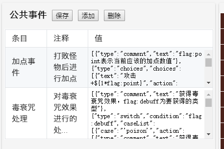
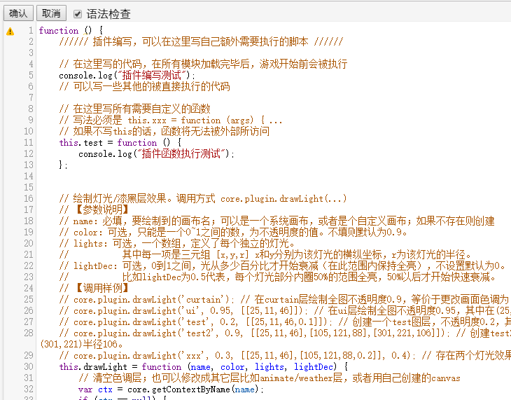

# 个性化

?> 目前版本**v2.5.4**，上次更新时间：* {docsify-updated} *

有时候只靠样板本身可能是不够的。我们需要一些个性化、自定义的素材，道具效果，怪物属性，等等。

## 图层的说明

HTML5魔塔是使用画布（canvas）来绘制，存在若干个图层，它们之间有一个覆盖关系，后面的图层将覆盖前面的图层。

所有图层从低往高依次如下：（加[B]的代表该层是大地图，[D]代表由系统按需动态创建，z-index代表该层的纵向高度）

- bg**[B]**：背景层；绘制背景图层素材bgmap，和背景贴图 (z-index: 10)
- event**[B]**：事件层；所有事件（道具、墙壁、NPC、怪物等）都绘制在这一层进行处理 (z-index: 30)
- hero：勇士层；主要用来绘制勇士 (z-index: 40)
- event2**[B]**：事件2层；本层主要用来绘制48x32的图片素材的上半部分（避免和勇士错位） (z-index: 50)
- fg**[B]**：前景层；绘制前景图层素材fgmap，和前景贴图 (z-index: 60)
- damage**[B]**：显伤层；主要用来绘制怪物显伤和领域显伤 (z-index: 65)
- animate：动画层；主要用来绘制动画。 (z-index: 70)
- weather**[D]**：天气层；主要用来绘制天气（雨/雪/雾） (z-index: 80)
- route**[D]**：路线层；主要用来绘制勇士的行走路线图。 (z-index: 95)
- paint**[D]**：绘图层；主要用来进行绘图模式。（z-index: 95)
- curtain：色调层；用来控制当前楼层的画面色调 (z-index: 125)
- image1\~50**[D]**：图片层；用来绘制图片等操作。（z-index: 100+code, 101~150；也就是图片编号在1~25的在色调层之下，26~50的在色调层之上）
- ui：UI层；用来绘制一切UI窗口，如剧情文本、怪物手册、楼传器、系统菜单等等 (z-index: 160)
- data：数据层；用来绘制一些顶层的或更新比较快的数据，如左上角的提示，战斗界面中数据的变化等等。 (z-index: 170)

### 动态创建canvas

从V2.5.3开始，可以在H5样板中任意动态创建canvas并进行使用。

使用`core.createCanvas(name, x, y, w, h, z)`来动态创建一个画布。

其中name为动态canvas名称，x,y,w,h为创建的画布相对窗口左上角的像素坐标和长宽，z为画布的纵向高度。

例如：`core.createCanvas('test', 10, 20, 100, 200, 74)` 创建了一个名为test的画布，其左上角相对窗口的像素坐标为(10,20)，宽100高200，纵向高度74（在动画层和天气层之间）。

该函数会返回画布的context，也可以通过 `core.dymCanvas[name]` 来获得；例如 `core.dymCanvas.test` 就是我们上面创建的画布的context，然后进行操作。

也可以简单的使用`core.fillText()`, `core.fillRect()`, `core.strokeRect()`等等对画布进行任意绘制。

``` js
core.fillText('test', '这是一段文字', 10, 30, '#FF0000', '16px Verdana'); // 绘制一段文本
```

使用 `core.deleteCanvas(name)` 删除一个动态创建的画布，例如 `core.deleteCanvas('test')`。

`core.deleteAllCanvas()`可以删除所有动态创建的画布，`core.relocateCanvas(name, x, y)`和`core.resizeCanvas(name, x, y)`可以对画布的位置和大小进行改变。

更多详细API请参见[API列表](api)。

## 自定义素材

所有素材的图片都在`images`目录下。
- `animates.png` 为所有动画效果。主要是星空熔岩，开门，毒网，传送门之类的效果。为四帧。
- `autotile*.png` 为Autotile块。
- `enemys.png` 为所有怪物的图片。
- `enemy48.png` 为所有48x32怪物的图片。
- `heros.png` 为勇士行走图。
- `items.png` 为所有道具的图标。
- `npcs.png` 为所有NPC的图标。
- `npc48.png` 为所有48x32的NPC图标。
- `terrains.png` 为所有地形的图标。

系统会读取`icon.js`文件，并获取每个ID对应的图标所在的位置。

### 使用预定义的素材

在images目录的“默认素材”下给定了若干预定义的自定义素材。

如果你需要某个素材已经存在，则可以直接将其覆盖images目录下的同名文件，就能看到效果。

### 背景和前景图层

从V2.4.1开始，样板允许多个图层叠加，最多支持背景层、事件层和前景层三个图层。

在地图编辑器中绘图时，下拉框选中“背景层”或“前景层”即可在对应的图层上绘图。

其中背景层和前景层可以使用任何素材，以及使用自动元件（autotile）。

可以使用`showBgFgMap`, `hideBgFgMap`, `setBgFgBlock`等事件对背景和前景图层进行操作。

### 使用自己的图片作为某层楼的背景/前景素材

由于HTML5功能（素材）有限，导致了对很多比较复杂的素材（比如房子内）等无法有着较好的绘图方式。

为了解决这个问题，我们允许用户自己放置一张或多张图片作为某一层的背景/前景素材。

要启用这个功能，我们首先需要在`data.js`中将可能的图片进行加载。

``` js
"images": [ // 在此存放所有可能使用的图片
    // 图片可以被作为背景/前景图，也可以直接用自定义事件进行显示。
    // 图片名不能使用中文，不能带空格或特殊字符；可以直接改名拼音就好
    // 建议对于较大的图片，在网上使用在线的“图片压缩工具(http://compresspng.com/zh/)”来进行压缩，以节省流量
    "bg.jpg", "house.png", "bed.png"// 依次向后添加
];
```

!> 请使用网上的一些[在线图片压缩工具](http://compresspng.com/zh/)对图片进行压缩，以节省流量。

之后，我们可以在每层剧本的`"images"`里来定义该层的默认背景/前景层的图片素材。

从V2.5.4开始，贴图也允许进行帧动画，只要设置第五项的数值。

``` js
"images": [[96,120,"bg.jpg",0]], // 背景图；你可以选择一张或多张图片来作为背景/前景素材。
"images": [], // 无任何背景图
"images": [[32,32,"house.png",0], [160,170,"bed.png",1]] // 在(32,32)放一个house.png在背景层，且(160,170)放bed.png在前景层
"images": [[96,120,"tree.png",2]] // 如果写2，则会自动调节遮挡效果
"images": [[64,0,"x.png",1,4]] // 这是一个前景层的4帧动画贴图
```

images为一个数组，代表当前层所有作为背景素材的图片信息。每一项为一个五元组，分别为该背景素材的x，y，图片名，遮挡方式和帧数。

其中x和y分别为左上角的像素坐标；图片名则必须在全塔属性的images中定义过。

第四项为遮挡方式，定义如下：

- 0：该图片将全部画在背景层，被勇士所遮挡。举例：某些特殊地形等。
- 1：该图片将全部画在前景层，可以遮挡勇士。举例：云彩等效果。
- 2：该图片将上部分画在前景层，下部分画在背景层。从而可以达到一个“自动调节遮挡的效果”。举例：树、房子等等。

!> 如果写2的话，最好让x，y和图片高度都是32的倍数！

第五项为图片的帧数，可选。如果进行了设置，则会将该贴图视为帧动画，并切分成对应的帧数。

例如，假设图片是100x100的，且帧数设为4，则视为四帧帧动画，每次绘制的图片大小实际上是25x100。

关于楼层贴图和前景、背景层的层叠覆盖关系，默认是：**地板 - 背景贴图 - 背景图块 - 事件 - 勇士 - 前景贴图 - 前景图块**。

可以通过修改`libs/maps.js`的`drawMap`函数中下面三行的顺序来改变其覆盖关系。

``` js
// ----- 可以调整这三行的顺序来修改覆盖关系；同层画布上，后绘制的覆盖先绘制的
// ----- ui.js的drawThumbnail函数也需要对应进行修改。

// 绘制楼层贴图
core.maps.drawFloorImages(floorId, images);
// 绘制背景层图块
core.maps.drawBgFgMap(floorId, core.canvas.bg, "bg", true);
// 绘制前景层图块
core.maps.drawBgFgMap(floorId, core.canvas.fg, "fg", true);
```

楼层贴图可以被事件隐藏和显示，详见[隐藏贴图](event#hideFloorImg：隐藏贴图)的写法。

**如果要让贴图的某些点不可通行，则可以使用noPass或者空气墙。**

!> 小技巧：可以使用帧动画贴图来贴一些大型怪物，比如魔龙、章鱼，或者《永不复还》中的恐怖利刃等等。如果使用帧贴图来贴怪物，则可以使用一个“透明的怪物”放置在对应位置并写上具体属性数值（这样就可以进行战斗和显伤了）；然后可以使用[displayIdInBook](element#怪物的朝向问题)在怪物手册中将该透明怪物映射到另一个有素材的怪物ID上。战斗完毕后使用[隐藏贴图](event#hideFloorImg：隐藏贴图)事件将贴图隐藏即可。

### 使用便捷PS工具生成素材

如果我们有更多的素材要求，我们可以使用“便捷PS工具”进行处理。


我们可以打开有需求改变的素材，和我们需要被替换的素材，然后简单的Ctrl+C和Ctrl+V操作即可。

便捷PS工具同样支持图片色相的修改，和RMXP几乎完全相同。

用这种方式，我们能极快地替换或素材，包括需要新增的怪物。

### 添加素材到游戏

在使用地图编辑器编辑的过程中，我们有可能会出现“该数字和ID未被定义”的错误提示。

这是因为，该素材没有被定义，无法被游戏所识别。

!> 在V2.0中，我们可以简单的在地图编辑器中新增素材，以及定义新增素材的ID和数字，但是仍然**强烈建议**对素材的机制进行了解。

#### 素材的机制

本塔所有的素材都拥有三个属性：**ID**，**索引**，**数字**。
- **ID** 为该素材的唯一标识符，任何两个素材的ID都不能相同。
- **索引** 为该素材的在对应图片上的图标索引，即该素材是图片上的第几个。
- **数字** 为该素材的对应数字，以方便地图的生成和存储。

**`ID-索引` 对应关系定义在icons.js文件中。该文件将唯一确定一个ID在图片上所在的位置。**

**`ID-数字` 对应关系定义在maps.js文件中。该文件将唯一确定一个ID对应的数字是多少。**

在V2.0中，我们可以在地图编辑器中很方便查看每个图块的三个属性信息。

#### 注册素材

在V2.0的地图编辑器中，要注册新素材，我们只需要在图块属性一栏输入新素材的ID和数字。


ID必须由数字字母下划线组成，数字在1000以内，且均不能和已有的进行重复。

之后刷新编辑器即可。

对于怪物和道具，我们也可以进行自动注册，只需要点击“自动注册”按钮，将对该栏下所有未注册的素材进行自动注册（自动分配ID和数字）。

素材注册完毕后，即可在游戏中正常使用，也可以被地图生成器所识别（需要重开地图生成器）。

#### Autotile自动元件的注册

但是，通过上面这种方式，我们是没办法新增并注册Autotile的。

除了替换样板现有的几个外，如果我们还需要新添加Autotile，则：

1. 下拉框切到“追加素材”，导入文件到画板，然后导入一张Autotile自动元件图片。
2. 下拉框选择autotile，然后点“追加”
3. 看到成功的提示后刷新编辑器即可。

<!--

1. 将新的Autotile图片复制到images目录下。文件名必须是字母数字和下划线组成。
2. 进入icons.js，在autotile分类下进行添加该文件的名称，索引简单的写0。
3. 指定一个数字，在maps.js中类似进行添加。

!> Autotile的ID和文件名应确保完全相同！

-->
<!--
#### 新添加自定义地形（路面、墙壁等）

如果你在terrains.png中新增了一行：

1. 指定一个唯一的英文ID，不能和现有的重复。
2. 进入icons.js，在terrains分类下进行添加索引（对应图标在图片上的位置，即index）

**如果你无须在游戏内使用本地形，而仅仅是将其作为“背景图”使用，则操作如下：**
3. 修改对应楼层的剧本文件的`defaultGround`项，改成新的ID。

**如果你要在游戏内使用本地形，则操作如下：**
3. 指定一个数字，在maps.js中类似进行添加。

#### 新添加Autotile

如果你需要新增一个Autotile：

1. 将新的Autotile图片复制到images目录下。
2. 进入icons.js，在autotile分类下进行添加该文件的名称，索引简单的写0。
3. 指定一个数字，在maps.js中类似进行添加。

!> Autotile的ID和文件名完全相同！且其ID/文件名不能含有中文、空格或特殊字符。

!> V2.0版本不能在地图编辑器中添加Autotile，请按上面的操作来执行。

#### 新添加道具

如果你需要新增一个未被定义的道具：

1. 指定一个唯一的英文ID，不能和现有的重复。
2. 进入icons.js，在items分类下进行添加索引（对应图标在图片上的位置，即index）
3. 指定一个数字，在maps.js中类似进行添加。
4. 在items.js中仿照其他道具，来添加道具的信息。

有关如何自行实现一个道具的效果，参见[自定义道具效果](#自定义道具效果)。

#### 新添加怪物

如果我们需要新添加怪物，请在enemys.png中新增一行。

你可以通过便捷PS工具的“更改色相”来将红头怪变成橙头怪等。

然后执行如下操作：

1. 指定一个唯一的英文ID，不能和enemys中现有的重复。
2. 进入icons.js，在enemys分类下进行添加索引（对应图标在图片上的位置，即index）
3. 在maps.js中继续进行添加。
4. 在enemys.js中仿照其他怪物，来添加怪物的信息。

!> 如果是48x32的怪物素材，请放在enemy48.png中，然后在icons.js的enemy48下添加索引。

有关如何自行实现一个怪物的特殊属性或伤害计算公式，参见[怪物的特殊属性](#怪物的特殊属性)。

#### 新添加NPC

1. 指定一个唯一的英文ID，不能和现有的重复。
2. 进入icons.js，在npcs分类下进行添加索引（对应图标在图片上的位置，即index）
3. 指定一个数字，在maps.js的getBlock下类似进行添加。

!> 如果是48x32的怪物素材，请放在npc48.png中，然后在icons.js的npc48下添加索引。

-->

### 地图生成器使用自定义素材

地图生成器是直接从js文件中读取数字-图标对应关系的。

因此，在你修改了icons.js和maps.js两个文件，也就是将素材添加到游戏后，地图生成器的对应关系也将同步更新。

### 额外素材

从V2.4.2开始，HTML5魔塔样板开始支持额外素材。

具体而言，通过上面的“素材导入”的方式，确实可以有效地添加素材到游戏。但是，如果想增加大量自定义素材，需要通过便捷PS工具将这些素材全部导入到`terrains.png`中，并且全部是单列，极度不友好。这也导致了野外风的制作相对变得很困难，增加了大量素材处理的工作量。

额外素材就是为了解决这个问题而被提出。

所谓`额外素材`，即用户可以自定导入任意张素材图片，无需PS，无需注册，即可直接在游戏中使用。这一点已经十分向RM靠拢了。

要使用额外素材，请将你需要的素材图片放在`images`目录下，并在`全塔属性`的`tilesets`中定义图片名。

**该素材的宽高必须都是32的倍数，且图片上的总图块数不超过1000（即最多有1000个32*32的图块在该图片上）。**

```js
"tilesets": ["1.png", "2.png"]    // 导入两个额外素材，文件名分别是1.png和2.png
```

刷新后，系统会自动加载该素材并添加到素材区。

额外素材无需导入，无需注册。在`tilesets`中定义了图片后，即可直接使用绘图，无需再注册其数字和ID。其ID、索引和数字均为系统自动分配，且不允许修改。

请注意，额外素材的ID、索引和数字，与该图片在tilesets数组中的index及该素材在图片上的位置都有关系。

!> **因此如果对`tilesets`数组随意删除或修改顺序，可能会导致所有额外素材全部发生变化！这点请务必注意！！！**

除此之外，额外素材在游戏中的使用和正式素材都是一致的，也能在前景或背景图层绘制。

额外素材可以使用“tileset贴图”的方式进行绘制，一次绘制一个矩形区域。

## 自定义道具效果

本节中将继续介绍如何自己编辑一个道具的效果。

道具效果的具体实现都在`items.js`中。

### 即捡即用类道具（cls: items）

对于即捡即用类道具，如宝石、血瓶、剑盾等，我们可以简单地修改`data.js`中的value一栏即可。

如果你想要同种宝石在不同层效果不同的话，可以进行如下操作：

1. 在楼层的item_ratio中定义宝石的比率（比如1-10的写1，11-20层写2等）
2. 修改获得道具的itemEffect函数（编辑器中双击进行编辑）

``` js
// ratio为楼层的item_ratio值，可以进行翻倍宝石属性
core.status.hero.atk += core.values.redJewel * ratio
```

这里我们可以直接写ratio来取用该楼层中定义的`item_ratio`的值。

如果不是倍数增加（比如线性增加）也可以类似来写

``` js
// 一个二倍线性增加的例子
core.status.hero.atk += core.values.redJewel + 2*ratio
```

### 消耗类道具（cls: tools）；永久类道具（cls: constants）

如果要自己实现消耗类道具或永久类道具的使用效果，则需修改`items.js`中的canUseItem和useItem两个函数。

具体过程比较复杂，需要一定的JS能力，在这里就不多说了，有需求可以找`艾之葵`进行了解。

但值得一提的是，我们可以使用`core.hasItem(name)` 来判断是否某个道具是否存在。例如下面是passNet（通过路障处理）的一部分：

``` js
/****** 经过路障 ******/
events.prototype.passNet = function (data) {
    // 有鞋子
    if (core.hasItem('shoes')) return;
    if (data.event.id=='lavaNet') { // 血网
// ... 下略
```

我们进行了一个简单的判断，如果拥有绿鞋，则不进行任何路障的处理。

### 实战！拿到神圣盾后免疫吸血、领域、夹击效果

1. 在itemEffect中修改拿到神圣盾时的效果，标记一个自定义Flag。
``` js
core.status.hero.def += core.values.shield5 * ratio;
core.setFlag("shield5", true); // 增加一个自定义Flag：已经拿到神圣盾
```
2. 免疫吸血效果：在脚本编辑的getDamageInfo中，编辑成如果存在神圣盾标记，吸血伤害为0。
``` js
function (enemy, hero_hp, hero_atk, hero_def, hero_mdef, x, y, floorId) {
// ... 上略
    // 吸血
    if (this.hasSpecial(mon_special, 11)) {
        var vampireDamage = hero_hp * enemy.value;

        // 如果有神圣盾免疫吸血等可以在这里写
        // 也可以用hasItem或hasEquip来判断装备
        if (core.hasFlag("shield5")) vampireDamage = 0; // 存在神圣盾，吸血伤害为0

        vampireDamage = Math.floor(vampireDamage) || 0;
        // 加到自身
        if (enemy.add) // 如果加到自身
            mon_hp += vampireDamage;

        initDamage += vampireDamage;
    }
// ... 下略
```
3. 免疫领域、夹击、阻击效果：在2.4.1之后，可以直接将flag:no_zone设为true来免疫领域效果，其他几个同理。
``` js
// 写在获得道具后事件
[
    // 设置不同的flag可以分别无视对应的阻激夹域效果
    {"type": "setValue", "name": "flag:no_zone", "value": "true"}, // 免疫领域
    {"type": "setValue", "name": "flag:no_snipe", "value": "true"}, // 免疫阻击
    {"type": "setValue", "name": "flag:no_laser", "value": "true"}, // 免疫激光
    {"type": "setValue", "name": "flag:no_betweenAttack", "value": "true"}, // 免疫夹击
]
```
4. 如果有更高的需求，例如想让吸血效果变成一半，则还是在上面这些地方进行对应的修改即可。

## 新增门和对应的钥匙

如果要新增一个门和对应的钥匙，需要进行如下几步：

1. 在terrains.png中添加新的门的素材，并在地图编辑器中注册门的ID。该ID必须是以`Door`结尾，例如`abcDoor`。
2. 在animates.png中添加开门的四格动画，然后直接打开icons.js文件，在animates下直接添加ID和索引信息，例如`'abcDoor': 34`。
3. 在items.png中添加钥匙的素材，并在地图编辑器中注册钥匙的ID。该ID必须是和门对应且以`Key`结尾，例如`abcKey`。
4. 该道具的cls应为`tools`，可以自行写道具描述，最下面几项均留`null`即可。

!> **请勿在animates中对门的动画素材进行注册！而是请直接打开icons.js文件并添加ID和索引信息！！！**

!> terrains和animates的门ID必须完全一致，且以`Door`结尾；所对应的钥匙ID应当是把`Door`换成`Key`，这样才能对应的上！

## 覆盖楼传事件

对于特殊的塔，我们可以考虑修改楼传事件来完成一些特殊的要求，比如镜子可以按楼传来切换表里。

要修改楼传事件，需要进行如下几步：

1. 截获楼传的点击事件。在control.js中找到useFly函数，并将其替换成如下内容：
``` js
////// 点击楼层传送器时的打开操作 //////
control.prototype.useFly = function (need) {
    if (!core.status.heroStop) {
        core.drawTip("请先停止勇士行动");
        return;
    }
    if (core.canUseItem('fly')) core.useItem('fly');
    else core.drawTip("当前无法使用"+core.material.items.fly.name);
}
```
2. 修改楼传的使用事件。和其他永久道具一样，在地图编辑器的图块属性中修改楼传的useItemEffect和canUseItemEffect两个内容。例如：
``` js
"useItemEffect": "core.insertAction([...])" // 执行某段自定义事件，或者其他脚本
"canUseItemEffect": "true" // 任何时候可用
```
修改时，请先把`null`改成空字符串`""`，然后再双击进行编辑。

<!--

## 自定义装备

由于HTML5魔塔并不像RM那样存在一个装备界面可供我们对装备进行调整，但是我们也可以使用一个替代的方式实现这个目标。

### 装备的实现原理

在HTML5中，装备将全部看成是永久道具（constants），同时对于每个装备位置，勇士都定义一个flag域表示正在装备的内容。

例如：当勇士获得银剑时，将获得一个永久道具“银剑”；当使用这个银剑，首先检查勇士当前是否装备了武器（比如铁剑），如果
装备了则先脱掉装备（减去已装备的铁剑所加的属性，并获得永久道具铁剑），然后再穿上新的银剑。

同时由于脱剑术和脱盾术的存在，我们还需要一个“脱掉装备”的永久道具（比如sword0），使用它可以脱掉对应位置的装备。

### 装备加值的修改

要启用装备，首先需要在data.js（全塔属性）中设置`'equipment': true`。此时，游戏内将自动将剑盾变成装备的存在，其
所加的数值就是全塔属性中对应的数值（比如铁剑sword1就加的全塔属性中sword1的值）。

有时候，我们还会有一个装备加多种属性的需求，此时需要将对应的项从数值改变成一个对象。

``` js
"sword1": {"atk": 10, "def": 0, "mdef": 5}, // 铁剑加10攻和5魔防
"shield1": {"atk": 0, "def": 10, "mdef": 10}, // 铁盾加10防和10魔防
```

通过这种方式，当穿上装备时，将会给你的三围分别加上对应项的数值（支持负数，比如装剑减防御）。

### 新增剑盾

样板默认提供了铁剑（盾），银剑（盾），骑士剑（盾），圣剑（盾）和神圣剑（盾）这五类装备。但有时候，五类是不够的，
我们可能还需要更多的剑盾。

要增加更多的剑盾，我们需要进行如下步骤：（以新增剑为例）

1. 新注册一个素材到游戏；**其ID必须是sword+数字的形式，比如sword6等。**（同理如果是盾就必须是shield+数字的形式比如shield6。）
2. 将其cls设置为`constants`，`useItemEffect`和`canUseItem`直接复制其他几个剑盾的内容。  
（即：`useItemEffect`必须为`"core.plugin.useEquipment(itemId)"`，`canUseItemEffect`必须为`"true"`）。
3. 使用VSCode或其他文本编辑器直接打开`data.js`文件，并在`"values"`中仿照已有的内容添加剑盾的属性。  
（例如：`"sword6": 100`，或者`"sword6": `{"atk": 100, "def": 0, "mdef": 50}`）

!> 请注意：新的剑的ID必须是sword+数字，新的盾的ID必须是shield+数字的形式，不然装备将无效！

### 新增其他部位的装备

如果我们还需要新增更多部位的装备，比如戒指、首饰等等，也是可以的，只需要依次进行如下步骤：（以新建戒指为例）

1. 选择一个装备的部位的ID；比如假设我们的装备部位为戒指，那么我们可以选择"ring"作为装备的部位。
2. 定义一个空戒指，相当于脱掉戒指。注册一个素材到游戏，**其ID必须是ring0**（即部位ID+数字0）。
3. 同上述新建剑盾的方式来设置ring0这个空戒指的属性。请注意打开data.js后，设置的其值必须为0。  
(即：必须是`"ring0": 0`)
3. 创建更多的戒指；每加一个新的戒指到游戏，其ID必须是**ring+数字**的形式，比如`ring1`, `ring2`，等等。
4. 对于每一个创建的戒指，按照上述新建剑盾的方式设置属性（图块属性，打开data.js直接编辑）。  
（例如：`"ring2": {"atk": 3, "def": 5, "mdef": 8}`）
5. **切换到脚本编辑 - 自定义插件编写，在`this.useEquipment`中仿照着新增一行代表戒指的使用。**

``` js
this.useEquipment = function (itemId) { // 使用装备
	_useEquipment(itemId, "sword", "atk"); // 剑
	_useEquipment(itemId, "shield", "def"); // 盾
	_useEquipment(itemId, "ring", "mdef"); // 新增的戒指
}
```

我们仿照着新增一行`_useEquipment(itemId, "ring", "mdef")`。

其中第二项为装备部位的ID，比如我们上述定义的是ring；第三项表示“如果values中该值为数字，则加到什么属性上”。
比如如果我们这里写mdef，那么我们假设在data.js的values中设置`"ring1": 20`，则使用该戒指会增加20点魔防。

如果你定义的是对象`{"atk": xxx, "def": xxx, "mdef": xxx}`的形式，则不会受到第三项的影响。

!> 必须对于每一个装备部位定义唯一一个不同的ID；脱掉装备（空装备）必须是该ID加数字0的形式，其他有效装备必须是
该ID+正整数的形式，不然会出错！

-->

## 自定义怪物属性

如果你对现有的怪物不满意，想自行添加怪物属性也是可以的。具体参见脚本编辑-getSpecials。

你需自己指定一个special数字，修改属性名和属性提示文字。后两者可以直接写字符串，或写个函数传入怪物。

如果要修改伤害计算公式，请修改下面的getDamageInfo函数。请注意，如果无法战斗，该函数必须返回`null`。

!> 如果改动了伤害计算公式，可能导致临界计算崩掉，因此建议将全塔属性中的`useLoop`置为true。

对于毒衰弱怪物的战斗后结算在脚本编辑中的afterBattle函数中。

对于领域、夹击、阻击怪物的检查在`control.js`中的checkBlock函数中。

## 自定义快捷键

如果需要绑定某个快捷键为处理一段事件，也是可行的。

要修改按键，我们可以在脚本编辑的`onKeyUp`进行处理：

比如，我们设置一个快捷键进行绑定，比如`Y`，其keycode是89。（有关每个键的keycode搜一下就能得到）

然后在脚本编辑的`onKeyUp`函数的`switch`中进行处理。

``` js
case 89: // 使用该按键的keyCode，比如Y键就是89
    // 还可以再判定altKey是否被按下，即 if (altKey) { ...

    // ... 在这里写你要执行脚本
    // **强烈建议所有新增的自定义快捷键均能给个对应的道具可点击，以方便手机端的行为**
    if (core.hasItem('...')) {
        core.useItem('...');
    }

    break;
```

强烈建议所有新增的自定义快捷键均给个对应的永久道具可点击，以方便手机端的行为。

可以使用altKey来判断Alt键是否被同时按下。

## 公共事件

从V2.5.4开始，样板提供了“公共事件”下拉框，我们可以在里面用事件编辑器进行编辑，并通过`{"type":"insert"}`进行调用。



具体详见[插入公共事件或另一个地点的事件并执行](event#insert：插入公共事件或另一个地点的事件并执行)。

当然，继续使用**插件**的写法也是可以的。

## 插件系统

在H5中，提供了“插件”系统。具体参见“脚本编辑 - 插件编写”。



当我们在这上面定义了自己需要的函数（插件后），就可以通过任何方式进行调用。

在这个插件编写的过程中，我们可以使用任何[常见API](api)里面的代码调用；也可以通过`core.insertAction`来插入自定义事件执行。

下面是一个很简单的例子，我编写一个插件函数，其效果是让勇士生命值变成原来的x倍，并令面前的图块消失。

``` js
this.myfunc = function(x) {
    core.status.hero.hp *= x; // 勇士生命翻若干倍
    core.insertAction([ // 自定义事件：令面前的图块消失。
        {"type": "setValue", "name": "flag:x", "value": "core.nextX()"},
        {"type": "setValue", "name": "flag:y", "value": "core.nextY()"},
        {"type": "hide", "loc": ["flag:x", "flag:y"]}
    ]);
}
```

然后比如我们在某个道具的使用效果 `useItemEffect` 中写 `core.plugin.myfunc(2)` 即可调用此插件函数。也可以在战后事件或自定义脚本等位置来写。

网站上也提供了一个[插件库](https://h5mota.com/plugins/)，欢迎大家把自己写的插件进行共享。

## 标题界面事件化

从V2.5.3开始，我们可以将标题界面的绘制和游戏开始用事件来完成。可以通过绘制画布、

全塔属性，flags中的startUsingCanvas可以决定是否开启标题界面事件化。

然后就可以使用“事件流”的形式来绘制标题界面、提供选项等等。

在这里可以调用任意事件。例如，可以贴若干个图，可以事件切换楼层到某个剧情层再执行若干事件，等等。

关于选项，样板默认给出的是最简单的choices事件；你也可以使用贴按钮图，循环处理+等待操作来定制自己的按钮点击效果。

!> 开始游戏、读取存档、录像回放的效果已经默认给出，请不要修改或删减这些内容，以免出现问题。

标题界面事件全部处理完后，将再继续执行startText事件。

## 手机端按键模式

从V2.5.3以后，我们可以给手机端增加按键了，这样将非常有利于技能的释放。

当用户在竖屏模式下点击工具栏，就会在工具栏按钮和快捷键模式之间进行切换。

切换到快捷键模式后，可以点1-7，分别等价于在电脑端按键1-7。

可以在脚本编辑的onKeyUp中定义每个快捷键的使用效果，比如使用道具或释放技能等。

默认值下，1使用破，2使用炸，3使用飞，4使用其他存在的道具，5-7未定义。可以相应修改成自己的效果。

也可以替换icons.png中的对应图标，以及修改main.js中`main.statusBar.image.btn1~7`中的onclick事件来自定义按钮和对应按键。

非竖屏模式下、回放录像中、隐藏状态栏中，将不允许进行切换。

## 自定义状态栏（新增显示项）

在V2.2以后，我们可以自定义状态栏背景图（全塔属性 - statusLeftBackground）等等。

但是，如果我们还想新增其他项目的显示，比如攻速或者暴击，该怎么办？

需要进行如下几个操作：

1. 定义ID；比如攻速我就定义speed，暴击可以简单的定义baoji；你也可以定义其他的ID，但是不能和已有的重复。这里以speed为例。
2. 在index.html的statusBar中（44行起），进行该状态栏项的定义。仿照其他几项，插在其应当显示的位置，注意替换掉相应的ID。
``` html
<div class="status" id="speedCol">
    
    <p class='statusLabel' id='speed'></p>
</div>
```
3. 在editor.html中的statusBar（323行起），仿照第二点同样添加；这一项如果不进行则会地图编辑器报错。editor-mobile.html同理。
4. 使用便捷PS工具，打开icons.png，新增一行并将魔力的图标P上去；记下其索引比如37（从0开始数）。
5. 在main.js的this.statusBar中增加图片、图标和内容的定义。
``` js
this.statusBar = {
    'images': {
        // ...其他略
        'speed': document.getElementById("img-speed"), // 图片的定义
    },
    'icons': {
        // ...其他略
        'speed': 37, // 图标的定义，这里对应的是icons.png中的索引
    },
    // ...其他略
    'speed': document.getElementById('speed'), // 显示内容（数据）的定义
}
```
6. 显示内容的设置。在脚本编辑的updateStatusBar函数，可以对该状态栏显示内容进行设置，下面是几个例子。
``` js
// 设置其显示内容为status:speed值；需要在project/data.js中firstData的hero那里新增初始值`"speed": 0`。
core.statusBar.speed.innerHTML = core.getStatus('speed');
// 设置其显示内容为flag:speed值，无需额外进行定义。
core.statusBar.speed.innerHTML = core.getFlag('speed', 0);
```

## 技能塔的支持

其实，在HTML5上制作技能塔是完全可行的。

要支持技能塔，可能需要如下几个方面：

- 魔力（和上限）的添加；技能的定义
- 状态栏的显示
- 技能的触发（按键与录像问题）
- 技能的效果

从V2.5开始，内置了"二倍斩"技能，可以仿照其制作自己的技能。

### 魔力的定义添加；技能的定义

从V2.5开始，提供了status:mana选项，可以直接代表当前魔力值。

如果要启用，需要开启全塔属性的enableMana选项。

如果需要魔力上限，则可以使用flag:manaMax来表示当前的魔力最大值。

同时，我们可以使用flag:skill表示当前开启的技能编号，flag:skillName表示当前开启的技能名称。

如果flag:skill不为0，则代表当前处于某个技能开启状态，且状态栏显示flag:skillName值。伤害计算函数中只需要对flag:skill进行处理即可。

### 状态栏的显示

从V2.5开始，魔力值和技能名的状态栏项目已经被添加，可以直接使用。

在脚本编辑-updateStatusBar中，可以对状态栏显示内容进行修改。

``` js
// 设置魔力值
if (core.flags.enableMana) {
    // 也可以使用flag:manaMax来表示最大魔力值
    // core.status.hero.mana = Math.max(core.status.hero.mana, core.getFlag('manaMax', 10));
    // core.statusBar.mana.innerHTML = core.status.hero.mana + "/" + core.getFlag('manaMax', 10);
}
// 设置技能栏
if (core.flags.enableSkill) {
    // 可以用flag:skill表示当前开启的技能类型，flag:skillName显示技能名
    core.statusBar.skill.innerHTML = core.getFlag('skillName', '无');
}
```

### 技能的触发

#### 使用道具作为技能

由于手机端按键十分不方便，虚拟键盘不好用，因此强烈推荐**给每个技能设置一个道具图标，在道具栏点击使用！**

下面是个很简单的例子，要制作一个技能"二倍斩"。

我们可以设置一个道具，其cls是`constants`（永久道具），ID比如是`skill1`。

该道具的使用判定`canUseItemEffect`是`true`（表示任意时候都可使用），使用效果`useItemEffect`是：

``` js
if (core.getFlag('skill', 0)==0) { // 判断当前是否已经开了技能
    if (core.getStatus('mana')>=5) { // 这里要写当前能否开技能的条件判断，比如魔力值至少要多少
        core.setFlag('skill', 1); // 开技能1
        core.setFlag('skillName', '二倍斩'); // 设置技能名
    }
    else {
        core.drawTip("魔力不足，无法开技能");
    }
}
else { // 关闭技能
    core.setFlag('skill', 0); // 关闭技能状态
    core.setFlag('skillName', '无');
}
```

简单的说，用flag:skill判断当前开启的技能，flag:skillName表示该技能名。（可在状态栏显示）

该（技能）道具任何时候都可被使用；使用时，判断当前是否开启了技能，如果开启则关闭，没开则再判断是否允许开启（魔力值够不够等）。

#### 快捷键触发技能

在PC端，我们还可以按键触发技能。

在技能的道具定义完毕后，再将该道具绑定到一个快捷键上。有关绑定按键请参见[自定义快捷键](#自定义快捷键)。

下面是一个很简单的例子，当勇士按下W后，触发我们上面定义的二倍斩技能。

``` js
case 87: // W：开启技能“二倍斩”
    // 检测技能栏是否开启，是否拥有“二倍斩”这个技能道具
    if (core.flags.enableSkill && core.hasItem('skill1')) {
        core.useItem('skill1');
    }
    break;
```

在勇士处于停止的条件下，按下W键时，判断技能的道具是否存在，如果存在再使用它。

!> 1，2，3这三个键被默认绑定到了破炸飞；如果想用的话也是一样，只不过是把已有的实现进行替换。

### 技能的效果

最后一点就是技能的效果；其实到了这里就和RM差不多了。

技能的效果要分的话有地图类技能，战斗效果类技能，后续影响类技能什么的，这里只介绍最简单的战斗效果类技能。

其他的几类技能根据需求可能更为麻烦，有兴趣可自行进行研究。

战斗效果内技能要改两个地方：战斗伤害计算，战后扣除魔力值。

战斗伤害计算在脚本编辑的`getDamageInfo`函数，有需求直接修改这个函数即可。

战后扣除魔力值则在脚本编辑的`afterBattle`中进行编辑即可。

举个例子，我设置一个勇士的技能：二倍斩，开启技能消耗5点魔力，下一场战斗攻击力翻倍。

那么，直接在脚本编辑的`getDamageInfo`中进行判断：

``` js
if (core.getFlag('skill', 0)==1) { // 开启了技能1
    hero_atk *= 2; // 计算时攻击力翻倍
}
```

然后在脚本编辑的`afterBattle`中进行魔力值的扣除：

``` js
// 战后的技能处理，比如扣除魔力值
if (core.flags.enableSkill) {
    // 检测当前开启的技能类型
    var skill = core.getFlag('skill', 0);
    if (skill==1) { // 技能1：二倍斩
        core.status.hero.mana-=5; // 扣除5点魔力值
    }
    // 关闭技能
    core.setFlag('skill', 0);
    core.setFlag('skillName', '无');
}
```

!> 开启技能后，建议将全塔属性的useLoop置为true，即改用循环计算临界值，这样临界计算才不会出问题！

&nbsp;

通过上述这几种方式，我们就能成功的让H5支持技能啦！

## 成就系统

我们还可以给HTML5魔塔增加成就系统。注意到成就是和游戏相关，因此需要使用getLocalStorage而不是getFlag判定。

可将下面的代码粘贴到脚本编辑 - 插件编写中。

``` js
// 所有成就项的定义
this.achievements = [
    // 每行一个，分别定义flag、名称、描述、是否存在提示、成就点数
    {"flag": "a1", "name": "成就1", "text": "成就1的达成描述", "hint": false, "point": 1},
    // 可以继续往后新增其他的。
];

// 达成成就；如 core.plugin.achieve("a1") 即达成a1对应的成就
this.achieve = function (flag) {
    // 获得已达成的成就；如果跟存档而不是跟游戏则改成getFlag
    var achieved = core.getLocalStorage("achievements", []);
    var point = core.getLocalStorage("achievePoint", 0);
    // 已经获得该成就
    if (achieved.indexOf(flag)>=0) return;
    // 尝试达成成就；找到对应的成就项
    this.achievements.forEach(function (one) {
        if (one.flag == flag) {
            // 执行达成成就的操作；也可以自行在上面加上达成成就后的事件
            core.insertAction("\t[达成成就："+one.name+"]"+one.text);
            point += one.point || 0;
        }
    });
    achieved.push(flag);
    // 存入localStorage中；如果跟存档走则使用setFlag
    core.setLocalStorage("achievements", achieved);
    core.setLocalStorage("achievePoint", point);
}

// 获得所有成就说明；这里简单使用两个insertAction，你也可以修改成自己的实现
// 简单一点的可以使用insertAction+剧情文本；稍微复杂一点的可以使用图片化文本等；更复杂的可以自绘UI。
this.getAchievements = function () {
    var achieved = core.getLocalStorage("achievements", []);
    var yes = [], no = [];
    // 对所有成就进行遍历
    this.achievements.forEach(function (one) {
        // 检测是否达成
        if (achieved.indexOf(one.flag)>=0) {
            yes.push(one.name+"："+one.text);
        }
        else {
            no.push(one.name+"："+(one.hint?one.text:"达成条件请自行探索"));
        }
    });
    core.insertAction([
        "\t[已达成的成就]"+(yes.length==0?"暂无":yes.join("\n")),
        "\t[尚未达成的成就]"+(no.length==0?"暂无":no.join("\n"))
    ]);
}
```


## 多角色的支持

其实，我们的样板还能支持多角色的制作。比如《黑·白·间》之类的塔也是完全可以刻的。

你只需要如下几步来达到多角色的效果。

1. 每个角色弄一张行走图。相关信息参见[自定义事件：setHeroIcon](event#setHeroIcon：更改角色行走图)。
2. [覆盖楼传事件](#覆盖楼传事件)，这样可以通过点工具栏的楼层传送按钮来切换角色。当然你也完全可以自己写一个道具，或[自定义快捷键](#自定义快捷键)来进行绑定。
3. 将下述代码直接贴入脚本编辑 - 插件编写中。
    ``` js
    // 所有需要保存的内容；这些保存的内容不会多角色共用，在切换时会进行恢复。
    // 你也可以自行新增或删除，比如不共用金币则可以加上"money"的初始化，不共用道具则可以加上"items"的初始化，
    // 多角色共用hp的话则删除hp，等等。总之，不共用的属性都在这里进行定义就好。
    var hero1 = { // 1号勇士（默认的是0号）
        "floorId": "MT0", // 该角色楼层ID
        "icon": "hero1.png", // 角色的行走图名称
        "name": "1号角色",
        "lv": 1,
        "hp": 1000,
        "atk": 10,
        "def": 10,
        "mdef": 0,
        "loc": {"x": 0, "y": 0, "direction": "up"},
        // 如果道具不共用就将下面这句话取消注释
        // "items": {"keys":{"yellowKey":0,"blueKey":0,"redKey":0},"tools":{},"constants":{}}
    }
    // 也可以类似新增其他勇士
    // var hero2 = { ...

    var heroCount = 2; // 包含默认的在内总共多少个勇士，该值需手动修改。
    
    // 初始化该勇士
    this.initHeros = function () {
        core.status.hero.icon = "hero.png";
        core.setFlag("hero1", core.clone(hero1)); // 将属性值存到变量中
        // core.setFlag("hero2", core.clone(hero2)); // 更多的勇士...
    }
    
    // 切换勇士
    this.changeHero = function (toHeroId) {
        var currHeroId = core.getFlag("heroId", 0); // 获得当前角色ID
        if (!core.isset(toHeroId)) {
            toHeroId = (currHeroId+1)%heroCount;
        }
        if (currHeroId == toHeroId) return;

        var saveList = Object.keys(hero1);

	    // 保存当前内容
        var toSave = {};
        saveList.forEach(function(name) {
            if (name=='floorId') toSave[name] = core.status.floorId; // 楼层单独设置
            else toSave[name] = core.clone(core.status.hero[name]); // 使用core.clone()来创建新对象
        })
    
        core.setFlag("hero"+currHeroId, toSave); // 将当前角色信息进行保存
        var data = core.getFlag("hero"+toHeroId); // 获得要切换的角色保存内容
    
        // 设置角色的属性值
        saveList.forEach(function(name) {
            if (name != 'floorId')
                core.status.hero[name] = core.clone(data[name]);
        })
    
        // 插入事件：改变角色行走图并进行楼层切换
        core.insertAction([
            {"type": "setHeroIcon", "name": data.icon||"hero.png"}, // 改变行走图
            {"type": "changeFloor", "floorId": data.floorId, "loc": [data.loc.x, data.loc.y], 
                "direction": data.loc.direction, "time": 0} // 楼层切换事件
        ])
        core.setFlag("heroId", toHeroId); // 保存切换到的角色ID
    }
    ```
3. 在脚本编辑 - setInitData中加上`core.plugin.initHeros()`来初始化新勇士。（写在`core.events.afterLoadData()`后，反大括号之前。）
4. 如果需要切换角色（包括事件、道具或者快捷键等），可以直接调用自定义JS脚本：`core.plugin.changeHero();`进行切换。也可以指定参数调用`core.plugin.changeHero(1)`来切换到某个具体的勇士上。

## 系统使用的flag变量

众所周知，自定义flag变量都可以任意定义并取用（未定义直接取用的flag默认值为0）。

下面是一些可能会被系统设置或取用的flag变量：

- **`flag:hard`**: 当前的难度标志；此flag变量在setInitData中被定义，可以直接取用来判定当前难度分歧。上传成绩时将根据此flag来对不同难度进行排序。
- **`flag:posion`**, **`flag:weak`**, **`flag:curse`**: 中毒、衰弱、诅咒状态。
- **`flag:no_zone`**, **`flag:no_snipe`**, **`flag:no_laser`**, **`flag:no_betweenAttack`**: 是否分别免疫领域、阻击、激光、夹击效果。
- **`flag:hatred`**: 当前的仇恨数值。
- **`flag:commonTimes`**: 全局商店共用次数时的访问次数。
- **`flag:input`**: 接受用户输入的事件后，存放用户输入的结果。
- **`flag:type`**, **`flag:keycode`**, **`flag:x`**, **`flag:y`**, **`flag:px`**, **`flag:py`**: 等待用户操作后，用户的操作类型，按键keycode或点击/像素坐标。
- **`flag:skill`**, **`flag:skillName`**: 开启的技能编号和技能名。
- **`flag:heroIcon`**: 当前的勇士行走图名称。
- **`flag:saveEquips`**: 快速换装时保存的套装。
- **`flag:__visited__`**: 当前访问过的楼层。
- **`flag:equip_atk_buff`**, **`flag:equip_def_buff`**, **`flag:equip_mdef_buff`**: 当前攻防魔防的实际计算比例加成。
- **`flag:__color__`**, **`flag:__weather__`**, **`flag:__volume__`**: 当前的画面色调、天气和音量。
- **`flag:__events__`**: 当前保存的事件列表，读档时会恢复（适用于在事件中存档）
- **`flag:textAttribute`**, **`flag:globalAttribute`**, **`flag:globalFlags`**: 当前的剧情文本属性，当前的全局属性，当前的全局开关。
- **`flag:cannotMoveDirectly`**, **`flag:clickMove`**: 当前是否不允许瞬间移动，当前用户是否开启了单击瞬移。
- **`flag:hideStatusBar`**, **`flag:showToolbox`**: 是否隐藏状态栏，是否显示工具栏。
- **`flag:debug`**, **`flag:consoleOpened`**: 当前是否开启了调试模式，是否开启了控制台。
- **`flag:__seed__`**, **`flag:__rand__`**: 伪随机数生成种子和当前的状态

==========================================================================================

[继续阅读附录：所有API列表](api)
