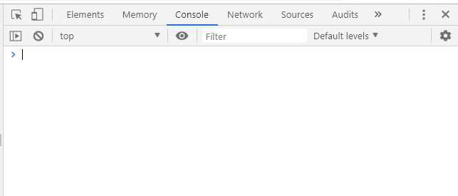
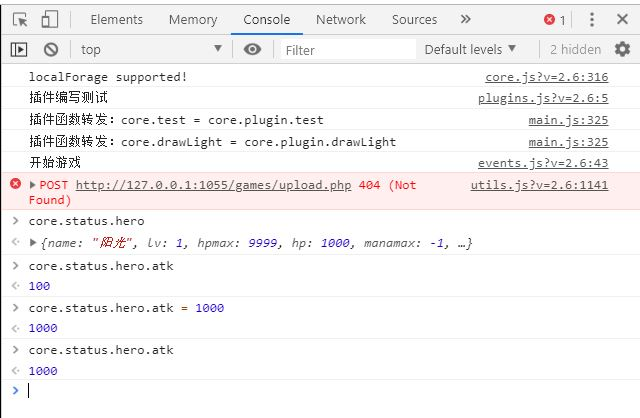
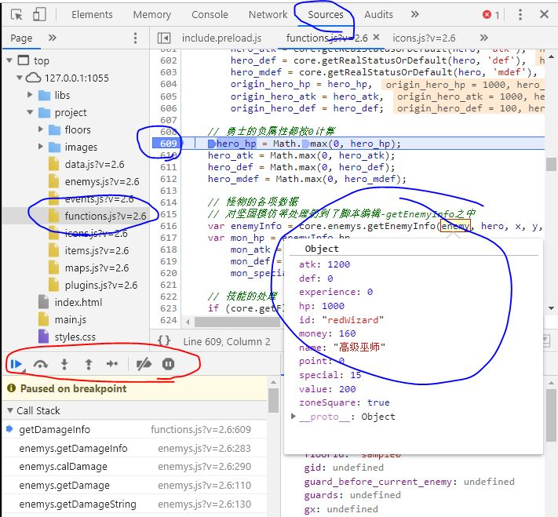
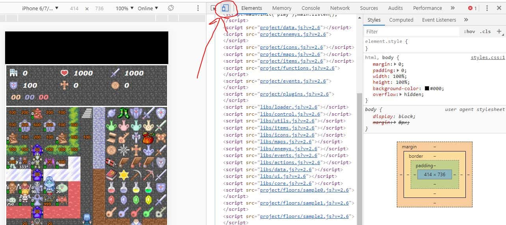
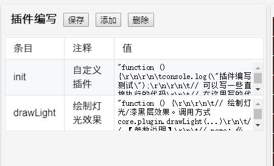

# 脚本

?> 目前版本**v2.6**，上次更新时间：* {docsify-updated} *

在V2.6版本中，基本对整个项目代码进行了重写，更加方便造塔者的使用和复写函数。

## 控制台的使用

在Chrome浏览器中，按（Ctrl+Shift+I）可打开控制台。



控制台中有很多的标签，最常用的是`Console`, `Sources`和`Elements`。

有关更详尽的控制台使用可自行搜索[Chrome开发者工具](https://www.baidu.com/s?wd=chrome%20%E5%BC%80%E5%8F%91%E8%80%85%E5%B7%A5%E5%85%B7)了解更多。

### Console：命令行

Console页为命令行。可以在这里输入一些命令进行调试。

比如，进入游戏后，输入`core.status.hero.atk`即可获得勇士的当前攻击力数值。`core.status.hero.atk=100`可以设置攻击力为100。

更多的API可参见[附录：API列表](#附录：API列表)。

除此以外，游戏中的报错等信息也是可以在Console中进行查看的。



### Sources：断点调试

Sources页可以查看JS源代码，并进行断点调试等。

例如，如果相对脚本编辑中的伤害计算函数进行断点调试：
1. 在左边找到`project/functions.js`，单击打开文件
2. 并找到对应的行（可以Ctrl+F搜索），比如搜索`getDamageInfo`
3. 在行号上点一下打断点，会出现一个蓝色标签

之后，当代码运行到你的断点处时，将自动停止运行。



可以将鼠标移动到变量上，将弹窗形式显示这个变量的各项数值，从而查看变量值是否符合预期。

图中红色框内有几个按钮，从左到右分别是：**继续执行**，**执行到下一行**，**进入当前函数**，**跳出当前函数**，**单步执行**。

通过这几个按钮，可以一行一行的对代码进行执行，执行过程中能不断查看各个变量的数值变化，从而定位问题所在。

红圈下方是Call Stack，即当前的函数调用链（从哪些地方调用过来的）。

Sources还有更多有趣的功能，在此不做介绍，有兴趣的可自行网上搜索了解。

### Elements：网页元素查看

Elements页可以查看网页的源代码，调整css布局等。



不过对魔塔样板来说，最重要的是红圈中的按钮。点击此按钮可以进入**手机模式**。

手机模式下，左边可以对屏幕分辨率进行调整和模拟。

这可以很有效的帮我们进行测试样板在手机端的表现。

## 整体项目架构

``` text
├── /_server/        # 为可视化地图编辑器提供一些支持的目录
├── /libs/           # ---- 系统库目录 ----
│ ├─ /thirdparty/    # 游戏所用到的第三方库文件
│ ├─ actions.js      # 用户交互处理
│ ├─ core.js         # 系统核心文件（游戏入口，接口&转发）
│ ├─ control.js      # 游戏逻辑控制
│ ├─ data.js         # 全塔属性等
│ ├─ enemys.js       # 怪物相关处理
│ ├─ events.js       # 各个事件的执行
│ ├─ icons.js        # 图标和素材
│ ├─ items.js        # 道具效果
│ ├─ loader.js       # 各个资源加载
│ ├─ maps.js         # 地图数据和绘制
│ ├─ ui.js           # UI窗口绘制
│ └─ utils.js        # 工具类函数
├── /project/        # ---- 项目目录 ----
│ ├─ /animates/      # 动画目录
│ ├─ /floors/        # 楼层文件
│ ├─ /images/        # 图片素材
│ ├─ /sounds/        # bgm和音效
│ ├─ data.js         # 全塔属性
│ ├─ enemys.js       # 怪物属性
│ ├─ events.js       # 公共事件
│ ├─ functions.js    # 脚本编辑
│ ├─ icons.js        # 素材和ID的对应关系定义
│ ├─ items.js        # 道具的定义和效果
│ ├─ maps.js         # 地图和数字的对应关系
│ └─ plugins.js      # 自定义插件
├── /常用工具/        # 辅助造塔的小工具
├── editor.html      # 地图编辑器
├── editor-mobile.html      # 手机版的地图编辑器
├── index.html       # 主程序，游戏的入口
├── main.js          # JS程序的入口，将动态对所需JS进行加载
├── style.css        # 游戏所需要用到的样式表
└── 启动服务.exe      # 一个本地的HTTP服务器，通过它来运行游戏
```

`_server`为**地图编辑器目录**，里面存放了地图编辑器相关的各项内容。

`libs`为**系统库目录**，里面存放了各个系统核心函数。

从V2.6开始，请勿直接修改libs下的代码，如有需要修改系统库函数请尝试在插件中[复写函数](#复写函数)。

`project`为**项目目录**，你所造的塔的数据全部存放在project下。在不同样板之间接档也是直接迁移project目录即可。

## 函数的转发

在本样板中，`core.js`里面基本是没有定义什么函数的，所有的游戏内函数都在其他几个文件中实现。

例如，常见的获得某个变量值`getFlag`是定义在`control.js`中的：

```js
////// 获得某个自定义变量或flag //////
control.prototype.getFlag = function(name, defaultValue) {
    if (!core.status.hero) return defaultValue;
    var value = core.status.hero.flags[name];
    return value != null ? value : defaultValue;
}
```

也就是，我们可以通过`core.control.getFlag(name, value)`来调用此函数。

但是这样会十分不便，我们希望能直接调用`core.getFlag(name, value)`，而不需要中间的control。

为了达到这个目的，样板设置了**函数转发**，即**将其他文件中定义的函数，转发到core中执行**。

上述`getFlag`代码的转发实际上是增加了如下函数：

```js
////// getFlag函数的转发 //////
core.getFlag = function (name, defaultValue) {
    return core.control.getFlag(name, defaultValue);
}
// 转发后，即可通过 core.getFlag() 来实际调用 core.control.getFlag()
```

转发是自动完成的，其满足如下两条规则：
- **在libs中其他文件定义的函数，如果不以下划线`_`开头，就会进行转发。**
- **如果core中已经存在同名函数，则会在控制台中打出一条报错信息，并不转发该函数。**

具体函数的转发实现代码可参见`core.js`的`_forwardFunc`函数。

!> 除此以外，插件中以`this.xxx`来定义的函数也会被转发！

例如，你可以直接调用`core.drawLight()`来实际调用插件中的`core.plugin.drawLight`。

## 插件编写

插件编写是H5魔塔的一个重大特点，从V2.0.1引入，并逐渐发扬光大。

对于有一定脚本经验的人来说，可以编写插件来实现各种各样的功能，包括且不仅限于拓展功能的实现，系统代码的复写等等。

在V2.5.5以前，插件位置都在脚本编辑中；从V2.6开始则迁移到了新的下拉框中，并进行了切分。

你也可以创建自己的插件。



新的插件切分和原来的单插件使用方法完全一致，单纯进行了切分而已。可参见已有的`init`和`drawLight`的样例。

拆分的意义主要是将各个可能的功能独立出来，避免单个框内内容太长，过大和混杂等。

在V2.6中，应当每个独立的额外功能实现都新建一个自己的插件，这样也方便进行拓展，例如打包迁移到别的塔上，或发布在网页插件库中。

另外一点需要注意的是，所有插件的初始化都会在系统资源加载之前，此时图片等资源尚未进行加载。

在所有资源加载完毕时，将会执行init插件中的_afterLoadResources函数，可以在这里对资源进行一些操作，比如切分图片等。

```js
function () {
	console.log("插件编写测试");

	// 可以写一些直接执行的代码
	// 在这里写的代码将会在【资源加载前】被执行，此时图片等资源尚未被加载。
	// 请勿在这里对包括bgm，图片等资源进行操作。


	this._afterLoadResources = function () {
		// 本函数将在所有资源加载完毕后，游戏开启前被执行
		// 可以在这个函数里面对资源进行一些操作，比如切分图片等。

		// 这是一个将assets.png拆分成若干个32x32像素的小图片并保存的样例。
		// var arr = core.splitImage("assets.png", 32, 32);
		// for (var i = 0; i < arr.length; i++) {
		//     core.material.images.images["asset"+i+".png"] = arr[i];
		// }

	}

	// 可以在任何地方（如afterXXX或自定义脚本事件）调用函数，方法为 core.plugin.xxx();
	// 从V2.6开始，插件中用this.XXX方式定义的函数也会被转发到core中，详见文档-脚本-函数的转发。
}
```

网站上提供了一个插件库，[https://h5mota.com/plugins/](https://h5mota.com/plugins/)，上面有一些大家分享的插件，可供使用。

可以查看附录中的[API列表](api)来查看所有的系统API内容。

## 复写函数

样板的功能毕竟是写死的，有时候我们也需要修改样板的一些行为。

在V2.6以前，需要直接打开libs目录下的对应文件并进行修改。但是开libs下的文件就会出现各种问题：

- 不容易记得自己修改过什么，而且如果改错了很麻烦
  - 例如，直接修改了某函数加了新功能，结果过段时间发现不需要，想删掉，但是这时候已经很难找到自己改过了什么了。
  - 或者，如果代码改错了，不断往上面打补丁，也只会使得libs越来越乱，最后连自己做过什么都不记得。
- 不容易随着新样板接档进行迁移
- 不方便能整理成新的插件在别的塔使用（总不能让别的塔也去修改libs吧）
- ……

好消息的是，从V2.6开始，我们再也不需要开文件了，而是可以直接在插件中对原始函数进行复写。

函数复写的好处如下：

- 不会影响系统原有代码。
  - 即使写错了或不需要了，也只用把插件中的函数注释或删除即可，不会对原来的系统代码产生任何影响。
- 清晰明了。很容易方便知道自己修改过什么，尤其是可以和系统原有代码进行对比。
- 方便整理成新的插件，给其他的塔使用。

如果我想对xxx文件中的yyy函数进行重写，其模式一般是：`core.xxx.yyy = function (参数列表) { ... }`

下面是几个例子，从简单到复杂。

### 重写怪物手册的背景图绘制，使用winskin而不是默认的黑色

直接重写怪物手册的背景图绘制，使用`core.drawBackground`来用winskin绘制一个背景图。

```js
// 重写ui.js中的_drawBook_drawBackground函数
core.ui._drawBook_drawBackground = function () {
    // core.__PIXELS__为定义的一个宏，对于13x13的值是416，对于15x15的值是480
    core.drawBackground(0, 0, core.__PIXELS__, core.__PIXELS__);
}
```

### 重写点击楼传事件

重写点击楼传事件，使得点击楼传按钮时能使用一个道具（比如item:fly）。

```js
// 重写events.js的useFly函数，即点击楼传按钮时的事件
core.events.useFly = function (fromUserAction) {
    if (core.isMoving()) {
        core.drawTip("请先停止勇士行动");
        return;
    }
    if (core.status.lockControl || core.status.event.id != null) return;
    
    if (core.canUseItem('fly')) core.useItem('fly');
    else core.drawTip("当前无法使用"+core.material.items.fly.name);
}
```

其他的几个按钮，如快捷商店`openQuickShop`，虚拟键盘`openKeyBoard`的重写也几乎完全一样。

### 楼层切换时根据flag来播放不同的音效

整体复制并重写整个楼传切换前的函数，将`core.playSound('floor.mp3')`替换成根据flag来判定。

```js
// 复制重写events.js中的_changeFloor_beforeChange，修改音效
core.events._changeFloor_beforeChange = function (info, callback) {
    // 直接替换原始函数中的 core.playSound('floor.mp3'); 
    if (core.getFlag("floorSound") == 0) core.playSound('floor0.mp3');
    if (core.getFlag("floorSound") == 1) core.playSound('floor1.mp3');
    if (core.getFlag("floorSound") == 2) core.playSound('floor2.mp3');
    // ...
    
    // 下面是原始函数中的剩余代码，保持不变
    window.setTimeout(function () {
        if (info.time == 0)
            core.events._changeFloor_changing(info, callback);
        else
            core.showWithAnimate(core.dom.floorMsgGroup, info.time / 2, function () {
                core.events._changeFloor_changing(info, callback);
            });
    }, 25)
}
```

### 每次打开全局商店时播放一个音效

打开全局商店是在`events.js`中的`openShop`函数，因此需要对其进行重写。

然而，我们只需要在这个函数执行之前插一句音效播放，所以并不需要重写整个函数，而是直接插入一行就行。

```js
var openShop = core.events.openShop; // 先把原始函数用一个变量记录下来
core.events.openShop = function (shopId, needVisited) {
    core.playSound("shop.mp3"); // 播放一个音效
    return openShop(shopId, needVisited); // 直接调用原始函数
}
```

### 每次绘制地图前在控制台打出一条信息 

绘制地图在`maps.js`的`drawMap`函数，因此需要对其进行重写。

由于只需要额外在函数执行前增加一句控制台输出，所以直接插入一行即可。

但是需要注意的是，`drawMap`中使用了`this._drawMap_drawAll()`，因此使用函数时需要用`call`或者`apply`来告知this是什么。

```js
var drawMap = core.maps.drawMap; // 先把原始函数用一个变量记录下来
core.maps.drawMap = function (floorId, callback) {
    console.log("drawMap..."); // 控制台打出一条信息
    return drawMap.call(core.maps, floorId, callback); // 需要使用`call`来告知this是core.maps
}
```

详见[call和apply的用法](https://www.jianshu.com/p/80ea0d1c04f8)。

==========================================================================================

[继续阅读下一章：API列表](api)


