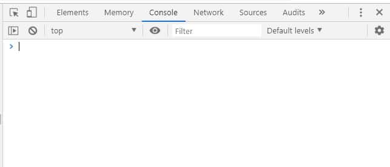
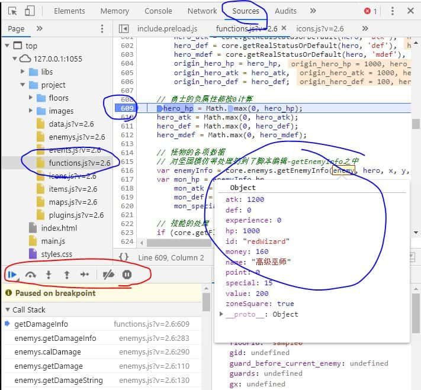
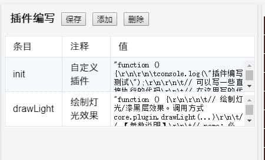

# 脚本

?> 在这一节中，让我们来了解如何使用控制台和使用脚本！

在V2.6版本中，基本对整个项目代码进行了重写，更加方便造塔者的使用。

* [脚本教程视频](https://www.bilibili.com/video/BV1uL411J7yZ?share_source=copy_web)

## 控制台的使用

在Chrome浏览器中，按（Ctrl+Shift+I）可打开控制台。



控制台中有很多的标签，最常用的是`Console`, `Sources`和`Elements`。

有关更详尽的控制台使用可自行搜索[Chrome开发者工具](https://www.baidu.com/s?wd=chrome%20%E5%BC%80%E5%8F%91%E8%80%85%E5%B7%A5%E5%85%B7)了解更多。

### Console：命令行

Console页为命令行。可以在这里输入一些命令进行调试。

比如，进入游戏后，输入`core.status.hero.atk`即可获得勇士的当前攻击力数值。`core.status.hero.atk=100`可以设置攻击力为100。

更多的API可参见[附录：API列表](#附录：API列表)。

除此以外，游戏中的报错等信息也是可以在Console中进行查看的。


### Sources：断点调试

Sources页可以查看JS源代码，并进行断点调试等。

例如，如果相对脚本编辑中的伤害计算函数进行断点调试：
1. 在左边找到`project/functions.js`，单击打开文件
2. 并找到对应的行（可以Ctrl+F搜索），比如搜索`getDamageInfo`
3. 在行号上点一下打断点，会出现一个蓝色标签

之后，当代码运行到你的断点处时，将自动停止运行。



可以将鼠标移动到变量上，将弹窗形式显示这个变量的各项数值，从而查看变量值是否符合预期。

图中红色框内有几个按钮，从左到右分别是：**继续执行**，**执行到下一行**，**进入当前函数**，**跳出当前函数**，**单步执行**。

通过这几个按钮，可以一行一行的对代码进行执行，执行过程中能不断查看各个变量的数值变化，从而定位问题所在。

红圈下方是Call Stack，即当前的函数调用链（从哪些地方调用过来的）。

Sources还有更多有趣的功能，在此不做介绍，有兴趣的可自行网上搜索了解。

### Elements：网页元素查看

Elements页可以查看网页的源代码，调整css布局等。


不过对魔塔样板来说，最重要的是红圈中的按钮。点击此按钮可以进入**手机模式**。

手机模式下，左边可以对屏幕分辨率进行调整和模拟。

这可以很有效的帮我们进行测试样板在手机端的表现。

## 整体项目架构

``` text
├── /_server/        # 为可视化地图编辑器提供一些支持的目录
├── /libs/           # ---- 系统库目录 ----
│ ├─ /thirdparty/    # 游戏所用到的第三方库文件
│ ├─ actions.js      # 用户交互处理
│ ├─ core.js         # 系统核心文件（游戏入口，接口&转发）
│ ├─ control.js      # 游戏逻辑控制
│ ├─ data.js         # 全塔属性等
│ ├─ enemys.js       # 怪物相关处理
│ ├─ events.js       # 各个事件的执行
│ ├─ icons.js        # 图标和素材
│ ├─ items.js        # 道具效果
│ ├─ loader.js       # 各个资源加载
│ ├─ maps.js         # 地图数据和绘制
│ ├─ ui.js           # UI窗口绘制
│ └─ utils.js        # 工具类函数
├── /project/        # ---- 项目目录 ----
│ ├─ /animates/      # 动画目录
│ ├─ /floors/        # 楼层文件
│ ├─ /images/        # 图片素材
│ ├─ /sounds/        # bgm和音效
│ ├─ data.js         # 全塔属性
│ ├─ enemys.js       # 怪物属性
│ ├─ events.js       # 公共事件
│ ├─ functions.js    # 脚本编辑
│ ├─ icons.js        # 素材和ID的对应关系定义
│ ├─ items.js        # 道具的定义和效果
│ ├─ maps.js         # 地图和数字的对应关系
│ └─ plugins.js      # 自定义插件
├── /常用工具/        # 辅助造塔的小工具
├── editor.html      # 地图编辑器
├── editor-mobile.html      # 手机版的地图编辑器
├── index.html       # 主程序，游戏的入口
├── main.js          # JS程序的入口，将动态对所需JS进行加载
├── style.css        # 游戏所需要用到的样式表
└── 启动服务.exe      # 一个本地的HTTP服务器，通过它来运行游戏
```

`_server`为**地图编辑器目录**，里面存放了地图编辑器相关的各项内容。

`libs`为**系统库目录**，里面存放了各个系统核心函数。

从V2.6开始，请勿直接修改libs下的代码，如有需要修改系统库函数请尝试在插件中[复写函数](#复写函数)。

`project`为**项目目录**，你所造的塔的数据全部存放在project下。在不同样板之间接档也是直接迁移project目录即可。

## 函数的转发

在本样板中，`core.js`里面基本是没有定义什么函数的，所有的游戏内函数都在其他几个文件中实现。

例如，常见的获得某个变量值`getFlag`是定义在`control.js`中的：

```js
////// 获得某个自定义变量或flag //////
control.prototype.getFlag = function(name, defaultValue) {
    if (!core.status.hero) return defaultValue;
    var value = core.status.hero.flags[name];
    return value != null ? value : defaultValue;
}
```

也就是，我们可以通过`core.control.getFlag(name, value)`来调用此函数。

但是这样会十分不便，我们希望能直接调用`core.getFlag(name, value)`，而不需要中间的control。

为了达到这个目的，样板设置了**函数转发**，即**将其他文件中定义的函数，转发到core中执行**。

上述`getFlag`代码的转发实际上是增加了如下函数：

```js
////// getFlag函数的转发 //////
core.getFlag = function (name, defaultValue) {
    return core.control.getFlag(name, defaultValue);
}
// 转发后，即可通过 core.getFlag() 来实际调用 core.control.getFlag()
```

转发是自动完成的，其满足如下两条规则：
- **在libs中其他文件定义的函数，如果不以下划线`_`开头，就会进行转发。**
- **如果core中已经存在同名函数，则会在控制台中打出一条报错信息，并不转发该函数。**

具体函数的转发实现代码可参见`core.js`的`_forwardFunc`函数。

!> 除此以外，插件中以`this.xxx`来定义的函数也会被转发！

例如，你可以直接调用`core.drawLight()`来实际调用插件中的`core.plugin.drawLight`。

## 插件编写

插件编写是H5魔塔的一个重大特点，从V2.0.1引入，并逐渐发扬光大。

对于有一定脚本经验的人来说，可以编写插件来实现各种各样的功能，包括且不仅限于拓展功能的实现，系统代码的复写等等。

在V2.5.5以前，插件位置都在脚本编辑中；从V2.6开始则迁移到了新的下拉框中，并进行了切分。

你也可以创建自己的插件。



新的插件切分和原来的单插件使用方法完全一致，单纯进行了切分而已。可参见已有的`init`和`drawLight`的样例。

拆分的意义主要是将各个可能的功能独立出来，避免单个框内内容太长，过大和混杂等。

在V2.6中，应当每个独立的额外功能实现都新建一个自己的插件，这样也方便进行拓展，例如打包迁移到别的塔上，或发布在网页插件库中。

另外一点需要注意的是，所有插件的初始化都会在系统资源加载之前，此时图片等资源尚未进行加载。

在所有资源加载完毕时，将会执行init插件中的_afterLoadResources函数，可以在这里对资源进行一些操作，比如切分图片等。

```js
function () {
	console.log("插件编写测试");

	// 可以写一些直接执行的代码
	// 在这里写的代码将会在【资源加载前】被执行，此时图片等资源尚未被加载。
	// 请勿在这里对包括bgm，图片等资源进行操作。


	this._afterLoadResources = function () {
		// 本函数将在所有资源加载完毕后，游戏开启前被执行
		// 可以在这个函数里面对资源进行一些操作，比如切分图片等。

		// 这是一个将assets.png拆分成若干个32x32像素的小图片并保存的样例。
		// var arr = core.splitImage("assets.png", 32, 32);
		// for (var i = 0; i < arr.length; i++) {
		//     core.material.images.images["asset"+i+".png"] = arr[i];
		// }

	}

	// 可以在任何地方（如afterXXX或自定义脚本事件）调用函数，方法为 core.plugin.xxx();
	// 从V2.6开始，插件中用this.XXX方式定义的函数也会被转发到core中，详见文档-脚本-函数的转发。
}
```

网站上提供了一个插件库，[https://h5mota.com/plugins/](https://h5mota.com/plugins/)，上面有一些大家分享的插件，可供使用。

可以查看附录中的[API列表](api)来查看所有的系统API内容。

## register系列函数

在API列表中，有一系列的函数以`register`开头；这一系列函数允许你将一部分自定义的代码注入到样板中，从而可以监听某一系列行为并进行处理。

下面会对这系列函数进行逐个介绍。

### registerAction

```
registerAction: fn(action: string, name: string, func: string|fn(params: ?), priority?: number)
此函数将注册一个用户交互行为。
action: 要注册的交互类型，如 ondown, onup, keyDown 等等。
name: 你的自定义名称，可被注销使用；同名重复注册将后者覆盖前者。
func: 执行函数。
如果func返回true，则不会再继续执行其他的交互函数；否则会继续执行其他的交互函数。
priority: 优先级；优先级高的将会被执行。此项可不填，默认为0
```

`registerAction`为register系列最常用的功能之一，它允许你任意监听用户的交互事件，包括且不仅限于按键、点击、拖动、长按，等等。

下面是一个例子：

```js
// 当flag:abc是true时，点击屏幕左上角可以使用道具破墙镐
// 注入一个 ondown 事件，名称为 my_pickaxe
core.registerAction('ondown', 'my_pickaxe', function (x, y, px, py) {
    // 如果当前正在执行某个事件，则忽略之。
    if (core.status.lockControl) return false;
    // 如果勇士正在行走中，则忽略之。
    if (core.isMoving()) return false;
    // x, y 为点击坐标；px, py 为点击的像素坐标
    // 检查flag是否为true，且点击了(0,0)点
    if (core.hasFlag('abc') && x == 0 && y == 0) {
        // 检查能否使用破墙镐
        if (core.canUseItem('pickaxe')) {
            core.useItem('pickaxe');
            // 返回true将拦截其他交互函数对于点击的处理
            return true;
        }
    }
    // 返回false后将会继续执行其他的交互函数（例如寻路）
    return false;

// 优先级设置为100，比系统优先级高，因此将会优先执行此注入的项目。
}, 100);

// 当你不再需要上述监听时，可以通过下面这一句取消注入。
// core.unregisterActon('ondown', 'my_pickaxe');
```

下面是另一个例子：

```js
// 假设我们通过事件流做了一个商店，希望能通过”长按空格“和“长按屏幕”进行连续确认购买
// 此时，需要使用一个flag，表示是否在商店中；例如 flag:inShop

// 注入一个keyDown（按下）事件；请注意，当按下按键且不释放时，会连续触发keyDown。
core.registerAction('keyDown', 'my_shop', function (keycode) {
    // 检查是否确实在该商店事件中；进该商店前需要将flag:inShop设为true，退出后需要设为false
    if (!core.hasFlag('inShop')) return false;
    // 检查当前事件是一个”显示选择项“
    if (core.status.event.id != 'action' || core.status.event.data.type != 'choices') {
        return false;
    }
    // 获得当前“显示选择项”的各个选项
    var choices = core.status.event.data.current.choices;
    // 获得当前选项第一项在屏幕上的y坐标
    var topIndex = core.actions._getChoicesTopIndex(choices.length);
    // 检查按键的键值，是否是空格或者回车
    if (keycode == 13 || keycode == 32) {
        // 如果是，则视为直接点击屏幕上的选项
        // core.status.event.selection为当前光标选择项；第一项为0
        // 点击的x为HSIZE，即屏幕左右居中；y为topIndex + core.status.event.selection为该选择项
		core.actions._clickAction(core.actions.HSIZE, topIndex + core.status.event.selection);
        // 不再执行其他的交互函数
        return true;
    }
    // 否则，继续执行其他的交互函数（如上下键光标选择）
    return false;
}, 100);


// 还需要注册一个keyUp（放开）事件，拦截空格和回车
// 这是因为，按一下空格会先触发keyDown再触发keyUp；这里不拦截的话会购买两次。
var _my_shop_up = function (keycode) {
    if (!core.hasFlag('inShop')) return false;
    if (core.status.event.id != 'action' || core.status.event.data.type != 'choices') {
        return false;
    }
    // 检查是否是空格或者回车，如果是则拦截操作。
    if (keycode == 13 || keycode == 32) return true;
    return false;
};
// 这里可以传入前面定义的函数体。
core.registerAction('keyUp', 'my_shop', _my_shop_up, 100);


// 注册一个长按事件，允许长按连续购买
this._my_shop_longClick = function (x, y, px, py) {
    if (!core.hasFlag('inShop')) return false;
    if (core.status.event.id != 'action' || core.status.event.data.type != 'choices') {
        return false;
    }
    // 直接视为点击了此位置
    core.actions._clickAction(x, y, px, py);
	return true;
}
// 如果是插件中使用`this.xxx`定义的函数，也可以直接传入函数名。
core.registerAction('longClick', 'my_shop', '_my_shop_longClick', 100);
```

简单地说，`registerAction`这个函数**允许你在任何时候监听和拦截任何用户交互行为**。

目前，`registerAction`支持监听和拦截如下交互：

- `keyDown`: 当一个键被按下时
  - 对应的函数参数：`function (keycode)`，为此时按下键的键值
  - 请注意：如果长按键不放开的话，会连续触发`keyDown`事件
- `keyUp`: 当一个键被放开时
  - 对应的函数参数：`function (keycode, altKey, fromReplay)`，为此时放开键的键值、当前alt是否被按下、是否是录像播放中模拟的按键
- `onKeyDown`: 当一个键被按下时
  - 对应的函数参数：`function (e)`，为此时按键的信息。这里的`e`是一个`KeyboardEvent`。
  - 请注意：如果长按键不放开的话，会连续触发`onKeyDown`事件。
  - 和上述`keyDown`的主要区别就是参数为原始的`KeyboardEvent`；仍然推荐直接使用`keyDown`。
- `onKeyUp`: 当一个键被放开时
  - 对应的函数参数：`function (e)`，为此时按键的信息。这里的`e`是一个`KeyboardEvent`。
  - 和上述`keyUp`的主要区别就是参数为原始的`KeyboardEvent`；仍然推荐直接使用`keyUp`。
- `ondown`: 当屏幕被鼠标或手指按下时
  - 对应的函数参数：`function (x, y, px, py)`，为此时按下时的格子坐标和像素坐标。
- `onmove`: 当屏幕被鼠标滑动，或手指拖动时
  - 对应的函数参数：`function (x, y, px, py)`，为此时滑动或拖动时的格子坐标和像素坐标。
  - 如果是鼠标，只要在屏幕上滑动就会触发`onmove`，无需处于点击状态（也就是悬浮也是可以的）。
  - 如果是触摸屏，则只有手指按下滑动时才会触发`onmove`（并不存在什么悬浮的说法）。
- `onup`: 当屏幕被鼠标或手指放开时
  - 对应的函数参数：`function (x, y, px, py)`，为此时放开时的格子坐标和像素坐标。
- `onclick` 【已废弃】
  - 从V2.8.2起，此交互已被废弃，注册一个`onclick`会被直接转发至`ondown`。
- `onmousewheel`: 当鼠标滚轮滚动时
  - 对应的函数参数：`function (direct)`，为此时滚轮方向。向下滚动是-1，向上滚动是1。
  - 目前在楼传、怪物手册、存读档、浏览地图等多个地方绑定了鼠标滚轮事件。
- `keyDownCtrl`: 当Ctrl键处于被长按不放时
  - 对应的函数参数：`function ()`，即无参数。
  - 目前主要用于跳过剧情对话。
- `longClick`: 当鼠标或手指长按屏幕时
  - 对应的函数参数：`function (x, y, px, py)`，为长按屏幕对应的格子坐标和像素坐标
  - 目前主要用于虚拟键盘，和跳过剧情对话。
- `onStatusBarClick`: 当点击状态栏时
  - 对应的函数参数：`function (px, py, vertical)`，为状态栏点击的像素坐标。
  - 如果参数`vertical`不为`null`，表示该状态栏点击是录像播放时触发的，其值为录像记录时的横竖屏状态。

### registerAnimationFrame

```
registerAnimationFrame: fn(name: string, needPlaying: bool, func?: fn(timestamp: number))
注册一个 animationFrame
name: 名称，可用来作为注销使用
needPlaying: 是否只在游戏运行时才执行（在标题界面不执行）
func: 要执行的函数，或插件中的函数名；可接受timestamp（从页面加载完毕到当前所经过的时间）作为参数
```

`registerAnimationFrame`为其次常用的功能，可以用于需要反复执行的脚本，常用于动画之类。

目前，样板的全局动画（即怪物的帧振动）、人物行走动画、普通动画、天气效果、游戏计时、以及楼层并行事件等，都是通过`registerAnimationFrame`进行实现的。

通过`registerAnimationFrame`注册的函数会平均每16.6ms执行一次（视浏览器的性能而定，例如手机上可能执行频率会变慢）。可以通过函数的`timestamp`参数来获得从页面加载完毕到当前所经过的毫秒数（从而可以进一步控制执行频率，如每500ms才执行一次）。

**推荐所有的需要反复执行的脚本（如动画相关）都通过此函数来注册，而不是使用`setInterval`，以获得更好的性能。**

下面是“人物血量动态变化”的插件的例子。

```js
var speed = 0.05; // 动态血量变化速度，越大越快。
var _currentHp = null; // 当前正在变化的hp值
var _lastStatus = null; // 上次人物的属性对象

// 注册一个
core.registerAnimationFrame('dynamicHp', true, function (timestamp) {
    // 检查人物所指向的对象是否发生了变化
    // 在例如读档后，core.status.hero被重置了，此时需要将_currentHp重置为正确的生命值。
    if (_lastStatus != core.status.hero) {
        _lastStatus = core.status.hero;
        _currentHp = core.status.hero.hp;
    }
    // 如果显示的hp值和当前实际hp值不同
    if (core.status.hero.hp != _currentHp) {
        // 计算hp差值，并获得下个血量变化值。
        var dis = (_currentHp - core.status.hero.hp) * speed;
        if (Math.abs(dis) < 2) {
            // 如果很接近了，直接设为实际hp值。
            _currentHp = core.status.hero.hp;
        } else {
            // 否则，改变显示值使其更接近。
            _currentHp -= dis;
        }
        // 然后设置状态栏中生命的显示项。
        core.setStatusBarInnerHTML('hp', _currentHp);
    }
});
```

### registerReplayAction

```
registerReplayAction: fn(name: string, func: fn(action?: string) -> bool)
注册一个录像行为
name: 自定义名称，可用于注销使用
func: 具体执行录像的函数，可为一个函数或插件中的函数名；
需要接受一个action参数，代表录像回放时的下一个操作
func返回true代表成功处理了此录像行为，false代表没有处理此录像行为。
```

`registerReplayAction`允许你自己定义和注册一个录像行为。

在游戏时，你的所有操作会被记录为一个数组`core.status.route`，如按上就是`up`，使用破墙镐就是`item:pickaxe`，瞬移到(1,2)就是`move:1:2`，等等。

在录像播放时，会依次从数组中取出一个个的录像操作，并模拟执行对应的操作。这里对于每个录像操作，都是靠`registerReplayAction`进行注册的。

下面是一个例子：

```js
// 当flag:abc为true时，点击屏幕(0,0)，(0,1)，(0,2)，(0,3)会分别执行不同的公共事件。

// 先通过registerAction注册屏幕点击事件
core.registerAction('onclick', 'commonEvent', function (x, y, px, py) {
    // 检查是否是自由状态、是否在移动，是否存在flag。
    if (core.status.lockControl || core.isMoving() || !core.hasFlag('abc')) return false;
    // 公共事件名
    var eventName = null;
    if (x == 0 && y == 0) {
        eventName = "公共事件0";
    } else if (x == 0 && y == 1) {
        eventName = "公共事件1";
    } else if (x == 0 && y == 2) {
        eventName = "公共事件2";
    } // ... 可以继续写下去。

    // 如果存在需要执行的公共事件
    if (eventName != null) {
        // 重要！往录像中写入一个自定义的`commonEvent:`项，记录执行的公共事件名称。
        // 由于录像编码时只支持部分ascii码，而eventName作为公共事件名可能带有中文，
        // 因此需要使用 core.encodeBase64() 对eventName进行编码
        core.status.route.push("commonEvent:" + core.encodeBase64(eventName));
        // 插入公共事件
        core.insertCommonEvent(eventName);
        return true;
    }
    return false;
});

// 注册一个录像处理行为来处理上述的`commonEvent:`项。
core.registerReplayAction('commonEvent', function (action) {
    // 参数action为此时录像播放时执行到的项目。
    // 如果不是`commonEvent:`，则不应该被此函数处理。
    if (action.indexOf('commonEvent:') !== 0) return false;
    // 二次检查flag:abc是否存在
    if (!core.hasFlag('abc')) {
        core.control._replay_error(action);
        return true;
    }
    // 如果是我们的录像行为，获得具体的公共事件名。
    // 上面使用encodeBase64()编码了录像，现在同样需要解码。
    var eventName = core.decodeBase64(action.substring(12));
    // 由于录像播放中存在二次记录，还需要将action写入到当前播放过程中的录像中。
    // 这样录像播放完毕后再次直接重头播放不会出现问题。
    core.status.route.push(action);
    // 执行该公共事件。
    core.insertCommonEvent(eventName);
    // 继续播放录像。
    core.replay();
    // 返回true表示我们已经成功处理了此录像行为。
    return true;
});
```

### registerWeather

```
registerWeather: fn(name: string, initFunc: fn(level: number), frameFunc?: fn(timestamp: number, level: number))
注册一个天气
name: 要注册的天气名
initFunc: 当切换到此天气时的初始化；接受level（天气等级）为参数；可用于创建多个节点（如初始化雪花）
frameFunc: 每帧的天气效果变化；可接受timestamp（从页面加载完毕到当前所经过的时间）和level（天气等级）作为参数
天气应当仅在weather层进行绘制，推荐使用core.animateFrame.weather.nodes用于节点信息。
```

`registerWeather`允许你注册一个天气。

在游戏时，楼层属性中可以设置天气如 `["snow", 5]`，或者脚本 `core.setWeather("snow", 5)` 来切换天气。

下面是一个例子：

```js
// 注册一个”血“天气，每200ms就随机在界面上的绘制红色斑点
core.registerWeather('blood', function (level) {
    // 切换到此天气时应当执行的脚本吗，如播放一个音效
    core.playSound('blood.mp3');
}, function (timestamp, level) {
    // 我们希望每200ms就界面上随机绘制 level^2 个红点，半径在0~32像素之间

    // 检查是否经过了200ms
    if (timestamp - core.animateFrame.weather.time < 200) return;
    // 当且仅当在weather层上绘制
    core.clearMap('weather');
    for (var i = 0; i < level * level; ++i) {
        // 随机界面中的一个点，半径在0~32之间
        var px = Math.random() * core.__PIXELS__;
        var py = Math.random() * core.__PIXELS__;
        var r = Math.random() * 32;
        core.fillCircle('weather', px, py, r, 'red');
    }
    // 设置本次天气调用的时间
    core.animateFrame.weather.time = timestamp;
});
```

值得注意的是，天气当且仅当在`weather`层进行绘制，推荐使用或设置`core.animateFrame.weather.time`作为上次天气调用的时间避免太过于频繁的调用。

推荐使用`core.animateFrame.weather.nodes`来存储天气的节点，这样会在取消天气时自动被移除。

样板的云`cloud`和雾`fog`均由多个图片叠加移动实现；如果你想实现类似效果，可直接使用`core.control.__animateFrame_weather_image`作为`frameFunc`，详见样板的云雾实现。

另外注意的是，注册的天气无法在事件编辑器的下拉框中选择；你可以选择脚本调用`core.setWeather`，或者修改`_server/MotaAction.g4`中的`Weather_List`:

```js
Weather_List
    :   '无'|'雨'|'雪'|'晴'|'雾'|'云'
    /*Weather_List ['null','rain','snow','sun','fog','cloud']*/;
```

### registerSystemEvent

```
registerSystemEvent: fn(type: string, func: fn(data?: ?, callback?: fn()))
注册一个系统事件
type: 事件名
func: 为事件的处理函数，可接受(data,callback)参数
```

`registerSystemEvent`允许你注册一个系统事件。

在图块属性中，存在一个`trigger`选项，可以设置图块的触发器；当玩家碰触到对应的图块时，会根据对应图块的触发器来执行对应系统事件，即`registerSystemEvent`所注册的。

这里的`data`为触发该图块时的`block`信息，和`core.getBlock()`的返回值相同。`callback`为执行完毕时的回调。

下面是一个例子：

```js
// 假设存在一个图块，当触碰时会触发一个公共事件，且需要图块坐标作为公共事件参数。
// 首先需要将该图块的触发器设置为`custom`。

// 注册一个`custom`的系统事件；当角色碰触到触发器为`custom`的图块时会被执行。
core.registerSystemEvent("custom", function (data, callback) {
    // 这里的`data`为碰触到的图块信息。
    console.log(data);
    // 插入一个公共事件（如“图块触碰”），把图块坐标作为公共事件参数传入。
    core.insertCommonEvent("图块触碰", /*args*/ [data.x, data.y], data.x, data.y);
    if (callback) callback();
})
```

`registerSystemEvent`系列最大的好处是，他是和“图块”相关而不是和“点”相关的。也就是说，可以任意通过`setBlock`之类的函数移动图块，不会影响到事件的触发（而这个是靠红点所无法完成的）。

也可以通过`registerSystemEvent`来拦截默认的系统事件，例如 `core.registerSystemEvent("battle", ...)` 可以拦截当遇到没有覆盖触发器的怪物的系统处理（即不再直接战斗）。

### registerEvent

```
registerEvent: fn(type: string, func: fn(data: ?, x?: number, y?: number, prefix?: string))
注册一个自定义事件
type: 事件类型
func: 事件的处理函数，可接受(data, x, y, prefix)参数
data为事件内容，x和y为当前点坐标（可为null），prefix为当前点前缀
```

`registerEvent`允许你注册一个自定义事件，即事件流中 type:xxx 的行为。

```js
// 注册一个type:abc事件
core.registerEvent("abc", function (data, x, y, prefix) {
    // 直接打出当前事件信息
    console.log(data.name);
    core.doAction();
});

// 执行一个abc事件
// 控制台会打出 "hahaha"
// core.insertAction([{"type": "abc", "name": "hahaha"}]);
```

此函数一般不是很常用，但是配合“编辑器修改”（即给事件编辑器修改或者增加事件图块）会有奇效。

具体例子可参见[修改编辑器](editor)中的`demo - 增加新语句图块`。

### registerResize

```
registerResize: fn(name: string, func: fn(obj: ?))
注册一个resize函数
name: 名称，可供注销使用
func: 可以是一个函数，或者是插件中的函数名；可以接受obj参数，详见resize函数。
```

`registerResize`允许你重写一个屏幕重定位函数。

此函数会在游戏开始前，以及每次屏幕大小发生改变时调用。系统通过此函数来对游戏界面进行调整，如横竖屏自适应等。

此函数会被较少用到。

## 复写函数

样板的功能毕竟是写死的，有时候我们也需要修改样板的一些行为。

在V2.6以前，需要直接打开libs目录下的对应文件并进行修改。但是开libs下的文件就会出现各种问题：

- 不容易记得自己修改过什么，而且如果改错了很麻烦
  - 例如，直接修改了某函数加了新功能，结果过段时间发现不需要，想删掉，但是这时候已经很难找到自己改过了什么了。
  - 或者，如果代码改错了，不断往上面打补丁，也只会使得libs越来越乱，最后连自己做过什么都不记得。
- 不容易随着新样板接档进行迁移
- 不方便能整理成新的插件在别的塔使用（总不能让别的塔也去修改libs吧）
- ……

好消息是，从V2.6开始，我们再也不需要开文件了，而是可以直接在插件中对原始函数进行复写。

函数复写的好处如下：

- 不会影响系统原有代码。
  - 即使写错了或不需要了，也只用把插件中的函数注释或删除即可，不会对原来的系统代码产生任何影响。
- 清晰明了。很容易方便知道自己修改过什么，尤其是可以和系统原有代码进行对比。
- 方便整理成新的插件，给其他的塔使用。

一般而言，复写规则如下：

**对xxx文件中的yyy函数进行复写，规则是`core.xxx.yyy = function (参数列表) { ... }`。**

但是，对于`register`系列函数是无效的，例如直接复写`core.control._animationFrame_globalAnimate`函数是没有效果的。对于这种情况引入的函数，需要注册同名函数，可参见最下面的样例。

下面是几个例子，从简单到复杂。

### 重写怪物手册的背景图绘制，使用winskin而不是默认的黑色

直接重写怪物手册的背景图绘制，使用`core.drawBackground`来用winskin绘制一个背景图。

```js
// 重写ui.js中的_drawBook_drawBackground函数
core.ui._drawBook_drawBackground = function () {
    // core.__PIXELS__为定义的一个宏，对于13x13的值是416，对于15x15的值是480
    core.drawBackground(0, 0, core.__PIXELS__, core.__PIXELS__);
}
```

### 重写点击楼传事件

重写点击楼传事件，使得点击楼传按钮时能使用一个道具（比如item:fly）。

```js
// 重写events.js的useFly函数，即点击楼传按钮时的事件
core.events.useFly = function (fromUserAction) {
    if (core.isMoving()) {
        core.drawTip("请先停止勇士行动");
        return;
    }
    if (core.status.lockControl || core.status.event.id != null) return;
    
    if (core.canUseItem('fly')) core.useItem('fly');
    else core.drawTip("当前无法使用"+core.material.items.fly.name);
}
```

其他的几个按钮，如快捷商店`openQuickShop`，虚拟键盘`openKeyBoard`的重写也几乎完全一样。

### 关门时播放一个动画

关门是在`events.js`中的`closeDoor`函数，因此需要对其进行重写。

然而，我们只需要在这个函数执行之前插一句播放动画，所以并不需要重写整个函数，而是直接插入一行就行。

```js
var closeDoor = core.events.closeDoor; // 先把原始函数用一个变量记录下来
core.events.closeDoor = function (x, y, id, callback) {
    core.drawAnimate('closeDoor', x, y); // 播放 closeDoor 这个动画
    return closeDoor(x, y, id, callback); // 直接调用原始函数
}
```

### 每次跳跃角色前播放一个音效

跳跃角色在`events.js`的`jumpHero`函数，因此需要对其进行重写。

由于只需要额外在函数执行前增加一句音效播放，所以直接插入一行即可。

但是需要注意的是，`jumpHero`中使用了`this._jumpHero_doJump()`，因此使用函数时需要用`call`或者`apply`来告知this是什么。

```js
var jumpHero = core.events.jumpHero; // 先把原始函数用一个变量记录下来
core.events.jumpHero = function (ex, ey, time, callback) {
    core.playSound("jump.mp3"); // 播放一个音效
    return jumpHero.call(core.events, ex, ey, time, callback); // 需要使用`call`来告知this是core.events
}
```

详见[call和apply的用法](https://www.jianshu.com/p/80ea0d1c04f8)。

### 复写全局动画绘制函数

全局动画绘制在`control.js`的`_animationFrame_globalAnimate`函数。

注意到此函数是由`registerAnimationFrame`注册的，因此直接复写是无效的。

其在control.js的注册的定义如下：

```js
// 注册全局动画函数
this.registerAnimationFrame("globalAnimate", true, this._animationFrame_globalAnimate);
```

因此，可以在插件中自行注册一个**同名**的函数来覆盖原始的内容。

```js
// 插件中复写全局动画绘制函数
this.myGlobalAnimate = function (timestamp) {
    // ...... 实际复写的函数内容
}

// 注册同名（globalAnimate）函数来覆盖系统原始内容
core.registerAnimationFrame("globalAnimate", true, "myGlobalAnimate");
```


==========================================================================================

[继续阅读下一章：修改编辑器](editor)


