# 快速上手

?> 目前版本**v2.5.4**，上次更新时间：* {docsify-updated} *

在这一节中，将详细介绍做一部塔的流程。现在，让我们来做一部单层塔！

## 前置需求

你需要有满足如下条件才能进行制作：

- Windows 8以上操作系统；Windows 7需要安装.Net Framework 4.0。（能打开同目录下的“启动服务.exe”即可）
  - Mac系统则需OS X 10.7及以上，能正确打开启动服务(Mac版).app即可。
  - 安卓手机端需要下载最新版的HTML5安卓造塔器。
- Chrome浏览器。其他浏览器可能会导致本地服务器产生闪退等现象。
- 强烈推荐安装一个很好的文本编辑器：VSCode。在某些需要直接修改文件的场合，可能会非常重要。

上述软件均可以在群文件的常用软件中找到下载安装包。

只要满足了上述条件，你就可以开始做自己的塔啦！

## 启动HTTP服务

在根目录下有一个“启动服务.exe”，运行之。（Mac版本则双击运行“启动服务(Mac版).app”，手机端则使用造塔APP。）

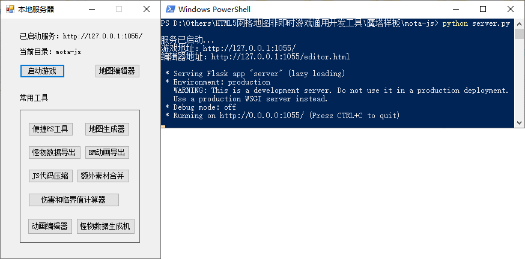

* “启动游戏”按钮将打开一个网页，你能在里面看到现在游戏的效果。
* “地图编辑器”允许你以可视化的方式进行编辑地图。
* “便捷PS工具”能让你很方便的对自定义素材进行添加。参见[自定义素材](personalization#自定义素材)。
* “地图生成器”能让你从已有的截图（如RMXP项目）中立刻生成可被本样板识别的地图数据。
* “RM动画导出器”能让你从RMXP中导出动画而被H5魔塔使用。
* “JS代码压缩工具”能对JS代码进行压缩，从而减少IO请求数和文件大小。
* “伤害和临界值计算器”是一个很便捷的小工具，能对怪物的伤害和临界值进行计算。

!> **整个造塔过程中，启动服务必须全程处于开启状态！切不可手滑关闭，否则做的都是无用功！**

## 绘制地图

有两种绘制地图的方式：从头绘制地图；从RMXP中导入已有的地图。

### 从头绘制地图

我们直接打开“地图编辑器”，可以看到一个可视化的UI界面。

楼层切换到MT0层，然后可以开始任意绘制地图。

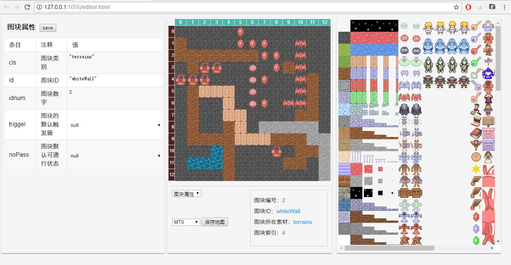

如果提示“该素材未被定义”或有红色问号框，请参见[素材注册](#素材注册)。

绘制地图时可以右键弹出菜单，移动图块和事件。

从V2.4.2开始，可以使用`Alt+0~9`对一个图块素材快速保存，`Ctrl+0~9`来快速选用。

### 从RMXP导入已有的地图

如果我们想复刻一个现有的，已经被RMXP所制作的塔，也有很便捷的方式，那就是用到我们的“地图生成器”。

首先，我们打开RMXP和对应的项目，可以看到它的地图。

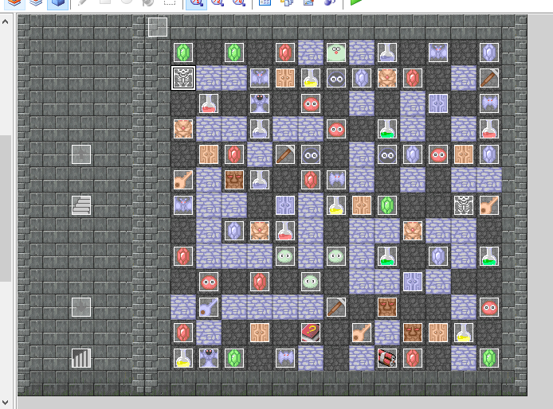

我们打开地图编辑器，创建一个地图，宽高需要和RM中的地图一致。

之后，我们打开Windows自带的“截图工具”，并将整个地图有效区域截图下来，并将其复制到剪切板。

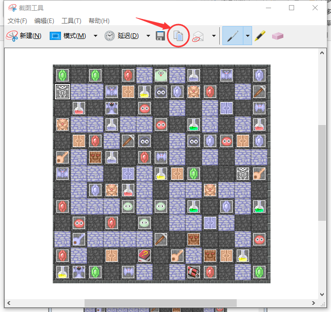

截图时请注意：**只截取有效游戏空间内数据，并且有效空间内的范围必须是创建的地图的大小（至少为13x13）。**

确认地图的图片文件已经复制到剪切板后，我们打开“地图生成器”，并点“加载图片”。大约1-2秒后，可以得到地图的数据。

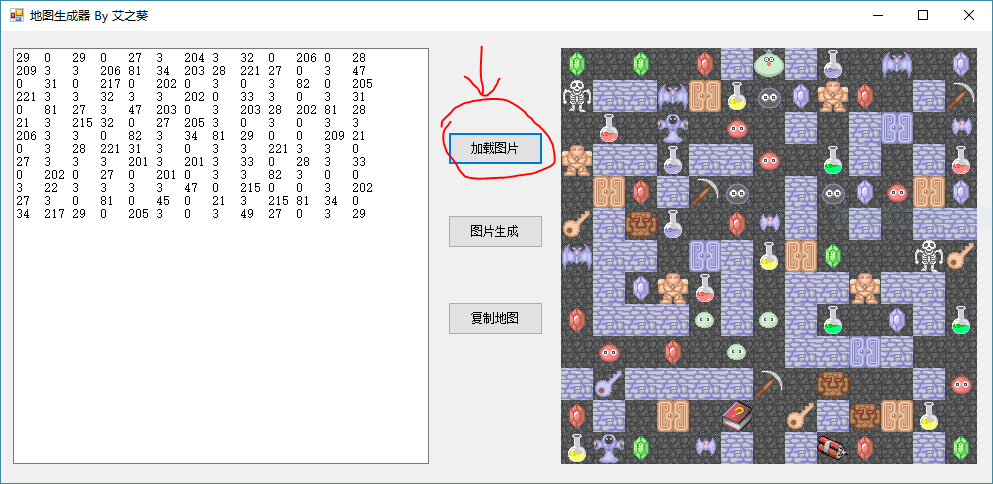

然后点击“复制地图”，即可将地图数据复制到剪切板，然后再地图编辑器中切换到“地图编辑”，并在左边的框进行粘贴。

!> **地图生成器默认只支持已被定义的素材。如果有自定义素材需求（例如原版的1层小塔那种素材），请先[导入并注册素材](#素材注册)后再进行操作。**  

!> **请确保截图范围为你创建的地图大小，并且保证每个位置的像素都是32x32。**

!> **如果宽度超过13，地图生成器将无法显示完全，但是仍然可以粘贴到地图编辑器中进行修改。**

!> **地图生成器靠左上角来确定偏移量，如果左上角是全黑或者星空之类的素材可能导致识别不准，此时请在左上角放置一个岩浆后再进行截图识别。**

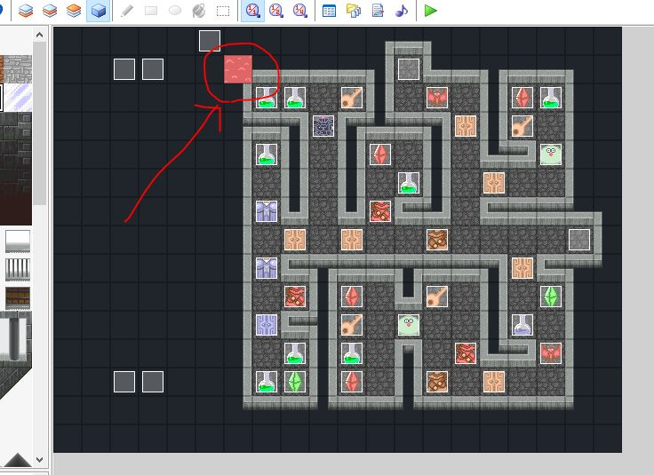

## 编辑属性

当地图绘制完毕后，我们可能需要进行属性的编辑。属性编辑有四类：楼层属性、怪物属性、道具属性、全塔属性。

### 楼层属性

我们切换到楼层属性，并进行一项项的编辑。将鼠标放在中间有具体的每一项注释，这里不再细说。

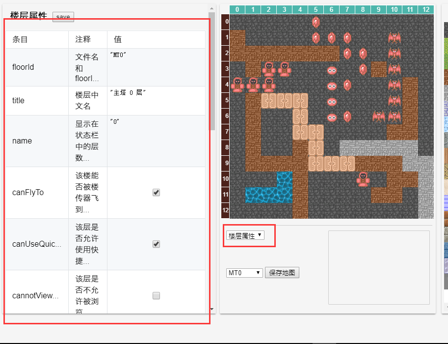

### 怪物属性

我们点击右边的怪物图块，可以在左边的框内设置该怪物的各项属性。将鼠标放在中间有具体的每一项注释，这里不再细说。

有关怪物的更详细信息可参见[元件说明：怪物](element#怪物)。

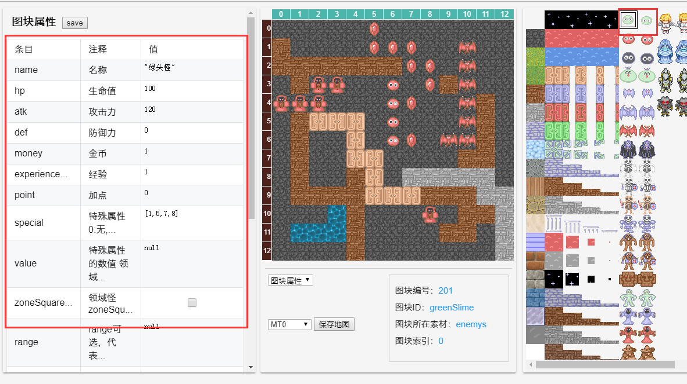

### 道具属性

同理，点击道具可以对道具属性进行编辑。

目前大多数道具都已有默认效果。更多信息可参见[元件说明：道具](element#道具)。

### 全塔属性

我们切换到全塔属性，并进行一项项的编辑。同样鼠标放在中间可以查看注释。

我们可以在这里定义一些全局的属性，比如开始剧情、宝石血瓶剑盾数值，破甲反击净化的比例，以及一些系统开关比如是否启用加点，是否允许负伤害等等。

!> **注：name作为游戏的唯一标识符必须进行修改，否则可能会导致存档等出现问题。**

&nbsp;

上述属性全部修改完毕后，保存，然后点启动服务的“开始游戏”，就可以看到我们写的游戏效果啦！

## 新建和删除楼层

如果要新建楼层，请切换到“地图编辑”，输入新的楼层ID，并新建空白地图，然后刷新编辑器。

请注意，楼层ID必须是由字母、数字和下划线组成且不能以数字开头，不能和任何已有的楼层ID重复。

你也可以删除当前楼层（比如几个样板层），只需要点击删除楼层再刷新就行。删除楼层并不会删除文件，只是不再被游戏所引入而已。

你可以在全塔属性 - floorIds中看到所有的楼层。其顺序将影响到楼传器的顺序、浏览地图的顺序和上下楼器等的顺序。

## 事件编辑

我们点击任意一个图块，都可以进入事件编辑模式。

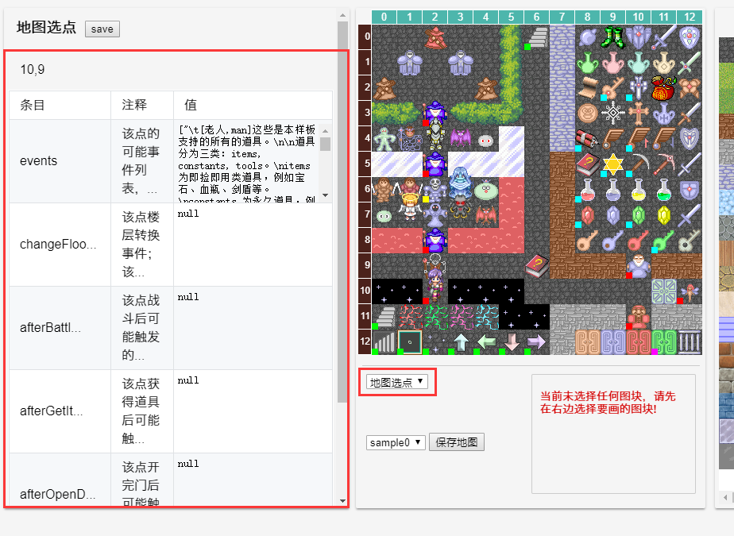

从上至下有若干项，分别代表该点的一些事件。有关事件的详细信息请参见[事件](event)。

如果一个点存在事件，则在地图编辑器中该点的左下角会有一个小方框表示。

红色为自定义事件，绿色为楼层传送事件，黄色为战后事件，青色为道具获得后的事件，粉色为开门后的事件。

## 自定义素材的添加与注册

有关素材的更多详细信息，包括素材的机制等内容，请参见[自定义素材](personalization#自定义素材)。

这里只对如何导入（新增）素材以及注册素材进行简要介绍。

### 新素材的添加

如果我们需要新增加一些素材，比如样板中没有的怪物等。

我们可以从启动服务打开编辑PS工具，然后选择对应的图片进行添加。

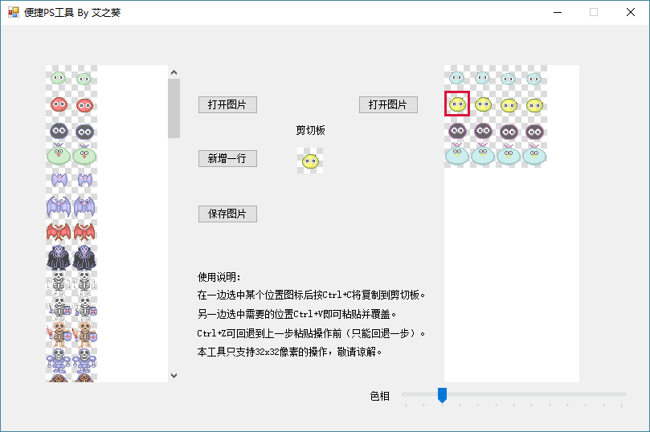

在左边选择你要导入到的位置，比如怪物就是enemy.png，道具就是items.png等等，再在右边导入你的新素材图片。

之后就可以简单的使用Ctrl+C和Ctrl+V来复制粘贴了。

保存后，刷新地图编辑器即可生效。

### 素材注册

当我们使用新素材后，可能会出现素材不存在的情况，此时绘图时会存在红色问号方框。

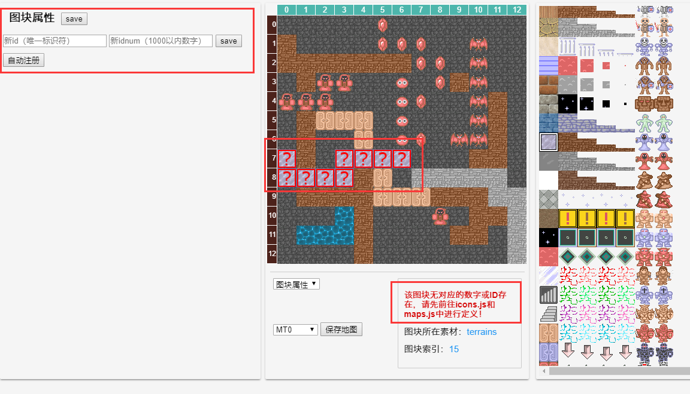

出现这种情况，是因为我们没有将该素材定义到游戏中，也无法进行使用。

要解决这个问题，只需要在左边的图块属性中定义新的图块ID和图块数字即可。ID必须由数字字母下划线组成，数字在1000以内，且均不能和已有的进行重复。

有关图块的ID和数字定义请参见[素材的机制](personalization#素材的机制)。

之后刷新编辑器即可。

对于怪物和道具，我们也可以进行自动注册，只需要点击“自动注册”按钮，将对该栏下所有未注册的素材进行自动注册（自动分配ID和数字）。

素材注册完毕后，即可在游戏中正常使用，也可以被地图生成器所识别（需要重开地图生成器）。

### 额外素材

从2.4.2开始，H5魔塔样板支持额外素材，你可以导入任意个类似RM中的tilesets文件，且无需注册即可使用。

要使用额外素材，请在`全塔属性`中的`tilesets`项，添加额外素材的图片名称，刷新后即可在地图编辑器中使用。

额外素材不可注册，其数字、ID和索引都是和该图块在图片上的位置相关，不可编辑。

有关额外素材的更多说明参见[额外素材](personalization#额外素材)

## 控制台调试

HTML5的塔都是可以进行控制台调试的。

当我们使用Chrome进入游戏后，可以按 `Ctrl+Shift+I` ，并找到 `Console` 控制台。

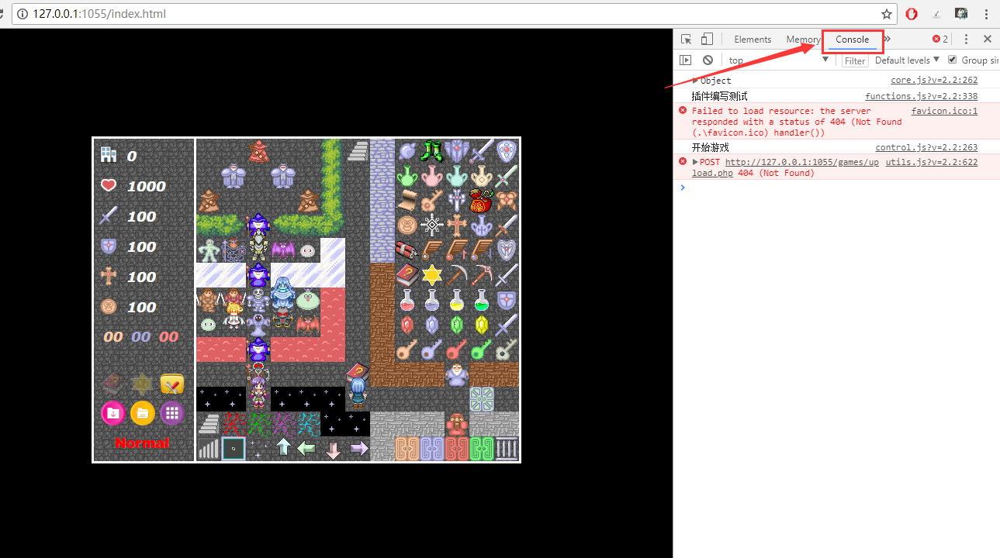

在控制台中，我们可以输入一些命令对游戏进行调试，常见的命令有：

- `core.status.floorId` 获得当前层的floorId。
- `core.status.thisMap` 获得当前地图信息。例如`core.status.thisMap.blocks`可以获得当前层所有图块。
- `core.floors` 获得所有剧本的信息。例如`core.floors[core.status.floorId].events`可以获得当前层所有事件。
- `core.status.hero` 获得当前勇士状态信息。例如`core.status.hero.atk`就是当前勇士的攻击力数值。
- `core.material.enemys` 获得所有怪物信息。例如`core.material.enemys.greenSlime`就是获得绿色史莱姆的属性数据。
- `core.material.items` 获得所有道具的信息。例如`core.material.items.pickaxe`就是获得破墙镐的信息。
- `core.debug()` 开启调试模式；此模式下可以按住Ctrl键进行穿墙。
- `core.updateStatusBar()` 立刻更新状态栏和地图显伤。
- `core.setStatus('atk', 1000)` 直接设置勇士的某项属性。本句等价于 `core.status.hero.atk = 1000`。
- `core.getStatus('atk')` 返回勇士当前某项属性数值。本句等价于 `core.status.hero.atk`。
- `core.setItem('pickaxe', 10)` 直接设置勇士某个道具的个数。这里可以需要写道具的ID。
- `core.getItem('pickaxe', 2)` 令勇士获得两个破墙镐。
- `core.itemCount('pickaxe')` 返回勇士某个道具的个数。
- `core.hasItem('pickaxe')` 返回勇士是否拥有某个道具。等价于`core.itemCount('pickaxe')!=0`。
- `core.getEquip(0)` 返回0号装备类型（武器）的当前装备的itemId，不存在则返回null
- `core.hasEquip('sword1')` 返回某个装备当前是否处于被装备状态
- `core.setFlag('xxx', 1)` 设置某个flag/自定义变量的值。
- `core.getFlag('xxx', 10)` 获得某个flag/自定义变量的值；如果该项不存在（未被定义），则返回第二个参数的值。
- `core.hasFlag('xxx')` 返回是否存在某个变量且不为0。等价于`core.getFlag('xxx', 0)!=0`。
- `core.removeFlag('xxx')` 删除某个flag/自定义变量
- `core.insertAction(list)` 执行一段自定义事件。比如 `core.insertAction(["剧情文本"])` 将执行一个剧情文本显示事件。
- `core.changeFloor('MT2', 'downFloor')` 立刻执行楼层切换到MT2层的下楼点位置。
- `core.changeFloor('MT5', null, {'x': 4, 'y': 7})` 立刻切换楼层到MT5层的(4,7)点。
- `core.getBlock(3, 5, 'MT1')` 获得当前地图上某一个块的信息。第三个参数为floorId，可省略表示当前楼层。
- `core.getBlockId(3, 5, 'MT1')` 获得当前地图上某一个点的图块ID。第三个参数为floorId，可省略表示当前楼层。
- `core.resetMap()` 重置当前层地图。**当修改地图后再读档，修改的地图不会立刻生效，此时可以使用resetMap来重置当前楼层的地图。**
- ……

更多API和详细参数介绍可参见[API列表](api)。

## 报错处理

有时候刷新后可能地图编辑器页面变成空白，即无法正确加载，游戏也无法正常进入。

出现这种问题的原因往往是如下几种：
- 手动直接打开并错误编辑了文件
- 文件不存在（被误删等）
- 楼层floorId不合法（必须是字母数字下划线组成，且不能以数字开头）
- 楼层floorId定义存在重复（比如定义了两个MT0层）
- 初始楼层ID不存在（比如修改了全塔属性中的初始楼层ID，但是实际的该ID不存在，也会出错）
- ……（可能各种奇怪的报错问题）

出现这种问题，（在Chrome浏览器中）请按Ctrl+Shift+I打开控制台，并找到Console查看报错。

一般都会具体到哪个楼层文件出错。

解决方式：哪个楼层文件出错，请使用VSCode等打开project目录下的data.js文件，并将出错的那个楼层定义删除。

例如下面这个问题：

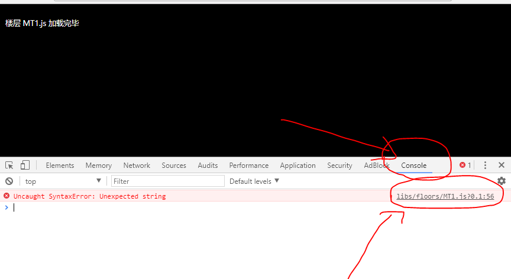

那么使用VSCode打开data.js文件，并将 "floorIds": [..., "MT1"] 这里对它的楼层定义删除，再刷新即可。

请注意，手动删除楼层时一定要确保“初始楼层ID”是一个有效且存在的floorId！

&nbsp;

如有任何无法解决的问题，欢迎加群**539113091**寻求帮助。

==========================================================================================

[继续阅读下一章：元件说明](element)
