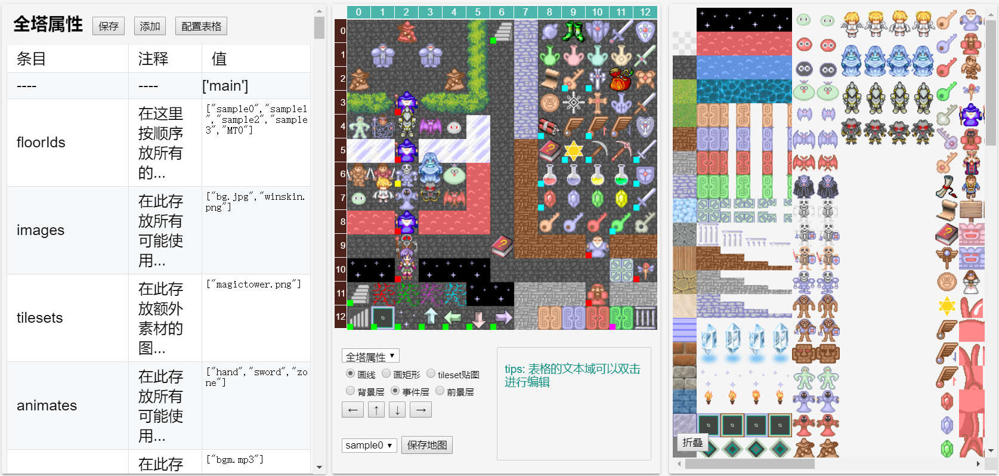
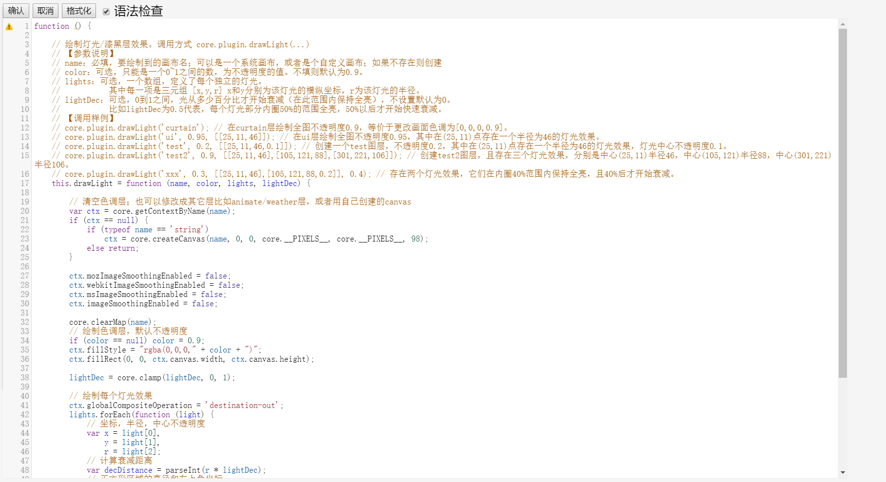

# editor

直接使用游戏运行时(之后简称core)的代码来绘制游戏画面, 借助fs.js来实现浏览器编辑文件. 通过表格编辑数据, blockly图块编辑事件, code mirror编辑文本的可视化魔塔编辑器.



左侧数据区, 中间地图区, 右侧素材区


事件编辑器



脚本编辑器

> 此文件是editor的结构说明, 不是使用文档

## 组成

本目录下所有文件,以及`../editor.html`,`../editor-mobile.html`和`../启动服务.exe`,`../server.py`是地图编辑器的所有组件.

### 父目录
+ editor(-mobile).html  
  编辑器的[入口页面](http://127.0.0.1:1055/editor.html)  
  以`display:none`的形式引入了core的`index.html`的`dom`,修改了原来的`.gameCanvas #ui #data`等的名字以避免冲突  
+ 启动服务.exe [源码](http://github.com/ckcz123/mota-js-server/)  
  为fs.js提供后端支持, 同时集成了一些实用工具
+ server.py  
  非windows平台中为fs.js提供后端支持  

### core

游戏运行时中部分代码根据`main.mod=='editor'`进行了调整

+ 通过`main.init('editor')`加载数据

+ `editor`模式关闭了部分动画

+ `core.drawMap`中`editor`模式下不再画图,而是生成画图的函数提+ 供给`editor`

+ `editor`模式下`GlobalAnimate`可以独立的选择是否播放

+ `core.playBgm`和`core.playSound`中非`play`模式不再播放声音

+ `core.show`和`core.hide`中非`play`模式不再进行动画而是立刻+ 完成并执行回调

+ `editor`模式不执行`core.resize`


### fs.js

依照[issue#31](https://github.com/ckcz123/mota-js/issues/13)的约定, 模仿node的fs模块提供如下api,与`启动服务.exe`,`server.py`配合为js提供文件读写功能, 是编辑器成立的前提

``` js
fs.readFile('file.in','utf-8',callback) 
//读文本文件
//callback:function(err, data)
//data:字符串
fs.readFile('file.in','base64',callback) 
//读二进制文件
//callback:function(err, data)  
//data:base64字符串

fs.writeFile('file.out', data ,'utf-8', callback)
//写文本文件
//callback:function(err)
//data:字符串
fs.writeFile('file.out', data ,'base64', callback)
//写二进制文件
//callback:function(err)
//data:base64字符串

fs.readdir(path, callback)
//callback:function(err, data) 
//path:支持"/"做分隔符
//data:[filename1,filename2,..] filename是字符串,只包含文件不包含目录

//所有参数不允许缺省
```

### editor_multi.js

用[CodeMirror](https://github.com/codemirror/CodeMirror) 实现有高亮的多行文本编辑

编辑选定`id_`的文本域
``` js
editor_multi.import(id_,{lint:true})
```

编辑blockly方块的特定域
``` js
editor_multi.multiLineEdit(value,b,f,{lint:true},callback)
```

配置表格
``` js
editor_multi.editCommentJs(mod)
```

### MotaAction.g4

通过[antlr-blockly](https://github.com/zhaouv/antlr-blockly)的语法定义core中各事件对应的方块.  

借助google的[blockly](https://github.com/google/blockly)来实现事件的可视化编辑.

入口方块以`_m`结尾

一般语句写在`action`中, 以`_s`结尾

### editor_blockly.js

把选定`id_`的事件用blockly编辑
``` js
editor_blockly.import(id_,{type:'event'});
```

把文本区域的代码转换成图块
``` js
editor_blockly.parse();
```

`initscript中`的`toolboxObj`定义了侧边栏中显示的图块

自定义`Blockly.FieldColour.prototype.createWidget_`修改了颜色选择器的行为

自定义`Blockly.FieldTextInput.prototype.showInlineEditor_`添加了自动补全


### editor_mode.js

用于切换数据区

加载数据
```javascript
editor.mode.loc();
editor.mode.enemyitem();
editor.mode.floor();
editor.mode.tower();
editor.mode.functions();
```

切换模式
```javascript
editor.mode.onmode('');//清空
editor.mode.onmode('save');//保存
editor.mode.onmode('nextChange');//下次onmode时前端进行切换

editor.mode.onmode('loc');
editor.mode.onmode('enemyitem');
editor.mode.onmode('floor');
editor.mode.onmode('tower');
editor.mode.onmode('functions');
editor.mode.onmode('map');
editor.mode.onmode('appendpic');
```
在`onmode('save')`时,改动才会保存到文件,涉及到图片的改动需要刷新页面使得`editor`能看到

数据区一些通用的函数也定义在这里

### editor_table.js

处理表格的生成, 及其响应的事件

其接受来自../project/\*.js的数据`obj`和来自table/\*.comment.js的注释`commentObj`

commentObj的结构如示例
``` js
{
	"_type": "object",
	"_data": {
		"events": {
			"_type": "object",
			"_data": {
				"resetGame": {
					"_leaf": true,
					"_type": "textarea",
					"_lint": true,
					"_data": "重置整个游戏"
				},
				"setInitData": {
					"_leaf": true,
					"_type": "textarea",
					"_lint": true,
					"_data": "设置初始属性"
        },
```
一层正常数据, 一层`_`开头的结构说明, 忽略`_`层的话与obj同结构

通过
``` js
editor.table.objToTable(obj, commentObj)
editor.table.objToTr
editor.table.objToTd
```
遍历这两个对象来生成表格, 叶节点根据`_type`渲染成对应的dom

表格的值变化`onchange`, 双击`dblclickfunc`, 删除`deletefunc`, 添加`addfunc`也定义在此文件

### editor_mappanel.js

与地图区相关的功能
+ 画地图 线/矩形/tileset
+ 通过地图选中事件或素材
+ 右键菜单
+ 切换楼层
+ 大地图移动可视窗口

### editor_materialpanel.js

与素材区相关的功能
+ 选中
+ 展开/折叠

### editor_datapanel.js

与数据区相关的功能 (且与表格无关的功能)
+ 地图编辑
  - 创建新地图
  - 批量创建
+ 地图选点
+ 图块属性
  - 注册素材
  - 修改id
+ 楼层属性
  - 修改楼层id
+ 全塔属性
+ 脚本编辑
+ 追加素材
  - 选择导入的区域
  - 导入图片
  - 改色相
  - 选中图片中的格子
  - 确认追加
+ 公共事件
+ 插件编写

### editor_ui.js

ui事件中没有具体到前三个区中的函数
+ 响应点击
+ 快捷键
+ 显示帮助
+ UI预览 & 地图选点相关

### editor_util.js

一些通用的函数
+ 生成id
+ HTML转义
+ 像素处理
+ base64的encode/decode
+ 检查值是否为空

### editor_listen.js

界面与功能的绑定

### editor_file.js

包装fs.js, 把数据读写到对应的文件

### editor_game.js

游戏数据的处理

此部分的重构未完成, 实际上是由editor_file.js和editor_file_unsorted.js来做的

### editor.js

初始化加整合各模块

现状是还放了一些游戏数据有关的函数未挪到editor_game, 以及部分和入口页面生成有关的函数