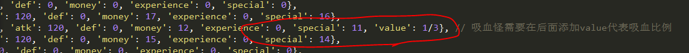
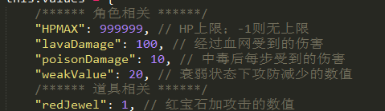
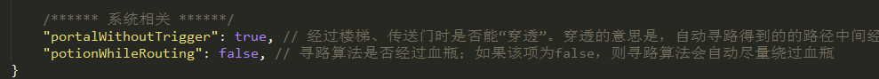

# 元件说明

在本章中，将对样板里的各个元件进行说明。各个元件主要包括道具、门、怪物、楼梯等等。

请打开样板0层 `sample0.js` 进行参照对比。

## 道具

本塔目前支持的所有道具列表在样板0层中已全部给出。当你在样板0层中拿到某个宝物时会有提示，这里不再赘述，详见拿到该道具的说明。

大多数宝物都有默认的效果，十字架和屠龙匕首暂未定义，如有自己的需求可参见[自定义道具效果](./personalization#自定义道具效果)。

!> 请注意，本塔没有"装备"的说法，所有剑盾拿到后将立刻作为攻防数值直接加到勇士的属性上。

拿到道具后将触发`afterGetItem`事件，有关事件的详细介绍请参见[事件](./event)。

如需修改某个道具的效果，在不同区域宝石数据发生变化等问题，请参见[自定义道具效果](./personalization#自定义道具效果)的说明。

## 门

本塔支持6种门，黄蓝红绿铁花。前五种门需要有对应的钥匙打开，花门只能通过调用`openDoor`事件进行打开。

本塔支持暗墙，但是暗墙也必须通过`openDoor`事件开启。例如，样板2层的小偷事件，就是可以打开一个暗墙的。

开门后可触发该层的`afterOpenDoor`事件，有关事件的详细介绍请参见第四章。

## 怪物

本塔支持的怪物列表参见`enemys.js`。其与images目录下的`enemys.png`素材按顺序一一对应。如不知道怪物素材长啥样的请打开`enemys.png`对比查看。
如有自己的怪物素材需求请参见[自定义素材](./personalization#自定义素材)的内容。

怪物可以由特殊属性，每个怪物最多只能有一个特殊属性。怪物的特殊属性所对应的数字（special）在下面的`getSpecialText`中定义，请勿对已有的属性进行修改。

怪物的伤害计算在下面的`calDamage`函数中，如有自己需求的伤害计算公式请修改该函数的代码。

如果`data.js`中的enableExperience为false，即不启用经验的话，怪物手册里将不显示怪物的经验值，打败怪物也不获得任何经验。

拿到幸运金币后，打怪获得的金币将翻倍。

吸血怪需要在怪物后添加value，代表吸血的比例。

中毒怪让勇士中毒后，每步扣减的生命值由`data.js`中的values定义。
衰弱怪让勇士衰弱后，攻防会暂时下降一定的数值（直到衰弱状态解除恢复）；这个下降的数值同在`data.js`中的values定义。

诅咒怪将让勇士陷入诅咒状态，诅咒状态下杀怪不获得金币和经验值。

领域怪需要在怪物后添加value，代表领域伤害的数值。如果勇士生命值扣减到0，则直接死亡触发lose事件。

出于游戏性能的考虑，我们不可能每走一步都对领域和夹击进行检查。因此我们需要在本楼层的 checkBlock 中指明哪些点可能会触发领域和夹击事件，在这些点才会对领域和夹击进行检查和处理。

!> 请注意这里的`"x,y"`代表该点的横坐标为x，纵坐标为y；即从左到右第x列，从上到下的第y行（从0开始计算）。

本塔不支持阻击、激光、仇恨、自爆、退化等属性。

（这些属性基本都太恶心了，恶心到都不想加上去）

如有额外需求，可参见[自定义自定义怪物属性](./personalization#自定义自定义怪物属性)，里面讲了如何设置一个新的怪物属性。

### 路障、楼梯、传送门

血网的伤害数值、中毒后每步伤害数值、衰弱时暂时攻防下降的数值，都在 `data.js` 的values内定义。

路障同样会尽量被自动寻路绕过。

有关楼梯和传送门，必须在该层样板的changeFloor里指定传送点的目标。

!> 请注意这里的`"x,y"`代表该点的横坐标为x，纵坐标为y；即从左到右第x列，从上到下的第y行（从0开始计算）。如(6,0)代表最上面一行的正中间一列。

floorId指定的是目标楼层的唯一标识符（ID）。

后面可以写stair到upFloor或downFloor，表示将前往目标楼层的上楼梯/下楼梯位置。你也可以写loc然后指定目标点的坐标。

请注意的是，如果目标楼层有多个楼梯，写stair可能会导致到达的楼梯不确定，这时候请使用loc方式来指定具体的点位置。

可以指定direction为up/left/right/down，指定后勇士将面向该方向。

可以指定time，指定后切换动画时长为指定的数值。

楼梯和传送门默认可`"穿透"`。所谓穿透，就是当寻路穿过一个楼梯/传送门后，不会触发楼层传送事件，而是继续前进。通过系统Flag可以指定是否穿透，你也可以对每个传送点单独设置该项。

上面就是整个样板中的各个元件说明。通过这种方式，你就已经可以做出一部没有任何事件的塔了。

尝试着做一个两到三层的塔吧！
