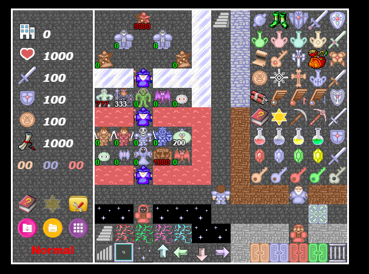

# 元件说明

?> 目前版本**v2.3**，上次更新时间：* {docsify-updated} *

在本章中，将对样板里的各个元件进行说明。各个元件主要包括道具、门、怪物、楼梯等等。

请打开样板0层 `sample0.js` 进行参照对比。



## 道具

本塔目前支持的所有道具列表在样板0层中已全部给出。当你在样板0层中拿到某个宝物时会有提示，这里不再赘述，详见拿到该道具的说明。

大多数宝物都有默认的效果，屠龙匕首暂未定义，如有自己的需求可参见[自定义道具效果](personalization#自定义道具效果)。

拿到道具后将触发`afterGetItem`事件，有关事件的详细介绍请参见[事件](event)。

如需修改某个道具的效果，在不同区域宝石数据发生变化等问题，请参见[自定义道具效果](personalization#自定义道具效果)的说明。

**有关轻按，在data.js的系统变量中有定义。如果`enableGentleClick`为true，则鼠标（触摸屏）通过双击勇士，键盘通过空格可达到轻按效果，即不向前移动而获得前方物品。**

## 装备

如果需要让剑盾等变成装备，可以直接在`data.js`中设置`'equipment': true`即可。

有关装备更为详细的资料可参见[自定义装备](personalization#自定义装备)的说明。

## 门

本塔支持6种门，黄蓝红绿铁花。前五种门需要有对应的钥匙打开，花门只能通过调用`openDoor`事件进行打开。

开门后可触发该层的`afterOpenDoor`事件，有关事件的详细介绍请参见第四章。

## 暗墙

本塔支持暗墙。

要制作一个暗墙非常简单：在该点直接放一个普通墙壁，然后事件写“开门”，坐标为该点就行。

``` js
// 该点画一个普通的墙壁，比如`yellowWall`

// 在该点的事件events中:
"x,y": [
    {"type": "openDoor", "loc": [x,y]} // 直接使用开门事件，坐标需写当前点坐标。
]
```

系统会自动调用animates中的开暗墙动画。

目前只有如下ID支持以这种方式开门：

``` text
yellowDoor, blueDoor, redDoor, greenDoor, specialDoor, steelDoor,
yellowWall, blueWall, whiteWall, lava, star
```

## 怪物

本塔支持的怪物列表参见`project/enemys.js`。其与images目录下的`enemys.png`素材按顺序一一对应。

如有自己的怪物素材需求请参见[自定义素材](personalization#自定义素材)的内容。

怪物可以有特殊属性，每个怪物可以有多个自定义属性。

怪物的特殊属性所对应的数字（special）在`libs/enemys.js`中的`getSpecialText`中定义，请勿对已有的属性进行修改。

``` js
enemys.prototype.getSpecialText = function (enemyId) {
    if (enemyId == undefined) return "";
    var enemy = this.enemys[enemyId];
    var special = enemy.special;
    var text = [];
    if (this.hasSpecial(special, 1)) text.push("先攻");
    if (this.hasSpecial(special, 2)) text.push("魔攻");
    if (this.hasSpecial(special, 3)) text.push("坚固");
    if (this.hasSpecial(special, 4)) text.push("2连击");
    if (this.hasSpecial(special, 5)) text.push("3连击");
    if (this.hasSpecial(special, 6)) text.push((enemy.n||4)+"连击");
    if (this.hasSpecial(special, 7)) text.push("破甲");
    if (this.hasSpecial(special, 8)) text.push("反击");
    if (this.hasSpecial(special, 9)) text.push("净化");
    if (this.hasSpecial(special, 10)) text.push("模仿");
    if (this.hasSpecial(special, 11)) text.push("吸血");
    if (this.hasSpecial(special, 12)) text.push("中毒");
    if (this.hasSpecial(special, 13)) text.push("衰弱");
    if (this.hasSpecial(special, 14)) text.push("诅咒");
    if (this.hasSpecial(special, 15)) text.push("领域");
    if (this.hasSpecial(special, 16)) text.push("夹击");
    if (this.hasSpecial(special, 17)) text.push("仇恨");
    if (this.hasSpecial(special, 18)) text.push("阻击");
    if (this.hasSpecial(special, 19)) text.push("自爆");
    if (this.hasSpecial(special, 20)) text.push("无敌");
    if (this.hasSpecial(special, 21)) text.push("退化");
    if (this.hasSpecial(special, 22)) text.push("固伤");
    if (this.hasSpecial(special, 23)) text.push("重生");
    return text.join("  ");
}
```

多属性可采用数组的写法，比如`'special': [1,3]`视为同时拥有先攻和坚固属性；`'special': [5,10,14,18]`视为拥有3连击、魔防、诅咒、阻击四个属性。

本塔支持战斗动画，在`data.js`中存在三个全局选项：`canOpenBattleAnimate`, `showBattleAnimateConfirm`, `battleAnimate`。

- `canOpenBattleAnimate`代表是否允许用户开启战斗动画。如果你添加了一些自定义属性，且不想修改战斗界面的UI，则可以将其关闭。
- `showBattleAnimateConfirm`代表是否在游戏开始时给用户提供开启动画的选项。对于一些偏向于萌新的塔，可以开启此项。
- `battleAnimate`代表是否默认开启战斗动画。此项会被用户存储的设置给覆盖。
- 如果`canOpenBattleAnimate`为false，则后面两个也强制为false。

怪物可以负伤，在`data.js`的全局变量`enableNegativeDamage`中指定。

下面的`getSpecialHint`函数则给定了每个特殊属性的详细描述。这个描述将在怪物手册中看到。

打败怪物后可以进行加点操作。有关加点塔的制作可参见[加点事件](event#加点事件)。

如果`data.js`中的enableExperience为false，即不启用经验的话，怪物手册里将不显示怪物的经验值，打败怪物也不获得任何经验。

拿到幸运金币后，打怪获得的金币将翻倍。

如果怪物有`"notBomb": true`，则该系列诖怪物均不可被炸。

N连击怪物的special是6，且我们可以为它定义n代表实际连击数。参见样板中剑王的写法。

吸血怪需要给怪物设置value，代表吸血的比例。

可以给吸血怪添加`'add': true`来将吸血的数值加到自身上。

中毒怪让勇士中毒后，每步扣减的生命值由`data.js`中的values定义。

衰弱怪让勇士衰弱后，攻防会下降一定比例或固定数值（直到衰弱状态解除恢复）；其在`data.js`中的values定义。

诅咒怪将让勇士陷入诅咒状态，诅咒状态下杀怪不获得金币和经验值。

领域怪需要在怪物后添加value，代表领域伤害的数值。如果勇士生命值扣减到0，则直接死亡触发lose事件。

领域是十字伤害还是九宫格伤害由`zoneSquare`设定，如设置为true则为九宫格伤害，不指定或为false则为十字伤害。

领域怪还可以设置`range`选项代表该领域怪的范围，不写则默认为1。

阻击怪同样需要设置value，代表领域伤害的数值。如果勇士生命值扣减到0，则直接死亡触发lose事件。

!> 阻击怪后退的地点不能有任何事件存在，即使是已经被禁用的自定义事件！

请注意如果吸血、领域、阻击中任何两个同时存在，则value会冲突。**因此请勿将吸血、领域或阻击放置在同一个怪物身上。**

退化怪需要设置'atkValue'和'defValue'表示退化的数值；也可以不设置默认为0。

固伤怪则需要设置`damage`选项，代表战前扣血数值。

如有额外需求，可参见[自定义怪物属性](personalization#自定义自定义怪物属性)，里面讲了如何设置一个新的怪物属性。

## 路障，楼梯，传送门

血网的伤害数值、中毒后每步伤害数值、衰弱时暂时攻防下降的数值，都在 `data.js` 的values内定义。

路障同样会尽量被自动寻路绕过。

有关楼梯和传送门，必须在该层样板的changeFloor里指定传送点的目标。


!> **请注意这里的`"x,y"`代表该点的横坐标为x，纵坐标为y；即从左到右第x列，从上到下的第y行（从0开始计算）。如(6,0)代表最上面一行的正中间一列。**

floorId指定的是目标楼层的唯一标识符（ID）。

也可以写`"floorId": ":before"`和`"floorId": ":next"`表示上一楼和下一楼。

后面可以写stair到upFloor或downFloor，表示将前往目标楼层的上楼梯/下楼梯位置。你也可以写loc然后指定目标点的坐标。

请注意的是，如果目标楼层有多个楼梯，写stair可能会导致到达的楼梯不确定，这时候请使用loc方式来指定具体的点位置。

可以指定direction为up/left/right/down，指定后勇士将面向该方向。

可以指定time，指定后切换动画时长为指定的数值。

**从2.1.1开始，楼层属性中提供了`upFloor`和`downFloor`两项。如果设置此项（比如`"upFloor": [2,3]`），则写stair:upFloor或者楼传器的落点将用此点来替换楼梯位置（即类似于RM中的上箭头）。**

## 动画和天气系统

现在我们的H5魔塔支持播放动画，也支持天气系统了。

要播放动画，你需要先使用“RM动画导出器”将动画导出，放在animates目录下，然后再data.js中定义。

``` js
"animates": [// 在此存放所有可能使用的动画，必须是animate格式，在这里不写后缀名
    // 动画必须放在animates目录下；文件名不能使用中文，不能带空格或特殊字符
    "hand", "sword", "zone", "yongchang", "thunder" // 根据需求自行添加
]
```

!> 动画必须是animate格式，名称不能使用中文，不能带空格或特殊字符。

导出动画时可能会进行一些压缩以节省流量，因此清晰度可能不如原版。

动画播放时，是按照每秒20帧的速度（即50ms/帧）。

定义完毕后，我们可以调用`animate`事件来播放该动画，有关事件的详细介绍请参见[事件](event)。

!> 播放录像时，将默认忽略所有动画。

目前天气系统只支持雨和雪两种天气。

在每层楼的剧本文件里存在一个weather选项，表示该层楼的默认天气。

``` js
// 该层的默认天气。本项可忽略表示晴天，如果写则第一项为"rain"或"snow"代表雨雪，第二项为1-10之间的数代表强度。
"weather": ["snow",5] 
```

我们也可以使用`setWeather`事件来设置当前天气，有关事件的详细介绍请参见[事件](event)。

## 背景音乐

本塔支持BGM和SE的播放。

要播放音乐和音效，你需要将对应的文件放在sounds目录下，然后在全塔属性中进行定义

``` js
"bgms": [ // 在此存放所有的bgm，和文件名一致。第一项为默认播放项
    // 音频名不能使用中文，不能带空格或特殊字符；可以直接改名拼音就好
    'bgm.mp3'
];
"sounds": [ // 在此存放所有的SE，和文件名一致
    // 音频名不能使用中文，不能带空格或特殊字符；可以直接改名拼音就好
    'floor.mp3', 'attack.mp3', 'door.mp3', 'item.mp3', 'zone.mp3'
]
```

!> 音频名不能使用中文，不能带空格或特殊字符。

目前BGM支持主流的音乐格式，如mp3, ogg, mid格式等。SE则不支持mid格式的播放。

!> mid格式是通过数学方法模拟出来的音乐效果，质量可能会和实际效果差距较大。

!> **警告！** mid格式在手机端播放可能会特别卡，仍推荐直接使用mp3/ogg来播放。

定义完毕后，我们可以调用`playBgm`/`playSound`事件来播放对应的音乐/音效，有关事件的详细介绍请参见[事件](event)。

**另外，考虑到用户的流量问题，将遵循如下规则：**

- **如果用户当前使用的电脑，则默认开启音乐效果，并播放默认BGM**
- **如果用户当前使用的手机，且处于Wifi状态，则默认开启音乐效果，并播放默认BGM**
- **其他情况，将默认关闭音乐效果，只有在用户在菜单栏中点击“音乐开关”后才会播放音乐**

!> iOS平台以及部分浏览器不支持获得当前网络状态，此时即使在使用Wifi也必须要用户点击“音乐开关”才能播放音乐。

## 录像

HTML5魔塔一大亮点就是存在录像系统，可以很方便进行录像回放。

当你在游戏的过程中，随着你的操作，录像也会被依次记录。游戏结束后将提示是否下载录像，上传成绩时也会上传你的录像信息。

在菜单栏-同步存档中，可以直接对当前录像进行下载。

!> 录像记录的是你当前的路线（本质上是模拟键盘操作），是一个纯文本文件，占用空间很小！

录像的回放主要有两种方式：

1. 保存成的录像文件(.h5route文件)：在标题界面点录像回放，再选择文件即可。
2. 游戏过程中时的当前录像：随时按R可以进行回放；手机端则长按任何位置3秒以上调出虚拟键盘，再按R。

录像播放过程中，可以进行如下操作：

- **暂停/播放：** 按空格可以随时暂停或播放录像。
- **加速：** 按X可以加速录像播放，最高可达6倍速。
- **减速：** 按Z可以减速录像播放，最低可达0.3倍速。
- **停止：** 按ESC可以立刻停止录像播放，并返回正常游戏。
- **回退：** 按A可以回退到上一个录像节点（录像播放过程中每50步存一个录像节点）。
- **存档：** 按S可以在录像播放过程中进行存档。
- **查看手册：** 按C可以在录像播放过程中查看怪物手册。

上述操作在手机端均有工具栏的对应按钮可点击操作。

如果录像出现问题，请加群539113091找小艾反馈Bug。

## 操作说明

本塔主要支持鼠标（触摸屏）操作和键盘操作。

鼠标（触摸屏）操作说明如下：

- **点状态栏中图标：** 进行对应的操作
- **点任意块：** 寻路并移动
- **点任意块并拖动：** 指定寻路路线
- **单击勇士：** 转向
- **双击勇士：** 轻按（仅在轻按开关打开时有效）
- **长按任意位置：** 打开虚拟键盘

键盘操作快捷键如下：

- **[CTRL]** 跳过对话
- **[Z]** 转向
- **[X]** 打开/关闭怪物手册
- **[G]** 打开/关闭楼层传送器
- **[A]** 读取自动存档
- **[S/D]** 打开/关闭存/读档页面
- **[K]** 打开/关闭快捷商店选择列表
- **[T]** 打开/关闭工具栏
- **[ESC]** 打开/关闭系统菜单
- **[H]** 打开帮助页面
- **[R]** 回放录像
- **[SPACE]** 轻按（仅在轻按开关打开时有效）
- **[1]** 快捷使用破墙镐
- **[2]** 快捷使用炸弹/圣锤
- **[3]** 快捷使用中心对称飞行器

以上快捷键也能在游戏菜单中的操作说明中看到。

&nbsp;

&nbsp;

上面就是整个样板中的各个元件说明。通过这种方式，你就已经可以做出一部没有任何事件的塔了。

尝试着做一个两到三层的塔吧！

==========================================================================================

[继续阅读下一章：事件](event)
