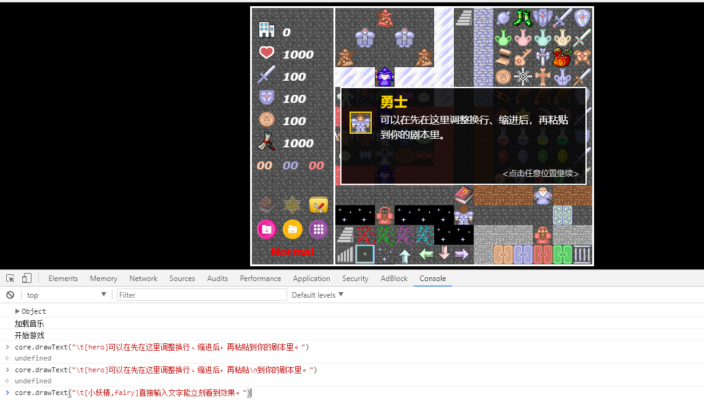

# 事件

?> 目前版本**v1.4.1**，上次更新时间：* {docsify-updated} *

本章内将对样板所支持的事件进行介绍。

## 事件的机制

本塔所有的事件都是依靠触发`trigger`完成的。例如，勇士碰到一个门可以触发一个事件`openDoor`，勇士碰到怪物可以触发一个事件`battle`，勇士碰到一个（上面定义的）楼层传送点可以触发一个事件`changeFloor`，勇士穿过路障可以触发一个事件`passNet`，等等。上面说的这些事件都是系统本身自带的，即类似于RMXP中的公共事件。

上述这些默认的事件已经存在处理机制，不需要我们操心。我们真正所需要关心的，其实只是一个自定义的事件。

**本塔中的所有自定义事件能且只能被其他事件触发。不存在RMXP里面那种，设置了某个变量为true后，一个事件被自动执行的问题。这点和RMXP的区别非常大，请务必注意。**

所有事件都存在两种状态：启用和禁用。  
- 启用状态下，该事件才处于可见状态，可被触发、交互与处理。  
- 禁用状态下该事件相当于不存在，不可见、不可被触发、不可交互。

所有事件默认情况下都是启用的，除非指定了`enable: false`。

在事件列表中使用`type: show`和`type: hide`可以将一个禁用事件启用，或将一个启用事件给禁用。


## 自定义事件

打开样板1层（`sample1.js`）有着一些介绍。下面是更为详细的说明。

所有自定义的事件都是如下的写法：

``` js
"events": { // 该楼的所有可能事件列表
    "x,y": {
        "trigger": "action", // 触发的trigger, action代表自定义事件
        "enable": true, // 该事件初始状态下是否处于启用状态
        "noPass": true, // 该点是否不可通行。true代表不可通行，false代表可通行。
        "data": [ // 实际执行的事件列表
            // 事件1
            // 事件2
            // ...
        ]
    }
}
```

这里的`"x,y"`代表该点的横坐标为`x`，纵坐标为`y`；即从左到右第`x`列，从上到下的第`y`行（从0开始计算）。

我们上面提到，有很多系统已经默认的事件（例如开门、打怪等，相当于公共事件）。如果我们需要自定义一个事件，则需要`"trigger": "action"`，它表示该点是一个自定义事件。

!> **如果系统本身存在事件（如一个怪物），且你指定了`"trigger": "action"`，则原事件会被覆盖。**

这种情况下一般需采用后面的afterBattle，afterOpenDoor和afterGetItem来进行事件的处理。

如果该点本身不存在系统事件，则`"trigger":"action"`可被省略不写：

``` js
"events": { // 该楼的所有可能事件列表
    "x,y": {
        // 除非你要覆盖该点已存在的系统默认事件，否则"trigger": "action"可以省略
        "enable": true, // 该事件初始状态下是否处于启用状态
        "noPass": true, // 该点是否不可通行。true代表不可通行，false代表可通行。
        "data": [ // 实际执行的事件列表
            // 事件1
            // 事件2
            // ...
        ]
    }
}
```

`"enable": true` 代表该点初始状态下是否是启用的。如果`enable`为`false`，则该点初始状态下禁用，将不会被显示和交互（比如如果该点是个怪，指定了`enable`为`false`，则该怪不会显示在地图上，也不会发生战斗）。

默认情况下`enable`是`true`，所以如果`enable`为`true`，该项也可以省略不写：

``` js
"events": { // 该楼的所有可能事件列表
    "x,y": {
        // 除非你要覆盖该点已存在的系统默认事件，否则"trigger": "action"可以省略
        // 该事件初始状态下是启用状态，则可以省略"enable": true；如果是禁用状态则必须加上"enable": false
        "noPass": true, // 该点是否不可通行。true代表不可通行，false代表可通行。
        "data": [ // 实际执行的事件列表
            // 事件1
            // 事件2
            // ...
        ]
    }
}
```

`"noPass"`为该点是否可通行的标记。`true`代表该点不可通行，`false`代表该点可通行。

对于目前所有的素材，都存在默认的是否可通行状态。如果你在该点指定`noPass`，则原本的可通行状态会被覆盖。

因此，除非你想覆盖默认的可通行选项（比如将一个空地设为不可通行），否则该项可以忽略。

``` js
"events": { // 该楼的所有可能事件列表
    "x,y": {
        // 除非你要覆盖该点已存在的系统默认事件，否则"trigger": "action"可以省略
        // 该事件初始状态下是启用状态，则可以省略"enable": true；如果是禁用状态则必须加上"enable": false
        // 除非你想覆盖系统默认的可通行状态，否则"noPass"项可以忽略
        "data": [ // 实际执行的事件列表
            // 事件1
            // 事件2
            // ...
        ]
    }
}
```

`"data"`为实际执行的事件列表。类似于RMXP中的"脚本"，也是由一系列事件顺序构成的（其中可以使用`if`和`choices`来进行条件判断或用户选择，后面会具体提到）。

如果大括号里只有`"data"`，则可以省略大括号和`"data"`，直接写中括号数组，换句话说，上面和下面这种写法也是等价的，可以进行一下比较：

``` js
"events": { // 该楼的所有可能事件列表
    // 如果大括号里只有"data"项(没有"action", "enable"或"noPass")，则可以省略到只剩下中括号
    "x,y": [ // 实际执行的事件列表
        // 事件1
        // 事件2
        // ...
    ]
}
```

这种简写方式可以极大方便地造塔者进行造塔。

!> **请注意：如果该点初始的`enable`为`false`，或者该点本身有系统默认事件且需要覆盖（`trigger`），或者你想覆盖该点的默认通行状态，则必须采用上面那种大括号写的方式来定义。**

&nbsp;

`"data"`中，是由一系列的自定义事件类型组成。每个元素类似于：

``` js
"events": { // 该楼的所有可能事件列表
    // 如果大括号里只有"data"项(没有"action"或"enable")，则可以省略到只剩下中括号
    "x,y": [ // 实际执行的事件列表
        {"type": "xxx", ...}, // 事件1
        {"type": "xxx", ...}, // 事件2
        // ...
        // 按顺序写事件，直到结束
    ]
}
```

`"type"`为该自定义事件的类型；而后面的`...`则为具体的一些事件参数。

每次，系统都将取出数组中的下一个事件，并进行处理；直到数组中再无任何事件，才会完全结束本次自定义事件，恢复游戏状态。

下面将依次对所有自定义事件类型进行介绍。

### text：显示一段文字（剧情）

使用`{"type": "text"}`可以显示一段文字。后面`"text"`可以指定文字内容。

``` js
"events": { // 该楼的所有可能事件列表
    // 如果大括号里只有"data"项(没有"action"或"enable")，则可以省略到只剩下中括号
    "x,y": [ // 实际执行的事件列表
        {"type": "text", "text": "在界面上的一段文字"}, // 显示文字事件
        {"type": "text", "text": "这是第二段文字"}, // 显示第二个文字事件
        // ...
        // 按顺序写事件，直到结束
    ]
}
```

该项可以简写成直接的字符串的形式，即下面这种方式也是可以的：

``` js
"events": { // 该楼的所有可能事件列表
    // 如果大括号里只有"data"项(没有"action"或"enable")，则可以省略到只剩下中括号
    "x,y": [ // 实际执行的事件列表
        "在界面上的一段文字",// 直接简写，和下面写法完全等价
        {"type": "text", "text": "这是第二段文字"}, // 显示第二个文字事件
        // ...
        // 按顺序写事件，直到结束
    ]
}
```

所有文字事件均可以进行简写，系统会自动转成`{"type": "text"}`的形式。

值得注意的是，系统会自动对文字进行换行；不过我们也可以手动加入`\n`来换行。

``` js
"events": { // 该楼的所有可能事件列表
  // 如果大括号里只有"data"项(没有"action"或"enable")，则可以省略到只剩下中括号
  "x,y": [ // 实际执行的事件列表
    "这一段文字特别特别长，但是系统可以对它进行自动换行，因此我们无需手动换行",
    "这是第一行\n这是第二行\n这是第三行",
    // ...
    // 按顺序写事件，直到结束
  ]
}
```

我们可以给文字加上标题或图标，只要以`\t[...]`开头就可以，大致共有如下几种情况：

- `\t[hero]` 显示勇士的图标和名字
- `\t[monster_id]`显示某个怪物的图标和名字。`monster_id`在`enemys`中有定义，请前往参照。
  - 例如：`\t[blackMagician]` 将显示黑暗大法师的图标和名字。
- `\t[名字,npc_id]` 显示某个NPC的名字和图标。`npc_id`所对应的图标具体在`icons.js`中有定义，请前往参照。
  - 例如：`\t[小妖精,fairy]` 将显示名字为"小妖精"，且是仙子的图标。
- `\t[标题]` 直接显示标题。
  - 如果该中括号内只有一项，且不为`hero`也不为某个怪物的ID，则会直接显示。如 `\t[你死了]` 直接显示一个标题为"你死了"。

``` js
"x,y": [ // 实际执行的事件列表
    "一段普通文字",
    "\t[hero]这是一段勇士说的话",
    "\t[blackMagician]这是一段黑暗大法师说的话",
    "\t[小妖精,fairy]这是一段小妖精说的话，使用仙子(fairy)的图标",
    "\t[你赢了]直接显示标题为【你赢了】",
]
```

除此以外，我们还能实现“对话框效果”，只要有`\b[...]`就可以。

- `\b[up]` 直接显示在当前点上方。同样把这里的up换成down则为下方。
  - 如果不存在当前点（如在firstArrive中调用），则显示在屏幕最上方（最下方）
- `\b[up,hero]` 显示在勇士上方。同样把这里的up换成down则为下方。
- `\b[up,x,y]` 显示在(x,y)点的上方（下方）；x和y都为整数且在0到12之间。

``` js
"x,y": [ // 实际执行的事件列表
    "\b[up]这段文字显示在当前点上方",
    "\b[down]这段文字显示在当前点上方",
    "\t[hero]\b[up,hero]这是一段勇士说的话，会显示在勇士上方",
    "\t[小妖精,fairy]\b[down,2,2]这是一段小妖精说的话，会显示在(2,2)点下方",
]
```

!> `\t[...]`必须在`\b[...]`前面！不然两者都无法正常显示。


另外值得一提的是，我们是可以在文字中计算一个表达式的值的。只需要将表达式用 `${ }`整个括起来就可以。

``` js
"x,y": [ // 实际执行的事件列表
    "1+2=${1+2}, 4*5+6=${4*5+6}", // 显示"1+2=3, 4*5+6=26"
]
```

我们可以使用 `status:xxx` 代表勇士的一个属性值；`item:xxx` 代表某个道具的个数；`flag:xxx` 代表某个自定义的变量或flag值。

``` js
"x,y": [ // 实际执行的事件列表
    "你当前的攻击力是${status:atk}, 防御是${status:def}",
    "你的攻防和的十倍是${10*(status:atk+status:def)}",
    "你的红黄蓝钥匙总数为${item:yellowKey+item:blueKey+item:redKey}",
    "你访问某个老人的次数为${flag:man_times}",
]
```

- `status:xxx` 获取勇士属性时只能使用如下几个：hp（生命值），atk（攻击力），def（防御力），mdef（魔防值），money（金币），experience（经验）。
- `item:xxx` 中的xxx为道具ID。所有道具的ID定义在items.js中，请自行查看。例如，`item:centerFly` 代表中心对称飞行器的个数。
- `flag:xxx` 中的xxx为一个自定义的变量/Flag；如果没有对其进行赋值则默认值为false。

另外，有个小`trick`。是否想立刻知道显示效果？
你可以用Chrome浏览器打开游戏，按Ctrl+Shift+I打开开发者工具，找到Console（控制台），并中输入`core.drawText("...")` 即可立刻看到文字显示的效果。适当调整文字，使得显示效果满意后，再复制粘贴到你的剧情文本中。



### autoText：自动剧情文本

使用`{"type": "autoText"}`可以使用剧情文本。

``` js
"x,y": [ // 实际执行的事件列表
    {"type": "autoText", "text": "一段自动显示的剧情文字", "time": 5000}
]
```

text为文本正文内容，和上面的写法完全一致。

time为可选项，代表该自动文本的时间。可以不指定，不指定默认为3000毫秒。

用户无法跳过自动剧情文本，只能等待time时间结束后自动过。

回放录像时将忽略自动剧情文本的显示。

!> 由于用户无法跳过自动剧情文本，因此对于大段剧情文本请自行添加“是否跳过剧情”的提示，否则可能会非常不友好。

### setText：设置剧情文本的属性

使用`{"type": "setText"}`可以设置剧情文本的各项属性。

``` js
"x,y": [ // 实际执行的事件列表
    {"type": "setText", "title": [255,0,0], "text": [255,255,0], "background": [0,0,255,0.3]},
    {"type": "setText", "position": "up", "bold": true, "time": 70},
    "这段话将显示在上方，标题为红色，正文为黄色粗体，背景为透明度0.3的蓝色，70毫秒速度打字机效果"
]
```

title为可选项，如果设置则为一个RGB三元组或RGBA四元组，表示标题（名字）颜色。 默认值：`[255,215,0,1]`

text为可选项，如果设置则为一个RGB三元组或RGBA四元组，表示正文颜色。 默认值：`[255,255,255,1]`

background为可选项，如果设置则为一个RGB三元组或RGBA四元组，表示背景色。 默认值：`[0,0,0,0.85]`

position为可选项，表示设置文字显示位置。只能为up（上），center（中）和down（下）三者。 默认值： `center`

bold为可选项，如果设置则为true或false，表示正文是否使用粗体。 默认值：`false`

time为可选项，表示文字添加的速度。若此项设置为0将直接全部显示，若大于0则会设置为相邻字符依次显示的时间间隔。 默认值：`0`

### tip：显示一段提示文字

`{"type": "tip"}`可以在左上角显示一段提示文字。

``` js
"x,y": [ // 实际执行的事件列表
    {"type": "tip", "text": "这段话将在左上角以气泡形式显示"}
]
```

值得注意的是，提示的text内容是可以使用`${ }`来计算表达式的值的。

### setValue：设置勇士的某个属性、道具个数，或某个变量/Flag的值

`{"type": "setValue"}` 能修改勇士的某个属性、道具个数、或某个自定义变量或`Flag`的值。

其大致写法如下：

``` js
"x,y": [ // 实际执行的事件列表
    {"type": "setValue", "name": "...", "value": "..."}, // 设置一个属性、道具或自定义Flag
]
```

使用`setValue`需要指定`name`和`value`选项。

name为你要修改的属性/道具/Flag，每次只能修改一个值。写法和上面完全相同，`status:xxx` 表示勇士一个属性，`item:xxx` 表示某个道具个数，`flag:xxx` 表示某个变量或flag值。参见上面的介绍。

value是一个表达式，将通过这个表达式计算出的结果赋值给name。该表达式同样可以使用`status:xxx`, `item:xxx`, `flag:xxx`的写法表示勇士当前属性，道具个数和某个变量/Flag值。

``` js
"x,y": [ // 实际执行的事件列表
    {"type": "setValue", "name": "status:atk", "value": "status:atk+10" } // 攻击提高10点
    {"type": "setValue", "name": "status:money", "value": "1000" } // 将金币数设为1000（不是+1000）
    {"type": "setValue", "name": "status:hp", "value": "status:hp*2" } // 生命值翻倍
    {"type": "setValue", "name": "item:yellowKey", "value": "item:yellowKey+3" } // 黄钥匙个数加3
    {"type": "setValue", "name": "item:bomb", "value": "item:bomb+10" } // 炸弹个数+10
    {"type": "setValue", "name": "flag:man_times", "value": "0" } // 将变量man_times设为0
    {"type": "setValue", "name": "flag:man_times", "value": "flag:man_times+2*status:atk" } // 将变量man_times的值加上勇士的攻击数值的两倍
]
```

另外注意一点的是，如果hp被设置成了0或以下，将触发lose事件，直接死亡。

### show: 将一个禁用事件启用

我们上面提到了，所有事件都必须靠其他事件驱动来完成，不存在当某个flag为true时自动执行的说法。那么，我们自然要有启用事件的写法。

使用`{"type":"show"}`可以将一个本身禁用的事件启用。

``` js
"x,y": [ // 实际执行的事件列表
  {"type": "show", "loc": [3,6], "floorId": "MT1", "time": 500}, // 启用MT1层[3,6]位置事件，动画500ms
  {"type": "show", "loc": [3,6], "time": 500}, // 如果启用目标是当前层，则可以省略floorId项
  {"type": "show", "loc": [3,6]}, // 如果不指定动画时间，则立刻显示，否则动画效果逐渐显示，time为动画时间
  {"type": "show", "loc": [[3,6],[2,9],[1,2]], "time": 500} // 我们也可以同时动画显示多个点。
]
```

show事件需要用loc指定目标点的坐标，可以简单的写[x,y]代表一个点，也可以写个二维数组[[x1,y1],[x2,y2],...]来同时显示多个点。

floorId为目标点的楼层，如果不是该楼层的事件（比如4楼小偷开2楼的门）则是必须的，如果是当前楼层可以忽略不写。

time为动画效果时间，如果指定了某个大于0的数，则会以动画效果慢慢从无到有显示，动画时间为该数值；如果不指定该选项则无动画直接立刻显示。

!> **要注意的是，调用show事件后只是让该事件从禁用状态变成启用，从不可见不可交互变成可见可交互，但本身不会去执行该点的事件。**

### hide: 将一个启用事件禁用

`{"type":"hide"}`和show刚好相反，它会让一个已经启用的事件被禁用。

其参数和show也完全相同，loc指定事件的位置，floorId为楼层（同层可忽略），time指定的话事件会以动画效果从有到无慢慢消失。

loc同样可以简单的写[x,y]表示单个点，或二维数组[[x1,y1],[x2,y2],...]表示多个点。

但是和show事件有所区别的是：loc选项也可以忽略；如果忽略loc则使当前事件禁用。（即使禁用当前事件，也不会立刻结束当前正在进行的，而是仍然会依次将列表中剩下的事件执行完）

请注意，一次性事件必须要加 `{"type":"hide"}`，尤其是例如走到某个点，触发对话或机关门（陷阱）这种，否则每次都会重复触发。

NPC对话事件结束后如果需要NPC消失也需要调用 `{"type": "hide"}`，可以不写loc选项代表当前事件，可以指定time使NPC动画消失。

``` js
"x,y": [ // 实际执行的事件列表
    {"type": "hide", "loc": [3,6], "floorId": "MT1", "time": 500}, // 禁用MT1层[3,6]位置事件，动画500ms
    {"type": "hide", "loc": [3,6], "time": 500}, // 如果启用目标是当前层，则可以省略floorId项
    {"type": "hide", "loc": [3,6]}, // 如果不指定动画时间，则立刻消失，否则动画效果逐渐消失，time为动画时间
    {"type": "hide", "loc": [[3,6],[2,9],[1,2]], "time": 500}, // 也可以同时指定多个点消失
    {"type": "hide", "time": 500}, // 如果不指定loc选项则默认为当前点， 例如这个就是500ms消失当前对话的NPC
    {"type": "hide"}, // 无动画将当前事件禁用，常常适用于某个空地点（触发陷阱事件、触发机关门这种）
    
]
```

### trigger: 立即触发另一个地点的事件

`{"type":"trigger"}` 会立刻触发当层另一个地点的自定义事件。

上面我们说到，show事件会让一个禁用事件启用且可被交互；但是如果我想立刻让它执行应该怎么办呢？使用trigger就行。

其基本写法如下：

``` js
"x,y": [ // 实际执行的事件列表
    {"type": "trigger", "loc": [3, 6]}, // 立即触发loc位置的事件，当前剩下的事件全部不再执行
    "执行trigger后，这段文字将不会再被显示"
]
```

其后面带有loc选项，代表另一个地点的坐标。

执行trigger事件后，当前事件将立刻被结束，剩下所有内容被忽略；然后重新启动另一个地点的action事件。

例如上面这个例子，下面的文字将不会再被显示，而是直接跳转到`"3,6"`对应的事件列表从头执行。

### revisit: 立即重启当前事件

revisit和trigger完全相同，只不过是立刻触发的还是本地点的事件

``` js
"x,y": [ // 实际执行的事件列表
    {"type": "revisit"}, // 立即触发本事件，等价于{"type": "trigger", "loc": [x,y]}
    "执行revisit后，这段文字将不会再被显示"
]
```

revisit其实是trigger的简写，只不过是loc固定为当前点。

revisit常常使用在一些商人之类的地方，当用户购买物品后不是离开，而是立刻重新访问重新进入购买页面。

### exit: 立刻结束当前事件

上面说到像商人一类，购买物品后可以立刻revisit重新访问，但是这样就相当于陷入了死循环导致无法离开。

可以使用`{"type":"exit"}`立刻结束事件。调用exit后，将立刻结束一切事件，清空事件列表，并返回游戏。

例如玩家点击商人的"离开"选项，则可以调用exit返回游戏。

``` js
"x,y": [ // 实际执行的事件列表
    {"type": "exit" }, // 立即结束事件并恢复游戏，一切列表中的事件都将不再被执行
    "执行exit后，这段文字将不会再被显示"
]
```

### setBlock：设置某个图块

我们可以采用 `{"type": "setBlock"}` 来改变某个地图块。

``` js
"x,y": [ // 实际执行的事件列表
    {"type": "setBlock", "floorId": "MT1", "loc": [3,3], "number": 233}, // 将MT1层的(3,3)点变成数字233
    {"type": "setBlock", "loc": [2,1], "number": 121}, // 省略floorId则默认为本层
    {"type": "setBlock", "number": 57}, // loc也可省略，默认为当前点
]
```

floorId为可选的，表示要更改的目标楼层。如果忽略此项，则默认为当前楼层。

loc为可选的，表示要更改地图块的坐标。如果忽略此项，则默认为当前事件点。

number为**要更改到的数字**，有关“数字”的定义详见参见[素材的机制](personalization#素材的机制)。

图块更改后：

 - 其启用/禁用状态不会发生任何改变。原来是启用还是启用，原来是禁用还是禁用。
 - 可通行状态遵循覆盖原则，即**首先取该图块的默认noPass属性，如果剧本的events中定义该点的noPass则覆盖**。
 - 触发器(trigger)亦采用覆盖原则，即**首先取该图块的默认触发器（例如怪物是battle，道具是getItem，门是openDoor），如果剧本的events中定义了该点的trigger则覆盖**。

图块更改往往与[同一个点的多事件处理](#同一个点的多事件处理)相关。

### update: 立刻更新状态栏和地图显伤

如果你需要刷新状态栏和地图显伤，只需要简单地调用 `{"type": "update"}` 即可。

### sleep: 等待多少毫秒

等价于RMXP中的"等待x帧"，不过是以毫秒来计算。

基本写法：`{"type": "sleep", "time": xxx}` ，其中xxx为指定的毫秒数。

``` js
"x,y": [ // 实际执行的事件列表
    {"type": "sleep", "time": 1000}, // 等待1000ms
    "等待1000ms后才开始执行这个事件"
]
```

### battle: 强制战斗

调用battle可强制与某怪物进行战斗（而无需去触碰到它）。

例如，《宿命的旋律》中，一区有个骷髅队长，当你拿了它周围三个物品时，就会立刻触发强制战斗事件。这时候就可以用`{"type": "battle"}` 实现。

其基本写法是： `{"type": "battle", "id": xxx}`，其中xxx为怪物ID。

``` js
"10,4": [ // 开门后走进去的事件：强制战斗
    "\t[blackKing]你终于还是来了。",
    "\t[hero]放开我们的公主！",
    "\t[blackKing]如果我不愿意呢？",
    "\t[hero]无需多说，拔剑吧！",
    {"type": "battle", "id": "blackKing"}, // 强制战斗
    // 如果战斗失败直接死亡，不会继续触发接下来的剧情。
    {"type": "hide", "loc": [10,2]}, // 战斗后需要手动使怪物消失；战斗后不会引发afterBattle事件。
    {"type": "openDoor", "loc": [8,7]}, // 开门口的机关门
    "\t[blackKing]没想到你已经变得这么强大了... 算你厉害。\n公主就交给你了，请好好对她。",
    {"type": "hide"} // 隐藏本事件
],
```

上面就是样板层中右上角的强制战斗例子。

如果强制战斗失败，则会立刻生命归0并死亡，调用lose函数，接下来的事件不会再被执行。

打败怪物后可以进行加点操作。有关加点塔的制作可参见[加点事件](#加点事件)。

强制战斗没有指定loc的选项，因此战斗后需要调用hide使怪物消失（如果有必要）。

### openDoor: 开门

调用`{"type":"openDoor"}`可以打开一扇门。

``` js
"x,y": [ // 实际执行的事件列表
    {"type": "openDoor", "loc": [3,6], "floorId": "MT1"}, // 打开MT1层的[3,6]位置的门
    {"type": "openDoor", "loc": [3,6]}, // 如果是本层则可省略floorId
]
```

loc指定门的坐标，floorId指定门所在的楼层ID。如果是当前层则可以忽略floorId选项。

如果loc所在的点是一个墙壁，则作为暗墙来开启。

如果loc所在的点既不是门也不是墙壁，则忽略本事件。

### changeFloor: 楼层切换

在事件中也可以对楼层进行切换。一个比较典型的例子就是TSW中，勇士在三楼的陷阱被扔到了二楼，就是一个楼层切换事件。

changeFloor的事件写法大致如下。

``` js
"x,y": [ // 实际执行的事件列表
    {"type": "changeFloor", "floorId": "sample0"，"loc": [10, 10], "direction": "left", "time": 1000 },
    //后面几项依次为楼层id，楼层位置（这两项为必填）；勇士方向可选，切换时间也是可选。
]
```

可以看到，与上面的楼梯、传送门的写法十分类似。

但是相比那个而言，不支持stair楼梯位置（只能写坐标），没有穿透选项。

direction为可选的，指定的话将使勇士的朝向变成该方向

time为可选的，指定的话将作为楼层切换动画的时间。

**time也可以置为0，如果为0则没有楼层切换动画。**

!> **changeFloor到达一个新的楼层，将不会执行firstArrive事件！如有需求请在到达点设置自定义事件，然后使用type: trigger立刻调用之。**

### changePos: 当前位置切换/勇士转向

有时候我们不想要楼层切换的动画效果，而是直接让勇士从A点到B点。

这时候可以用changePos。其参数和changeFloor类似，但少了floorId和time两个选项。

``` js
"x,y": [ // 实际执行的事件列表
    {"type": "changePos", "loc": [10,10], "direction": "left"}, // 直接切换勇士的坐标，loc为目标地点，后面勇士换位后方向
    {"type": "changePos", "loc", [10,10]}, // 如无需指定方向则direction可省略
    {"type": "changePos", "direction": "left"} // loc也可省略，只指定direction；此时等价于当前勇士转向到某个方向。
]
```

### openShop: 打开一个全局商店

使用openShop可以打开一个全局商店。有关全局商店的说明可参见[全局商店](#全局商店)。

### disableShop: 禁用一个全局商店

使用disableShop可以永久禁用全局商店直到再次被openShop打开为止。有关全局商店的说明可参见[全局商店](#全局商店)。

### animate：显示动画

我们可以使用 `{"type": "animate"}` 来显示一段动画。

有关动画的详细介绍可参见[动画和天气系统](element#动画和天气系统)。

``` js
"x,y": [ // 实际执行的事件列表
    {"type": "animate", "name": "yongchang", "loc": [1,3]}, // 在(1,3)显示“咏唱魔法”动画
    {"type": "animate", "name": "zone", "loc": "hero"}, // 在勇士位置显示“领域”动画
    {"type": "animate", "name": "hand"} // 可以不指定loc，则默认为当前事件点
]
```

name为动画名，**请确保动画在main.js中的this.animates中被定义过。**

loc为动画的位置，可以是`[x,y]`表示在(x,y)点显示，也可以是字符串`"hero"`表示在勇士点显示。

loc可忽略，如果忽略则显示为事件当前点。

在动画播放结束后才会继续执行下一个事件。

### showImage：显示图片

我们可以使用 `{"type": "showImage"}` 来显示一张图片。

``` js
"x,y": [ // 实际执行的事件列表
    {"type": "showImage", "name": "bg", "loc": [231,297]}, // 在(231,297)显示bg.png
    {"type": "showImage", "name": "1", "loc": [109,167]}, // 在(109,167)显示1.png
    {"type": "showImage"} // 如果不指定name则清除所有图片。
]
```

name为图片名。**请确保图片在main.js中的this.pngs中被定义过。**

loc为图片左上角坐标，以像素为单位进行计算。

如果不指定name则清除所有显示的图片。

调用show/hide/move/animate等几个事件同样会清除所有显示的图片。

### setFg: 更改画面色调

我们可以使用 `{"type": "setFg"}` 来更改画面色调。

``` js
"x,y": [ // 实际执行的事件列表
    {"type": "setFg", "color": [255,255,255,0.6], "time": 1000}, // 更改画面色调为纯白，不透明度0.6，动画时间1000毫秒
    {"type": "setFg", "color": [0,0,0]}, // 更改画面色调为纯黑，不透明度1，不指定动画时间（使用默认时间）
    {"type": "setFg"} // 如果不指定color则恢复原样。
]
```

color为需要更改画面色调的颜色。它是一个数组，分别指定目标颜色的R,G,B,A值。
- 常见RGB颜色： 纯黑[0,0,0]，纯白[255,255,255]，纯红[255,0,0]，等等。
- 第四元为Alpha值，即不透明度，为一个0到1之间的数。可以不指定，则默认为Alpha=1

如果color不指定则恢复原样。

time为可选的，如果指定，则会作为更改画面色调的时间。

### setWeather：更改天气

我们可以使用 `{"type": "setWeather"}` 来更改天气。

``` js
"x,y": [ // 实际执行的事件列表
    {"type": "setWeather", "name": "rain", "level": 6}, // 更改为雨天，强度为6级
    {"type": "setWeather", "name": "snow", "level": 3}, // 更改为雪天，强度为3级
    {"type": "setWeather"} // 更改回晴天
]
```

name为天气选项。目前只支持`rain`和`snow`，即雨天和雪天。

level为天气的强度等级，在1-10之间。1级为最弱，10级为最强。

如果想改回晴天则直接不加任何参数。

!> 使用setWeather更改的天气在切换地图后会被目标地图的默认天气覆盖。

### move: 让某个NPC/怪物移动

如果我们需要移动某个NPC或怪物，可以使用`{"type": "move"}`。

下面是该事件常见的写法：

``` js
"x,y": [ // 实际执行的事件列表
    {"type": "move", "time": 750, "loc": [x,y], "steps": [// 动画效果，time为移动速度(比如这里每750ms一步)，loc为位置可选，steps为移动数组
        {"direction": "right", "value": 2},// 这里steps 的效果为向右移动2步，在向下移动一步并消失
        "down" // 如果该方向上只移动一步则可以这样简写，效果等价于上面value为1
    ], "immediateHide": true }, //immediateHide可选，制定为true则立刻消失，否则渐变消失
]
```

time选项必须指定，为每移动一步所需要用到的时间。

loc为需要移动的事件位置。可以省略，如果省略则移动本事件。

steps为一个数组，其每一项为一个 `{"direction" : xxx, "value": n}`，表示该步是向xxx方向移动n步。

如果只移动一步可以直接简单的写方向字符串（`up/left/down/right`）。

immediateHide为一个可选项，代表该事件移动完毕后是否立刻消失。如果该项指定了并为true，则移动完毕后直接消失，否则以动画效果消失。

值得注意的是，当调用move事件时，实际上是使事件脱离了原始地点。为了避免冲突，规定：move事件会自动调用该点的hide事件。

换句话说，当move事件被调用后，该点本身的事件将被禁用。

move完毕后移动的NPC/怪物一定会消失，只不过可以通过immediateHide决定是否立刻消失还是以time作为时间来动画效果消失。

如果想让move后的NPC/怪物仍然可以被交互，需采用如下的写法：

``` js
"4,3": [ // [4,3]是一个NPC，比如小偷
    {"type": "move", "time": 750, "steps": [ // 向上移动两格，每步750毫秒
        {"direction": "up", "value": 2},
    ], "immediateHide": true}, // 移动完毕立刻消失
    {"type": "show", "loc": [4,1]} // 指定[4,1]点的NPC立刻生效（显示）
    {"type": "trigger", "loc": [4,1]} // 立刻触发[4,1]点的事件
],
"4,1": { // [4,1]也是这个NPC，而且是向上移动两个的位置
    "enable": false, // 初始时需要是禁用状态，被show调用后将显示出来
    "data": [
        "\t[杰克,thief]这样看起来就好像移动过去后也可以被交互。"
    ]
}
```

即，在移动的到达点指定一个初始禁用的相同NPC，然后move事件中指定immediateHide使立刻消失，并show该到达点坐标使其立刻显示（看起来就像没有消失），然后就可以触发目标点的事件了。

### moveHero：移动勇士

如果我们需要移动勇士，可以使用`{"type": "moveHero"}`。

下面是该事件常见的写法：

``` js
"x,y": [ // 实际执行的事件列表
    {"type": "moveHero", "time": 750, "steps": [// 动画效果，time为移动速度(比如这里每750ms一步)，steps为移动数组
        {"direction": "right", "value": 2},// 这里steps 的效果为向右移动2步，在向下移动一步并消失
        "down" // 如果该方向上只移动一步则可以这样简写，效果等价于上面value为1
    ]},
]
```

可以看到，和上面的move事件几乎完全相同，除了不能指定loc，且少了immediateHide选项。

不过值得注意的是，用这种方式移动勇士的过程中将无视一切地形，无视一切事件，中毒状态也不会扣血。

### playBgm: 播放背景音乐

使用playBgm可以播放一个背景音乐。

使用方法：`{"type": "playBgm", "name": "bgm.mp3"}`

值得注意的是，额外添加进文件的背景音乐，需在main.js中this.bgms里加载它。

目前支持mp3/ogg/wav/mid等多种格式的音乐播放。

有关BGM播放的详细说明参见[背景音乐](element#背景音乐)

### pauseBgm: 暂停背景音乐

使用`{"type": "pauseBgm"}`可以暂停背景音乐的播放。

### resumeBgm: 恢复背景音乐

使用`{"type": "resumeBgm"}`可以恢复背景音乐的播放。

### playSound: 播放音效

使用playSound可以立刻播放一个音效。

使用方法：`{"type": "playSound", "name": "item.ogg"}`

值得注意的是，如果是额外添加进文件的音效，则需在main.js中this.sounds里加载它。

### win: 获得胜利

`{"type": "win", "reason": "xxx"}` 将会直接调用events.js中的win函数，并将reason作为参数传入。

该事件会显示获胜页面，并重新游戏。

### lose: 游戏失败

`{"type": "lose", "reason": "xxx"}` 将会直接调用`events.js`中的lose函数，并将reason作为参数传入。

该事件会显示失败页面，并重新开始游戏。

### input：接受用户输入

使用`{"type": "input"}`可以接受用户的输入。

``` js
"x,y": [ // 实际执行的事件列表
    {"type": "input", "text": "请输入一个数"}, // 显示一个弹窗让用户输入内容
    "你刚刚输入的数是${flag:input}" // 输入结果将被赋值为flag:input
]
```

text为提示文字，可以在这里给输入提示文字。这里同样可以使用${ }来计算表达式的值。

当执行input事件时，将显示一个弹窗，并提示用户输入一个内容。

!> 该事件只能接受非负整数输入，所有非法的输入将全部变成`0`。例如用户在输入框内输入“你好”或者-3，都将实际得到0。

输入得到的结果将被赋值给flag:input，可以供后续if来进行判断。

### if: 条件判断

使用`{"type": "if"}`可以对条件进行判断，根据判断结果将会选择不同的分支执行。

其大致写法如下：

``` js
"x,y": [ // 实际执行的事件列表
    {"type": "if", "condition": "...", // 测试某个条件
        "true": [ // 条件成立则执行true里面的事件
            
        ],
        "false": [ // 条件不成立则执行false里的事件

        ]
    },
]
```

我们可以在condition中给出一个表达式（能将`status:xxx, item:xxx, flag:xxx`来作为参数），并进行判断是否成立。

如果条件成立，则将继续执行`"true"`中的列表事件内容。

如果条件不成立，则将继续执行`"false"`中的列表事件内容。

例如下面这个例子，每次将检查你的攻击力是否大于500，不是的场合将给你的攻击力加100点。

``` js
"x,y": [ // 实际执行的事件列表
    {"type": "if", "condition": "status:atk>500", // 判断攻击力是否大于500
        "true": [ // 条件成立则执行true里面的事件
            "你的攻击力已经大于500了！",
            {"type": "exit"} // 立刻结束本事件
        ],
        "false": [ // 条件不成立则执行false里的事件
            "你当前攻击力为${status:atk}, 不足500！\n给你增加100点攻击力！",
            {"type": "setValue", "name": "status:atk", "value": "status:atk+100"}, // 攻击力加100， 接着会执行revisit事件
        ]
    },
    {"type", "revisit"}, // 立刻重启本事件， 直到攻击力大于500后结束
]
```

需要额外注意的几点：

- 给定的表达式（condition）一般需要返回true或false。
- `flag:xxx` 可取用一个自定义变量或flag。如果从未设置过该flag，则其值默认为false。而JS中，`false==0`这个判断是成立的，因此我们可以简单使用 `"flag:npc_times==0"` 来判断某个NPC是否被访问过。
- 即使成功失败的场合不执行事件，对应的true或false数组也需要存在，不过简单的留空就好。
- if可以不断进行嵌套，一层套一层；如成立的场合再进行另一个if判断等。
- if语句内的内容执行完毕后将接着其后面的语句继续执行。

### choices: 给用户提供选项

choices是一个很麻烦的事件，它将弹出一个列表供用户进行选择。

当用户做出了不同的选择，可以有着不同的分支处理。

其完全类似于RMXP中的"显示选择项"，"XX的场合"，只不过同样是需要使用数组来定义。

其大致写法如下：

``` js
"x,y": [ // 实际执行的事件列表
    {"type": "choices", "text": "...", // 提示文字
        "choices": [
            {"text": "选项1文字", "action": [
                    // 选项1执行的事件
            ]},
            {"text": "选项2文字", "action": [
                    // 选项2执行的事件
            ]},
            {"text": "选项3文字", "action": [
                    // 选项3执行的事件
            ]},
        ]
    },
]
```

其中最外面的"text"为提示文本。同上面的`"type":"text"`一样，支持`${}`表达式的计算，和\t显示名称、图标。text可省略，如果省略将不显示任何提示文字。

choices为一个数组，其中每一项都是一个选项列表。

每一项的text为显示在屏幕上的选项名，也支持${}的表达式计算，但不支持`\t[]`的显示。action为当用户选择了该选项时将执行的事件。

选项可以有任意多个，但一般不要超过6个，否则屏幕可能塞不下。

下面是一个卖钥匙的事件，是一个比较复杂却也较为典型的if和choices合并使用的样例。

``` js
"10,11": [ // 商人事件，if语句和choices语句的写法
    // 这部分逻辑相对比较长，细心看，很容易看懂的。
    {"type": "if", "condition": "flag:woman_times==0", // 条件判断：是否从未访问过此商人。
        "true": [ // 如果从未访问过该商人，显示一段文字
            "\t[老人,woman]这是个很复杂的例子，它将教会你如何使用if 语句进行条件判断，以及 choices 提供选项来供用户进行选择。",
            "\t[老人,woman]第一次访问我将显示这段文字；从第二次开始将会向你出售钥匙。\n钥匙价格将随着访问次数递增。\n当合计出售了七把钥匙后，将送你一把大黄门钥匙，并消失不再出现。",
            "\t[老人,woman]这部分的逻辑比较长，请细心看样板的写法，是很容易看懂并理解的。"
            // 第一次访问结束
        ],
        "false": [ // 如果已经访问过该商人
            {"type": "if", "condition": "flag:woman_times==8", // 条件判断：是否已经出售七把钥匙
                "true": [ // 如果已经出售过七把钥匙，则直接结束
                    "\t[老人,woman]你购买的钥匙已经够多了，再继续卖给你的话我会有危险的。",
                    "\t[老人,woman]看在你贡献给我这么多钱的份上，送你一把大黄门钥匙吧，希望你能好好用它。",
                    {"type": "setValue", "name": "item:bigKey", "value": "item:bigKey+1"}, // 获得一把大黄门钥匙
                    "\t[老人,woman]我先走了，拜拜~",
                    {"type":"hide", "time": 500}, // 消失
                    {"type":"exit"} // 立刻结束当前事件。下面的 setValue 和 revisit 都不会再执行。
                ],
                "false": [ // 否则，显示选择页面
                    {"type": "choices", "text": "\t[老人,woman]少年，你需要钥匙吗？\n我这里有大把的！", // 显示一个卖钥匙的选择页面
                        "choices": [ // 提供四个选项：黄钥匙、蓝钥匙、红钥匙、离开。前三个选项显示需要的金额
                            {"text": "黄钥匙（${9+flag:woman_times}金币）", "action": [ // 第一个选项，黄钥匙
                                // 选择该选项的执行内容
                                {"type": "if", "condition": "status:money>=9+flag:woman_times", // 条件判断：钱够不够
                                    "true": [
                                        {"type": "setValue", "name": "status:money", "value": "status:money-(9+flag:woman_times)"}, // 扣减金钱
                                        {"type": "setValue", "name": "item:yellowKey", "value": "item:yellowKey+1"}, // 增加黄钥匙
                                        // 然后会继续执行下面的setValue来增加商人访问次数
                                    ],
                                    "false": [
                                        "\t[老人,woman]你的金钱不足！",
                                        {"type": "revisit"} // 直接重新访问；不执行下面的setValue来增加访问次数
                                    ]
                                }
                            ]},
                            {"text": "蓝钥匙（${18+2*flag:woman_times}金币）", "action": [ // 第二个选项：蓝钥匙
                                // 逻辑和上面黄钥匙完全相同，略
                            ]},
                            {"text": "红钥匙（${36+4*flag:woman_times}金币）", "action": [ // 第三个选项：红钥匙
                                // 逻辑和上面黄钥匙完全相同，略
                            ]},
                            {"text": "离开", "action": [ // 第四个选项：离开
                                {"type": "exit"} // 立刻结束当前事件
                            ]}
                        ]
                    }
                ]
            }
        ]
    },
    {"type": "setValue", "name": "flag:woman_times", "value": "flag:woman_times+1"}, // 增加该商人的访问次数。
    {"type": "revisit"} // 立即重新开始这个事件
],
```

### function: 自定义JS脚本

上述给出了这么多事件，但有时候往往不能满足需求，这时候就需要执行自定义脚本了。

``` js
"x,y": [ // 实际执行的事件列表
    {"type": "function", "function": function(){ // 执行一段js脚本
        // 这里写js代码
        alert(core.getStatus("atk")); // 弹窗显示勇士的攻击力
    }},
]
```

`{"type":"function"}`需要有一个`"function"`参数，它是一个JS函数，里面可以写任何自定义的JS脚本；系统将会执行它。

系统所有支持的API都在[附录](api)中给出。

这里只简单列出给一些最常见的API：

``` js
core.getStatus(name) //获得勇士的某个属性（hp/atk/def/…）
core.setStatus(name, value) //设置勇士某个属性值为value
core.itemCount(name) //获得某个道具的个数
core.getItem(name, count) //获得某个道具count个
core.setItem(name, value) //设置某个道具为value个
core.getFlag(name, defaultValue) //获得某个自定义变量flag；如果未定义则返回defaultValue
core.setFlag(name, value) //将某个自定义变量/flag设置为value
core.hasFlag(name) //判断某个自定义flag是否成立。只有被被赋值过，且不为0或false时才会返回true。
core.updateStatusBar() //立刻更新状态栏和地图显伤。（上面各种get和set均不会对状态栏和地图显伤更新，需要手动调用这个函数。）
core.insertAction(list) //往当前事件列表中插入一系列事件。使用这个函数插入的事件将在这段自定义JS脚本执行完毕后立刻执行。
// ……
```

## 同一个点的多事件处理

我们可以发现，就目前而且，每个点的事件是和该点进行绑定，并以该点坐标作为唯一索引来查询。

而有时候，我们往往需要在同一个点存在多个不同的事件。这涉及到同一个点的多事件处理。

我们可以依靠两来实现。**`setBlock`事件**和**if+flag的条件判断**。

下面以几个具体例子来进行详细说明。

### 打怪掉宝（怪物->道具）

我们注意到怪物和道具都是系统默认事件，因此无需写events，而是直接在afterBattle中setBlock即可。

``` js
"afterBattle": {
    "x,y": [
        {"type": "setBlock", "number": 21} // 变成黄钥匙。注意是当前点因此可省略floorId和loc
    ]
}
```

### 打怪变成可对话的NPC（怪物->NPC）

由于NPC是自定义事件，因此我们需要写events。注意到events中不覆盖trigger，则还是怪物时，存在系统trigger因此会战斗；变成NPC后没有系统trigger因此会触发自定义事件。

请注意打死怪物时默认会禁用该点，因此替换后需要手动进行show来启用。

``` js
"events": {
    "x,y": [
        "可对话的NPC"
    ]
},
"afterBattle": {
    "x,y": [
        {"type": "setBlock", "number": 121}, // 变成老人
        {"type": "show", "loc": [x,y]} // 启用该点
    ]
}
```

### 获得圣水后变成墙

这个例子要求获得圣水时不前进（也就是不能走到圣水地方），然后把圣水位置变成墙。

因此需要我们需要覆盖系统trigger（getItem），并覆盖noPass。

通过if来判断有没有获得圣水，没有则触发圣水（生命x2）然后变成墙，否则不执行。

``` js
"events": {
    "x,y": {
        "trigger": "action", // 覆盖系统trigger，默认的getItem不会执行
        "noPass": true, // 覆盖可通行状态，不允许走到该点
        "data": [
            {"type": "if", "condition": "flag:hasSuperPotion", // 条件判断：是否喝过圣水
                "true": [], // 喝过了，不执行
                "false": [
                    {"type":"setValue", "name":"status:hp", "value":"status:hp*2"}, // 生命翻倍
                    {"type":"setBlock", "number": 1}, // 将该点变成墙
                    {"type":"setValue", "name":"flag:hasSuperPotion", "value": "true"} // 标记已经喝过了
                ]
            }
        ]
    ]
}
```


总之，记住如下两点：

 - 可以使用setBlock来更改一个图块。
   - 可通行状态遵循覆盖原则，即**首先取该图块的默认noPass属性，如果剧本的events中定义该点的noPass则覆盖**。
   - 触发器(trigger)亦采用覆盖原则，即**首先取该图块的默认触发器（例如怪物是battle，道具是getItem，门是openDoor），如果剧本的events中定义了该点的trigger则覆盖**。
 - 可以通过if语句和flag来控制自定义事件具体走向哪个分支。
   - 如果弄不清楚系统trigger和自定义事件等的区别，也可以全部覆盖为自定义事件，然后通过type:battle，type:openDoor等来具体进行控制。

## 加点事件

打败怪物后可以进行加点。

如果要对某个怪物进行加点操作，则首先需要修改该怪物的点数值，即在怪物定义的后面添加`point`，代表怪物本身的加点数值。

``` js
... 'def': 0, 'money': 1, 'experience': 1, 'special': 0, 'point': 1}, // 在怪物后面添加point代表怪物的加点数
```

然后在`events.js`文件中找到`addPoint`函数。它将返回一个choices事件。修改此函数为我们需要的加点项即可。

``` js
////// 加点 //////
events.prototype.addPoint = function (enemy) {
    var point = enemy.point; // 获得该怪物的point
    if (!core.isset(point) || point<=0) return [];

    // 加点，返回一个choices事件
    return [
        {"type": "choices",
            "choices": [ // 提供三个选项：对于每一点，攻击+1/防御+2/生命+200
                {"text": "攻击+"+(1*point), "action": [
                    {"type": "setValue", "name": "status:atk", "value": "status:atk+"+(1*point)}
                ]},
                {"text": "防御+"+(2*point), "action": [
                    {"type": "setValue", "name": "status:def", "value": "status:def+"+(2*point)}
                ]},
                {"text": "生命+"+(200*point), "action": [
                    {"type": "setValue", "name": "status:hp", "value": "status:hp+"+(200*point)}
                ]},
            ]
        }
    ];
}
```

## 全局商店

我们可以采用上面的choices方式来给出一个商店。这样的商店确实可以有效地进行操作，但是却是"非全局"的，换句话说，只有在碰到NPC的时候才能触发商店事件。

我们可以定义"全局商店"，其可以直接被快捷栏中的"快捷商店"进行调用。换句话说，我们可以定义快捷商店，让用户在任意楼层都能快速使用商店。

全局商店定义在`data.js`中，找到shops一项。

``` js
"shops": [ // 定义全局商店（即快捷商店）
    {
        "id": "moneyShop1", // 商店唯一ID
        "name": "贪婪之神", // 商店名称（标题）
        "icon": "blueShop", // 商店图标，blueShop为蓝色商店，pinkShop为粉色商店
        "textInList": "1F金币商店", // 在快捷商店栏中显示的名称
        "use": "money", // 商店所要使用的。只能是"money"或"experience"。
        "need": "20+10*times*(times+1)",  // 商店需要的金币/经验数值；可以是一个表达式，以times作为参数计算。
        // 这里用到的times为该商店的已经的访问次数。首次访问该商店时times的值为0。
        // 上面的例子是50层商店的计算公式。你也可以写任意其他的计算公式，只要以times作为参数即可。
        // 例如： "need": "25" 就是恒定需要25金币的商店； "need": "20+2*times" 就是第一次访问要20金币，以后每次递增2金币的商店。
        // 如果是对于每个选项有不同的计算公式，写 "need": "-1" 即可。可参见下面的经验商店。
        "text": "勇敢的武士啊，给我${need}金币就可以：", // 显示的文字，需手动加换行符。可以使用${need}表示上面的need值。
        "choices": [ // 商店的选项
            {"text": "生命+800", "effect": "status:hp+=800"},
            // 如果有多个effect以分号分开，参见下面的经验商店
            {"text": "攻击+4", "effect": "status:atk+=4"},
            {"text": "防御+4", "effect": "status:def+=4"},
            {"text": "魔防+10", "effect": "status:mdef+=10"}
            // effect只能对status和item进行操作，不能修改flag值。
            // 必须是X+=Y的形式，其中Y可以是一个表达式，以status:xxx或item:xxx为参数
            // 其他effect样例：
            // "item:yellowKey+=1" 黄钥匙+1
            // "item:pickaxe+=3" 破墙镐+3
            // "status:hp+=2*(status:atk+status:def)" 将生命提升攻防和的数值的两倍
        ]
    },
    {
        "id": "expShop1", // 商店唯一ID
        "name": "经验之神",
        "icon": "pinkShop",
        "textInList": "1F经验商店",
        "use": "experience", // 该商店使用的是经验进行计算
        "need": "-1", // 如果是对于每个选项所需要的数值不同，这里直接写-1，然后下面选项里给定具体数值
        "text": "勇敢的武士啊，给我若干经验就可以：",
        "choices": [
            // 在choices中写need，可以针对每个选项都有不同的需求。
            // 这里的need同样可以以times作为参数，比如 "need": "100+20*times"
            {"text": "等级+1", "need": "100", "effect": "status:lv+=1;status:hp+=1000;status:atk+=7;status:def+=7"},
            // 多个effect直接以分号分开即可。如上面的意思是生命+1000，攻击+7，防御+7。
            {"text": "攻击+5", "need": "30", "effect": "status:atk+=5"},
            {"text": "防御+5", "need": "30", "effect": "status:def+=5"},
        ]
    }
],
```

全局商店全部定义在`data.js`中的shops一项里。商店以数组形式存放，每一个商店都是其中的一个对象。

- id 为商店的唯一标识符（ID），请确保任何两个商店的id都不相同
- name 为商店的名称（打开商店后的标题）
- icon 为商店的图标，在icons.js的npcs中定义。如woman可代表一个商人。
- textInList 为其在快捷商店栏中显示的名称，如"3楼金币商店"等
- use 为消耗的类型，是金币（money）还是经验（experience）。
- need 是一个表达式，计算商店所需要用到的数值。
  - 可以将times作为参数，times为该商店已经访问过的次数，第一次访问时times是0。
  - 如果对于每个选项都需要不同的数值，这里设为"-1"；可参见下面经验商店的例子。
- text 为商店所说的话。可以用${need}表示需要的数值。
- choices 为商店的各个选项，是一个list，每一项是一个选项
  - text为显示文字。请注意这里不支持 ${} 的表达式计算。
  - effect 为该选项的效果；effect只能对status或items进行操作，且必须是 `status:xxx+=yyy` 或 `item:xxx+=yyy`的形式。即中间必须是+=符号。
  - 如有多个effect（例如升级全属性提升），使用分号分开，参见经验商店的写法。

像这样定义了全局商店后，即可在快捷栏中看到。

请注意，快捷商店默认是不可被使用的。直到至少调用一次自定义事件中的 `{"type": "openShop"}` 打开商店后，才能真正在快捷栏中被使用。

``` js
"1,0": [ // 金币商店
    // 打开商店前，你也可以添加自己的剧情
    // 例如，通过if来事件来判断是不是第一次访问商店，是的则显示一段文字（类似宿命的华音那样）
    {"type": "openShop", "id": "moneyShop1"}, // 这里的id要和data.js中你定义的商店ID完全一致
    // 调用openShop事件后，所有当前事件都会被结束（同exit事件），然后打开一个全局商店
    
    // 如果需要禁用商店，则需要调用disableShop事件
    {"type": "disableShop", "id": "moneyShop1"}
],
```

如果需要禁用一个全局商店，则简单的在事件中调用 `{"type": "disableShop"}` 即可。

禁用商店后商店将无法从快捷栏中进行使用，直到再次使用openShop打开商店为止。

另外需要注意的一点就是，每层楼都有一个 canUseQuickShop 选项。如果该选项置为false则无法在该层使用快捷商店。

## 系统引发的自定义事件

我们知道，所有自定义事件都是需要定义在`"x,y"`处，并且得让用户经过或撞上才能触发的。

但是有一系列的事件，例如战斗、获取道具、开门等，是系统已经预先设定好的事件，我们不能将其覆盖为自定义事件，否则原本的战斗等事件会被覆盖。

为了解决此问题，在每层的剧本中引入了三个元素：`afterBattle`, `afterGetItem`, `afterOpenDoor`。
- 当某个战斗结束后，将执行`afterBattle`中，对应位置的事件。
- 当获取某个道具后，将执行`afterGetItem`中，对应位置的事件。
- 当开了某个门后，将执行`afterOpenDoor`中，对应位置的事件。

例如，下面就是一个典型的杀怪开门的例子。每当杀死一个守卫机关门的怪物，将检查是否满足打开机关门的条件。如果是，则开启机关门。

``` js
"afterBattle": { // 战斗后可能触发的事件列表
    "9,6": [ // 初级卫兵1
        {"type": "setValue", "name": "flag:door", "value": "flag:door+1"}, // 将"door"这个自定义flag加一
        {"type": "if", "condition": "flag:door==2", // 一个条件判断事件，条件是"door"这个flag值等于2
            "true": [ // 如果条件成立：打开机关门
                {"type": "openDoor", "loc": [10,5]}
            ],
            "false": [] // 如果条件不成立则无事件触发
        },
    ],
    "11,6": [ // 初级卫兵2；注意由于打怪顺序问题，可能都得写一遍。
        {"type": "setValue", "name": "flag:door", "value": "flag:door+1"}, // 将"door"这个自定义flag加一
        {"type": "if", "condition": "flag:door==2", // 一个条件判断事件，条件是"door"这个flag值等于2
            "true": [ // 如果条件成立：打开机关门
                {"type": "openDoor", "loc": [10,5]}
            ],
            "false": [] // 如果条件不成立则无事件触发
        },
    ],
},
```

同样，为了实现类似于RMXP中，到达某一层后自动触发某段事件的效果，样板中还存在`firstArrive`事件。

当且仅当勇士第一次到达某层时，将会触发此事件。可以利用此事件来显示一些剧情，或再让它调用 `{"type": "trigger"}` 来继续调用其他的事件。

## 使用炸弹后的事件

上面的afterBattle事件只对和怪物进行战斗后才有会被处理。

如果我们想在使用炸弹后也能触发一些事件（如开门），则可以在`events.js`里面的`afterUseBomb`函数进行处理：

``` js
////// 使用炸弹/圣锤后的事件 //////
events.prototype.afterUseBomb = function () {
    // 这是一个使用炸弹也能开门的例子
    if (core.status.floorId=='xxx' && core.terrainExists(x0,y0,'specialDoor') // 某个楼层，该机关门存在
        && !core.enemyExists(x1,y1) && !core.enemyExists(x2,y2)) // 且守门的怪物都不存在
    {
        core.insertAction([ // 插入事件
            {"type": "openDoor", "loc": [x0,y0]} // 开门
        ])
    }
}
```

## 滑冰和推箱子事件

最新的样板还支持滑冰和推箱子事件。

滑冰事件的数字是167，trigger为ski。

当角色走上冰面时，将触发ski事件，并会一直向前滑行，直到撞上不可通行的块会触发事件（比如撞上怪物会触发battle，撞上门会触发openDoor等等），或者离开冰面为止。

!> 由于H5魔塔只有事件一层，因此滑冰的冰面上将无法摆放任何东西（如道具）。

!> 撞上怪物将触发battle进行战斗，此战斗的触发和直接撞上怪物相同（战斗前自动存档，打不过则无法战斗）；如需不自动存档的强制战斗请使用自定义事件覆盖。开门同理。

关于推箱子，存在三种状态：花（168），箱子（169）和已经推到花的箱子（170）。

!> 推箱子的前方不允许存在任何事件（花除外），包括已经禁用的自定义事件。

推完箱子后将触发events.js中的afterPushBox事件，你可以在这里进行开门判断。

``` js
////// 推箱子后的事件 //////
events.prototype.afterPushBox = function () {

    var noBoxLeft = function () {
        // 地图上是否还存在未推到的箱子，如果不存在则返回true，存在则返回false
        for (var i=0;i<core.status.thisMap.blocks.length;i++) {
            var block=core.status.thisMap.blocks[i];
            if (core.isset(block.event) && block.event.id=='box') return false;
        }
        return true;
    }

    if (noBoxLeft()) {
        // 可以通过if语句来进行开门操作
        /*
        if (core.status.floorId=='xxx') { // 在某个楼层
            core.insertAction([ // 插入一条事件
                {"type": "openDoor", "loc": [x,y]} // 开门
            ])
        }
        */
    }
}
```


## 战前剧情

有时候光战后事件`afterBattle`是不够的，我们可能还需要战前剧情，例如Boss战之前和Boss进行一段对话。

要使用战前剧情，首先你需要覆盖该店的系统默认事件，改成你自己的自定义事件，然后在战前剧情后调用`{"type": "battle"}`强制战斗。

值得注意的是，使用这种自定义事件来覆盖系统的默认战斗事件时，可以增加`displayDamage`代表该点是否需要显伤。此项可省略，默认为有显伤。

``` js
"x,y": { // (x,y)为该怪物坐标
    "trigger": "action", // 覆盖该点本身默认事件，变成自定义事件
    "displayDamage": true, // 覆盖后，该点是否有显伤；此项可忽略，默认为有。
    "data": [ // 该点的自定义事件列表
        // ... 战前剧情
        {"type": "battle", "id": "xxx"}, // 强制战斗
        // ... 战后剧情；请注意上面的强制战斗不会使怪物消失，如有需要请调动{"type": "hide"}
    ]
}
```

## 经验升级（进阶/境界塔）

本塔也支持经验升级，即用户杀怪获得经验后，可以到达某些数值自动进阶，全面提升属性。

要经验升级，你需要先在`data.js`中的全局变量中启用。你需要将`enableExperience`启用经验，且`enableLevelUp`启用进阶。同时你也可以将`enableLv`置为true以在状态栏中显示当前等级（境界）。

同时，你还需要在`data.js`中的`levelUp`来定义每一个进阶所需要的生命值，以及进阶时的效果。

``` js
"levelUp": [ // 经验升级所需要的数值，是一个数组
    {}, // 第一项为初始等级，可以简单留空，也可以写name

    // 每一个里面可以含有三个参数 need, name, effect
    // need为所需要的经验数值，是一个正整数。请确保need所需的依次递增
    // name为该等级的名称，也可以省略代表使用系统默认值；本项将显示在状态栏中
    // effect为本次升级所执行的操作，可由若干项组成，由分号分开
    // 其中每一项写法和上面的商店完全相同，同样必须是X+=Y的形式，Y是一个表达式，同样可以使用status:xxx或item:xxx代表勇士的某项数值/道具个数
    {"need": 20, "name": "第二级", "effect": "status:hp+=2*(status:atk+status:def);status:atk+=10;status:def+=10"}, // 先将生命提升攻防和的2倍；再将攻击+10，防御+10

    // effect也允许写一个function，代表本次升级将会执行的操作，比如可以显示一段提示文字，或者触发一个事件
    {"need": 40, "effect": function () {
        core.drawText("恭喜升级！");
        core.status.hero.hp *= 2;
        core.status.hero.atk += 100;
        core.status.hero.def += 100;
    }},

    // 依次往下写需要的数值即可
]
```

`levelUp`是一个数组，里面分别定义了每个等级的信息。里面每一项是一个object，主要有三个参数`need`, `name`, `effect`
- `need` 该等级所需要的经验值，是一个正整数。请确保数组中的need依次递增。
- `name` 该等级的名称，比如“佣兵下级”等。该项可以忽略，以使用系统默认的等级。该项将显示在状态栏中。
- `effect` 为本次等级执行的操作。它有两种写法：字符串，或函数。
  - 如果`effect`为字符串，则和上面的全局商店的写法完全相同。可由分号分开，每一项为X+=Y的形式，X为你要修改的勇士属性/道具个数，Y为一个表达式。
  - 如果`effect`为函数，则也允许写一个`function`，来代表本次升级将会执行的操作。

## 开始，难度分歧，获胜与失败，多结局

游戏开始时将调用`events.js`中的`startGame`函数。

它将显示`data.js`中的startText内容（可以修改成自己的），提供战斗动画开启选择，设置初始福利，并正式开始游戏。

我们可以修改`setInitData`函数来对于不同难度分别设置初始属性。

其参数hard为以下三个字符串之一：`"Easy"`, `"Normal"`, `"Hard"`，分别对应三个难度。针对不同的难度，我们可以设置一些难度分歧。

``` js
////// 不同难度分别设置初始属性 //////
events.prototype.setInitData = function (hard) {
    if (hard=='Easy') { // 简单难度
        core.setFlag('hard', 1); // 可以用flag:hard来获得当前难度
        // 可以在此设置一些初始福利，比如设置初始生命值可以调用：
        // core.setStatus("hp", 10000);
        // 赠送一把黄钥匙可以调用
        // core.setItem("yellowKey", 1);
    }
    if (hard=='Normal') { // 普通难度
        core.setFlag('hard', 2); // 可以用flag:hard来获得当前难度
    }
    if (hard=='Hard') { // 困难难度
        core.setFlag('hard', 3); // 可以用flag:hard来获得当前难度
    }
}
```

难度会赋值给`flag:hard`，即我们可以在上述if语句的condition中进行判断。

请不要在任何事件中修改对`flag:hard`进行任何赋值（修改它），不然可能会造成一些不可知的后果。

当获胜`{"type": "win"}`事件发生时，将调用`events.js`中的win事件。其显示一段恭喜文字，并重新开始游戏。

``` js
////// 游戏获胜事件 //////
events.prototype.win = function(reason) {
    core.ui.closePanel();
    var replaying = core.status.replay.replaying;
    core.stopReplay();
    core.waitHeroToStop(function() {
        core.removeGlobalAnimate(0,0,true);
        core.clearMap('all'); // 清空全地图
        core.drawText([
            "\t[恭喜通关]你的分数是${status:hp}。"
        ], function () {
            core.events.gameOver('', replaying);
        })
    });
}
```

其参数reason为获胜原因（即type:win事件里面的reason参数）。你可以在这里修改自己的获胜界面显示的文字。

当失败（`{"type": "lose"}`，或者被怪强制战斗打死、被领域怪扣血死、中毒导致扣血死，路障导致扣血死等等）事件发生时，将调用`events.js`中的`lose`事件。其直接显示一段文字，并重新开始游戏。

``` js
////// 游戏失败事件 //////
events.prototype.lose = function(reason) {
    core.ui.closePanel();
    var replaying = core.status.replay.replaying;
    core.stopReplay();
    core.waitHeroToStop(function() {
        core.drawText([
            "\t[结局1]你死了。\n如题。"
        ], function () {
            core.events.gameOver(null, replaying);
        });
    })
}
```

其参数reason为失败原因。你可以在这里修改失败界面时显示的文字。

如果要设置多种不同的结局，只需要在win的传参中把`core.events.gameOver('', replaying);`的空字符串改成具体的结局名。

例如：

``` js
events.prototype.win = function(reason) { // 传入参数"reason"为结局名
// ... 上略
        ], function () {
            core.events.gameOver(reason, replaying); // 使用reason作为结局名
        })
    });
}

// 然后在事件可以调用
{"type": "win", "reason": "TRUE END"}, // TE结局
{"type": "win", "reason": "NORMAL END"} // NE结局
```

上面这个例子中，我们直接把reason作为结局名的参数传入gameOver函数，这样的话就可以直接在{"type": "win"}中加上"reason"代表具体的结局。

==========================================================================================

[继续阅读下一章：个性化](personalization)
