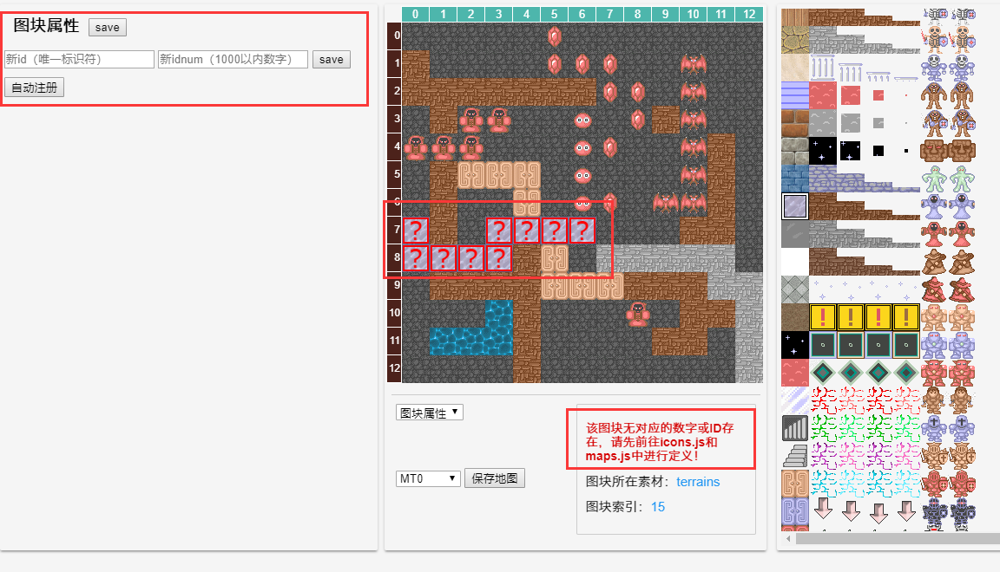
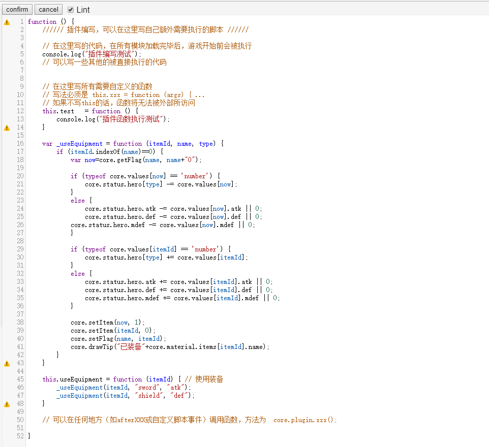

# 个性化

?> 目前版本**v2.3**，上次更新时间：* {docsify-updated} *

有时候只靠样板本身可能是不够的。我们需要一些个性化、自定义的素材，道具效果，怪物属性，等等。

## 图层的说明

HTML5魔塔是使用画布（canvas）来绘制，存在若干个图层，它们之间有一个覆盖关系，后面的图层将覆盖前面的图层。

所有图层从低往高依次如下：

- bg：背景层；绘制地面素材，或者作为背景的图片素材
- event：事件层；所有事件（道具、墙壁、NPC、怪物等）都绘制在这一层进行处理
- hero：勇士层；主要用来绘制勇士
- event2：事件2层；本层主要用来绘制48x32的图片素材的上半部分（避免和勇士错位），也可以用来绘制该层的前景图片素材
- fg：显伤层；主要用来绘制怪物显伤和领域显伤
- animate：动画层；主要用来绘制动画，图块的淡入/淡出效果，图块的移动。showImage事件绘制的图片也是在这一层。
- weather：天气层；主要用来绘制天气（雨/雪）
- curtain：色调层；用来控制当前楼层的画面色调
- ui：UI层；用来绘制一切UI窗口，如剧情文本、怪物手册、楼传器、系统菜单等等
- data：数据层；用来绘制一些顶层的或更新比较快的数据，如左上角的提示，战斗界面中数据的变化等等。

## 自定义素材

所有素材的图片都在`images`目录下。
- `animates.png` 为所有动画效果。主要是星空熔岩，开门，毒网，传送门之类的效果。为四帧。
- `autotile.png` 为Autotile块。
- `enemys.png` 为所有怪物的图片。
- `enemy48.png` 为所有48x32怪物的图片。
- `heros.png` 为勇士行走图。
- `items.png` 为所有道具的图标。
- `npcs.png` 为所有NPC的图标。
- `npc48.png` 为所有48x32的NPC图标。
- `terrains.png` 为所有地形的图标。

系统会读取`icon.js`文件，并获取每个ID对应的图标所在的位置。

### 使用预定义的素材

在images目录的“默认素材”下给定了若干预定义的自定义素材。

如果你需要某个素材已经存在，则可以直接将其覆盖images目录下的同名文件，就能看到效果。

### 使用自己的图片作为某层楼的背景/前景素材

由于HTML5功能（素材）有限，导致了对很多比较复杂的素材（比如房子内）等无法有着较好的绘图方式。

为了解决这个问题，我们允许用户自己放置一张或多张图片作为某一层的背景素材。

要启用这个功能，我们首先需要在`data.js`中将可能的图片进行加载。

``` js
"images": [ // 在此存放所有可能使用的图片
    // 图片可以被作为背景图（的一部分），也可以直接用自定义事件进行显示。
    // 图片名不能使用中文，不能带空格或特殊字符；可以直接改名拼音就好
    // 建议对于较大的图片，在网上使用在线的“图片压缩工具(http://compresspng.com/zh/)”来进行压缩，以节省流量
    "bg.jpg", "house.png", "bed.png"// 依次向后添加
];
```

!> 请使用网上的一些[在线图片压缩工具](http://compresspng.com/zh/)对图片进行压缩，以节省流量。

之后，我们可以在每层剧本的`"images"`里来定义该层的默认背景图片素材。

``` js
"images": [[x,y,"bg.jpg",false]], // 背景图；你可以选择一张或多张图片来作为背景/前景素材。
"images": [], // 无任何背景图
"images": [[1,1,"house.png",false], [6,7,"bed.png",true]] // 在(1,1)放一个house.png在背景层，且(6,7)放bed.png在前景层
```

images为一个数组，代表当前层所有作为背景素材的图片信息。

每一项为一个四元组，分别为该背景素材的x，y，图片名和是否为前景。其中x和y分别为横纵坐标，在0-12之间；图片名则必须在上面的images中定义过。

如果第四项为true，则会在前景层（event2）上绘制，能覆盖勇士，常常用来作为柱子的上半部分等情况。

**如果你需要让某些点不可通行（比如你建了个房子，墙壁和家具等位置不让通行），则需在`events`中指定`{"noPass": false}`，参见[自定义事件](event#自定义事件)的写法。**

``` js
"events": {
    "x,y": {"noPass": true} // (x,y)点不可通行
}
```

### 使用便捷PS工具生成素材

如果我们有更多的素材要求，我们可以使用“便捷PS工具”进行处理。


我们可以打开有需求改变的素材，和我们需要被替换的素材，然后简单的Ctrl+C和Ctrl+V操作即可。

便捷PS工具同样支持图片色相的修改，和RMXP几乎完全相同。

用这种方式，我们能极快地替换或素材，包括需要新增的怪物。

### 添加素材到游戏

在使用地图编辑器编辑的过程中，我们有可能会出现“该数字和ID未被定义”的错误提示。

这是因为，该素材没有被定义，无法被游戏所识别。

!> 在V2.0中，我们可以简单的在地图编辑器中新增素材，以及定义新增素材的ID和数字，但是仍然**强烈建议**对素材的机制进行了解。

#### 素材的机制

本塔所有的素材都拥有三个属性：**ID**，**索引**，**数字**。
- **ID** 为该素材的唯一标识符，任何两个素材的ID都不能相同。
- **索引** 为该素材的在对应图片上的图标索引，即该素材是图片上的第几个。
- **数字** 为该素材的对应数字，以方便地图的生成和存储。

**`ID-索引` 对应关系定义在icons.js文件中。该文件将唯一确定一个ID在图片上所在的位置。**

**`ID-数字` 对应关系定义在maps.js文件中。该文件将唯一确定一个ID对应的数字是多少。**

在V2.0中，我们可以在地图编辑器中很方便查看每个图块的三个属性信息。

#### 注册素材

在V2.0的地图编辑器中，要注册新素材，我们只需要在图块属性一栏输入新素材的ID和数字。



ID必须由数字字母下划线组成，数字在1000以内，且均不能和已有的进行重复。

之后刷新编辑器即可。

对于怪物和道具，我们也可以进行自动注册，只需要点击“自动注册”按钮，将对该栏下所有未注册的素材进行自动注册（自动分配ID和数字）。

素材注册完毕后，即可在游戏中正常使用，也可以被地图生成器所识别（需要重开地图生成器）。

#### Autotile的注册

但是，通过上面这种方式，我们是没办法新增并注册Autotile的。

除了替换样板现有的几个外，如果我们还需要新添加Autotile，则：

1. 将新的Autotile图片复制到images目录下。文件名必须是字母数字和下划线组成。
2. 进入icons.js，在autotile分类下进行添加该文件的名称，索引简单的写0。
3. 指定一个数字，在maps.js中类似进行添加。

!> Autotile的ID和文件名应确保完全相同！

<!--
#### 新添加自定义地形（路面、墙壁等）

如果你在terrains.png中新增了一行：

1. 指定一个唯一的英文ID，不能和现有的重复。
2. 进入icons.js，在terrains分类下进行添加索引（对应图标在图片上的位置，即index）

**如果你无须在游戏内使用本地形，而仅仅是将其作为“背景图”使用，则操作如下：**
3. 修改对应楼层的剧本文件的`defaultGround`项，改成新的ID。

**如果你要在游戏内使用本地形，则操作如下：**
3. 指定一个数字，在maps.js中类似进行添加。

#### 新添加Autotile

如果你需要新增一个Autotile：

1. 将新的Autotile图片复制到images目录下。
2. 进入icons.js，在autotile分类下进行添加该文件的名称，索引简单的写0。
3. 指定一个数字，在maps.js中类似进行添加。

!> Autotile的ID和文件名完全相同！且其ID/文件名不能含有中文、空格或特殊字符。

!> V2.0版本不能在地图编辑器中添加Autotile，请按上面的操作来执行。

#### 新添加道具

如果你需要新增一个未被定义的道具：

1. 指定一个唯一的英文ID，不能和现有的重复。
2. 进入icons.js，在items分类下进行添加索引（对应图标在图片上的位置，即index）
3. 指定一个数字，在maps.js中类似进行添加。
4. 在items.js中仿照其他道具，来添加道具的信息。

有关如何自行实现一个道具的效果，参见[自定义道具效果](#自定义道具效果)。

#### 新添加怪物

如果我们需要新添加怪物，请在enemys.png中新增一行。

你可以通过便捷PS工具的“更改色相”来将红头怪变成橙头怪等。

然后执行如下操作：

1. 指定一个唯一的英文ID，不能和enemys中现有的重复。
2. 进入icons.js，在enemys分类下进行添加索引（对应图标在图片上的位置，即index）
3. 在maps.js中继续进行添加。
4. 在enemys.js中仿照其他怪物，来添加怪物的信息。

!> 如果是48x32的怪物素材，请放在enemy48.png中，然后在icons.js的enemy48下添加索引。

有关如何自行实现一个怪物的特殊属性或伤害计算公式，参见[怪物的特殊属性](#怪物的特殊属性)。

#### 新添加NPC

1. 指定一个唯一的英文ID，不能和现有的重复。
2. 进入icons.js，在npcs分类下进行添加索引（对应图标在图片上的位置，即index）
3. 指定一个数字，在maps.js的getBlock下类似进行添加。

!> 如果是48x32的怪物素材，请放在npc48.png中，然后在icons.js的npc48下添加索引。

-->

### 地图生成器使用自定义素材

地图生成器是直接从js文件中读取数字-图标对应关系的。

因此，在你修改了icons.js和maps.js两个文件，也就是将素材添加到游戏后，地图生成器的对应关系也将同步更新。

## 自定义道具效果

本节中将继续介绍如何自己编辑一个道具的效果。

道具效果的具体实现都在`items.js`中。

### 即捡即用类道具（cls: items）

对于即捡即用类道具，如宝石、血瓶、剑盾等，我们可以简单地修改`data.js`中的value一栏即可。

如果你想要同种宝石在不同层效果不同的话，可以进行如下操作：

1. 在楼层的item_ratio中定义宝石的比率（比如1-10的写1，11-20层写2等）
2. 修改获得道具的itemEffect函数（编辑器中双击进行编辑）

``` js
// ratio为楼层的item_ratio值，可以进行翻倍宝石属性
core.status.hero.atk += core.values.redJewel * ratio
```

这里我们可以直接写ratio来取用该楼层中定义的`item_ratio`的值。

如果不是倍数增加（比如线性增加）也可以类似来写

``` js
// 一个二倍线性增加的例子
core.status.hero.atk += core.values.redJewel + 2*ratio
```

### 消耗类道具（cls: tools）；永久类道具（cls: constants）

如果要自己实现消耗类道具或永久类道具的使用效果，则需修改`items.js`中的canUseItem和useItem两个函数。

具体过程比较复杂，需要一定的JS能力，在这里就不多说了，有需求可以找`艾之葵`进行了解。

但值得一提的是，我们可以使用`core.hasItem(name)` 来判断是否某个道具是否存在。例如下面是passNet（通过路障处理）的一部分：

``` js
/****** 经过路障 ******/
events.prototype.passNet = function (data) {
    // 有鞋子
    if (core.hasItem('shoes')) return;
    if (data.event.id=='lavaNet') { // 血网
// ... 下略
```

我们进行了一个简单的判断，如果拥有绿鞋，则不进行任何路障的处理。

### 实战！拿到神圣盾后免疫吸血、领域、夹击效果

1. 在itemEffect中修改拿到神圣盾时的效果，标记一个自定义Flag。
``` js
core.status.hero.def += core.values.shield5 * ratio;
core.setFlag("shield5", true); // 增加一个自定义Flag：已经拿到神圣盾
```
2. 免疫吸血效果：在`enemys.js`的伤害计算中，编辑成如果存在神圣盾标记，吸血伤害为0。
``` js
enemys.prototype.calDamage = function (monster, hero_hp, hero_atk, hero_def, hero_mdef) {
// ... 上略
    // 吸血
    if (this.hasSpecial(mon_special, 11)) {
        var vampireDamage = hero_hp * monster.value;

        // 如果有神圣盾免疫吸血等可以在这里写
        if (core.hasFlag("shield5")) vampireDamage = 0; // 存在神圣盾，吸血伤害为0

        vampireDamage = Math.floor(vampireDamage) || 0;
        // 加到自身
        if (monster.add) // 如果加到自身
            mon_hp += vampireDamage;

        initDamage += vampireDamage;
    }
// ... 下略
```
3. 免疫领域、夹击、阻击效果：在`control.js`中，找到checkBlock函数，并编辑成如果有神圣盾标记，则将伤害变成0。
``` js
// 检查领域、夹击、阻击事件
control.prototype.checkBlock = function () {
    var x=core.getHeroLoc('x'), y=core.getHeroLoc('y');
    var damage = core.status.checkBlock.damage[13*x+y];
    if (damage>0) {
        if (core.hasFlag("shield5")) damage = 0; // 如果存在神圣盾，则将伤害变成0
        core.status.hero.hp -= damage;

        // 检查阻击事件
        var snipe = [];
        var scan = {
            'up': {'x': 0, 'y': -1},
            'left': {'x': -1, 'y': 0},
            'down': {'x': 0, 'y': 1},
            'right': {'x': 1, 'y': 0}
        }
// ... 下略
```
4. 如果有更高的需求，例如想让吸血效果变成一半，则还是在上面这些地方进行对应的修改即可。

## 新增门和对应的钥匙

如果要新增一个门和对应的钥匙，需要进行如下几步：

1. 在terrains.png中添加新的门的素材，并在地图编辑器中注册门的ID。该ID必须是以`Door`结尾，例如`abcDoor`。
2. 在animates.png中添加开门的四格动画，然后直接打开icons.js文件，在animates下直接添加ID和索引信息，例如`'abcDoor': 34`。
3. 在items.png中添加钥匙的素材，并在地图编辑器中注册钥匙的ID。该ID必须是和门对应且以`Key`结尾，例如`abcKey`。
4. 该道具的cls应为`tools`，可以自行写道具描述，最下面几项均留`null`即可。

!> **请勿在animates中对门的动画素材进行注册！而是请直接打开icons.js文件并添加ID和索引信息！！！**

!> terrains和animates的门ID必须完全一致，且以`Door`结尾；所对应的钥匙ID应当是把`Door`换成`Key`，这样才能对应的上！

## 覆盖楼传事件

对于特殊的塔，我们可以考虑修改楼传事件来完成一些特殊的要求，比如镜子可以按楼传来切换表里。

要修改楼传事件，需要进行如下几步：

1. 截获楼传的点击事件。在control.js中找到useFly函数，并将其替换成如下内容：
``` js
////// 点击楼层传送器时的打开操作 //////
control.prototype.useFly = function (need) {
    if (!core.status.heroStop) {
        core.drawTip("请先停止勇士行动");
        return;
    }
    if (core.canUseItem('fly')) core.useItem('fly');
    else core.drawTip("当前无法使用"+core.material.items.fly.name);
}
```
2. 让录像记下楼传的使用。在items.js的useItem函数中找到记录路线的那几行，修改为：
``` js
    // 记录路线
    if (itemId!='book') {  // 把 `&& itemId!='fly'` 给删除
        core.status.route.push("item:"+itemId);
    }
```
3. 修改楼传的使用事件。和其他永久道具一样，在地图编辑器的图块属性中修改楼传的useItemEffect和canUseItemEffect两个内容。例如：
``` js
"useItemEffect": "core.insertAction([...])" // 执行某段自定义事件，或者其他脚本
"canUseItemEffect": "true" // 任何时候可用
```
修改时，请先把`null`改成空字符串`""`，然后再双击进行编辑。


## 自定义装备

由于HTML5魔塔并不像RM那样存在一个装备界面可供我们对装备进行调整，但是我们也可以使用一个替代的方式实现这个目标。

### 装备的实现原理

在HTML5中，装备将全部看成是永久道具（constants），同时对于每个装备位置，勇士都定义一个flag域表示正在装备的内容。

例如：当勇士获得银剑时，将获得一个永久道具“银剑”；当使用这个银剑，首先检查勇士当前是否装备了武器（比如铁剑），如果
装备了则先脱掉装备（减去已装备的铁剑所加的属性，并获得永久道具铁剑），然后再穿上新的银剑。

同时由于脱剑术和脱盾术的存在，我们还需要一个“脱掉装备”的永久道具（比如sword0），使用它可以脱掉对应位置的装备。

### 装备加值的修改

要启用装备，首先需要在data.js（全塔属性）中设置`'equipment': true`。此时，游戏内将自动将剑盾变成装备的存在，其
所加的数值就是全塔属性中对应的数值（比如铁剑sword1就加的全塔属性中sword1的值）。

有时候，我们还会有一个装备加多种属性的需求，此时需要将对应的项从数值改变成一个对象。

``` js
"sword1": {"atk": 10, "def": 0, "mdef": 5}, // 铁剑加10攻和5魔防
"shield1": {"atk": 0, "def": 10, "mdef": 10}, // 铁盾加10防和10魔防
```

通过这种方式，当穿上装备时，将会给你的三围分别加上对应项的数值（支持负数，比如装剑减防御）。

### 新增剑盾

样板默认提供了铁剑（盾），银剑（盾），骑士剑（盾），圣剑（盾）和神圣剑（盾）这五类装备。但有时候，五类是不够的，
我们可能还需要更多的剑盾。

要增加更多的剑盾，我们需要进行如下步骤：（以新增剑为例）

1. 新注册一个素材到游戏；**其ID必须是sword+数字的形式，比如sword6等。**（同理如果是盾就必须是shield+数字的形式比如shield6。）
2. 将其cls设置为`constants`，`useItemEffect`和`canUseItem`直接复制其他几个剑盾的内容。  
（即：`useItemEffect`必须为`"core.plugin.useEquipment(itemId)"`，`canUseItemEffect`必须为`"true"`）。
3. 使用VSCode或其他文本编辑器直接打开`data.js`文件，并在`"values"`中仿照已有的内容添加剑盾的属性。  
（例如：`"sword6": 100`，或者`"sword6": `{"atk": 100, "def": 0, "mdef": 50}`）

!> 请注意：新的剑的ID必须是sword+数字，新的盾的ID必须是shield+数字的形式，不然装备将无效！

### 新增其他部位的装备

如果我们还需要新增更多部位的装备，比如戒指、首饰等等，也是可以的，只需要依次进行如下步骤：（以新建戒指为例）

1. 选择一个装备的部位的ID；比如假设我们的装备部位为戒指，那么我们可以选择"ring"作为装备的部位。
2. 定义一个空戒指，相当于脱掉戒指。注册一个素材到游戏，**其ID必须是ring0**（即部位ID+数字0）。
3. 同上述新建剑盾的方式来设置ring0这个空戒指的属性。请注意打开data.js后，设置的其值必须为0。  
(即：必须是`"ring0": 0`)
3. 创建更多的戒指；每加一个新的戒指到游戏，其ID必须是**ring+数字**的形式，比如`ring1`, `ring2`，等等。
4. 对于每一个创建的戒指，按照上述新建剑盾的方式设置属性（图块属性，打开data.js直接编辑）。  
（例如：`"ring2": {"atk": 3, "def": 5, "mdef": 8}`）
5. **切换到脚本编辑 - 自定义插件编写，在`this.useEquipment`中仿照着新增一行代表戒指的使用。**

``` js
this.useEquipment = function (itemId) { // 使用装备
	_useEquipment(itemId, "sword", "atk"); // 剑
	_useEquipment(itemId, "shield", "def"); // 盾
	_useEquipment(itemId, "ring", "mdef"); // 新增的戒指
}
```

我们仿照着新增一行`_useEquipment(itemId, "ring", "mdef")`。

其中第二项为装备部位的ID，比如我们上述定义的是ring；第三项表示“如果values中该值为数字，则加到什么属性上”。
比如如果我们这里写mdef，那么我们假设在data.js的values中设置`"ring1": 20`，则使用该戒指会增加20点魔防。

如果你定义的是对象`{"atk": xxx, "def": xxx, "mdef": xxx}`的形式，则不会受到第三项的影响。

!> 必须对于每一个装备部位定义唯一一个不同的ID；脱掉装备（空装备）必须是该ID加数字0的形式，其他有效装备必须是
该ID+正整数的形式，不然会出错！

## 自定义怪物属性

如果你对现有的怪物不满意，想自行添加怪物属性（例如让怪物拥有双属性乃至更多属性），也是可以的。具体参见`enemys.js`文件。

你需自己指定一个special数字，修改getSpecialText函数（属性名）和getSpecialHint函数（属性提示文字）。

如果要修改伤害计算公式，请修改下面的getDamageInfo函数。请注意，如果无法战斗，该函数必须返回`null`。

对于毒衰弱怪物的战斗后结算在`functions.js`中的afterBattle函数中。

对于领域、夹击、阻击怪物的检查在`control.js`中的checkBlock函数中。

`getCritical`, `getCriticalDamage`和`getDefDamage`三个函数依次计算的是该怪物的临界值、临界减伤和1防减伤。也可以适当进行修改。

## 自定义快捷键

如果需要绑定某个快捷键为处理一段事件，也是可行的。

要修改按键，我们可以在`actions.js`的`keyUp`进行处理：

比如，我们设置一个快捷键进行绑定，比如`W`，其keycode是87。（有关每个键的keycode搜一下就能得到）

然后在`actions.js`的`keyUp`函数的`switch`中进行处理。

``` js
case 87: // W
    if (core.status.heroStop) { 
        // ... 在这里写你要执行脚本
        // 请使用同步脚本，请勿执行任何异步代码，否则可能导致游戏过程或录像出现问题。
        core.insertAction([...]) // 例如，插入一段自定义事件并执行。
        
        core.status.route.push("key:"+keyCode); // 录像的支持！这句话必须要加，不然录像回放会出错！
    }
    break;
```


在勇士处于停止的条件下，按下W键时，将执行你写的脚本代码。请只使用同步脚本而不要使用异步代码，不然可能导致游戏出现问题。

`core.status.route.push("key:"+keyCode);` 这句话是对录像的支持，一定要加（这样录像播放时也会模拟该按键）。

!> H5不支持组合快捷键，所以不存在`W+1`这种组合快捷键的说法！

!> 手机端可以通过长按任何位置调出虚拟键盘，再进行按键，和键盘按键是等价的效果！

## 公共事件

在RM中，存在公共事件的说法；也就是通过某个指令来调用一系列事件的触发。

在H5中，我们可以使用“插件”的形式来达成这个效果。具体参见“脚本编辑 - 插件编写”。



当我们在这上面定义了自己需要的函数（插件后），就可以通过任何方式进行调用。

在这个插件编写的过程中，我们可以使用任何[常见API](api)里面的代码调用；也可以通过`core.insertAction`来插入自定义事件执行。

下面是一个很简单的例子，我编写一个公共事件（插件），其效果是让勇士生命值变成原来的x倍，并令面前的图块消失。

``` js
this.myfunc = function(x) {
    core.status.hero.hp *= x; // 勇士生命翻若干倍
    core.insertAction([ // 自定义事件：令面前的图块消失。
        {"type": "setValue", "name": "flag:x", "value": "core.nextX()"},
        {"type": "setValue", "name": "flag:y", "value": "core.nextY()"},
        {"type": "hide", "loc": ["flag:x", "flag:y"]}
    ]);
}
```

然后比如我们在某个道具的使用效果 `useItemEffect` 中写 `core.plugin.myfunc(2)` 即可调用此公共事件（插件）。也可以在战后事件或自定义脚本等位置来写。

通过这种，将脚本和自定义事件混用的方式，可以达到和RM中公共事件类似的效果，即一个调用触发一系列事件。

## 自定义状态栏（新增显示项）

在V2.2以后，我们可以自定义状态栏背景图（全塔属性 - statusLeftBackground）等等。

但是，如果我们还想新增其他项目的显示，比如技能塔所需要的魔力值（气息），该怎么办？

需要进行如下几个操作：

1. 定义图标ID；比如魔力我就定义mana，气息可以简单的定义qixi；你也可以定义其他的ID，但是不能和已有的重复。这里以mana为例。
2. 在index.html的statusBar中（44行起），进行该状态栏项的定义。仿照其他几项，插在其应当显示的位置，注意替换掉相应的ID。
``` html
<div class="status" id="manaCol">
    
    <p class='statusLabel' id='mana'></p>
</div>
```
3. 在editor.html中的statusBar（305行起），仿照第二点同样添加；这一项如果不进行则会地图编辑器报错。
4. 使用便捷PS工具，打开icons.png，新增一行并将魔力的图标P上去；记下其索引比如23（减速播放图标的下方）。
5. 在main.js的this.statusBar中增加图片、图标和内容的定义。
``` js
this.statusBar = {
    'images': {
        // ...其他略
        'mana': document.getElementById("img-mana"), // 图片的定义
    },
    'icons': {
        // ...其他略
        'mana': 23, // 图标的定义，这里对应的是icons.png中的索引
    },
    // ...其他略
    'mana': document.getElementById('mana'), // 显示内容（数据）的定义
}
```
6. 显示内容的设置。在control.js的updateStatusBar函数，可以对该状态栏显示内容进行设置，下面是几个例子。
``` js
core.statusBar.mana.innerHTML = core.getFlag('mana', 0); // 设置其显示内容为flag:mana值。
core.statusBar.mana.innerHTML = core.getFlag('mana', 0) + '/' + core.getFlag('manaMax', 0); // 显示内容将类似 "32/60" 这样。
core.statusBar.mana.style.fontStyle = 'normal'; // 这一行会取消斜体。如果是汉字（比如技能名）的话，斜体起来会非常难看，可以通过这一句取消。
```
7. 在control.js的clearStatusBar函数，`statusList`里面也要增加mana项，这样清空状态栏时也会对其清空。

## 技能塔的支持

其实，在HTML5上制作技能塔是完全可行的。

要支持技能塔，可能需要如下几个方面：

- 魔力（和上限）的定义添加
- 状态栏的显示
- 技能的触发（按键与录像问题）
- 技能的效果

下面依次进行描述。

### 魔力的定义添加

当我们定义了魔力的ID，比如`mana`后，要使用它，一般有两种方式：属性获取`status:mana`或者flag标记`flag:mana`。

如果要属性获取，则需要打开`data.js`文件，并在`hero`中添加定义。

通过这种方式定义的，可以通过`core.setStatus('mana', 0)`以及`core.getStatus('mana')`来设置或获取。

``` js
'hero': {
    // ... 上略
    'mana': 0, // 增添mana定义，可以放在experience之后。同理可定义manaMax表示当前最大魔力值。
}
```

如果要flag标记，则无需额外在任何地方进行定义。只需要在设置或取用的时候使用 `core.setFlag('mana', 0)` 或 `core.getFlag('mana', 0)` 即可。

下面我都使用属性获取的方式来进行说明。

### 状态栏的显示

首先我们需要额外新增一个状态栏；请参见[自定义状态栏（新增显示项）](#自定义状态栏（新增显示项）)。

我们可以在魔力那一行显示当前值和最大值：

``` js
core.setStatus('mana', Math.min(core.getStatus('mana'), core.getStatus('manaMax'))); // 如果魔力存在上限，则不能超过其上限值
core.statusBar.mana.innerHTML = core.getStatus('mana') + '/' + core.getStatus('manaMax', 0); // 显示比如 6/30 这样
```

如果我们还需要显示当前使用的技能名，也是可以的；定义一个ID为skill，然后按照上面的做法新增一行。

请注意，如果是中文字符，需要取消斜体（不然会非常难看的）！

``` js
core.statusBar.skill.style.fontStyle = 'normal'; // 取消斜体显示
core.statusBar.skill.innerHTML = core.getFlag('skillName', '无'); // 使用flag:skillName表示当前激活的技能名。
```

### 技能的触发

我们可以按键触发技能。有关绑定按键请参见[自定义快捷键](#自定义快捷键)。

下面是一个很简单的例子，当勇士按下W后，如果魔力不小于5点则允许开启技能"二倍斩"，再次按W则关闭技能。

``` js
case 87: // W
    if (core.status.heroStop) { // 当前停止状态；这个if需要加，不能在行走过程中触发不然容易出错。
        if (core.getFlag('skill', 0)==0) { // 判断当前是否已经开了技能
            if (core.getStatus('mana')>=5) { // 这里要写当前能否开技能的条件判断，比如魔力值至少要多少
                core.setFlag('skill', 1); // 开技能1
                core.setFlag('skillName', '二倍斩'); // 设置技能名
            }
            else {
                core.drawTip("魔力不足，无法开技能");
            }
        }
        else { // 关闭技能
            core.setFlag('skill', 0); // 关闭技能状态
            core.setFlag('skillName', '无');
        }
        core.updateStatusBar(); // 立刻更新状态栏和地图显伤
        core.status.route.push("key:"+keyCode); // 录像的支持！这句话必须要加，不然录像回放会出错！
    }
    break;
```

简单的说，用flag:skill判断当前开启的技能，flag:skillName表示该技能名。（可在状态栏显示）

在勇士处于停止的条件下，按下W键时，判断当前是否开启了技能，如果开启则关闭，没开则再判断是否允许开启（魔力值够不够等）。

`core.status.route.push("key:"+keyCode);` 这句话是对录像的支持，一定要加（这样录像播放时也会模拟该按键）。

!> 1，2，3这三个键被默认绑定到了破炸飞；如果想用的话也是一样，只不过是把已有的实现进行替换。

!> 手机端可以通过长按任何位置调出虚拟键盘，再进行按键，和键盘按键是等价的效果！

### 技能的效果

最后一点就是技能的效果；其实到了这里就和RM差不多了。

技能的效果要分的话有地图类技能，战斗效果类技能，后续影响类技能什么的，这里只介绍最简单的战斗效果类技能。
其他的几类技能根据需求可能更为麻烦，有兴趣可自行进行研究。

战斗效果内技能要改两个地方：战斗伤害计算，战后扣除魔力值。

战斗伤害计算在`enenmys.js`的`getDamageInfo`函数，有需求直接修改这个函数即可。

战后扣除魔力值则在脚本编辑的`afterBattle`中进行编辑即可。

举个例子，我设置一个勇士的技能：二倍斩，开启技能消耗5点魔力，下一场战斗攻击力翻倍。

那么，直接在`getDamageInfo`中进行判断：

``` js
if (core.getFlag('skill', 0)==1) { // 开启了技能1
    hero_atk *= 2; // 计算时攻击力翻倍
}
```

然后在脚本编辑的战后事件中进行魔力值的扣除：

``` js
if (core.getFlag('skill', 0)==1) { // 开启了技能1
    core.status.hero.mana -= 5; // 扣除5点魔力值
    core.setFlag('skill', 0); // 自动关闭技能
    core.setFlag('skillName', '无');
}
```

&nbsp;

通过上述这几种方式，我们就能成功的让H5支持技能啦！

## 多角色的支持

其实，我们的样板还能支持多角色的制作。比如《黑·白·间》之类的塔也是完全可以刻的。

你只需要如下几步来达到多角色的效果。

1. 每个角色弄一张行走图。相关信息参见[自定义事件：setHeroIcon](event#setHeroIcon：更改角色行走图)。
2. [覆盖楼传事件](#覆盖楼传事件)，这样可以通过点工具栏的楼层传送按钮来切换角色。当然你也完全可以自己写一个道具，或[自定义快捷键](#自定义快捷键)来进行绑定。
3. 将下述代码直接贴入脚本编辑 - 插件编写中。（写在`var _useEquipment = ...`之前。）
    ``` js
    // 所有需要保存的内容；这些保存的内容不会多角色共用，在切换时会进行恢复。
    // 你也可以自行新增或删除，比如不共用金币则可以加上"money"的初始化，不共用道具则可以加上"items"的初始化，
    // 多角色共用hp的话则删除hp，等等。总之，不共用的属性都在这里进行定义就好。
    var hero1 = { // 1号勇士（默认的是0号）
        "floorId": "MT0", // 该角色楼层ID
        "icon": "hero1.png", // 角色的行走图名称
        "name": "1号角色",
        "lv": 1,
        "hp": 1000,
        "atk": 10,
        "def": 10,
        "mdef": 0,
        "loc": {"x": 0, "y": 0, "direction": "up"},
        // 如果道具不共用就将下面这句话取消注释
        // "items": {"keys":{"yellowKey":0,"blueKey":0,"redKey":0},"tools":{},"constants":{}}
    }
    // 也可以类似新增其他勇士
    // var hero2 = { ...

    var heroCount = 2; // 包含默认的在内总共多少个勇士，该值需手动修改。
    
    // 初始化该勇士
    this.initHeros = function () {
        core.status.hero.icon = "hero.png";
        core.setFlag("hero1", core.clone(hero1)); // 将属性值存到变量中
        // core.setFlag("hero2", core.clone(hero2)); // 更多的勇士...
    }
    
    // 切换勇士
    this.changeHero = function (toHeroId) {
        var currHeroId = core.getFlag("heroId", 0); // 获得当前角色ID
        if (!core.isset(toHeroId)) {
            toHeroId = (currHeroId+1)%heroCount;
        }
        if (currHeroId == toHeroId) return;

        var saveList = Object.keys(hero1);

	    // 保存当前内容
        var toSave = {};
        saveList.forEach(function(name) {
            if (name=='floorId') toSave[name] = core.status.floorId; // 楼层单独设置
            else toSave[name] = core.clone(core.status.hero[name]); // 使用core.clone()来创建新对象
        })
    
        core.setFlag("hero"+currHeroId, toSave); // 将当前角色信息进行保存
        var data = core.getFlag("hero"+toHeroId); // 获得要切换的角色保存内容
    
        // 设置角色的属性值
        saveList.forEach(function(name) {
            if (name != 'floorId')
                core.status.hero[name] = core.clone(data[name]);
        })
    
        // 插入事件：改变角色行走图并进行楼层切换
        core.insertAction([
            {"type": "setHeroIcon", "name": data.icon||"hero.png"}, // 改变行走图
            {"type": "changeFloor", "floorId": data.floorId, "loc": [data.loc.x, data.loc.y], 
                "direction": data.loc.direction, "time": 0} // 楼层切换事件
        ])
        core.setFlag("heroId", toHeroId); // 保存切换到的角色ID
    }
    ```
3. 在脚本编辑 - setInitData中加上`core.plugin.initHeros()`来初始化新勇士。（写在`core.events.afterLoadData()`后，反大括号之前。）
4. 如果需要切换角色（包括事件、道具或者快捷键等），可以直接调用自定义JS脚本：`core.plugin.changeHero();`进行切换。也可以指定参数调用`core.plugin.changeHero(1)`来切换到某个具体的勇士上。

!> 如果道具不共用，需要在初始定义那里写 `'items': {"keys": {"yellowKey": 0, "blueKey": 0, "redKey": 0}, "tools": {}, "constants": {}}`

## 根据难度分歧来自定义地图

遗憾的是，所有地图数据必须在剧本的map中指定，换句话说，我们无法在游戏进行中动态修改地图，比如为简单难度增加一个血瓶。

幸运的是，我们可以采用如下方式进行难度分歧，为用户简单难度下增加额外的血瓶或宝石。

``` js
"firstArrive": [ // 第一次到该楼层触发的事件
    {"type": "if", "condition": "flag:hard!=3", // 判断是否困难难度
        "true": [ // 不为困难，则为普通或简单难度
            {"type": "show", "loc": [3,6]} // 显示血瓶
            {"type": "if", "condition": "flag:hard==1", // 判断是否是简单难度
                "true": [
                    {"type": "show", "loc": [3,7]} // 简单难度则显示宝石
                ],
                "false": [] // 普通难度则只显示血瓶
            },
        ],
        "false": [] // 困难难度，不进行任何操作
  },
],
"events": {
  "3,6": {"enable": false} // 比如[3,6]点是一个血瓶，初始不可见
  "3,7": {"enable": false} // 比如[3,7]点是一个宝石，初始不可见
}
```

如上所示，我们在地图上设置一个额外的血瓶和宝石，并初始时设为禁用状态。

当第一次到达该楼层时，进行一次判断；如果不为困难难度，则将血瓶显示出来；再判断是否为简单难度，如果是则再把宝石显示出来。

通过对`flag:hard`进行判断的方式，我们也可以达成“对于不同的难度有着不同的地图效果”。

==========================================================================================

[继续阅读附录：所有API列表](api)
