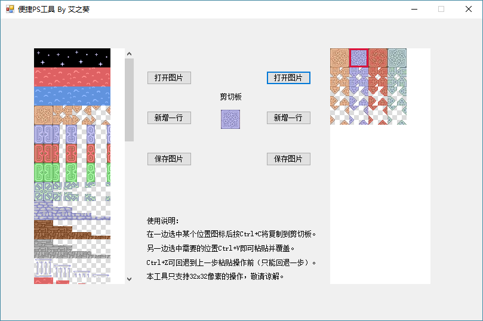

# 个性化

?> 目前版本**v2.0**，上次更新时间：* {docsify-updated} *

有时候只靠样板本身可能是不够的。我们需要一些个性化、自定义的素材，道具效果，怪物属性，等等。

## 图层的说明

HTML5魔塔是使用画布（canvas）来绘制，存在若干个图层，它们之间有一个覆盖关系，后面的图层将覆盖前面的图层。

所有图层从低往高依次如下：

- bg：背景层；绘制地面素材，或者作为背景的图片素材
- event：事件层；所有事件（道具、墙壁、NPC、怪物等）都绘制在这一层进行处理
- hero：勇士层；主要用来绘制勇士
- event2：事件2层；本层主要用来绘制48x32的图片素材的上半部分（避免和勇士错位），也可以用来绘制该层的前景图片素材
- fg：显伤层；主要用来绘制怪物显伤和领域显伤
- animate：动画层；主要用来绘制动画，图块的淡入/淡出效果，图块的移动。showImage事件绘制的图片也是在这一层。
- weather：天气层；主要用来绘制天气（雨/雪）
- curtain：色调层；用来控制当前楼层的画面色调
- ui：UI层；用来绘制一切UI窗口，如剧情文本、怪物手册、楼传器、系统菜单等等
- data：数据层；用来绘制一些顶层的或更新比较快的数据，如左上角的提示，战斗界面中数据的变化等等。

## 自定义素材

所有素材的图片都在`images`目录下。
- `animates.png` 为所有动画效果。主要是星空熔岩，开门，毒网，传送门之类的效果。为四帧。
- `autotile.png` 为Autotile块。
- `enemys.png` 为所有怪物的图片。
- `enemy48.png` 为所有48x32怪物的图片。
- `heros.png` 为勇士行走图。
- `items.png` 为所有道具的图标。
- `npcs.png` 为所有NPC的图标。
- `npc48.png` 为所有48x32的NPC图标。
- `terrains.png` 为所有地形的图标。

系统会读取`icon.js`文件，并获取每个ID对应的图标所在的位置。

### 使用预定义的素材

在images目录的“默认素材”下给定了若干预定义的自定义素材。

如果你需要某个素材已经存在，则可以直接将其覆盖images目录下的同名文件，就能看到效果。

### 使用自己的图片作为某层楼的背景/前景素材

由于HTML5功能（素材）有限，导致了对很多比较复杂的素材（比如房子内）等无法有着较好的绘图方式。

为了解决这个问题，我们允许用户自己放置一张或多张图片作为某一层的背景素材。

要启用这个功能，我们首先需要在`data.js`中将可能的图片进行加载。

``` js
"images": [ // 在此存放所有可能使用的图片
    // 图片可以被作为背景图（的一部分），也可以直接用自定义事件进行显示。
    // 图片名不能使用中文，不能带空格或特殊字符；可以直接改名拼音就好
    // 建议对于较大的图片，在网上使用在线的“图片压缩工具(http://compresspng.com/zh/)”来进行压缩，以节省流量
    "bg.jpg", "house.png", "bed.png"// 依次向后添加
];
```

!> 请使用网上的一些[在线图片压缩工具](http://compresspng.com/zh/)对图片进行压缩，以节省流量。

之后，我们可以在每层剧本的`"images"`里来定义该层的默认背景图片素材。

``` js
"images": [[x,y,"bg.jpg",false]], // 背景图；你可以选择一张或多张图片来作为背景/前景素材。
"images": [], // 无任何背景图
"images": [[1,1,"house.png",false], [6,7,"bed.png",true]] // 在(1,1)放一个house.png在背景层，且(6,7)放bed.png在前景层
```

images为一个数组，代表当前层所有作为背景素材的图片信息。

每一项为一个四元组，分别为该背景素材的x，y，图片名和是否为前景。其中x和y分别为横纵坐标，在0-12之间；图片名则必须在上面的images中定义过。

如果第四项为true，则会在前景层（event2）上绘制，能覆盖勇士，常常用来作为柱子的上半部分等情况。

**如果你需要让某些点不可通行（比如你建了个房子，墙壁和家具等位置不让通行），则需在`events`中指定`{"noPass": false}`，参见[自定义事件](event#自定义事件)的写法。

``` js
"events": {
    "x,y": {"noPass": true} // (x,y)点不可通行
}
```

### 使用便捷PS工具生成素材

如果我们有更多的素材要求，我们可以使用“便捷PS工具”进行处理。



我们可以打开有需求改变的素材，和我们需要被替换的素材，然后简单的Ctrl+C和Ctrl+V操作即可。

便捷PS工具同样支持图片色相的修改，和RMXP几乎完全相同。

用这种方式，我们能极快地替换或素材，包括需要新增的怪物。

### 添加素材到游戏

在使用地图编辑器编辑的过程中，我们有可能会出现“该数字和ID未被定义”的错误提示。

这是因为，该素材没有被定义，无法被游戏所识别。

!> 在V2.0中，我们可以简单的在地图编辑器中新增素材，以及定义新增素材的ID和数字，但是仍然**强烈建议**对素材的机制进行了解。

#### 素材的机制

本塔所有的素材都拥有三个属性：**ID**，**索引**，**数字**。
- **ID** 为该素材的唯一标识符，任何两个素材的ID都不能相同。
- **索引** 为该素材的在对应图片上的图标索引，即该素材是图片上的第几个。
- **数字** 为该素材的对应数字，以方便地图的生成和存储。

**`ID-索引` 对应关系定义在icons.js文件中。该文件将唯一确定一个ID在图片上所在的位置。**

**`ID-数字` 对应关系定义在maps.js文件中。该文件将唯一确定一个ID对应的数字是多少。**

如果需要添加一个素材到游戏，则必须为其分配一个唯一标识符，并同时修改`icons.js`和`maps.js`两个文件。

#### 新添加自定义地形（路面、墙壁等）

如果你在terrains.png中新增了一行：

1. 指定一个唯一的英文ID，不能和现有的重复。
2. 进入icons.js，在terrains分类下进行添加索引（对应图标在图片上的位置，即index）

**如果你无须在游戏内使用本地形，而仅仅是将其作为“背景图”使用，则操作如下：**
3. 修改对应楼层的剧本文件的`defaultGround`项，改成新的ID。

**如果你要在游戏内使用本地形，则操作如下：**
3. 指定一个数字，在maps.js中类似进行添加。

#### 新添加Autotile

如果你需要新增一个Autotile：

1. 将新的Autotile图片复制到images目录下。
2. 进入icons.js，在autotile分类下进行添加该文件的名称，索引简单的写0。
3. 指定一个数字，在maps.js中类似进行添加。

!> Autotile的ID和文件名完全相同！且其ID/文件名不能含有中文、空格或特殊字符。

!> V2.0版本不能在地图编辑器中添加Autotile，请按上面的操作来执行。

#### 新添加道具

如果你需要新增一个未被定义的道具：

1. 指定一个唯一的英文ID，不能和现有的重复。
2. 进入icons.js，在items分类下进行添加索引（对应图标在图片上的位置，即index）
3. 指定一个数字，在maps.js中类似进行添加。
4. 在items.js中仿照其他道具，来添加道具的信息。

有关如何自行实现一个道具的效果，参见[自定义道具效果](#自定义道具效果)。

#### 新添加怪物

如果我们需要新添加怪物，请在enemys.png中新增一行。

你可以通过便捷PS工具的“更改色相”来将红头怪变成橙头怪等。

然后执行如下操作：

1. 指定一个唯一的英文ID，不能和enemys中现有的重复。
2. 进入icons.js，在enemys分类下进行添加索引（对应图标在图片上的位置，即index）
3. 在maps.js中继续进行添加。
4. 在enemys.js中仿照其他怪物，来添加怪物的信息。

!> 如果是48x32的怪物素材，请放在enemy48.png中，然后在icons.js的enemy48下添加索引。

有关如何自行实现一个怪物的特殊属性或伤害计算公式，参见[怪物的特殊属性](#怪物的特殊属性)。

#### 新添加NPC

1. 指定一个唯一的英文ID，不能和现有的重复。
2. 进入icons.js，在npcs分类下进行添加索引（对应图标在图片上的位置，即index）
3. 指定一个数字，在maps.js的getBlock下类似进行添加。

!> 如果是48x32的怪物素材，请放在npc48.png中，然后在icons.js的npc48下添加索引。

### 地图生成器使用自定义素材

地图生成器是直接从js文件中读取数字-图标对应关系的。

因此，在你修改了icons.js和maps.js两个文件，也就是将素材添加到游戏后，地图生成器的对应关系也将同步更新。

## 自定义道具效果

本节中将继续介绍如何自己编辑一个道具的效果。

道具效果的具体实现都在`items.js`中。

### 即捡即用类道具（cls: items）

对于即捡即用类道具，如宝石、血瓶、剑盾等，我们可以简单地修改`data.js`中的value一栏即可。

如果你想要同种宝石在不同层效果不同的话，可以进行如下操作：

1. 在楼层的item_ratio中定义宝石的比率（比如1-10的写1，11-20层写2等）
2. 修改获得道具的itemEffect函数（在items.js中的itemEffect中编辑，V2.0中也可以使用编辑器）

``` js
// ratio为楼层的item_ratio值，可以进行翻倍宝石属性
core.status.hero.atk += core.values.redJewel * ratio
```

这里我们可以直接写ratio来取用该楼层中定义的`item_ratio`的值。

如果不是倍数增加（比如线性增加）也可以类似来写

``` js
// 一个二倍线性增加的例子
core.status.hero.atk += core.values.redJewel + 2*ratio
```

### 消耗类道具（cls: tools）；永久类道具（cls: constants）

如果要自己实现消耗类道具或永久类道具的使用效果，则需修改`items.js`中的canUseItem和useItem两个函数。

具体过程比较复杂，需要一定的JS能力，在这里就不多说了，有需求可以找`艾之葵`进行了解。

但值得一提的是，我们可以使用`core.hasItem(name)` 来判断是否某个道具是否存在。例如下面是passNet（通过路障处理）的一部分：

``` js
/****** 经过路障 ******/
events.prototype.passNet = function (data) {
    // 有鞋子
    if (core.hasItem('shoes')) return;
    if (data.event.id=='lavaNet') { // 血网
// ... 下略
```

我们进行了一个简单的判断，如果拥有绿鞋，则不进行任何路障的处理。

### 实战！拿到神圣盾后免疫吸血、领域、夹击效果

1. 在itemEffect中修改拿到神圣盾时的效果，标记一个自定义Flag。
``` js
core.status.hero.def += core.values.shield5 * ratio;
core.setFlag("shield5", true); // 增加一个自定义Flag：已经拿到神圣盾
```
2. 免疫吸血效果：在`enemys.js`的伤害计算中，编辑成如果存在神圣盾标记，吸血伤害为0。
``` js
enemys.prototype.calDamage = function (monster, hero_hp, hero_atk, hero_def, hero_mdef) {
// ... 上略
    // 吸血
    if (this.hasSpecial(mon_special, 11)) {
        var vampireDamage = hero_hp * monster.value;

        // 如果有神圣盾免疫吸血等可以在这里写
        if (core.hasFlag("shield5")) vampireDamage = 0; // 存在神圣盾，吸血伤害为0

        vampireDamage = parseInt(vampireDamage);
        // 加到自身
        if (monster.add) // 如果加到自身
            mon_hp += vampireDamage;

        initDamage += vampireDamage;
    }
// ... 下略
```
3. 免疫领域、夹击、阻击效果：在`control.js`中，找到checkBlock函数，并编辑成如果有神圣盾标记，则将伤害变成0。
``` js
// 检查领域、夹击、阻击事件
control.prototype.checkBlock = function () {
    var x=core.getHeroLoc('x'), y=core.getHeroLoc('y');
    var damage = core.status.checkBlock.damage[13*x+y];
    if (damage>0) {
        if (core.hasFlag("shield5")) damage = 0; // 如果存在神圣盾，则将伤害变成0
        core.status.hero.hp -= damage;

        // 检查阻击事件
        var snipe = [];
        var scan = {
            'up': {'x': 0, 'y': -1},
            'left': {'x': -1, 'y': 0},
            'down': {'x': 0, 'y': 1},
            'right': {'x': 1, 'y': 0}
        }
// ... 下略
```
4. 如果有更高的需求，例如想让吸血效果变成一半（如异空间），则还是在上面这些地方进行对应的修改即可。

## 自定义怪物属性

如果你对现有的怪物不满意，想自行添加怪物属性（例如让怪物拥有双属性乃至更多属性），也是可以的。具体参见`enemys.js`文件。

你需自己指定一个special数字，修改getSpecialText函数（属性名）和getSpecialHint函数（属性提示文字）。

如果要修改伤害计算公式，请修改下面的calDamage函数。请注意，如果无法战斗，该函数必须返回`999999999`。

对于毒衰弱怪物的战斗后结算在`functions.js`中的afterBattle函数中。

对于领域、夹击、阻击怪物的检查在`control.js`中的checkBlock函数中。

`getCritical`, `getCriticalDamage`和`getDefDamage`三个函数依次计算的是该怪物的临界值、临界减伤和1防减伤。也可以适当进行修改。

## 根据难度分歧来自定义地图

遗憾的是，所有地图数据必须在剧本的map中指定，换句话说，我们无法在游戏进行中动态修改地图，比如为简单难度增加一个血瓶。

幸运的是，我们可以采用如下方式进行难度分歧，为用户简单难度下增加额外的血瓶或宝石。

``` js
"firstArrive": [ // 第一次到该楼层触发的事件
    {"type": "if", "condition": "flag:hard!=3", // 判断是否困难难度
        "true": [ // 不为困难，则为普通或简单难度
            {"type": "show", "loc": [3,6]} // 显示血瓶
            {"type": "if", "condition": "flag:hard==1", // 判断是否是简单难度
                "true": [
                    {"type": "show", "loc": [3,7]} // 简单难度则显示宝石
                ],
                "false": [] // 普通难度则只显示血瓶
            },
        ],
        "false": [] // 困难难度，不进行任何操作
  },
],
"events": {
  "3,6": {"enable": false} // 比如[3,6]点是一个血瓶，初始不可见
  "3,7": {"enable": false} // 比如[3,7]点是一个宝石，初始不可见
}
```

如上所示，我们在地图上设置一个额外的血瓶和宝石，并初始时设为禁用状态。

当第一次到达该楼层时，进行一次判断；如果不为困难难度，则将血瓶显示出来；再判断是否为简单难度，如果是则再把宝石显示出来。

通过对`flag:hard`进行判断的方式，我们也可以达成“对于不同的难度有着不同的地图效果”。

==========================================================================================

[继续阅读附录：所有API列表](api)
